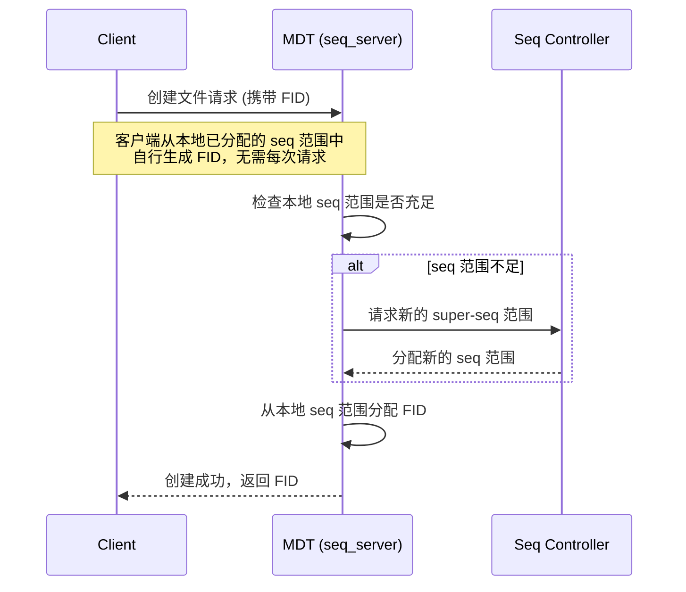
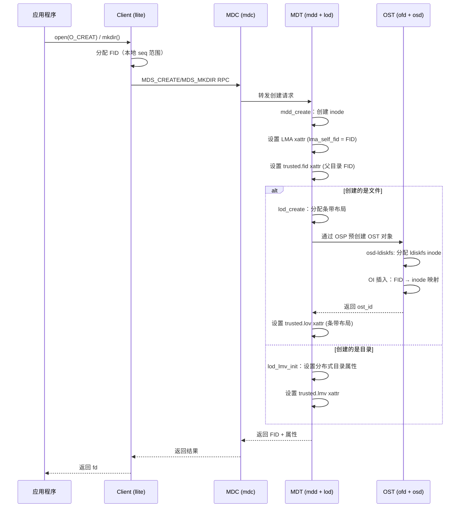
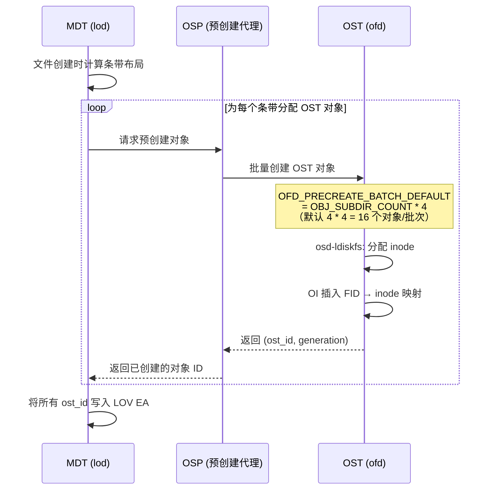
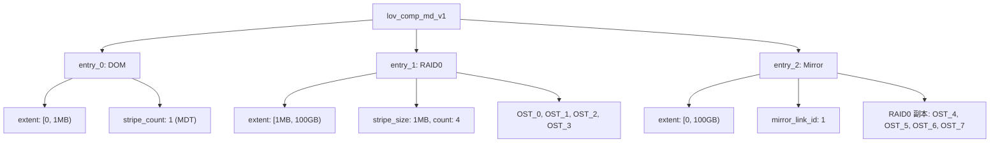
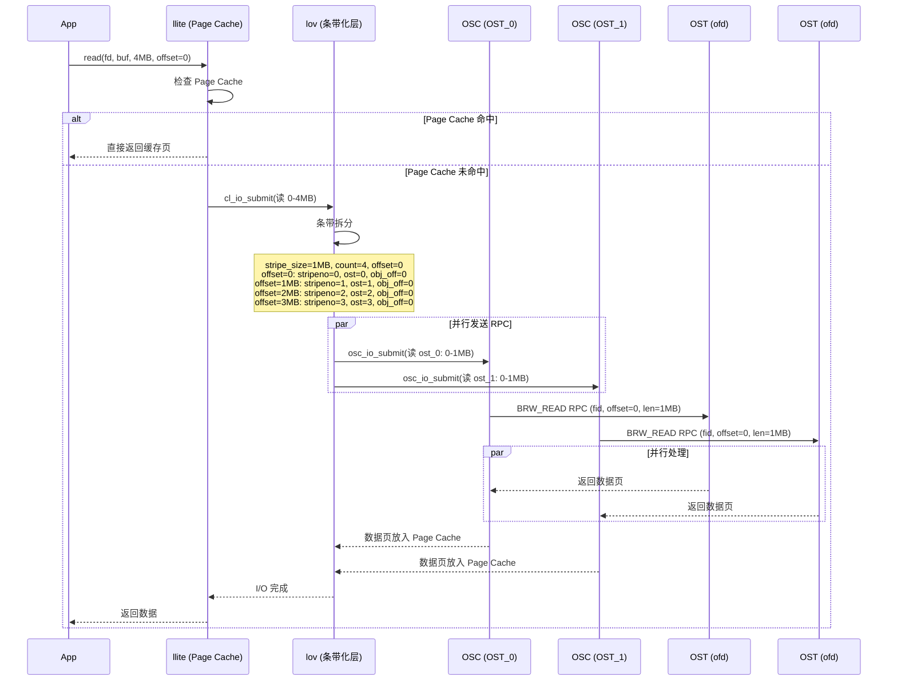
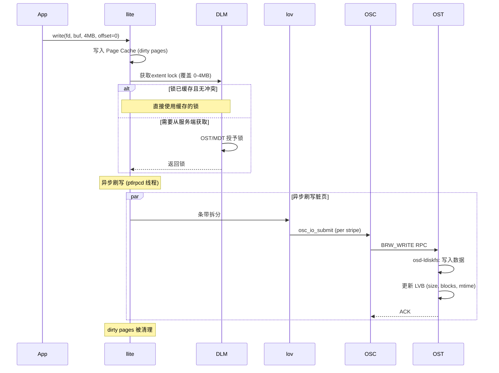
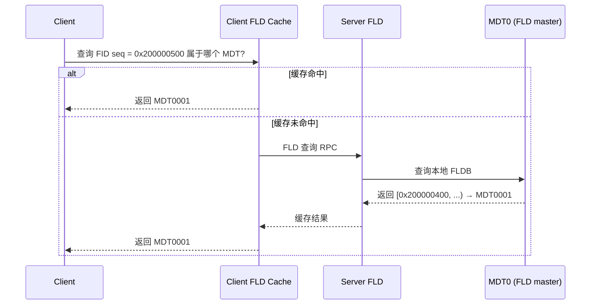

# Lustre 存储模型深度分析

## 1. 整体架构概览

Lustre 是一个高性能并行分布式文件系统，采用 **MDT（元数据目标）+ OST（对象存储目标）** 的分离架构。其核心设计理念是将元数据操作和数据 I/O 操作彻底解耦，通过独立的网络栈和分布式锁管理器（LDLM）协调一致性。

```
┌──────────────────────────────────────────────────────────────────────┐
│                         Client (llite)                               │
│  ┌──────────┐  ┌──────────┐  ┌──────────┐  ┌───────────────────┐    │
│  │  VFS     │  │ Page     │  │ DLM      │  │ LOV/OSC           │    │
│  │  接口    │→│ Cache    │  │ Client   │  │ 条带化/IO 聚合    │    │
│  └──────────┘  └──────────┘  └──────────┘  └───────┬───────────┘    │
│                                                       │               │
└───────────────────────────────────────────────────────┼───────────────┘
                                                        │ PTLRPC (LNet)
                         ┌──────────────────────────────┼──────────────┐
                         │                              │              │
               ┌─────────▼────────┐          ┌─────────▼────────┐      │
               │   MDT (元数据)   │          │  OSS + OST (数据) │      │
               │  ┌────────────┐  │          │  ┌────────────┐   │      │
               │  │ MDD        │  │          │  │ OFD        │   │      │
               │  │ (MD设备)   │  │          │  │ (对象过滤) │   │      │
               │  ├────────────┤  │          │  ├────────────┤   │      │
               │  │ LOD        │  │          │  │ FLD        │   │      │
               │  │ (LOV/LMV)  │  │          │  │ (位置索引) │   │      │
               │  ├────────────┤  │          │  ├────────────┤   │      │
               │  │ DLM Server │  │          │  │ OSP        │   │      │
               │  ├────────────┤  │          │  │ (预创建)   │   │      │
               │  │ osd-ldiskfs│  │          │  ├────────────┤   │      │
               │  │ (后端存储) │  │          │  │ osd-ldiskfs│   │      │
               │  └────────────┘  │          │  │ (后端存储) │   │      │
               └─────────────────┘          │  └────────────┘   │      │
                                            └──────────────────┘      │
               ┌─────────────────┐          ┌──────────────────┐      │
               │   MGS            │          │  (更多 OSS/OST)   │      │
               │ (管理服务)       │          │                   │      │
               └─────────────────┘          └──────────────────┘      │
               └──────────────────────────────────────────────────────┘
```

### 1.1 核心组件说明

| 组件 | 全称 | 功能 | 代码目录 |
|------|------|------|----------|
| **llite** | Lustre Lite | 客户端 VFS 适配层 | `lustre/llite/` |
| **mdc** | Metadata Client | 元数据 RPC 客户端 | `lustre/mdc/` |
| **osc** | Object Storage Client | 数据 I/O RPC 客户端 | `lustre/osc/` |
| **lov** | Logical Object Volume | 客户端条带化聚合层 | `lustre/lov/` |
| **lmv** | Logical Metadata Volume | 分布式目录支持 | `lustre/lmv/` |
| **mdt** | Metadata Target | 元数据服务端 | `lustre/mdt/` |
| **mdd** | Metadata Device | MDT 上的 MD 设备 | `lustre/mdd/` |
| **lod** | Logical Object Device | MDT 上的 LOV/LMV 管理 | `lustre/lod/` |
| **ofd** | Object Filter Device | OST 上的对象管理 | `lustre/ofd/` |
| **osp** | OSP | OST 预创建代理 | `lustre/osp/` |
| **osd-ldiskfs** | OSD for ldiskfs | ldiskfs 后端适配层 | `lustre/osd-ldiskfs/` |
| **ldlm** | Distributed Lock Manager | 分布式锁管理器 | `lustre/ldlm/` |
| **ptlrpc** | Portal RPC | Lustre RPC 框架 | `lustre/ptlrpc/` |
| **fld** | FID Location Database | FID 位置索引 | `lustre/fld/` |
| **fid** | File IDentifier | 唯一标识符系统 | `lustre/fid/` |
| **mgc/mgs** | Management | 配置管理 | `lustre/mgc/`, `lustre/mgs/` |

---

## 2. FID 标识符系统

Lustre 使用 FID（File IDentifier）作为全局唯一标识符，取代了传统文件系统的 inode 号。

### 2.1 FID 结构

```c
// lustre/include/uapi/linux/lustre/lustre_idl.h
struct lu_fid {
    __u64 f_seq;  // Sequence：序列号（64位）
    __u32 f_oid;  // Object ID：对象号（32位）
    __u32 f_ver;  // Version：版本号（32位）
};
```

- **f_seq（64位）**：文件系统全局唯一的序列号。每个序列号只分配给一个 MDT，因此同一 seq 内的 FID 一定属于同一个 MDT
- **f_oid（32位）**：在 seq 范围内自增分配。元数据 FID 每个 seq 最多分配 128K（`LUSTRE_METADATA_SEQ_MAX_WIDTH = 0x20000`），数据 FID 最多 32M（`LUSTRE_DATA_SEQ_MAX_WIDTH = 0x1FFFFFF`）
- **f_ver（32位）**：区分同一对象的不同版本（如快照、独立子树）

### 2.2 FID 分配流程



### 2.3 FID 命名空间

| 类型 | seq 范围 | 说明 |
|------|----------|------|
| **IGIF** | `[12, 2^32-1]` | 兼容旧版 Lustre 1.x，seq=inode号, oid=generation |
| **IDIF** | `[2^32, 2^33-1]` | 兼容旧版 OST 对象，seq 含 OST 索引 |
| **Normal FID** | `[2^33+0x400, ...]` | 新版文件系统使用的标准 FID |
| **LLOG** | seq=1 | Lustre Log 对象 |
| **ECHO** | seq=2 | 性能测试 |
| **Local** | FID_SEQ_LOCAL_FILE | MDT 本地对象（如 OI 索引） |

### 2.4 FID → DLM 资源映射

```c
// lustre/include/lustre_fid.h
static inline void fid_build_reg_res_name(const struct lu_fid *fid,
                                          struct ldlm_res_id *res) {
    memset(res, 0, sizeof(*res));
    res->name[0] = fid->f_seq;            // SEQ
    res->name[1] = (fid->f_ver << 32) | fid->f_oid;  // VER:OID 合并
}
```

---

## 3. 元数据存储模型（MDT）

### 3.1 MDT 设备栈

MDT 采用多层设备栈架构，自上而下：

```
┌───────────────────────────────┐
│          MDT (mdt_dev.c)       │   ← 对外服务入口
├───────────────────────────────┤
│     MDD (mdd/)                │   ← 元数据设备：处理目录/文件元数据操作
├───────────────────────────────┤
│     LOD (lod/)                │   ← LOV管理（为文件分配OST对象）+ LMV管理（分布式目录）
├───────────────────────────────┤
│     OSD-ldiskfs (osd-ldiskfs/)│   ← 底层存储：基于 ldiskfs (扩展 ext4) 的本地文件系统
└───────────────────────────────┘
```

### 3.2 元数据的磁盘存储

MDT 上的每个文件/目录对应一个 ldiskfs inode，元数据通过 **扩展属性（xattr）** 存储：

| xattr 名称 | 结构体 | 内容 | 定义位置 |
|------------|--------|------|----------|
| `trusted.lma` | `lustre_mdt_attrs` | **LMA**：对象的 FID + 特性标志 | lustre_user.h:495 |
| `trusted.lov` | `lov_mds_md_v1/v3` | **LOV EA**：文件条带化布局 | lustre_idl.h:1248 |
| `trusted.lmv` | `lmv_user_md_v1` | **LMV EA**：分布式目录映射 | lustre_user.h:1338 |
| `trusted.som` | `lustre_som_attrs` | **SOM**：Size-on-MDS 属性 | lustre_user.h:557 |
| `trusted.fid` | `lu_fid` | 父目录 FID | lustre_user.h:1285 |
| `trusted.dmv` | `lmv_user_md_v1` | 默认 LMV（子目录继承用） | lustre_user.h:1283 |
| `trusted.link` | - | 硬链接数据 | lustre_user.h:1284 |
| `trusted.hsm` | - | HSM（层级存储管理）状态 | lustre_user.h:1288 |

#### LMA 结构（Lustre Metadata Attributes）

```c
// lustre/include/uapi/linux/lustre/lustre_user.h:495
struct lustre_mdt_attrs {
    __u32 lma_compat;      // 兼容性特性位图
    __u32 lma_incompat;    // 不兼容特性位图
    struct lu_fid lma_self_fid;  // 本对象的 FID
};
```

#### LOV EA 结构（存储在 MDT inode 上，描述文件的条带化信息）

```c
// lustre/include/uapi/linux/lustre/lustre_idl.h:1248
struct lov_mds_md_v1 {          // LOV EA（小端序，MDT/网络格式）
    __u32 lmm_magic;            // LOV_MAGIC_V1
    enum lov_pattern lmm_pattern; // 条带模式
    struct ost_id lmm_oi;       // LOV 对象 ID
    __u32 lmm_stripe_size;      // 条带大小（字节）
    __u16 lmm_stripe_count;     // OST 条带数量
    __u16 lmm_layout_gen;       // 布局版本号
    struct lov_ost_data_v1 lmm_objects[];  // 每个条带的 OST 数据
};

struct lov_ost_data_v1 {        // 单个条带信息
    struct ost_id l_ost_oi;     // OST 对象 ID
    union {
        __u32 l_ost_type;       // OST 对象类型
        __u32 l_ost_gen;        // OST 代次
    };
    __u32 l_ost_idx;            // OST 索引
};
```

#### LMV 结构（分布式目录）

```c
// lustre/include/uapi/linux/lustre/lustre_user.h:1338
struct lmv_user_md_v1 {
    __u32 lum_magic;            // LMV_USER_MAGIC
    __u32 lum_stripe_count;     // 目录分片数量
    __u32 lum_stripe_offset;    // 默认 MDT 索引
    __u32 lum_hash_type;        // 目录分片哈希策略
    __u32 lum_type;             // LMV 类型
    __u8 lum_max_inherit;       // 继承深度
    __u8 lum_max_inherit_rr;    // round-robin mkdir 继承深度
    char lum_pool_name[];       // MDT 池名称
    struct lmv_user_mds_data lum_objects[];  // 每个 MDT 分片的信息
};
```

### 3.3 文件创建的元数据流程



---

## 4. 数据存储模型（OST）

### 4.1 OST 设备栈

```
┌───────────────────────────────┐
│         OFD (ofd/)            │   ← 对象过滤设备：处理 BRW 读/写/punch 等
├───────────────────────────────┤
│     FLD (fld/)               │   ← FID 位置索引（辅助路由）
├───────────────────────────────┤
│     OSP (osp/)               │   ← 对象预创建代理
├───────────────────────────────┤
│     OSD-ldiskfs               │   ← 底层存储适配
├───────────────────────────────┤
│     ldiskfs                   │   ← 扩展 ext4 后端文件系统
└───────────────────────────────┘
```

### 4.2 OST 对象在 ldiskfs 上的存储

每个 OST 对象是 ldiskfs 上的一个独立 inode。FID 到 ldiskfs inode 的映射通过 **OI（Object Index）** 实现。

#### OI 索引结构

```c
// lustre/osd-ldiskfs/osd_oi.h:52
struct osd_inode_id {
    __u32 oii_ino;  // ldiskfs inode 号
    __u32 oii_gen;  // ldiskfs inode generation
};
```

OI 使用多个 hash 桶（默认 `OSD_OI_FID_NR = 64`，即 `1 << 6`），每个桶是一个 ldiskfs 目录（`oi.16.X` 格式）。通过 FID 的哈希值选择桶，桶内以 FID 为 key、`osd_inode_id` 为 value 的 B+树索引快速查找。

```
OI 桶目录布局：
.lustre/oi/
├── oi.16.0/     ← FID hash % 64 == 0 的对象
│   ├── [fid_seq:fid_oid] → {ino, gen}
│   └── ...
├── oi.16.1/     ← FID hash % 64 == 1 的对象
├── ...
└── oi.16.63/
```

#### OST 对象属性（存储在 ldiskfs inode 的 xattr 中）

```c
// lustre/include/uapi/linux/lustre/lustre_user.h:514
struct lustre_ost_attrs {
    struct lustre_mdt_attrs loa_lma;    // 包含 FID
    struct lu_fid loa_parent_fid;       // 父文件 FID
    __u32 loa_stripe_size;              // 条带大小
    __u32 loa_comp_id;                  // 复合布局 ID
    __u64 loa_comp_start;               // 复合布局起始偏移
    __u64 loa_comp_end;                 // 复合布局结束偏移
};
```

### 4.3 对象预创建机制（OSP）

Lustre 通过 OSP（OST Proxy）实现对象预创建，避免在写入时动态创建对象的延迟。



---

## 5. 条带化模型（Striping）

### 5.1 条带化参数

| 参数 | 说明 | 定义 |
|------|------|------|
| `stripe_size` | 每个条带的字节大小 | 常见值：1MB（1048576） |
| `stripe_count` | 条带数量（即跨几个 OST） | -1 表示使用所有 OST |
| `stripe_offset` | 起始 OST 索引 | -1 表示自动选择 |

### 5.2 条带模式（lov_pattern）

```c
// lustre/include/uapi/linux/lustre/lustre_user.h:782
enum lov_pattern {
    LOV_PATTERN_NONE         = 0x000,  // 无条带
    LOV_PATTERN_RAID0        = 0x001,  // 标准 RAID0 条带
    LOV_PATTERN_RAID1        = 0x002,  // 镜像（FLR）
    LOV_PATTERN_PARITY       = 0x004,  // 纠删码 (EC)
    LOV_PATTERN_MDT          = 0x100,  // Data-on-MDT
    LOV_PATTERN_OVERSTRIPING = 0x200,  // 超级条带
    LOV_PATTERN_FOREIGN      = 0x400,  // 外部布局（DAOS/HSM）
    LOV_PATTERN_COMPRESS     = 0x800,  // 压缩
    // 标志位
    LOV_PATTERN_F_HOLE       = 0x40000000,  // EA 中存在空洞
    LOV_PATTERN_F_RELEASED   = 0x80000000,  // HSM 已释放
};
```

### 5.3 条带偏移计算

给定文件偏移量，计算对应的 OST 索引和对象内偏移：

```c
// lustre/lov/lov_offset.c:121
int lov_stripe_offset(struct lov_stripe_md *lsm, int index,
                      loff_t lov_off, int stripeno, loff_t *obdoff) {
    unsigned long ssize = lsm->lsm_entries[index]->lsme_stripe_size;
    u64 stripe_off, this_stripe, swidth;

    swidth = stripe_width(lsm, index);  // stripe_size × stripe_count

    // Step 1: 计算在哪一个"完整条带轮次"以及条带内偏移
    lov_off = div64_u64_rem(lov_off, swidth, &stripe_off);

    // Step 2: 计算目标条带起始位置
    this_stripe = (u64)stripeno * ssize;

    // Step 3: 判断文件偏移是否在目标条带内
    if (stripe_off < this_stripe) {
        stripe_off = 0;      // 在条带之前，对齐到条带起始
        ret = -1;
    } else {
        stripe_off -= this_stripe;
        if (stripe_off >= ssize) {
            stripe_off = ssize;  // 超出条带，截断到条带末尾
            ret = 1;
        }
    }

    // Step 4: 计算对象内偏移
    *obdoff = lov_off * ssize + stripe_off;
    return ret;
}
```

### 5.4 条带化图解

假设 `stripe_size = 1MB`，`stripe_count = 4`，`stripe_offset = 0`：

```
文件逻辑空间：
Offset:  0       1MB      2MB      3MB      4MB      5MB      6MB      7MB
         ├────────┼────────┼────────┼────────┼────────┼────────┼────────┼────→
         │Stripe0 │Stripe1 │Stripe2 │Stripe3 │Stripe0 │Stripe1 │Stripe2 │Stripe3
         │(OST_0) │(OST_1) │(OST_2) │(OST_3) │(OST_0) │(OST_1) │(OST_2) │(OST_3)
         └────────┴────────┴────────┴────────┴────────┴────────┴────────┴────→

         │←── stripe_width = 4MB ──→│←── stripe_width = 4MB ──→│

OST 0 对象:  [0, 1MB)          [4MB, 5MB)          [8MB, 9MB) ...
OST 1 对象:       [1MB, 2MB)         [5MB, 6MB)         [9MB, 10MB) ...
OST 2 对象:            [2MB, 3MB)         [6MB, 7MB)          [10MB, 11MB) ...
OST 3 对象:                 [3MB, 4MB)         [7MB, 8MB)            [11MB, 12MB) ...
```

**偏移映射公式**：
```
given file_offset:
  swidth = stripe_size × stripe_count
  round = file_offset / swidth               // 第几轮
  in_round = file_offset % swidth           // 轮内偏移
  stripeno = in_round / stripe_size         // 条带编号
  obj_offset = round × stripe_size + (in_round % stripe_size)
  ost_index = (stripe_offset + stripeno) % stripe_count
```

---

## 6. 复合布局（Composite Layout）

Lustre 2.x 引入了复合布局（`lov_comp_md_v1`），支持一个文件包含多个布局组件。

### 6.1 复合布局结构

```c
// lustre/include/uapi/linux/lustre/lustre_user.h:1079
struct lov_comp_md_entry_v1 {
    __u32 lcme_id;             // 组件唯一 ID
    __u32 lcme_flags;          // 标志 (LCME_FL_*)
    struct lu_extent lcme_extent;  // 文件范围 [e_start, e_end)
    __u32 lcme_offset;         // 组件 blob 偏移
    __u32 lcme_size;           // 组件 blob 大小
    __u32 lcme_layout_gen;     // 布局版本
    union {
        __u64 lcme_time_and_id;
        struct {
            __u64 lcme_timestamp:48;    // 时间戳
            __u16 lcme_mirror_link_id;  // 镜像链接 ID
        };
    };
    __u8 lcme_dstripe_count;   // 数据条带数 (EC 的 k)
    __u8 lcme_cstripe_count;   // 校验条带数 (EC 的 p)
    __u8 lcme_compr_type;      // 压缩类型
    __u8 lcme_compr_lvl:4;     // 压缩级别
    __u8 lcme_compr_chunk_log_bits:4;  // 块大小 = 2^(16+bits)
};
```

### 6.2 内存中的条带元数据（lov_stripe_md）

```c
// lustre/lov/lov_internal.h:85
struct lov_stripe_md {
    struct kref lsm_refc;
    loff_t lsm_maxbytes;          // 最大文件大小
    struct ost_id lsm_oi;
    u32 lsm_magic;                // LOV_MAGIC_V1/V3/COMP_V1
    u32 lsm_layout_gen;           // 布局版本号
    u16 lsm_flags;
    bool lsm_is_released;         // HSM 释放标志
    bool lsm_is_rdonly;
    u16 lsm_mirror_count;         // 镜像数
    u16 lsm_entry_count;          // 组件数
    struct lov_stripe_md_entry *lsm_entries[];  // 组件数组
};

// lustre/lov/lov_internal.h:27
struct lov_stripe_md_entry {
    struct lu_extent lsme_extent;      // 文件范围
    u32 lsme_id;                       // 组件 ID
    u32 lsme_magic;
    u32 lsme_flags;
    u32 lsme_pattern;                  // RAID0/RAID1/PARITY/MDT/...
    u32 lsme_stripe_size;
    u16 lsme_stripe_count;
    u16 lsme_layout_gen;
    u8 lsme_dstripe_count;            // EC k
    u8 lsme_cstripe_count;            // EC p
    char lsme_pool_name[...];
    struct lov_oinfo *lsme_oinfo[];   // 每个条带的 OST 信息
};
```

### 6.3 复合布局示例

```
文件: 0 ─────────────────────────────────────────────────────── 100GB
      │ Component 0 (DOM)   │ Component 1 (RAID0, 4 stripes) │
      │ [0, 1MB)             │ [1MB, 100GB)                    │
      │ DoM: 数据在 MDT 上   │ OST_0, OST_1, OST_2, OST_3     │
```



---

## 7. LU 对象层（Logical Unit Object Layer）

### 7.1 分层对象模型

Lustre 的服务端使用 **LU 对象层** 实现统一的设备抽象。每个文件/对象在不同层次上有对应的对象实例，通过 `lu_object_header` 串联：

```
┌─────────────────────────────────────────────────────────┐
│               lu_object_header                           │
│  (管理生命周期、FID 索引、LRU 缓存)                       │
├─────────────────────────────────────────────────────────┤
│  lov_object  ←→  lov_stripe_md                          │
│  (客户端条带化聚合对象)                                    │
├─────────────────────────────────────────────────────────┤
│  osc_object_0  osc_object_1  ...  osc_object_N          │
│  (每个 OST 对应一个 OSC 对象，管理页缓存和锁)              │
└─────────────────────────────────────────────────────────┘
```

### 7.2 对象缓存和生命周期

```c
// lustre/include/lu_object.h:36-81 (注释摘要)
// 设计目标：
// 1. 支持分层（每个设备一层 lu_object）
// 2. FID 唯一标识（hash 索引）
// 3. 引用计数 + LRU 缓存管理
// 4. 避免递归（迭代代替递归）
```

---

## 8. 客户端 I/O 模型

### 8.1 客户端数据路径

```
┌─────────────────────────────────────────────────────────────────┐
│                    Client (llite)                                │
│                                                                  │
│  ┌──────────┐    ┌──────────────┐    ┌──────────────────────┐   │
│  │ read() / │    │ Page Cache   │    │ cl_io (IO 子系统)     │   │
│  │ write()  │───→│ (Linux 页缓存)│───→│                      │   │
│  └──────────┘    └──────────────┘    └──────────┬───────────┘   │
│                                                   │              │
│                                     ┌─────────────▼──────────┐  │
│                                     │ lov_io (条带化 IO)      │  │
│                                     │ 将逻辑 I/O 拆分为多个   │  │
│                                     │ OSC 级别的子 I/O        │  │
│                                     └─────┬──────┬──────┬────┘  │
│                                           │      │      │       │
│                                     ┌─────▼┐┌───▼──┐┌─▼────┐  │
│                                     │OSC_0 ││OSC_1 ││OSC_N │  │
│                                     │(锁+  ││(锁+  ││(锁+  │  │
│                                     │ 页缓存)││ 页缓存)││ 页缓存)│  │
│                                     └──┬───┘└──┬───┘└──┬───┘  │
│                                        │       │       │      │
└────────────────────────────────────────┼───────┼───────┼──────┘
                                         │       │       │
                               ┌─────────▼───────▼───────▼────────┐
                               │        LNet / PTLRPC              │
                               └─────────┬───────┬───────┬────────┘
                                         │       │       │
                               ┌─────────▼┐┌─────▼───┐┌─▼────────┐
                               │  OST_0   ││  OST_1  ││  OST_N   │
                               └──────────┘└─────────┘└──────────┘
```

### 8.2 读操作时序



### 8.3 写操作时序



---

## 9. 分布式锁管理器（LDLM）

### 9.1 LDLM 架构

```c
// lustre/include/lustre_dlm.h:14-23
// 基于 VAX DLM 实现
// 两大职责：
// 1. 提供锁机制保证所有 Lustre 节点间数据一致性
// 2. 允许客户端通过持锁来缓存受锁保护的状态
```

### 9.2 锁类型

| 锁类型 | 用途 | 资源 |
|--------|------|------|
| **EXTENT** | 文件数据范围锁 | OST 上的 (FID, offset, length) |
| **INODE** | 元数据操作锁 | MDT 上的 FID |
| **IBITS** | inode 属性位锁 | MDT 上的 FID (按位: size, mtime, etc.) |

### 9.3 锁模式

| 模式 | 说明 |
|------|------|
| **PR** (Protected Read) | 共享读锁 |
| **PW** (Protected Write) | 排他写锁 |
| **EX** (Exclusive) | 完全排他锁 |
| **CW** (Concurrent Write) | 并发写（允许append） |

### 9.4 锁的缓存和取消

```
┌────────────────────────────────────────────────┐
│              LDLM LRU Cache                    │
│                                                │
│  ┌────────┐ ┌────────┐ ┌────────┐ ┌────────┐  │
│  │ Lock A │ │ Lock B │ │ Lock C │ │ Lock D │  │
│  │ (PR)   │ │ (PW)   │ │ (PR)   │ │ (PR)   │  │
│  │ age=30s│ │ age=60s│ │age=180s│ │age=300s│  │
│  └────────┘ └────────┘ └────────┘ └────────┘  │
│  ← LRU 头 (新)                          旧 → │
│                                                │
│  LDLM_DEFAULT_LRU_MAX_AGE = 600秒 (10分钟)    │
│  超时或内存压力时从尾部回收                      │
└────────────────────────────────────────────────┘
```

---

## 10. FLD（FID 位置数据库）

### 10.1 FLD 的作用

FLD 记录 FID seq 范围 → MDT/OST 的映射关系，用于路由请求到正确的服务节点。

```
FLD 记录示例：
┌──────────────────────┬────────────┐
│ seq range            │ target     │
├──────────────────────┼────────────┤
│ [0x200000000, ...)   │ MDT0000    │
│ [0x200000400, ...)   │ MDT0001    │
│ [0x200000800, ...)   │ MDT0002    │
│ ...                  │ ...        │
└──────────────────────┴────────────┘
```

### 10.2 FLD 查询流程



---

## 11. 网络栈（PTLRPC + LNet）

### 11.1 PTLRPC 框架

PTLRPC（Portable Transport Layer RPC）是 Lustre 的核心通信框架：

```
┌──────────────────────────────────────────┐
│              PTLRPC 层                    │
│  ┌──────────┐  ┌──────────┐  ┌────────┐ │
│  │ Request  │  │ Reply    │  │ Bulk   │ │
│  │ 处理     │  │ 处理     │  │ Transfer│ │
│  └──────────┘  └──────────┘  └────────┘ │
├──────────────────────────────────────────┤
│              LNet 层                      │
│  ┌──────────┐  ┌──────────┐  ┌────────┐ │
│  │ TCP      │  │ Infiniband│  │ portals│ │
│  │          │  │ (RDMA)   │  │        │ │
│  └──────────┘  └──────────┘  └────────┘ │
├──────────────────────────────────────────┤
│              ksocklnd / ko2iblnd         │
└──────────────────────────────────────────┘
```

### 11.2 数据传输模式

Lustre I/O 使用 **Bulk Transfer**（非 inline RPC）传输大量数据：

- **读操作**：客户端发送请求 → 服务端通过 RDMA WRITE 直接写入客户端内存
- **写操作**：客户端准备数据 → 发送请求 → 服务端通过 RDMA READ 直接从客户端内存读取

---

## 12. 数据布局对比：Lustre vs 3FS

| 维度 | Lustre | 3FS |
|------|--------|-----|
| **元数据存储** | ldiskfs (扩展 ext4) 的 inode + xattr | FoundationDB (分布式 KV) |
| **元数据标识** | FID (seq:oid:ver, 128-bit) | InodeId (自定义编码) |
| **条带化** | RAID0 条带，支持 Overstriping | Chain 分组 + 条带 |
| **条带粒度** | stripe_size (通常 1MB) | chunkSize (通常 64MB-256MB) |
| **条带数量** | stripe_count (1 到所有 OST) | stripeSize (每组 chunk 数) |
| **数据存储** | ldiskfs inode (每个 OST 对象 = 一个 inode) | RocksDB (chunk metadata) + 直接 IO |
| **数据布局存储** | LOV EA (MDT inode 的 xattr) | FDB Key (INOD/DENT 前缀) |
| **对象查找** | OI 索引 (FID → ldiskfs inode) | InodeId → Chain 路由 |
| **分布式锁** | LDLM (基于 VAX DLM) | CoLockManager (per-chunk) |
| **RPC 框架** | PTLRPC + LNet | 自研 Serde RPC + RDMA |
| **副本策略** | RAID0 (默认), FLR (镜像), EC (纠删码) | Chain Replication (3副本) |
| **文件大小** | stripe_size × stripe_count × max_ost_objects | chunkSize × ∞ (动态扩展) |
| **后端文件系统** | ldiskfs (ext4) 或 ZFS | 直接 IO (bypass FS) |

---

## 13. 关键源码文件索引

| 子系统 | 关键文件 | 内容 |
|--------|----------|------|
| FID | `lustre/include/lustre_fid.h` | FID 结构、分配、DLM 资源映射 |
| FID | `lustre/fid/fid_request.c` | FID 分配请求 |
| LOV EA | `lustre/include/uapi/linux/lustre/lustre_idl.h` | `lov_mds_md_v1/v3`, `lov_ost_data_v1` |
| 条带偏移 | `lustre/lov/lov_offset.c` | `lov_stripe_offset()`, `lov_stripe_size()` |
| 条带元数据 | `lustre/lov/lov_internal.h` | `lov_stripe_md`, `lov_stripe_md_entry` |
| 复合布局 | `lustre/include/uapi/linux/lustre/lustre_user.h` | `lov_comp_md_entry_v1` |
| LMV | `lustre/include/uapi/linux/lustre/lustre_user.h` | `lmv_user_md_v1` |
| LMA | `lustre/include/uapi/linux/lustre/lustre_user.h` | `lustre_mdt_attrs` |
| MDT | `lustre/mdd/mdd_inode.c` | 元数据操作实现 |
| LOD | `lustre/lod/lod_internal.h` | `lod_device`, `lod_layout_component` |
| OST | `lustre/ofd/ofd_internal.h` | OFD 对象管理 |
| OI | `lustre/osd-ldiskfs/osd_oi.h` | FID → inode 映射 |
| DLM | `lustre/include/lustre_dlm.h` | 分布式锁管理器 |
| FLD | `lustre/include/lustre_fld.h` | FID 位置数据库 |
| LU | `lustre/include/lu_object.h` | LU 对象层 |
| Client IO | `lustre/include/cl_object.h` | 客户端 I/O 对象模型 |
| 客户端 | `lustre/llite/rw.c` | 页缓存和读操作 |
| RPC | `lustre/ptlrpc/` | PTLRPC 框架 |
