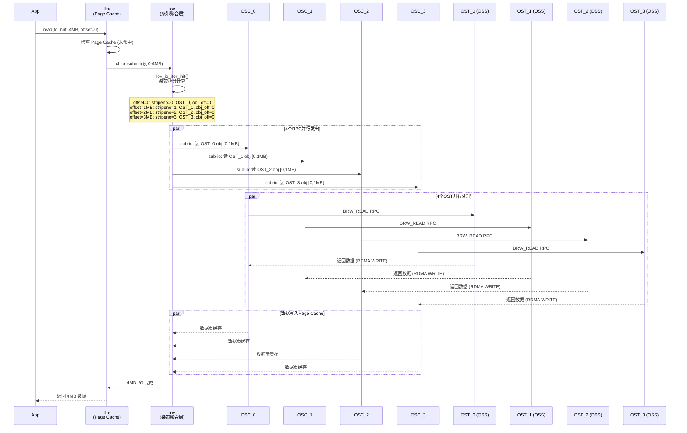
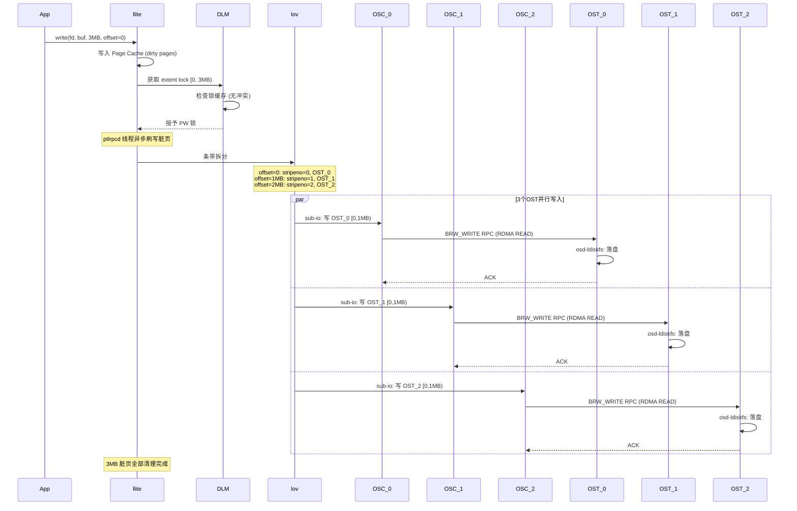
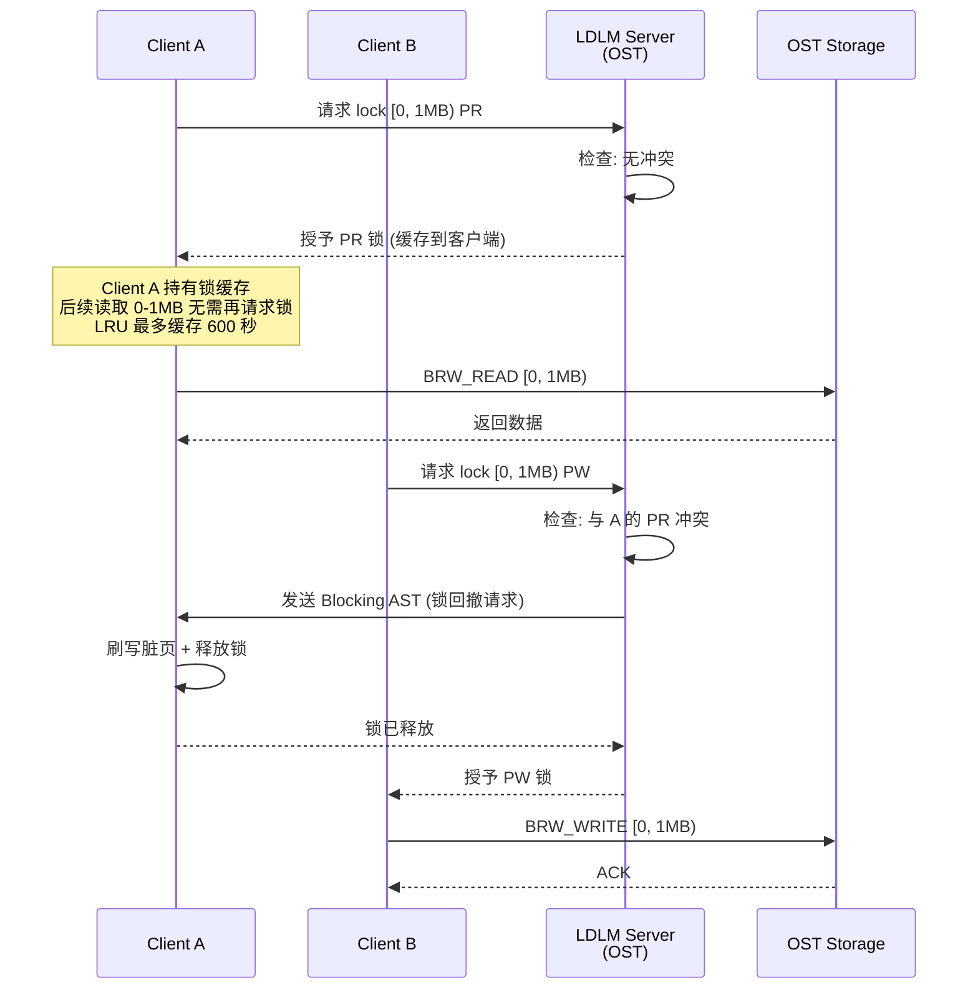
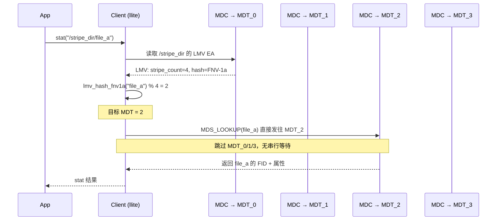
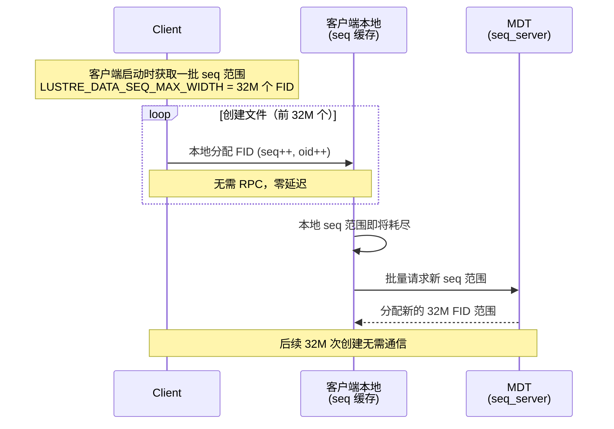
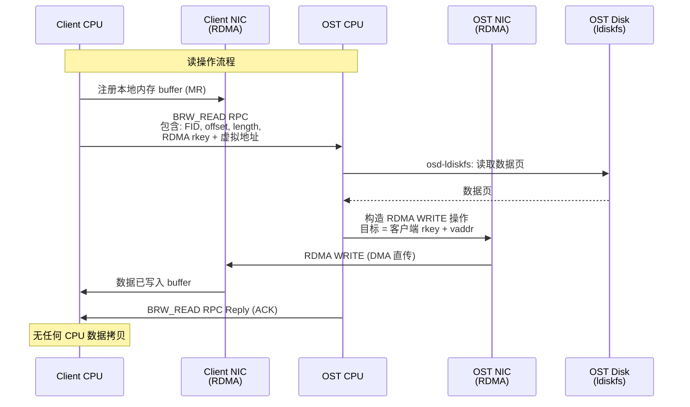
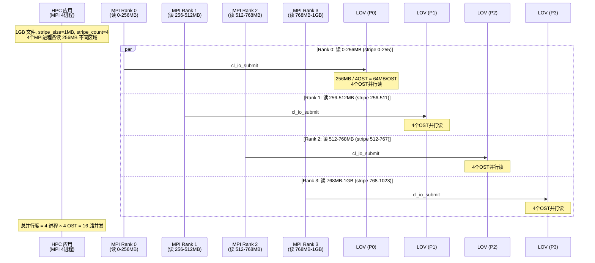

# Lustre 并行机制深度分析

## 1. 并行架构总览

Lustre 作为并行分布式文件系统，其并行性体现在 **四个维度**：

```
┌─────────────────────────────────────────────────────────────────────┐
│                     Lustre 并行维度全景                              │
│                                                                     │
│  维度1: 数据条带并行 (Data Striping)                               │
│  ├─ 单文件拆分为多个 stripe，分布在不同 OST 上                      │
│  └─ 单次 I/O 被拆分为多个子 I/O，并行发往多个 OSS                  │
│                                                                     │
│  维度2: 多客户端并行 (Multi-Client)                                 │
│  ├─ LDLM 分布式锁 + 客户端锁缓存 → 不同区域并发访问               │
│  ├─ Page Cache → 本地缓存减少服务端交互                            │
│  └─ 多客户端可同时读写同一文件的不同区域                            │
│                                                                     │
│  维度3: 元数据并行 (DNE: Distributed Namespace)                    │
│  ├─ LMV: 目录条带化，跨多个 MDT 分布                              │
│  ├─ 同一大目录的 lookup 可并行路由到不同 MDT                       │
│  └─ FID 序列化: 客户端本地分配，无需每次请求服务端                 │
│                                                                     │
│  维度4: 传输并行 (Bulk Transfer + RDMA)                            │
│  ├─ PTLRPC Bulk Transfer: 数据旁路传输，不经 CPU 拷贝             │
│  ├─ RDMA WRITE/READ: 客户端内存 ↔ OST 内存直接传输                │
│  └─ 多连接、多 portal 并发                                          │
└─────────────────────────────────────────────────────────────────────┘
```

---

## 2. 维度1: 数据条带并行

### 2.1 条带化原理

Lustre 将一个逻辑文件按固定大小（stripe_size）切分为条带，循环分布到多个 OST 上。客户端发起一次 I/O 时，LOV 层将其拆分为多个子 I/O，并行发往不同 OSS。

```
文件逻辑空间 (stripe_size=1MB, stripe_count=4):
Offset:  0       1MB      2MB      3MB      4MB      5MB      6MB      7MB
         ├───────┼────────┼────────┼────────┼───────┼────────┼────────┼────→
         │  S0   │  S1    │  S2    │  S3    │  S0   │  S1    │  S2    │  S3
         │OST_0  │OST_1   │OST_2   │OST_3   │OST_0  │OST_1   │OST_2   │OST_3
         └───────┴────────┴────────┴────────┴───────┴────────┴────────┴────→
         │←──────── stripe_width = 4MB ──────────→│←──────── stripe_width ─→│
```

**偏移映射公式**（源码: [lov_offset.c](lustre/lov/lov_offset.c)）：

```
given file_offset:
  swidth    = stripe_size × stripe_count
  round     = file_offset / swidth
  in_round  = file_offset % swidth
  stripeno  = in_round / stripe_size        → lov_stripe_number()
  obj_off   = round × stripe_size + (in_round % stripe_size)  → lov_stripe_offset()
  ost_idx   = (stripe_offset + stripeno) % stripe_count
```

### 2.2 单次读操作并行拆分时序



### 2.3 单次写操作并行拆分时序



### 2.4 条带并行的关键参数

| 参数 | 说明 | 典型值 | 最大值 |
|------|------|--------|--------|
| `stripe_size` | 每条带字节大小 | 1MB (1048576) | 无上限 |
| `stripe_count` | 条带数量 | 与 OST 数量相同 | 2000 (`LOV_MAX_STRIPE_COUNT`) |
| `stripe_offset` | 起始 OST 索引 | -1 (自动选择) | OST 总数 - 1 |
| `LOV_MIN_STRIPE_SIZE` | 最小条带大小 | 64KB | — |
| `LOV_MAX_STRIPE_COUNT` | 最大条带数 | — | 2000 |

**聚合带宽** = `单 OST 带宽 × min(stripe_count, 活跃 OST 数)`

---

## 3. 维度2: 多客户端并行

### 3.1 LDLM 分布式锁实现并发控制

Lustre 使用基于 VAX DLM 的 LDLM（[lustre_dlm.h](lustre/include/lustre_dlm.h)），允许多个客户端并发访问不同区域：

```
Client A: lock [0, 1MB)    PR ──→ OST_0 授予 ──→ 读取 0-1MB
Client B: lock [1MB, 2MB)  PR ──→ OST_1 授予 ──→ 读取 1-2MB    ← 并行无冲突
Client C: lock [2MB, 3MB)  PW ──→ OST_2 授予 ──→ 写入 2-3MB    ← 并行无冲突
Client D: lock [0, 1MB)    PW ──→ 等待 A 释放锁                  ← 锁冲突，排队
```

### 3.2 锁类型和模式

| 锁类型 | 资源 | 用途 |
|--------|------|------|
| **EXTENT** | OST 上 (FID, offset, length) | 文件数据范围锁 |
| **INODE** | MDT 上 FID | 元数据操作锁 |
| **IBITS** | MDT 上 FID (按位) | 属性位锁 (size, mtime, mode) |

| 锁模式 | 说明 | 并发性 |
|--------|------|--------|
| **PR** (Protected Read) | 共享读锁 | 多个 PR 可共存 |
| **PW** (Protected Write) | 排他写锁 | 与 PR/PW 互斥 |
| **CW** (Concurrent Write) | 并发写锁 (append) | 多个 CW 可共存，只允许追加 |
| **EX** (Exclusive) | 完全排他 | 与所有锁互斥 |

### 3.3 锁缓存机制



**锁缓存关键参数**（[lustre_dlm.h](lustre/include/lustre_dlm.h)）：

```
LDLM_DEFAULT_LRU_SIZE       = 100 × CPU 数量   // 每客户端最大缓存锁数
LDLM_DEFAULT_LRU_MAX_AGE    = 600 秒 (10分钟)   // 锁空闲超时
LDLM_DEFAULT_LRU_SHRINK_BATCH = 16              // 批量回收粒度
```

### 3.4 多客户端并行读写同一文件

```mermaid
sequenceDiagram
    participant A as Client A<br/>(写 0-1MB)
    participant B as Client B<br/>(写 1-2MB)
    participant C as Client C<br/>(读 2-4MB)
    participant DLM as LDLM
    participant O0 as OST_0
    participant O1 as OST_1
    participant O2 as OST_2
    participant O3 as OST_3

    par Client A 写入 0-1MB
        A->>DLM: lock [0, 1MB) PW → OST_0
        DLM-->>A: 授予
        A->>O0: BRW_WRITE [0,1MB)
        O0-->>A: ACK
    and Client B 写入 1-2MB
        B->>DLM: lock [1MB, 2MB) PW → OST_1
        DLM-->>B: 授予 (与 A 不冲突)
        B->>O1: BRW_WRITE [0,1MB)
        O1-->>B: ACK
    and Client C 读取 2-4MB
        C->>DLM: lock [2MB, 4MB) PR → OST_2, OST_3
        DLM-->>C: 授予 (与 A/B 不冲突)
        C->>O2: BRW_READ [0,1MB)
        C->>O3: BRW_READ [0,1MB)
        O2-->>C: 数据
        O3-->>C: 数据
    end

    Note over A,B,C: 三个客户端完全并行，互不阻塞
```

---

## 4. 维度3: 元数据并行 (DNE)

### 4.1 分布式目录 (LMV)

传统文件系统只有一个元数据服务器，是元数据操作瓶颈。Lustre 通过 LMV（Logical Metadata Volume）将目录条带化分布到多个 MDT：

```
传统单 MDT:
  /dir/ 下的所有文件查找 → MDT_0 (串行瓶颈)

DNE 分布式目录:
  /dir/ (stripe_count=4, hash_type=FNV-1a)
  ├── file_a  → hash("file_a") % 4 = 2 → MDT_2
  ├── file_b  → hash("file_b") % 4 = 0 → MDT_0
  ├── file_c  → hash("file_c") % 4 = 3 → MDT_3
  └── file_d  → hash("file_d") % 4 = 1 → MDT_1
```

### 4.2 目录查找并行路由时序



### 4.3 多客户端并行目录操作

```mermaid
sequenceDiagram
    participant A as Client A<br/>ls /stripe_dir/
    participant B as Client B<br/>stat /stripe_dir/file_x
    participant C as Client C<br/>create /stripe_dir/file_new
    participant M0 as MDT_0
    participant M1 as MDT_1
    participant M2 as MDT_2
    participant M3 as MDT_3

    par Client A 列目录
        A->>M0: hash("file_1") → MDT_0
        A->>M1: hash("file_2") → MDT_1
        A->>M2: hash("file_3") → MDT_2
        A->>M3: hash("file_4") → MDT_3
        Note over A: 4个 MDT 并行返回
    and Client B 查找单个文件
        B->>B: hash("file_x") = 1 → MDT_1
        B->>M1: MDS_LOOKUP("file_x")
        M1-->>B: FID + attr
    and Client C 创建文件
        C->>C: hash("file_new") = 3 → MDT_3
        C->>M3: MDS_CREATE("file_new")
        M3-->>C: FID
    end

    Note over A,B,C: 三个客户端并行操作不同 MDT<br/>互不阻塞
```

### 4.4 FID 本地分配（消除元数据分配瓶颈）



**关键参数**（[lustre_fid.h](lustre/include/lustre_fid.h)）：

```
LUSTRE_METADATA_SEQ_MAX_WIDTH = 0x20000      (128K FID/seq，元数据)
LUSTRE_DATA_SEQ_MAX_WIDTH    = 0x1FFFFFF     (32M FID/seq，数据对象)
LUSTRE_SEQ_BATCH_WIDTH       = 1000 seqs     (客户端一次批量获取)
```

---

## 5. 维度4: 传输并行 (Bulk Transfer + RDMA)

### 5.1 PTLRPC Bulk Transfer 机制

Lustre 的数据传输使用 Bulk Transfer，数据直接在客户端和 OST 之间传输，**不经服务端 CPU 拷贝**：

```
读操作:
  ┌──────────┐     控制RPC      ┌──────────┐
  │ Client   │ ──────────────→  │ OST      │
  │          │ ←──────────────  │          │
  │          │                   │          │
  │  内存 ◄──┼──── RDMA WRITE ───┤ OST 内存  │  ← 数据直接传输
  │          │                   │          │
  └──────────┘                   └──────────┘

写操作:
  ┌──────────┐     控制RPC      ┌──────────┐
  │ Client   │ ──────────────→  │ OST      │
  │          │ ←──────────────  │          │
  │          │                   │          │
  │  内存 ──┼──── RDMA READ ────┤ OST 内存  │  ← 数据直接传输
  │          │                   │          │
  └──────────┘                   └──────────┘
```

### 5.2 Bulk Transfer 时序



### 5.3 LNet 多连接并发

```
┌─────────────┐         LNet           ┌─────────────┐
│  Client A   │◄──────────────────────►│   OSS_0      │
│  (多 LNet)  │◄──────────────────────►│   (多 LNet)  │
│             │                         │              │
├─────────────┤                         ├─────────────┤
│  Client B   │◄──────────────────────►│   OSS_1      │
│             │◄──────────────────────►│              │
├─────────────┤                         ├─────────────┤
│  Client C   │◄──────────────────────►│   OSS_2      │
│             │◄──────────────────────►│              │
└─────────────┘                         └─────────────┘

每个 client ↔ OSS 连接独立带宽
传输层: ksocklnd (TCP) 或 ko2iblnd (InfiniBand RDMA)
Portals: MDS_REQUEST (12), OST_IO (6), MDS_IO (13)
```

---

## 6. 四维并行的综合效果

### 6.1 单个大文件并行读示例



### 6.2 并行度汇总

```
                    ┌──────────────────────────┐
                    │     聚合 I/O 带宽         │
                    │                          │
                    │  = 单OSS带宽 × 并行度    │
                    │                          │
                    │  并行度 = 进程数          │
                    │         × stripe_count   │
                    │         × 连接数          │
                    │         × RDMA 通道数    │
                    │                          │
                    │  例: 100MB/s × 4 × 4    │
                    │      × 2 × 2 = 6.4GB/s  │
                    └──────────────────────────┘
```

### 6.3 对比：有无并行机制的差异

| 场景 | 无并行 (单文件系统) | Lustre 并行 |
|------|---------------------|-------------|
| **1GB 文件读取** | 1 路串行, 受单磁盘带宽限制 | stripe_count 路并行 |
| **1000 个客户端读不同文件** | 元数据服务端串行瓶颈 | 多 MDT + LDLM 锁缓存并行 |
| **大目录 ls** | 单 MDT 遍历, O(n) 延迟 | LMV 条带化, 跨 MDT 并行查询 |
| **数据传输** | CPU 拷贝, 受内核协议栈限制 | RDMA DMA 直传, 零拷贝 |
| **文件创建** | 每次 inode 分配需 RPC | 客户端本地分配 FID, 32M 次零延迟 |
| **写 1GB 到单个文件** | 单 OSS 串行写入 | stripe_count 个 OSS 并行写入 |

---

## 7. 关键源码索引

| 并行维度 | 关键文件 | 核心函数/结构 |
|----------|----------|---------------|
| 条带拆分 | `lustre/lov/lov_offset.c` | `lov_stripe_offset()`, `lov_stripe_number()`, `lov_stripe_intersects()` |
| IO 迭代 | `lustre/lov/lov_io.c` | `lov_io_iter_init()`, `lov_io_rw_iter_init()` |
| 页映射 | `lustre/lov/lov_page.c` | `lov_page_init_composite()` |
| 分布式锁 | `lustre/include/lustre_dlm.h` | LDLM_NAMESPACE_SERVER, EXTENT/INODE/IBITS |
| 锁缓存 | `lustre/ldlm/ldlm_lock.c` | ldlm_grant(), ldlm_reprocess_queue() |
| LMV 目录 | `lustre/include/lustre_lmv.h` | `lmv_hash_fnv1a()`, `lmv_hash_crush()` |
| FID 分配 | `lustre/include/lustre_fid.h` | `seq_client_alloc_fid()` |
| Bulk 传输 | `lustre/ptlrpc/niobuf.c` | ptlrpc_prep_bulk_page_pin() |
| OSC 缓存 | `lustre/osc/osc_cache.c` | osc_extent, osc_page |
| 对象预创建 | `lustre/osp/osp_precreate.c` | osp_precreate() |
