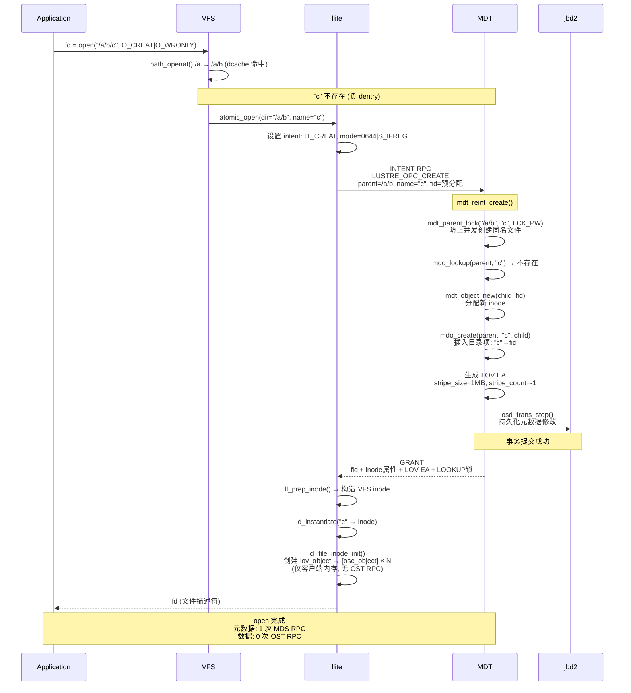
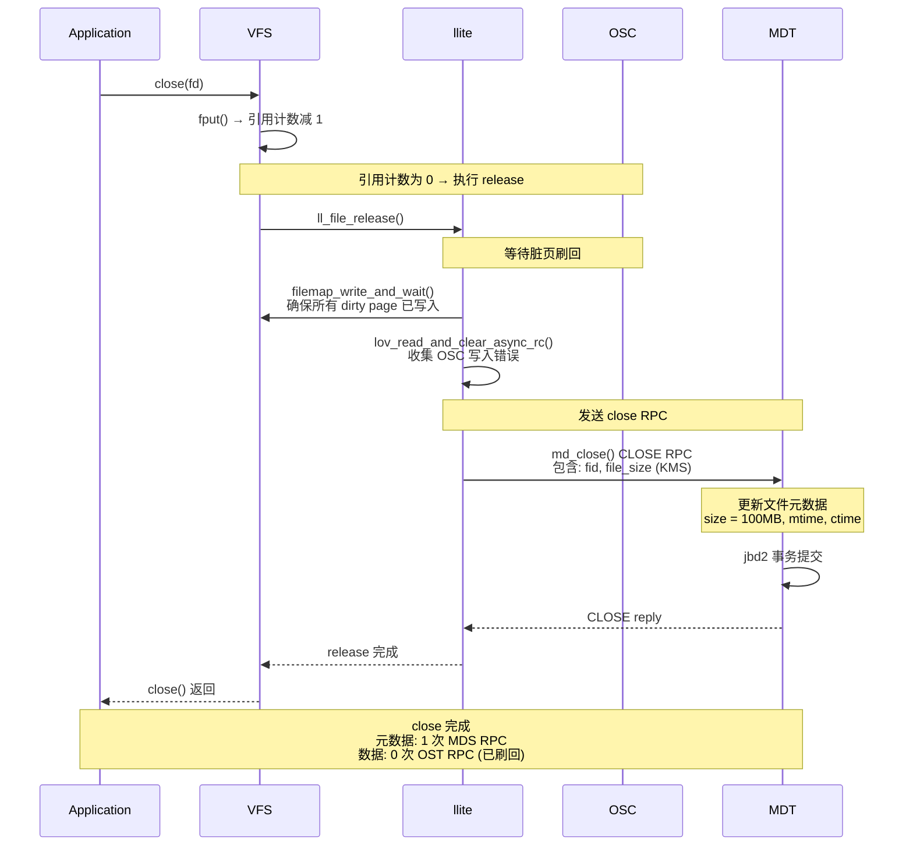
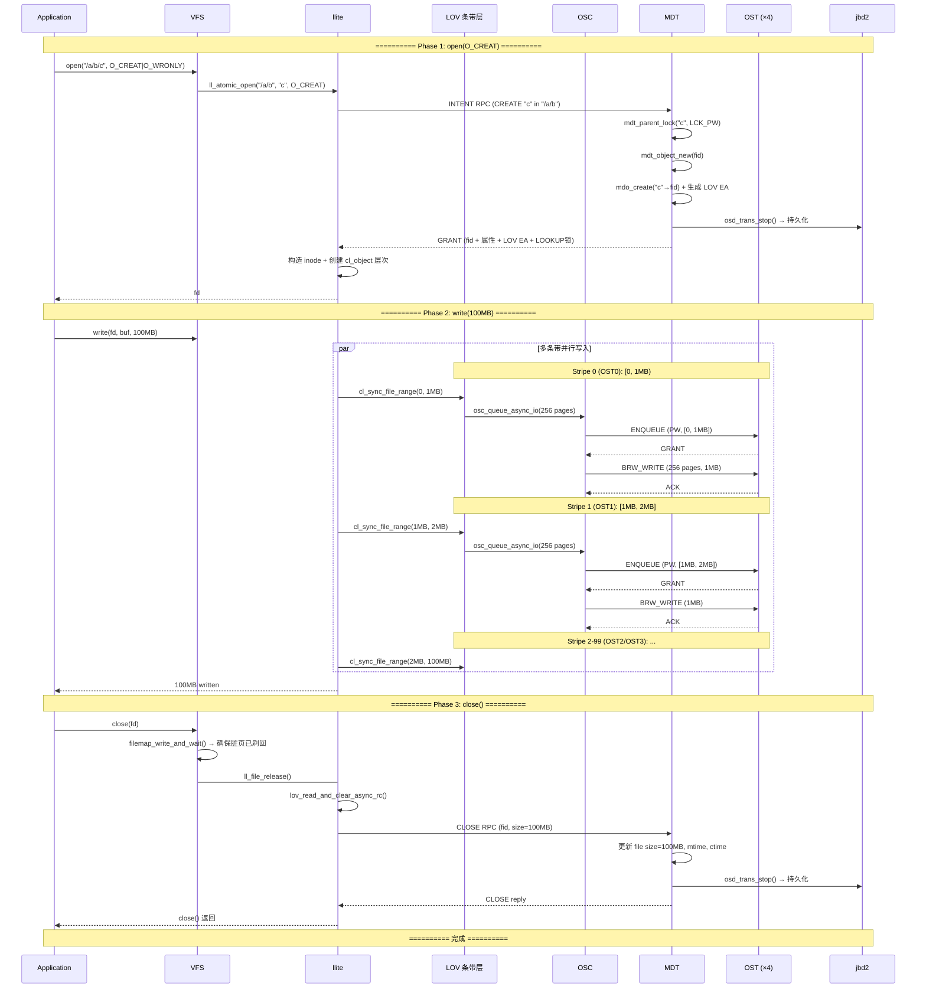

# 写入 100MB 文件到 Lustre 的完整过程分析

---

## 目录

1. [场景说明](#1-场景说明)
2. [open(O_CREAT) 阶段](#2-openo_creat-阶段)
3. [write() 数据写入阶段](#3-write-数据写入阶段)
4. [close() 关闭阶段](#4-close-关闭阶段)
5. [完整时序图](#5-完整时序图)
6. [元数据操作汇总](#6-元数据操作汇总)
7. [IO 处理汇总](#7-io-处理汇总)
8. [RPC 统计](#8-rpc-统计)
9. [关键源码索引](#9-关键源码索引)

---

## 1. 场景说明

### 1.1 操作描述

```
操作: open("/a/b/c", O_CREAT | O_WRONLY, 0644)
      write(fd, buf, 100MB)
      close(fd)

文件系统: Lustre (默认 1MB 条带大小, -1 stripe count = 所有 OST)

假设:
  - 路径 /a/b 已存在, 客户端已缓存其 dentry
  - 文件 c 不存在 (O_CREAT 触发创建)
  - 100MB 文件, 默认 1MB 条带
  - 假设集群有 4 个 OST (OST0, OST1, OST2, OST3)
  - 条带模式: RAID0 (循环条带)
```

### 1.2 条带分布

```
100MB 文件, 1MB 条带, 4 个 OST:

  Offset      Stripe    OST
  ──────────────────────────────
  [0, 1MB)     0       OST0
  [1MB, 2MB)   1       OST1
  [2MB, 3MB)   2       OST2
  [3MB, 4MB)   3       OST3
  [4MB, 5MB)   4       OST0
  [5MB, 6MB)   5       OST1
  ...          ...      ...
  [99MB,100MB)  99      OST3

  总共 100 个条带对象, 每个约 1MB
  分布在 4 个 OST 上, 每个 OST 约 25 个对象
```

### 1.3 元数据与数据流概览

```
  ┌─────────────────────────────────────────────────────────────────┐
  │                      写入 100MB 文件                               │
  │                                                                  │
  │  元数据路径 (MDS):                                               │
  │    open(O_CREAT) → 1 个 MDS intent RPC                           │
  │      → 路径解析 + 创建 inode + 创建目录项 + 分配 FID              │
  │      → 返回 LOV 条带元数据 (EA)                                   │
  │                                                                  │
  │  数据路径 (OST):                                                 │
  │    write() → 按条带分片 → 每个 OST 发送 BRW RPC                   │
  │      → 每个 RPC 约 1MB (PTLRPC_MAX_BRW_PAGES)                   │
  │      → 100MB ÷ 1MB ≈ 100 次 BRW RPC                            │
  │      → 分布在 4 个 OST 上, 每个 OST 约 25 次                    │
  │                                                                  │
  │  关闭路径:                                                       │
  │    close() → flush 脏页 → 1 个 MDS close RPC                      │
  │      → MDS 更新文件大小 (从 OST 获取 KMS)                         │
  └─────────────────────────────────────────────────────────────────┘
```

---

## 2. open(O_CREAT) 阶段

### 2.1 入口

```
Application:
  fd = open("/a/b/c", O_CREAT | O_WRONLY, 0644)

Linux VFS 调用链:
  vfs_open()
    → path_openat()          解析路径 /a/b/c
    → lookup_beneath()        逐级查找 a → b (命中 dcache)
    → atomic_open()           最后一级 "c" 不存在 (负 dentry)
      → ll_atomic_open()      ← Lustre 入口
```

### 2.2 ll_atomic_open() 流程

```cpp
// namei.c:1385-1551
ll_atomic_open(dir, dentry, file, open_flags, op, ...):
  1. 设置 intent: IT_OPEN | IT_CREAT
  2. it->it_create_mode = 0644 | S_IFREG

  3. ll_lookup_it(dir, dentry, it, ...):
     // namei.c:1043-1290
     a. opc = LUSTRE_OPC_CREATE (因为 O_CREAT)
     b. ll_intent_lock():
        → 发送 INTENT RPC 到 MDS (单次 RPC 完成查找+创建)
        → MDS 返回: FID + inode 属性 + LOV 条带 EA + LOOKUP 锁

  4. ll_create_it():  (namei.c:1602)
     a. ll_prep_inode(): 从 RPC 回复构造 VFS inode
     b. d_instantiate(): 挂载到 dentry
     c. ll_create_node(): 设置 FID、布局信息

  5. cl_file_inode_init():  (lcommon_cl.c:124)
     a. 解析 LOV EA (条带元数据)
     b. 创建 cl_object 层次:
        lov_object → [lovsub_object → osc_object] × N
        (仅客户端内存结构, 不发送 OST RPC!)

  6. ll_finish_open(): 挂载 file 结构
```

### 2.3 MDS 端处理

```cpp
// mdt_reint.c:1187-1233
mdt_reint_create():
  mdt_create():
    // mdt_reint.c:520-852

    1. mdt_object_find(parent_fid)  // 查找父目录 /a/b
    2. mdo_lookup(parent, "c")       // 检查 "c" 是否已存在

    3. mdt_parent_lock(parent, "c", LCK_PW)
       // 获取父目录的名字项锁, 防止并发创建同名文件

    4. mdo_lookup(parent, "c")       // 锁下再次检查

    5. mdt_object_new(child_fid)
       // 分配新 inode (FID 由客户端预分配)

    6. mdo_create(parent, "c", child, ...)
       // 创建目录项: "c" → child_fid
       // 同时更新父目录 mtime/ctime

    7. 生成 LOV 条带 EA
       // 包含: stripe_count, stripe_size, stripe_pattern
       //   stripe_size = 1MB (默认)
       //   stripe_count = -1 (所有 OST)
       //   stripe_pattern = RAID0 (循环)

    8. 授予 LOOKUP|UPDATE|PERM inode bits 锁 (LCK_PR)
       // 客户端可以缓存目录项

    9. jbd2 事务提交 (osd_trans_stop)
       // 所有元数据修改通过 jbd2 持久化
```

### 2.4 open 阶段时序



---

## 3. write() 数据写入阶段

### 3.1 写入概览

```
100MB 写入的处理流程:

  Application: write(fd, buf, 100MB)
      │
      ▼
  Linux VFS: generic_perform_write()
      │ 按 page size (4KB) 分割
      │ 100MB = 25600 个 page
      │
      ▼
  ll_write_begin() × 25600
      │ 每个 page 调用一次
      │ grab_cache_page → cl_page_assume
      │ (page 加入脏页标记)
      │
      ▼
  用户数据拷贝到 page (内核完成)
      │
      ▼
  ll_write_end() × 25600
      │ cl_page_list_add → 标记 inode dirty
      │ 当累积到 RPC 大小时触发提交
      │
      ▼
  vvp_io_write_commit()
      │ 触发 writeback
      │
      ▼
  ll_writepages() / cl_sync_file_range()
      │ 按 stripe 分片
      │
      ▼
  lov 层: 按 1MB 条带分片
      │ page 0-255 → stripe 0 → OST0
      │ page 256-511 → stripe 1 → OST1
      │ ...
      │ page 25088-25343 → stripe 99 → OST3
      │
      ▼
  osc_queue_async_io() (每个 stripe)
      │ 创建 osc_extent, 聚合脏页
      │
      ▼
  osc_lock_enqueue() (首次访问某个 OST 范围)
      │ 向 OST 请求 PW extent 锁
      │
      ▼
  osc_build_rpc() → BRW_WRITE RPC → OST
      │ 每个 RPC 约 256 个 page (1MB)
      │ 共约 100 个 BRW RPC
      │ 分散在 4 个 OST
```

### 3.2 条带分片细节

```
lov 层如何将连续的文件偏移映射到不同的 OST:

  cl_sync_file_range(file, 0, 100MB):
    │
    ▼
  lov_io_submit() 遍历所有 lovsub_object:
    │
    ├── lovsub_object[0] (OST0):
    │   cl_sync_range(0, 1MB) → page 0~255
    │   → osc_queue_async_io(osc_for_OST0, page0~255)
    │   → BRW_WRITE RPC to OST0 (1MB, 256 pages)
    │
    ├── lovsub_object[1] (OST1):
    │   cl_sync_range(1MB, 2MB) → page 256~511
    │   → BRW_WRITE RPC to OST1 (1MB)
    │
    ├── lovsub_object[2] (OST2):
    │   cl_sync_range(2MB, 3MB)
    │   → BRW_WRITE RPC to OST2 (1MB)
    │
    ├── lovsub_object[3] (OST3):
    │   cl_sync_range(3MB, 4MB)
    │   → BRW_WRITE RPC to OST3 (1MB)
    │
    └── ... (循环, 共 100 个 stripe)
```

### 3.3 单个条带的写入流程

```
以 stripe 0 (OST0, [0, 1MB)) 为例:

  1. osc_queue_async_io(page 0~255)
     a. osc_extent_find(osc, 0) → 创建 osc_extent
     b. 获取 write osc_lock (假设已有锁, 或需要 ENQUEUE)
     c. 关联: extent.oe_dlmlock = ldlm_lock_get(osclock)
     d. 256 个 page 添加到 extent.oe_pages

  2. osc_io_unplug() → osc_send_write_rpc()
     a. 遍历 extent tree, 找到 OES_CACHE 的 extent
     b. osc_extent_state_set(ext, OES_LOCKING)
     c. osc_build_rpc(env, cli, &rpclist, OBD_BRW_WRITE)
     d. 打包 256 个 page 到 BRW request

  3. BRW_WRITE RPC → OST0
     a. OST 接收数据, 写入磁盘 (jbd2 事务)
     b. OST 返回 ACK

  4. osc_extent_finish()
     a. 状态: OES_RPC → OES_INV
     b. 释放 page 引用
```

### 3.4 数据写入时序

```mermaid
sequenceDiagram
    participant APP as Application
    participant VFS as VFS
    participant LL as llite
    participant LOV as LOV (条带层)
    participant OSC as OSC
    participant OST0 as OST0
    participant OST1 as OST1
    participant OSTN as OST2/3

    APP->>VFS: write(fd, buf, 100MB)

    Note over VFS,LOV: 写入 25600 个 page (100MB / 4KB)

    loop 每 ~256 个 page (1MB, 一个条带)
        VFS->>LL: ll_write_begin() → grab_cache_page → cl_page_assume
        Note over VFS: 内核拷贝用户数据到 page

        VFS->>LL: ll_write_end() → 标记 page dirty

        LL->>LL: vvp_io_write_commit() → 触发 writeback

        LL->>LOV: cl_sync_file_range(stripe_start, stripe_end)

        par 多个条带并行
            LOV->>OSC0: osc_queue_async_io(page 0~255)
            LOV->>OSC1: osc_queue_async_io(page 256~511)
            LOV->OSC1->>OSC2: osc_queue_async_io(page 512~767)
            LOV->>OSC3: osc_queue_async_io(page 768~1023)
        end

        Note over OSC,OSTN: stripe 0 (OST0) 详细流程

        OSC0->>OSC0: osc_lock_enqueue() [如果尚未获取锁]
        OSC0->>OST0: ENQUEUE RPC (PW, [0, 1MB))
        OST0-->>OSC0: GRANT

        OSC0->>OSC0: osc_build_rpc()<br/>打包 256 个 page
        OSC0->>OST0: BRW_WRITE RPC (1MB)
        OST0-->>OSC0: ACK

        Note over OSC0: osc_extent_finish()<br/>释放 page 引用
    end

    APP->>VFS: write() 返回 100MB

    Note over APP,OSTN: 数据写入完成<br/>100MB = 100 个 BRW RPC<br/>分布在 4 个 OST
```

---

## 4. close() 关闭阶段

### 4.1 关闭流程

```
Application:
  close(fd)

Linux VFS 调用链:
  filp_close()
    → fput() (引用计数 -1)
    → 当引用计数为 0 时:
      → __fput()
        → do_fput()
          → file->f_op->release() = ll_file_release()
```

### 4.2 ll_file_release() 流程

```cpp
// file.c:435-494
ll_file_release(inode, file):
  1. lov_read_and_clear_async_rc(lli->lli_clob)
     // 收集 OSC 层的异步写入错误

  2. ll_md_close(inode, file)
     // file.c:329-433
     a. ll_close_inode_openhandle()
        // file.c:140-275
        b. ll_prepare_close()  // 准备 close 操作数据
        c. md_close(md_exp, op_data, och_mod, &req)
           → 发送 CLOSE RPC 到 MDS
           → 包含: 文件大小 (KMS 从 OST 获取)
           → MDS 更新文件的 size, mtime, ctime
```

### 4.3 close 阶段时序



---

## 5. 完整时序图



---

## 6. 元数据操作汇总

### 6.1 MDT 端元数据修改

| 操作 | 时机 | 内容 | 存储 |
|------|------|------|------|
| **创建 inode** | open(O_CREAT) | 分配 FID, 初始化 inode (mode, uid, gid, atime...) | ldiskfs inode |
| **创建目录项** | open(O_CREAT) | 插入 "c" → fid 映射到父目录 /a/b 的 B-tree | ldiskfs 目录块 |
| **更新父目录** | open(O_CREAT) | mtime++, ctime++, nlink++ | ldiskfs inode |
| **生成 LOV EA** | open(O_CREAT) | 条带参数 (stripe_size=1MB, stripe_count=-1, pattern=RAID0) | ldiskfs xattr |
| **更新文件属性** | close | size=100MB, mtime, ctime | ldiskfs inode |
| **jbd2 持久化** | open + close | 所有上述修改通过 jbd2 事务保证持久化 | jbd2 journal |

### 6.2 客户端元数据缓存

| 缓存内容 | 获取时机 | 释放条件 |
|---------|---------|---------|
| **dentry (dcache)** | 路径解析时自动缓存 | 内存压力 / VFS 回收 / 被撤销 |
| **inode 属性** | open 时从 MDS RPC 获取 | LOOKUP 锁过期 / 其他客户端修改 |
| **LOOKUP 锁** | open(O_CREAT) 时 MDS 授予 | 其他客户端创建/删除同名文件 / LRU 超时 |
| **LOV 条带 EA** | open(O_CREAT) 时从 MDS 返回 | 文件 restripe / close 后可能失效 |
| **FID** | open(O_CREAT) 时由客户端预分配 | 文件删除后失效 |

### 6.3 MDT 元数据事务 (jbd2)

```
open(O_CREAT) 事务:
  osd_trans_create()
  osd_trans_start()
    ├── mdo_create(parent, "c", child)  → 创建目录项
    ├── mdt_object_new(child)           → 创建 inode
    ├── mdt_attr_set(parent, mtime)     → 更新父目录
    └── 更新 LOV EA
  osd_trans_stop()  → jbd2 持久化

close() 事务:
  osd_trans_create()
  osd_trans_start()
    ├── mdt_attr_set(child, size)      → 更新文件大小
    └── mdt_attr_set(child, mtime)     → 更新时间戳
  osd_trans_stop()  → jbd2 持久化
```

---

## 7. IO 处理汇总

### 7.1 客户端数据流

```
Application buf (100MB)
      │
      ▼
VFS page cache (25600 × 4KB pages)
      │ dirty page 标记
      ▼
CL 层 (cl_page)
      │ 按 stripe 分组
      ▼
LOV 层 (lov_object)
      │ 按 stripe_size 拆分
      │ stripe 0 → OST0, stripe 1 → OST1, ...
      ▼
OSC 层 (osc_object × 4)
      │ 每个 osc_object 管理自己负责的条带
      │ dirty page 聚合为 osc_extent
      ▼
osc_extent (约 100 个 extent)
      │ 每个 extent ≈ 1MB (256 pages)
      │ 状态: ACTIVE → CACHE → LOCKING → RPC → INV
      ▼
BRW_WRITE RPC → OST (约 100 次 RPC)
      │ 每个 RPC 携带 ~1MB 数据
      │ 分散到 4 个 OST
      ▼
OST 磁盘 (通过 jbd2 事务持久化)
```

### 7.2 IO 关键参数

| 参数 | 值 | 说明 |
|------|-----|------|
| **文件大小** | 100MB | 总数据量 |
| **Page Size** | 4KB | Linux 默认页大小 |
| **总 Page 数** | 25600 | 100MB / 4KB |
| **条带大小** | 1MB | 默认 stripe_size |
| **条带数** | 100 | 100MB / 1MB |
| **条带模式** | RAID0 | 循环分配到各 OST |
| **OST 数量** | 4 | 假设 4 个 OST |
| **每个 OST 条带数** | 25 | 100 / 4 |
| **每个 RPC 大小** | ~1MB | 256 pages |
| **总 BRW RPC 数** | ~100 | 每个 stripe 一次 |
| **每个 OST RPC 数** | ~25 | 100 / 4 |

### 7.3 锁操作

```
数据写入需要的锁:

  1. MDT LOOKUP 锁 (open 时获取)
     → 保护目录项不被并发修改
     → LCK_PR 模式, 覆盖整个 inode

  2. OST PW extent 锁 (write 时获取)
     → 保护数据写入的独占性
     → 每个 OST 范围: [stripe_start, stripe_end]
     → 不同 OST 的锁可以并发获取 (不同资源)
     → 同一 OST 不同范围的 PW 可以共存 (如果范围不重叠)

  3. MDT inode bits 锁 (open 时获取)
     → LOOKUP + UPDATE + PERM
     → 允许其他客户端 LOOKUP 该文件 (共享读)
     → 但不能同时写 (需要自己的 UPDATE 锁)
```

---

## 8. RPC 统计

### 8.1 总 RPC 次数 (冷缓存, 首次写入)

```
open(O_CREAT):
  ┌──────────────────────────────────────────┐
  │ MDS:   1 次 INTENT RPC (CREATE)            │  ← 创建文件
  │ OST:   0 次 (OST 对象延迟创建)           │
  └──────────────────────────────────────────┘

write(100MB):
  ┌──────────────────────────────────────────┐
  │ MDS:   0 次                              │  ← 数据路径不经 MDS
  │ OST:   4 次 ENQUEUE RPC (首次获取锁)     │  ← 每个OST一次
  │ OST:  100 次 BRW_WRITE RPC              │  ← 100个条带
  └──────────────────────────────────────────┘

close():
  ┌──────────────────────────────────────────┐
  │ MDS:   1 次 CLOSE RPC                    │  ← 更新文件大小
  │ OST:   0 次 (数据已刷回)                │
  └──────────────────────────────────────────┘

总计:
  MDS RPC:   2 次 (CREATE + CLOSE)
  OST RPC: 104 次 (4 ENQUEUE + 100 BRW_WRITE)
  总 RPC:     106 次
```

### 8.2 RPC 次数 (热缓存, 已有锁)

```
open(O_CREAT):  1 MDS RPC
write(100MB):   100 BRW RPC (锁已缓存)
close():        1 MDS RPC
总计:            102 次 RPC
```

### 8.3 网络流量

```
  MDS RPC 流量 (每次 ~1-4KB):
    2 次 × ~2KB = ~4KB

  OST BRW 流量:
    请求头: 100 × ~1KB = ~100KB
    数据:    100 × 1MB = 100MB
    响应:    100 × ~1KB = ~100KB
    OST 总流量 ≈ 100.2MB

  总网络流量 ≈ 100.2MB + 4KB ≈ 100.2MB
```

---

## 9. 关键源码索引

| 模块 | 文件 | 关键内容 |
|------|------|---------|
| **atomic_open** | `lustre/llite/namei.c:1385` | `ll_atomic_open()` |
| **lookup_it** | `lustre/llite/namei.c:1043` | `ll_lookup_it()` |
| **create_it** | `lustre/llite/namei.c:1602` | `ll_create_it()` |
| **create_node** | `lustre/llite/namei.c:1554` | `ll_create_node()` |
| **new_node** | `lustre/llite/namei.c:1935` | `ll_new_node()` |
| **CL file init** | `lustre/llite/lcommon_cl.c:124` | `cl_file_inode_init()` |
| **write_begin** | `lustre/llite/rw26.c:632` | `ll_write_begin()` |
| **write_end** | `lustre/llite/rw26.c:831` | `ll_write_end()` |
| **writepages** | `lustre/llite/rw.c:1471` | `ll_writepages()` |
| **aops 注册** | `lustre/llite/rw26.c:950` | `ll_aops` |
| **dir ops** | `lustre/llite/namei.c:2544` | `ll_dir_inode_operations` |
| **file release** | `lustre/llite/file.c:435` | `ll_file_release()` |
| **md close** | `lustre/llite/file.c:329` | `ll_md_close()` |
| **openhandle** | `lustre/llite/file.c:140` | `ll_close_inode_openhandle()` |
| **MDT create** | `lustre/mdt/mdt_reint.c:1187` | `mdt_reint_create()` |
| **MDT create核心** | `lustre/mdt/mdt_reint.c:520` | `mdt_create()` |
| **MDT reint 分发** | `lustre/mdt/mdt_reint.c:3338` | `mdt_reinters[]` |
| **LOV init** | `lustre/lov/lov_object.c:1365` | `lov_object_init()` |
| **LOV offset** | `lustre/lov/lov_offset.c:121` | `lov_stripe_offset()` |
| **OSC async IO** | `lustre/osc/osc_cache.c:2446` | `osc_queue_async_io()` |
| **OSC extent** | `lustre/osc/osc_cache.c:688` | `osc_extent_find()` |
| **OSC lock** | `lustre/osc/osc_lock.c:985` | `osc_lock_enqueue()` |
| **OSC RPC** | `lustre/osc/osc_cache.c:2195` | `osc_build_rpc()` |
| **OSC unplug** | `lustre/osc/osc_cache.c:2392` | `__osc_io_unplug()` |
| **BRW prep** | `lustre/osc/osc_request.c:1524` | `osc_brw_prep_request()` |
