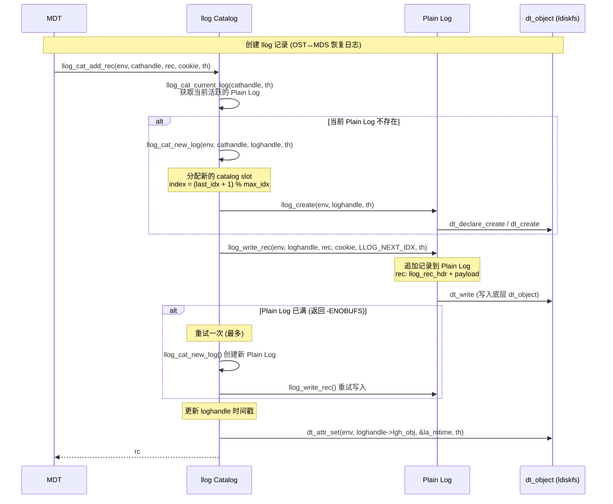
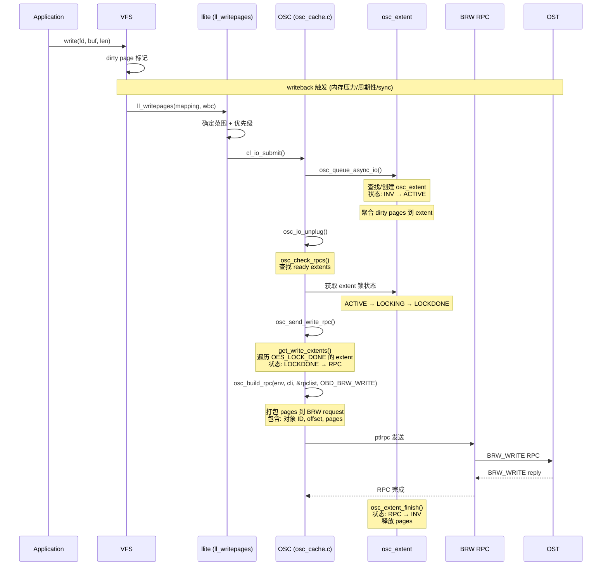
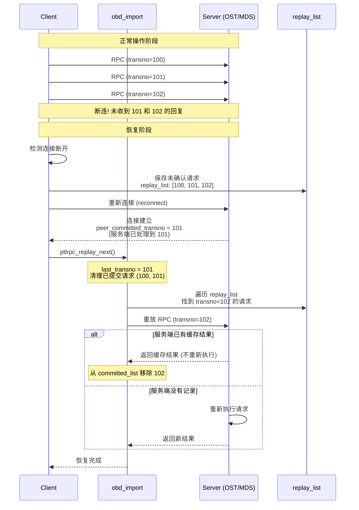
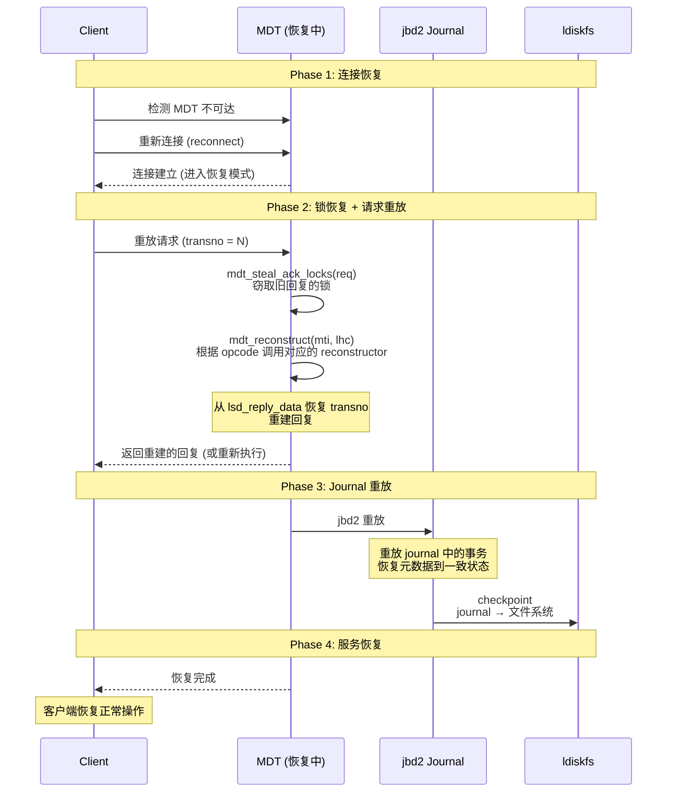
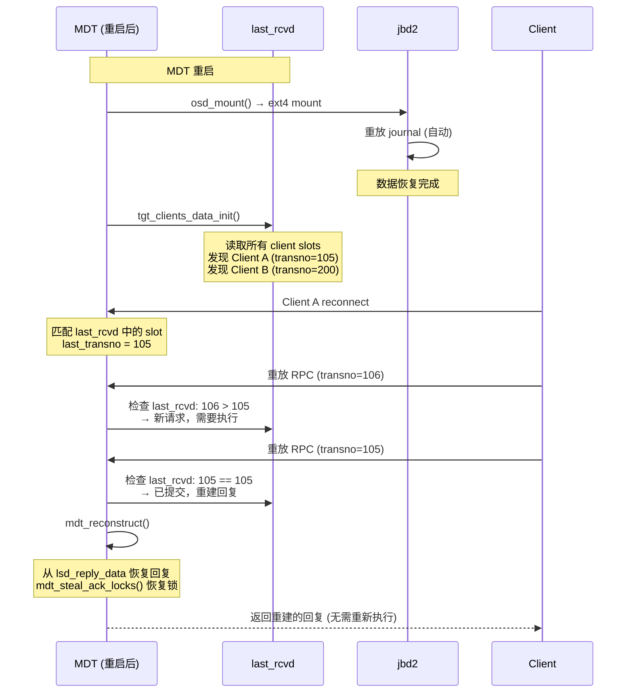
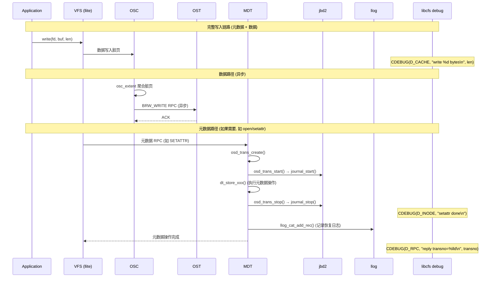

# Lustre 日志系统分析

---

## 目录

1. [日志系统总览](#1-日志系统总览)
2. [MDT 元数据日志 (jbd2)](#2-mdt-元数据日志-jbd2)
3. [Lustre Log (llog) 系统](#3-lustre-log-llog-系统)
4. [OSC 客户端写回与 BRW RPC](#4-osc-客户端写回与-brw-rpc)
5. [ptlrpc 恢复与重放](#5-ptlrpc-恢复与重放)
6. [MDT 恢复机制](#6-mdt-恢复机制)
7. [libcfs 调试日志系统](#7-libcfs-调试日志系统)
8. [last_rcvd 恢复文件](#8-last_rcvd-恢复文件)
9. [dt_txn_commit_cb 提交回调机制](#9-dt_txn_commit_cb-提交回调机制)
10. [OST (OFD) 架构与恢复](#10-ost-ofd-架构与恢复)
11. [各日志系统协作关系](#11-各日志系统协作关系)
12. [关键源码索引](#12-关键源码索引)

---

## 1. 日志系统总览

### 1.1 Lustre 日志体系

```
Lustre 日志系统由 5 个层次组成:

  ┌──────────────────────────────────────────────────────────────────┐
  │                     Lustre 日志体系                               │
  │                                                                  │
  │  Layer 1: libcfs Debug System (应用层调试日志)                    │
  │    ├── CDEBUG / CWARN / CERROR 宏                                │
  │    ├── 按子系统 + 掩码过滤 (S_MDS, S_RPC, S_OSD, ...)             │
  │    └── 输出到 /tmp/lustre-log 或内核环形缓冲区                     │
  │                                                                  │
  │  Layer 2: Client Writeback (客户端回写)                           │
  │    ├── Linux VFS writepages → ll_writepages                       │
  │    ├── OSC extent 聚合 → osc_build_rpc                           │
  │    └── BRW RPC → OST                                             │
  │                                                                  │
  │  Layer 3: llog (Lustre Log)                                      │
  │    ├── OST↔MDS 恢复日志                                          │
  │    ├── Catalog + Plain Log 两级结构                               │
  │    └── 基于 dt_object 存储                                        │
  │                                                                  │
  │  Layer 4: MDT Journal (jbd2)                                     │
  │    ├── osd-ldiskfs → jbd2 事务日志                               │
  │    ├── 元数据变更持久化保证                                        │
  │    └── 崩溃恢复时重放                                              │
  │                                                                  │
  │  Layer 5: ptlrpc Recovery (RPC 恢复/重放)                        │
  │    ├── 客户端 replay_list 保存未确认请求                           │
  │    ├── 重连后按 transno 重放                                      │
  │    └── 服务端 reconstruct 重建回复                                 │
  └──────────────────────────────────────────────────────────────────┘
```

### 1.2 各日志职责对比

| 日志 | 位置 | 职责 | 持久化 | 崩溃恢复 |
|------|------|------|--------|---------|
| **jbd2 journal** | MDT (osd-ldiskfs) | MDT 元数据变更的 WAL | 磁盘 (ext4/ldiskfs journal) | 重放 journal 恢复元数据 |
| **llog** | OST/MDS | OST↔MDS 恢复日志 | dt_object (LDISKFS) | 重放恢复 OST 端状态 |
| **OSC writeback** | Client | 脏页聚合并发送到 OST | 通过 BRW RPC 发送 | 重连后 resend |
| **ptlrpc replay** | Client/Server | 未完成 RPC 的重放 | 客户端内存 replay_list | transno 匹配 + 重放 |
| **libcfs debug** | 全局 | 调试/错误信息输出 | 可选写入文件 | 不需要恢复 |

---

## 2. MDT 元数据日志 (jbd2)

### 2.1 架构概述

```
MDT 元数据事务路径:

  ┌────────────────────────────────────────────────────────────┐
  │ MDT 元数据操作 (CREATE/UNLINK/RENAME/SETATTR/...)          │
  │      │                                                     │
  │      ▼                                                     │
  │ osd_trans_create()    ← 创建事务句柄                         │
  │   (osd_handler.c:2018)                                      │
  │      │                                                     │
  │      ▼                                                     │
  │ osd_trans_start()     ← 启动 jbd2 事务，分配 credits         │
  │   (osd_handler.c:2152)                                      │
  │      │  jbd2_journal_start(sb, credits, revoke)             │
  │      ▼                                                     │
  │ dt_store_xxx()        ← 执行实际元数据操作                    │
  │   (create/destroy/attr_set/...)                             │
  │      │  操作被 jbd2 记录到 journal                           │
  │      ▼                                                     │
  │ osd_trans_stop()      ← 提交 jbd2 事务                      │
  │   (osd_handler.c:2291)                                      │
  │      │  jbd2_journal_stop() → fsync journal → checkpoint    │
  │      ▼                                                     │
  │ osd_trans_stop_cb()   ← 调用事务回调                         │
  │   (osd_handler.c:2272)                                      │
  └────────────────────────────────────────────────────────────┘
```

### 2.2 事务生命周期

```cpp
// osd_handler.c:2018-2073
osd_trans_create(env, d):
  1. sb_start_write(sb)          // 冻结文件系统（阻止 umount）
  2. OBD_ALLOC_GFP(oh)           // 分配 osd_thandle
  3. th->th_dev = d              // 关联 dt_device
  4. INIT_LIST_HEAD(...)         // 初始化回调链表
  5. return th                   // 返回事务句柄

// osd_handler.c:2152-2247
osd_trans_start(env, d, th):
  1. dt_txn_hook_start(env, d, th)     // 前置钩子
  2. osd_trans_declare_op(env, oh, OSD_OT_QUOTA, 3)  // 声明 quota 操作
  3. osd_ldiskfs_credits_for_revoke()   // 计算 revoke credits
  4. jh = jbd2_journal_start_with_revoke(sb, credits, revoke)
     → 启动 jbd2 事务，预分配 journal 块
  5. oh->ot_handle = jh                // 保存 jbd2 handle
  6. return 0

// osd_handler.c:2272-2286
osd_trans_stop_cb(oth, result):
  1. 遍历 ot_stop_dcb_list
  2. 调用每个 dcb->dcb_func(NULL, th, dcb, result)
```

### 2.3 jbd2 事务写入流程

```
MDT 元数据写入时序:

  MDT Thread                    jbd2                     磁盘
  ──────────                    ────                     ────

  osd_trans_create()
      │
  osd_trans_start()
      │─── journal_start(credits) ──→ 预留 journal 块
      │←── handle ─────────────────
      │
  dt_store_create/destroy/...    记录到 journal buffer
      │    (元数据变更被追踪)
      │
  osd_trans_stop()
      │─── journal_stop(handle) ───→
      │       │                       写入 journal 区域
      │       │←── fsync ───────────  journal 持久化
      │       │
      │       │   (异步 checkpoint)
      │       │    journal → 文件系统
      │       │←──────────────────── checkpoint 完成
      │←── 0 ──────────────────────
      │
  osd_trans_stop_cb()
      │── 调用注册的回调函数
```

---

## 3. Lustre Log (llog) 系统

### 3.1 llog 概述

```
llog 是 Lustre 的恢复日志系统:
  - 主要用途: OST↔MDS 连接恢复
  - 不共享: 每个 OST↔MDS 连接有独立的 log
  - 两级结构: Catalog (目录) + Plain Log (数据)
  - 存储后端: dt_object (基于 ldiskfs)

  ┌───────────────────────────────────────────┐
  │          llog Catalog                      │
  │  (管理多个 Plain Log 的索引)               │
  │                                            │
  │  idx=0 → Plain Log A (记录 0..N)           │
  │  idx=1 → Plain Log B (记录 0..M)           │
  │  idx=2 → Plain Log C (记录 0..K)           │
  │  ...                                       │
  │                                            │
  │  llh_cat_idx = 0  (最旧仍在用的索引)       │
  │  lgh_last_idx = 2 (最新使用的索引)          │
  └───────────────────────────────────────────┘
```

### 3.2 llog 数据结构

```c
// lustre_log.h:201-271
struct llog_operations {
    // 生命周期
    int (*lop_open)(env, lgh, logid, name, param);
    int (*lop_close)(env, handle);
    int (*lop_create)(env, handle, th);
    int (*lop_destroy)(env, handle, th);

    // 读写
    int (*lop_next_block)(env, h, curr_idx, next_idx, offset, buf, len);
    int (*lop_prev_block)(env, h, prev_idx, buf, len);
    int (*lop_read_header)(env, handle);

    // 记录操作
    int (*lop_write_rec)(env, loghandle, rec, cookie, idx, th);
    int (*lop_add)(env, lgh, rec, cookie, th);  // catalog 添加

    // 同步/连接
    int (*lop_sync)(ctxt, exp, flags);
    int (*lop_connect)(ctxt, logid, gen, uuid);
};

// lustre_log.h:274-303
struct llog_handle {
    struct rw_semaphore lgh_lock;
    struct llog_logid    lgh_id;       // log 标识
    struct llog_log_hdr  *lgh_hdr;     // log 头 (可能 vmalloc)
    struct dt_object     *lgh_obj;     // 底层存储对象
    int                  lgh_last_idx; // 最新索引
    struct llog_ctxt     *lgh_ctxt;    // log 上下文
    union {
        struct plain_handle_data phd;  // plain log 数据
        struct cat_handle_data  chd;   // catalog 数据
    } u;
};
```

### 3.3 llog 操作时序



### 3.4 Catalog 环形缓冲区

```
Catalog 索引管理:

  ┌──────────────────────────────────────────┐
  │ Catalog (环形缓冲区)                      │
  │                                           │
  │  idx=0: Plain Log A [使用中]              │
  │  idx=1: Plain Log B [已满, 可回收]        │
  │  idx=2: Plain Log C [使用中]              │
  │  idx=3: Plain Log D [当前写入]             │
  │                                           │
  │  llh_cat_idx = 2   (最旧仍在用的)          │
  │  lgh_last_idx = 3  (最新使用的)            │
  │                                           │
  │  新增时:                                   │
  │    next = (3+1) % max_idx                 │
  │    如果 next == cat_idx+1 → 已满!         │
  │    否则 → 使用 next slot                   │
  │                                           │
  │  回收时:                                   │
  │    idx=1 的所有记录已被消费 → 可释放        │
  │    cat_idx 前进到 idx=2                    │
  └──────────────────────────────────────────┘
```

---

## 4. OSC 客户端写回与 BRW RPC

### 4.1 客户端写回架构

```
客户端数据写入路径:

  Application
      │ write()
      ▼
  Linux VFS
      │
      ▼
  llite/rw.c: ll_writepages()    ← VFS writeback 回调
      │ 确定回写范围 (start, end)
      │ 确定优先级 (NORMAL/DIRTY_EXCEEDED/RECLAIM)
      │
      ▼
  cl_io_submit()                  ← LU 层 IO 提交
      │
      ▼
  osc_queue_async_io()            ← OSC 异步 IO 入队
      │ (osc_cache.c:2446)
      │ 查找或创建 osc_extent
      │ osc_extent 状态: INV → ACTIVE → LOCKING → LOCKDONE → RPC
      │
      ▼
  osc_io_unplug()                 ← 触发 RPC 发送
      │ (osc_cache.c:2392)
      │
      ▼
  osc_check_rpcs() → osc_send_write_rpc()
      │ 遍历准备好的 extent
      │ 调用 osc_build_rpc()
      │
      ▼
  BRW RPC → OST                   ← 网络发送到 OST
```

### 4.2 OSC Extent 状态机

```
osc_extent 状态转换:

  ┌─────────┐     page 写入      ┌─────────┐    获取锁      ┌──────────┐
  │  OES_INV │ ───────────────→ │ OES_ACTIVE│ ───────────→ │OES_LOCKING│
  │ (空闲)   │                   │ (聚合中)  │              │ (等待锁)  │
  └─────────┘                   └─────────┘              └──────────┘
                                        │                       │
                                        │                       │ 锁获得
                                        │                       ▼
                                        │                  ┌──────────┐
                                        │                  │OES_LOCKDONE│
                                        │                  │ (可发送)   │
                                        │                  └──────────┘
                                        │                       │
                                        │              osc_send_write_rpc()
                                        │                       │
                                        │                       ▼
                                        │                  ┌──────────┐
                                        │                  │ OES_RPC  │
                                        │                  │ (发送中)  │
                                        │                  └──────────┘
                                        │                       │
                                        │               RPC 完成/失败
                                        │                       │
                                        │                       ▼
                                        │                  ┌──────────┐
                                        └── osc_extent_finish ← │OES_INV   │
                                                            │ (回收)   │
                                                            └──────────┘

  特殊状态: OES_CACHE (已缓存, 等待更多写入)
            OES_TRUNC (截断中)
```

### 4.3 BRW RPC 发送流程



---

## 5. ptlrpc 恢复与重放

### 5.1 客户端请求重放机制

```
ptlrpc 恢复流程:

  ┌─────────────────────────────────────────────────────────────┐
  │                     客户端                                   │
  │                                                              │
  │  正常操作时:                                                  │
  │    发送 RPC → 收到回复 → 从 replay_list 移除                  │
  │    (已确认的请求放入 committed_list)                           │
  │                                                              │
  │  断连恢复时:                                                  │
  │    1. 检测到连接断开 (eviction/timeout)                       │
  │    2. 保存未确认请求到 replay_list + committed_list           │
  │    3. 重新连接 (reconnect)                                    │
  │    4. 按 transno 顺序重放未完成请求                             │
  │    5. 服务端匹配 transno → 返回缓存结果 或 重新执行            │
  └─────────────────────────────────────────────────────────────┘
```

### 5.2 ptlrpc_replay_next() 逻辑

```
// ptlrpc/recover.c:34
ptlrpc_replay_next(imp, inflight):

  1. 清理已提交: ptlrpc_free_committed(imp)
     → 释放服务端已确认的请求

  2. 遍历 committed_list (优先):
     → 从 replay_cursor 开始
     → 找到第一个 rq_transno > last_transno 的请求
     → committed_list 中的请求已经服务端处理过
     → 重放时服务端会返回缓存结果 (不会重新执行)

  3. 遍历 replay_list (其次):
     → 找到第一个 rq_transno > last_transno 的请求
     → 这些请求可能未到达服务端

  4. 发送找到的请求:
     → 设置 imp_resend_replay 标志
     → ptlrpc_recover_req() 发送
     → *inflight = 1

  关键数据结构:
    imp_last_replay_transno: 已重放的最大 transno
    imp_peer_committed_transno: 服务端已提交的最大 transno
    imp_replay_cursor: 重放游标
    imp_committed_list: 已到达服务端的请求
    imp_replay_list: 未确认的请求
```

### 5.3 客户端恢复时序



---

## 6. MDT 恢复机制

### 6.1 MDT 恢复概述

```
MDT 故障恢复流程:

  ┌──────────────────────────────────────────────────────────────┐
  │                    MDT 恢复阶段                                │
  │                                                               │
  │  Phase 1: 连接恢复 (Connection Recovery)                      │
  │    ├── 客户端检测 MDT 不可达                                   │
  │    ├── 客户端发起重连                                          │
  │    └── MDT 准备恢复                                           │
  │                                                               │
  │  Phase 2: 锁恢复 (Lock Recovery)                              │
  │    ├── mdt_steal_ack_locks() - 窃取未确认的锁                  │
  │    ├── 客户端重放请求 (ptlrpc replay)                          │
  │    └── MDT reconstruct 重建回复                                │
  │                                                               │
  │  Phase 3: 日志重放 (Journal Replay)                           │
  │    ├── jbd2 重放 journal                                      │
  │    ├── 恢复 MDT 元数据到一致状态                               │
  │    └── llog 重放 (OST↔MDS 恢复)                               │
  │                                                               │
  │  Phase 4: 服务恢复 (Service Recovery)                         │
  │    ├── 通知客户端恢复完成                                      │
  │    └── 恢复正常服务                                            │
  └──────────────────────────────────────────────────────────────┘
```

### 6.2 锁窃取机制

```cpp
// mdt_recovery.c:24-80
mdt_steal_ack_locks(req):
  1. 遍历 exp->exp_outstanding_replies
  2. 匹配 xid 和 opc (操作码)
  3. 窃取该回复关联的所有锁:
     for (i = 0; i < rs->rs_nlocks; i++)
         ptlrpc_save_lock(req, &rs->rs_locks[i], rs->rs_no_ack)
  4. 清空原始回复的锁:
     rs->rs_nlocks = 0
  5. 调度延迟回复:
     ptlrpc_schedule_difficult_reply(rs)

  含义: 当客户端断连重连后，MDT 将之前未确认的锁
  转移到新的请求上，确保锁状态不丢失。
```

### 6.3 请求重建

```cpp
// mdt_recovery.c:236-258
static mdt_reconstructor reconstructors[REINT_MAX] = {
    [REINT_SETATTR]  = mdt_reconstruct_setattr,
    [REINT_CREATE]   = mdt_reconstruct_create,
    [REINT_LINK]     = mdt_reconstruct_generic,
    [REINT_UNLINK]   = mdt_reconstruct_generic,
    [REINT_RENAME]   = mdt_reconstruct_generic,
    [REINT_OPEN]     = mdt_reconstruct_open,
    [REINT_SETXATTR] = mdt_reconstruct_generic,
    [REINT_RMENTRY]  = mdt_reconstruct_generic,
    [REINT_MIGRATE]  = mdt_reconstruct_generic,
    [REINT_RESYNC]   = mdt_reconstruct_generic,
};

mdt_reconstruct(mti, lhc):
  reconst = reconstructors[mti->mti_rr.rr_opcode]
  reconst(mti, lhc)  // 恢复对应操作的回复
```

### 6.4 MDT 恢复时序



---

## 7. libcfs 调试日志系统

### 7.1 调试宏体系

```
Lustre 调试日志通过宏体系实现:

  宏层次:
  ┌─────────────────────────────────────────────────────┐
  │  LCONSOLE_EMERG(mask, fmt, ...)                     │
  │    = CDEBUG(D_CONSOLE | D_EMERG, ...)               │
  │    → 控制台输出 + 紧急                                │
  │                                                      │
  │  LCONSOLE_ERROR(mask, fmt, ...)                     │
  │    = CDEBUG_LIMIT(D_CONSOLE | D_ERROR, ...)          │
  │    → 控制台输出 + 错误 (限速)                          │
  │                                                      │
  │  LCONSOLE_WARN(mask, fmt, ...)                      │
  │    = CDEBUG_LIMIT(D_CONSOLE | D_WARNING, ...)        │
  │    → 控制台输出 + 警告 (限速)                          │
  │                                                      │
  │  CERROR(fmt, ...) = CDEBUG_LIMIT(D_ERROR, ...)      │
  │    → 错误日志 (限速)                                  │
  │                                                      │
  │  CWARN(fmt, ...) = CDEBUG_LIMIT(D_WARNING, ...)     │
  │    → 警告日志 (限速)                                  │
  │                                                      │
  │  CDEBUG(mask, fmt, ...)                              │
  │    → 条件日志 (mask & 全局掩码 & 子系统掩码)           │
  │                                                      │
  │  CDEBUG_LIMIT(mask, fmt, ...)                        │
  │    → 限速日志 (防止刷屏)                               │
  │                                                      │
  │  CDEBUG_SLOW(delay, mask, fmt, ...)                  │
  │    → 慢速限速 (每 delay 次输出一次)                    │
  └─────────────────────────────────────────────────────┘
```

### 7.2 过滤机制

```c
// libcfs_debug.h:109-113
static inline int cfs_cdebug_show(unsigned int mask, unsigned int subsystem)
{
    return mask & D_CANTMASK ||
           ((libcfs_debug & mask) && (libcfs_subsystem_debug & subsystem));
}

// 过滤规则:
//   1. D_CANTMASK 标志的日志 → 始终输出 (不可屏蔽)
//   2. libcfs_debug & mask → 全局掩码匹配
//   3. libcfs_subsystem_debug & subsystem → 子系统掩码匹配
//   4. 两者都匹配才输出

// 调试子系统 (DEBUG_SUBSYSTEM):
//   S_MDS     — MDS 相关
//   S_OSD     — OSD 相关
//   S_RPC     — ptlrpc 相关
//   S_LOG     — llog 相关
//   S_OST     — OST 相关
//   S_CLI     — 客户端相关
//   S_MDC     — MDC 相关
//   S_LNET    — LNet 相关
//   ... (几十个子系统)
```

### 7.3 日志输出路径

```
日志输出:

  libcfs_debug_msg(msgdata, format, ...)
      │
      ├── 格式化日志消息
      │   [file:line:func] subsystem: message
      │
      ├── 写入 debug buffer (内核环形缓冲区)
      │
      ├── 可选写入文件: /tmp/lustre-log
      │   (LIBCFS_DEBUG_FILE_PATH_DEFAULT)
      │
      └── 通过 debugfs 接口读取:
          /sys/kernel/debug/lustre/
```

---

## 8. last_rcvd 恢复文件

### 8.1 概述

```
last_rcvd 是 Lustre 真正的"恢复日志"，每个 Target (MDT/OST) 一个:

  ┌──────────────────────────────────────────────────────────────┐
  │  last_rcvd 文件结构                                          │
  │                                                               │
  │  Server-wide Header:                                         │
  │    ├── last_committed_transno (服务端最后提交的 transno)       │
  │    └── 服务端全局状态                                         │
  │                                                               │
  │  Per-Client Slots:                                           │
  │    ├── Client UUID                                            │
  │    ├── last_transno (该客户端最后确认的 transno)               │
  │    ├── last_xid (最后处理的请求 XID)                          │
  │    ├── last_result (最后请求的结果)                            │
  │    ├── pre_versions (VBR 版本号，用于重建回复)                 │
  │    └── reply_data (lsd_reply_data，用于 reconstruct)          │
  └──────────────────────────────────────────────────────────────┘

  与 jbd2 的关系:
    jbd2 负责磁盘数据一致性 (崩溃后数据不丢)
    last_rcvd 负责 RPC 级一致性 (哪些请求已完成)

  两者配合:
    jbd2 重放 → 数据恢复
    last_rcvd 读取 → 判断哪些客户端需要恢复、哪些请求需要重建
```

### 8.2 last_rcvd 更新流程

```cpp
// target/tgt_lastrcvd.c:1487
tgt_last_rcvd_update(req, rc):
  1. 分配/验证 transno:
     tgt->lut_last_transno = max(tgt->lut_last_transno, req_transno) + 1

  2. 设置 VBR (Version-Based Recovery) 版本:
     对操作涉及的对象设置 pre-versions

  3. 将 transno 存入请求回复:
     lustre_msg_set_transno(req->rq_repmsg, transno)

  4. 注册提交回调:
     tgt_last_commit_cb_add(req, cb_data)
     → jbd2 提交成功后 → 写 last_rcvd 文件

  5. 写入 last_rcvd:
     将 (transno, xid, result, pre_versions) 写入该客户端的 slot
     → 用于后续 mdt_reconstruct() 重建回复

// target/tgt_lastrcvd.c:720
tgt_server_data_update(tgt, th):
  更新 server-wide header 的 last_committed_transno

// target/tgt_lastrcvd.c:1697
tgt_clients_data_init(tgt):
  启动时读取所有 client slot
  → 确定哪些客户端需要参与恢复
  → 这些客户端需要重连并重放未完成请求
```

### 8.3 last_rcvd 在恢复中的作用



---

## 9. dt_txn_commit_cb 提交回调机制

### 9.1 提交回调概述

```
dt_txn_commit_cb 是 Lustre 事务系统的核心回调机制:

  作用: 在 jbd2 事务成功提交后执行回调
  触发时机: osd_trans_stop() → jbd2_journal_stop() → fsync → 回调

  ┌────────────────────────────────────────────────────────────┐
  │  事务生命周期中的回调链                                      │
  │                                                             │
  │  osd_trans_create()                                         │
  │       │                                                     │
  │  osd_trans_start()  ← jbd2 journal_start                    │
  │       │                                                     │
  │  dt_store_xxx()      ← 注册 dt_txn_commit_cb                │
  │       │               osd_trans_cb_add(th, cb)              │
  │       │                                                     │
  │  osd_trans_stop()    ← jbd2 journal_stop                    │
  │       │               ← fsync journal                       │
  │       │               ← 触发 dt_txn_commit_cb 回调链        │
  │       │                                                     │
  │  osd_trans_stop_cb() ← 触发 ot_stop_dcb_list 回调链        │
  └────────────────────────────────────────────────────────────┘
```

### 9.2 回调数据结构

```c
// include/dt_object.h:72-93
#define TRANS_COMMIT_CB_MAGIC  0xa0a00a0a
#define MAX_COMMIT_CB_STR_LEN  32

typedef void (*dt_cb_t)(struct lu_env *env, struct thandle *th,
                        struct dt_txn_commit_cb *cb, int err);

struct dt_txn_commit_cb {
    struct list_head dcb_linkage;       // 链入 thandle 回调链表
    dt_cb_t          dcb_func;          // 回调函数
    void            *dcb_data;          // 回调数据
    __u32            dcb_magic;         // 必须为 TRANS_COMMIT_CB_MAGIC
    __u32            dcb_flags;         // DCB_TRANS_STOP 等
    char             dcb_name[32];      // 调试用名称
};
```

### 9.3 注册回调的组件

```
各组件注册的 dt_txn_commit_cb:

  ┌────────────────────────────────────────────────────────────────┐
  │ 组件           │ 回调                │ 作用                     │
  ├────────────────────────────────────────────────────────────────┤
  │ tgt_lastrcvd   │ lncc_cb (line 553)  │ 更新 last_rcvd          │
  │                │ llcc_cb (line 935)  │ client slot 写入        │
  ├────────────────────────────────────────────────────────────────┤
  │ tgt_grant      │ tgc_cb (line 1515) │ grant 空间回收          │
  ├────────────────────────────────────────────────────────────────┤
  │ osp_sync       │ osp_sync_local_     │ MDT→OST 同步            │
  │                │ commit_cb (1802)    │ 跟踪本地提交状态         │
  ├────────────────────────────────────────────────────────────────┤
  │ ofd_objects    │ opc_cb (line 165)  │ OST 对象级提交处理      │
  └────────────────────────────────────────────────────────────────┘

  客户端侧:
  ┌────────────────────────────────────────────────────────────────┐
  │ osc_io         │ osc_io_commit_      │ 客户端异步提交          │
  │                │ async (line 393)    │ 页面提交到 OST          │
  ├────────────────────────────────────────────────────────────────┤
  │ osp_sync       │ osp_sync_request_   │ OST 确认后触发          │
  │                │ commit_cb (line 565)│ 标记操作已持久化        │
  └────────────────────────────────────────────────────────────────┘
```

### 9.4 提交回调时序

```mermaid
sequenceDiagram
    participant MDT as MDT
    participant TH as thandle
    participant JBD2 as jbd2
    member CB1 as dt_txn_commit_cb #1<br/>(last_rcvd update)
    member CB2 as dt_txn_commit_cb #2<br/>(grant reclaim)

    MDT->>TH: osd_trans_create()
    MDT->>TH: osd_trans_start() → jbd2 start

    MDT->>TH: dt_txn_commit_cb_add(th, CB1)
    MDT->>TH: dt_txn_commit_cb_add(th, CB2)
    MDT->>MDT: dt_store_xxx() (执行操作)

    MDT->>JBD2: osd_trans_stop() → jbd2 stop
    JBD2->>JBD2: 写入 journal + fsync

    Note over JBD2: jbd2 提交成功

    JBD2-->>TH: 触发 commit_cb 回调链
    TH->>CB1: dcb_func(env, th, cb1, 0)
    Note over CB1: tgt_last_rcvd 更新<br/>写入 client slot

    TH->>CB2: dcb_func(env, th, cb2, 0)
    Note over CB2: grant 空间回收

    Note over TH: 所有 commit_cb 执行完毕
    TH-->>MDT: 事务完成
```

---

## 10. OST (OFD) 架构与恢复

### 10.1 OFD 架构

```
现代 Lustre OST 使用 OFD (OBD Filter Device) 实现:

  ┌──────────────────────────────────────────────────┐
  │                  TGT (Target)                     │
  │   统一请求处理 (tgt_handler.c)                    │
  │   ├── tgt_request_handle()                       │
  │   ├── tgt_filter_recovery_request()               │
  │   └── MSG_REPLAY / MSG_RESENT 处理               │
  │                      │                            │
  │                      ▼                            │
  │                    OFD                            │
  │   (lustre/ofd/)                                  │
  │   ├── 处理客户端 BRW 读写请求                      │
  │   ├── Grant 空间管理                              │
  │   ├── 对象预创建 (MDT → OST)                     │
  │   └── LDLM 服务 (数据缓存一致性)                  │
  │                      │                            │
  │                      ▼                            │
  │                    OSD                            │
  │   (lustre/osd-ldiskfs/)                          │
  │   ├── jbd2 事务管理                               │
  │   ├── dt_object 存储                              │
  │   └── last_rcvd 恢复文件                          │
  └──────────────────────────────────────────────────┘
```

### 10.2 OST 恢复流程

```
OST 恢复与 MDT 走相同的 target 恢复路径:

  1. osd_mount() → ext4 mount → jbd2 journal replay
     (tgt_handler.c 中 osd_process_config → osd_mount)

  2. tgt_clients_data_init()
     读取 last_rcvd 确定需要恢复的客户端

  3. 客户端通过 OST_CONNECT 重连
     target_handle_connect() 处理

  4. 客户端重放 BRW 请求
     请求带 MSG_REPLAY 标志
     tgt_request_handle() → tgt_filter_recovery_request()

  5. tgt_finish_recovery()
     清理所有恢复队列 (obd_req_replay_queue, obd_lock_replay_queue, obd_final_req_queue)
     o_postrecov() 孤儿清理

  关键状态 (obd.h:683-754):
    obd_recovery_expired:1    — 恢复是否超时
    obd_recovery_start        — 恢复开始时间
    obd_recovery_end          — 恢复结束时间
    obd_recovery_timeout      — 恢复超时时间
    obd_next_recovery_transno — 下一个要恢复的 transno
    obd_req_replay_queue      — 待重放的请求队列
    obd_lock_replay_queue     — 待恢复的锁队列
    obd_final_req_queue       — 最终请求队列
```

### 10.3 OSP 同步 (MDT→OST)

```
当 MDT 需要通知 OST 执行操作 (如对象销毁、属性更新):
  通过 OSP (OBD Proxy Space) 发送到 OST

  ┌──────────────────────────────────────────────────────┐
  │  MDT → OST 同步路径                                   │
  │                                                       │
  │  MDT 操作 (UNLINK/SETATTR/...)                        │
  │       │                                               │
  │       ▼                                               │
  │  osp_sync_add()                                      │
  │    (osp_sync.c:531)                                  │
  │    添加 sync 记录到 OSP llog                           │
  │       │                                               │
  │       ▼                                               │
  │  同步线程处理 llog                                     │
  │       │                                               │
  │       ▼                                               │
  │  发送 RPC 到 OST                                      │
  │       │                                               │
  │       ▼                                               │
  │  OST 执行操作                                         │
  │       │                                               │
  │       ▼                                               │
  │  osp_sync_request_commit_cb() (line 565)              │
  │    OST 确认提交 → 移动请求到 committed 列表            │
  │       │                                               │
  │       ▼                                               │
  │  osp_sync_local_commit_cb() (line 1802)               │
  │    本地 jbd2 事务提交后 → 更新 opd_sync_last_committed │
  └──────────────────────────────────────────────────────┘
```

---

## 11. 各日志系统协作关系

### 11.1 写入路径全链路



### 11.2 故障恢复全链路

```
故障恢复时各日志的协作:

  场景: MDT 崩溃后重启

  ┌──────────────────────────────────────────────────────────┐
  │ Step 1: MDT 重启                                         │
  │   jbd2 重放 journal → 恢复 MDT 元数据                      │
  │   CDEBUG(D_HA, "journal replay done")                    │
  │                                                          │
  │ Step 2: 客户端检测断连                                     │
  │   libcfs: CERROR("connection lost")                       │
  │   保存未确认请求到 replay_list                             │
  │                                                          │
  │ Step 3: 客户端重连                                        │
  │   ptlrpc: 发起 reconnect                                  │
  │                                                          │
  │ Step 4: 锁恢复                                           │
  │   MDT: mdt_steal_ack_locks()                             │
  │   窃取旧回复关联的 DLM 锁                                  │
  │                                                          │
  │ Step 5: 请求重放                                          │
  │   Client: ptlrpc_replay_next()                           │
  │   遍历 replay_list 按 transno 发送                        │
  │   MDT: mdt_reconstruct() 重建回复                          │
  │                                                          │
  │ Step 6: OST↔MDS 恢复                                     │
  │   llog 重放 → 同步 OST 和 MDS 的状态                       │
  │                                                          │
  │ Step 7: 恢复完成                                          │
  │   CDEBUG(D_HA, "recovery complete")                      │
  │   客户端恢复正常操作                                       │
  └──────────────────────────────────────────────────────────┘
```

### 11.3 与 Ceph 日志系统对比

| 维度 | Lustre | Ceph |
|------|--------|------|
| **元数据日志** | jbd2 (依托 ldiskfs/ext4) | MDS Journal (RADOS Journaler) |
| **数据日志** | OSC writeback + BRW RPC | pg_log (RocksDB omap) |
| **恢复日志** | llog (dt_object) | pg_log + Peering |
| **客户端重放** | ptlrpc replay_list + transno | 无 (Primary-Replica 协议) |
| **底层存储日志** | jbd2 (LDISKFS) | BlueFS Log + RocksDB WAL |
| **锁恢复** | mdt_steal_ack_locks (DLM) | 无 DLM (Capability 机制) |
| **调试日志** | libcfs CDEBUG/CWARN/CERROR | dout/derr (独立日志系统) |

---

## 12. 关键源码索引

| 模块 | 文件 | 关键内容 |
|------|------|---------|
| **jbd2 事务创建** | `lustre/osd-ldiskfs/osd_handler.c:2018` | `osd_trans_create()` |
| **jbd2 事务启动** | `lustre/osd-ldiskfs/osd_handler.c:2152` | `osd_trans_start()` |
| **jbd2 事务提交** | `lustre/osd-ldiskfs/osd_handler.c:2291` | `osd_trans_stop()` |
| **事务回调** | `lustre/osd-ldiskfs/osd_handler.c:2272` | `osd_trans_stop_cb()` |
| **llog 核心** | `lustre/obdclass/llog.c:38` | `llog_alloc_handle()` |
| **llog 操作接口** | `lustre/include/lustre_log.h:201` | `llog_operations` 结构体 |
| **llog 句柄** | `lustre/include/lustre_log.h:274` | `llog_handle` 结构体 |
| **llog catalog** | `lustre/obdclass/llog_cat.c:45` | `llog_cat_new_log()` |
| **llog 添加记录** | `lustre/obdclass/llog_cat.c:547` | `llog_cat_add_rec()` |
| **OSC extent 状态** | `lustre/osc/osc_cache.c:80` | `oes_strings[]` 状态数组 |
| **OSC 异步 IO** | `lustre/osc/osc_cache.c:2446` | `osc_queue_async_io()` |
| **OSC 发送写 RPC** | `lustre/osc/osc_cache.c:2195` | `osc_build_rpc()` |
| **OSC 触发发送** | `lustre/osc/osc_cache.c:2392` | `__osc_io_unplug()` |
| **客户端写回** | `lustre/llite/rw.c:1471` | `ll_writepages()` |
| **ptlrpc 重放** | `lustre/ptlrpc/recover.c:34` | `ptlrpc_replay_next()` |
| **MDT 锁窃取** | `lustre/mdt/mdt_recovery.c:24` | `mdt_steal_ack_locks()` |
| **MDT 请求重建** | `lustre/mdt/mdt_recovery.c:236` | `reconstructors[]` |
| **MDT 重建分发** | `lustre/mdt/mdt_recovery.c:249` | `mdt_reconstruct()` |
| **libcfs 调试宏** | `include/linux/libcfs/libcfs_debug.h:104` | `CDEBUG/CWARN/CERROR` |
| **调试过滤** | `include/linux/libcfs/libcfs_debug.h:109` | `cfs_cdebug_show()` |
| **限速日志** | `include/linux/libcfs/libcfs_debug.h:130` | `CDEBUG_LIMIT()` |
| **控制台日志** | `include/linux/libcfs/libcfs_debug.h:185` | `LCONSOLE_*` |
| **默认日志路径** | `include/linux/libcfs/libcfs_debug.h:199` | `/tmp/lustre-log` |
| **last_rcvd 更新** | `lustre/target/tgt_lastrcvd.c:1487` | `tgt_last_rcvd_update()` |
| **last_rcvd 初始化** | `lustre/target/tgt_lastrcvd.c:1697` | `tgt_clients_data_init()` |
| **last_rcvd 全局头** | `lustre/target/tgt_lastrcvd.c:720` | `tgt_server_data_update()` |
| **commit_cb 结构** | `lustre/include/dt_object.h:72` | `dt_txn_commit_cb` |
| **grant 回调** | `lustre/target/tgt_grant.c:1515` | `tgc_cb` |
| **last_rcvd 回调** | `lustre/target/tgt_lastrcvd.c:553` | `lncc_cb` / `llcc_cb` |
| **OSP 同步** | `lustre/osp/osp_sync.c:531` | `osp_sync_add()` |
| **OSP 本地提交回调** | `lustre/osp/osp_sync.c:1802` | `osp_sync_local_commit_cb()` |
| **OST 请求确认回调** | `lustre/osp/osp_sync.c:565` | `osp_sync_request_commit_cb()` |
| **OFD 对象回调** | `lustre/ofd/ofd_objects.c:165` | `opc_cb` |
| **恢复完成** | `lustre/ldlm/ldlm_lib.c:1833` | `target_finish_recovery()` |
| **请求处理** | `lustre/target/tgt_handler.c:733` | `tgt_request_handle()` |
| **恢复请求过滤** | `lustre/target/tgt_handler.c:580` | `tgt_filter_recovery_request()` |
| **MDT reint 分发** | `lustre/mdt/mdt_reint.c:3338` | `mdt_reinters[]` |
| **MDT reint 处理** | `lustre/mdt/mdt_reint.c:3378` | `mdt_reint_rec()` |
| **OSD mount** | `lustre/osd-ldiskfs/osd_handler.c:8833` | `osd_process_config()` → `osd_mount()` |
| **OSD 恢复完成** | `lustre/osd-ldiskfs/osd_handler.c:8877` | `osd_recovery_complete()` |
| **OSC 异步提交** | `lustre/osc/osc_io.c:393` | `osc_io_commit_async()` |
| **llog 处理** | `lustre/obdclass/llog.c:936` | `llog_process_or_fork()` |
| **llog 线程** | `lustre/obdclass/llog.c:531` | `llog_process_thread()` |
| **obd 恢复状态** | `lustre/include/obd.h:683-754` | `obd_recovery_*` 字段 |
| **export 恢复状态** | `lustre/include/lustre_export.h:175-255` | `exp_replay_*` 字段 |
