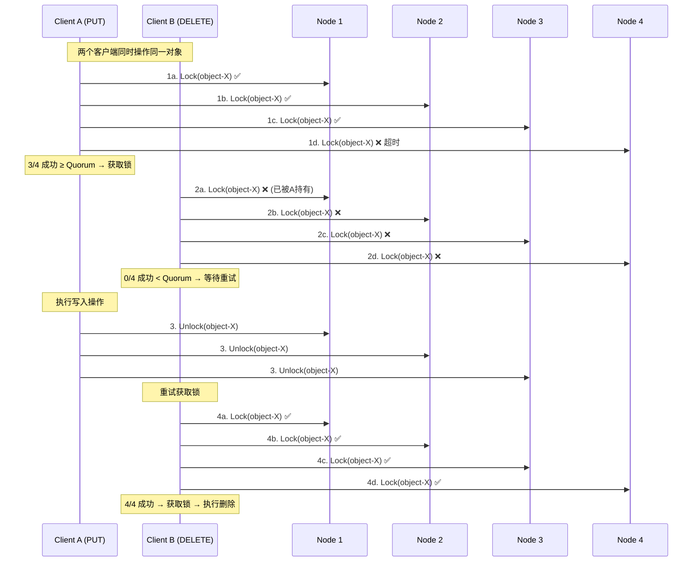
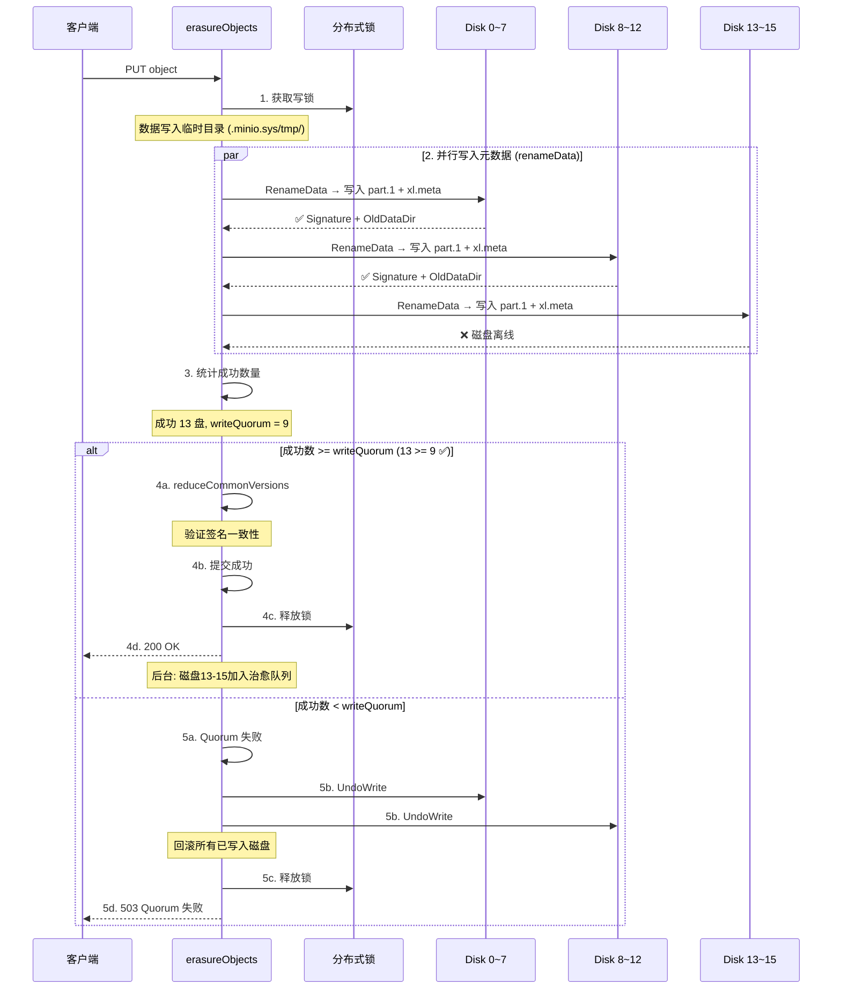
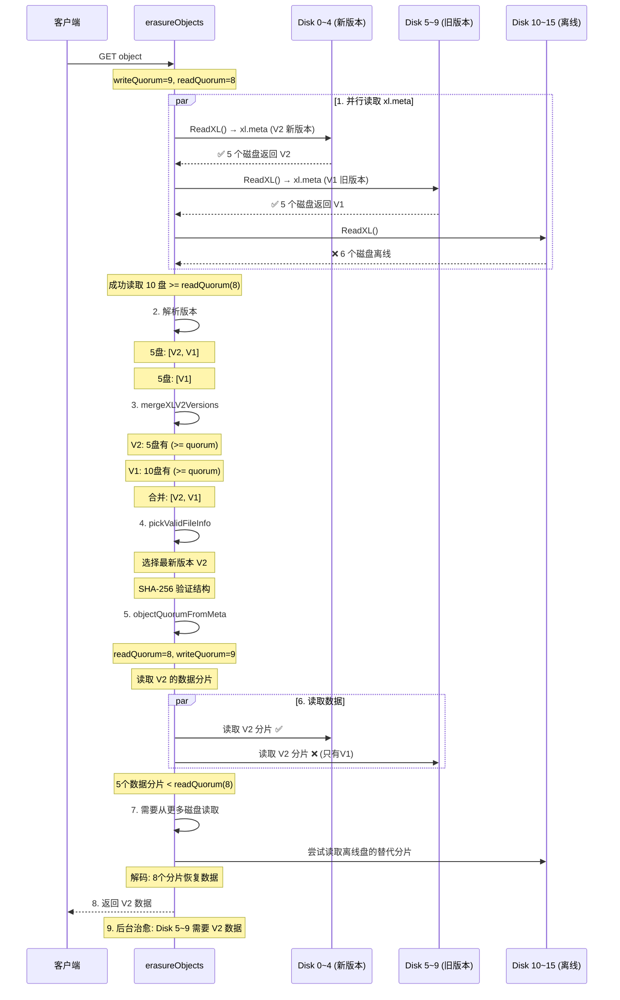
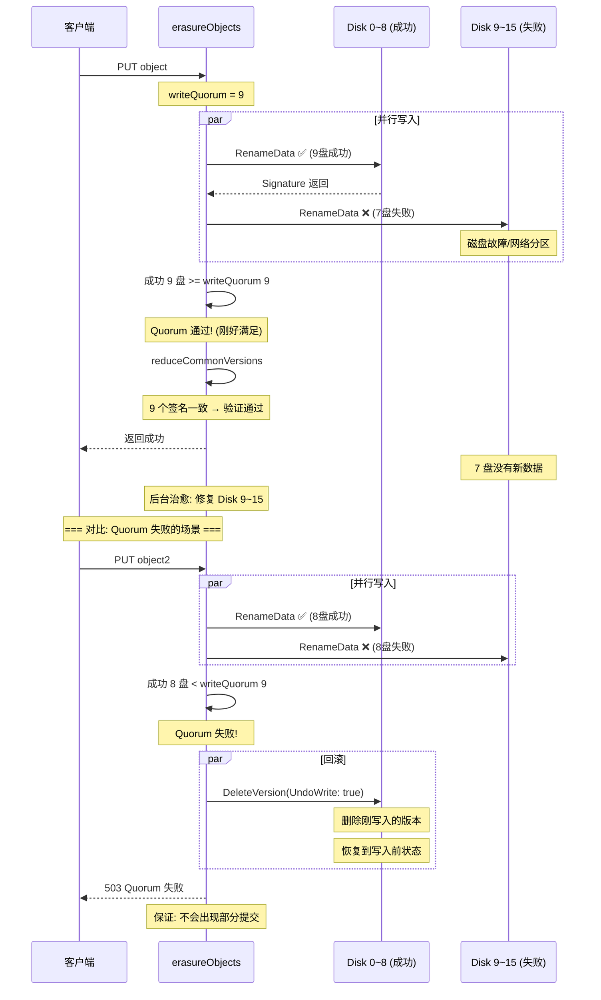
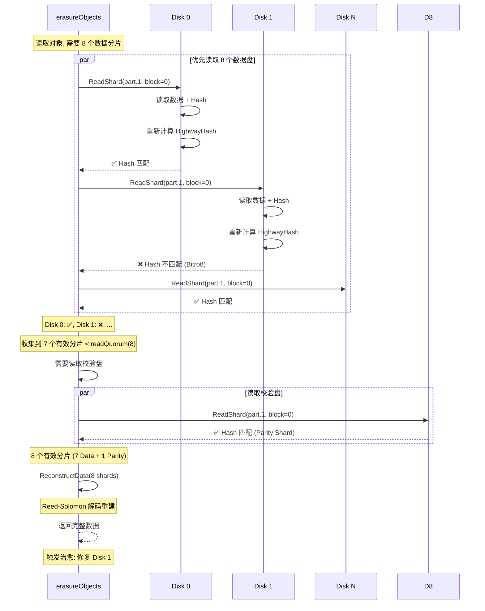
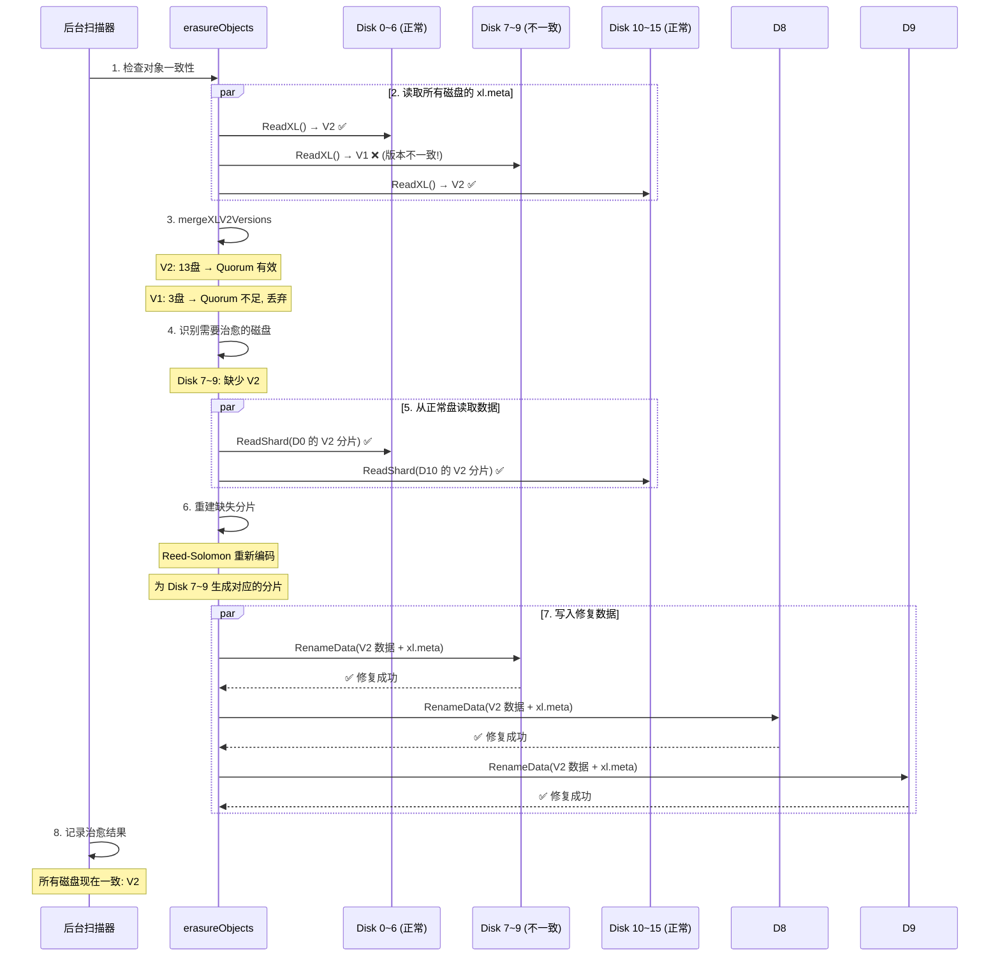
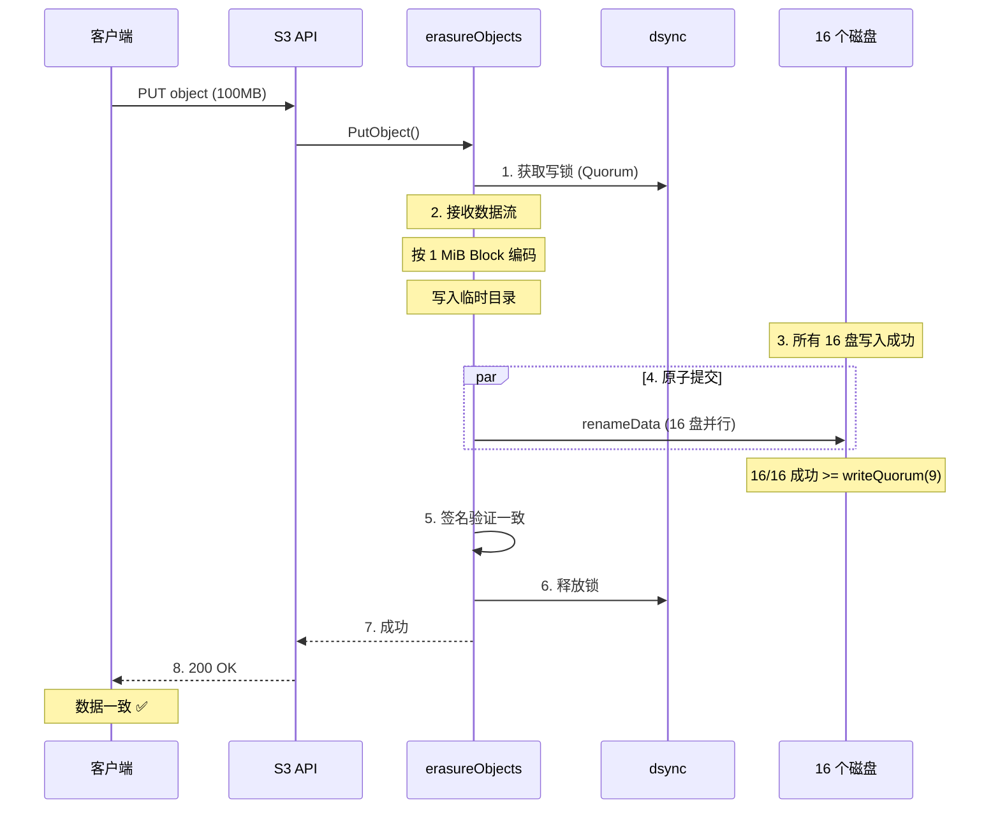
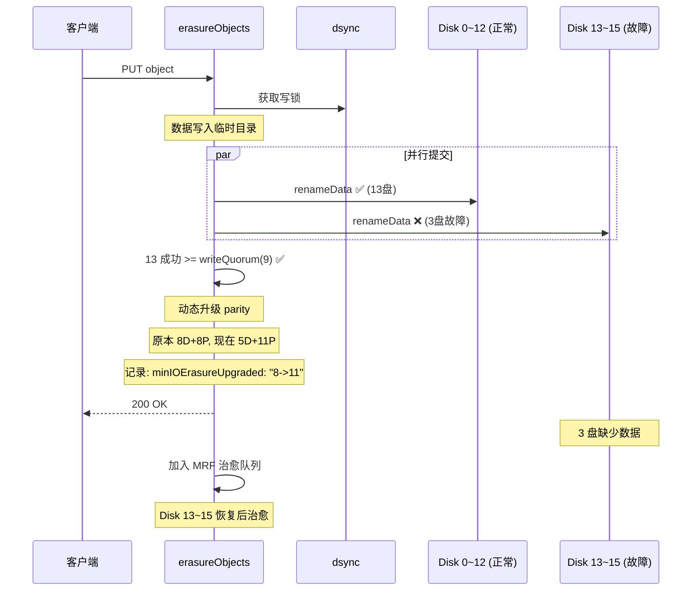
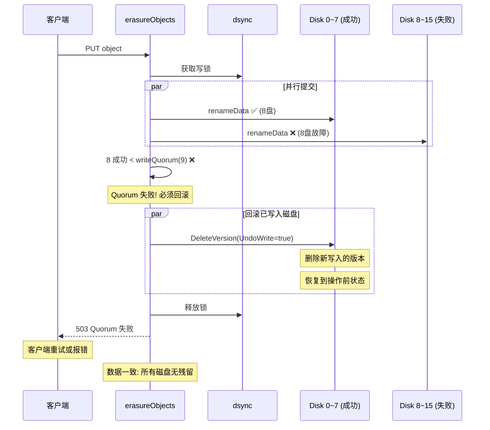

# MinIO 数据一致性机制分析

## 1. 概述

MinIO 通过**多层次机制**保证数据一致性，从单磁盘原子操作到跨磁盘 Quorum 协议。

```
┌─────────────────────────────────────────────────────────────────────────┐
│                    MinIO 数据一致性保障层次                                │
├─────────────────────────────────────────────────────────────────────────┤
│                                                                          │
│  第 1 层: 分布式锁 (dsync)                                               │
│  ├── 防止并发写入同一对象                                                │
│  └── Quorum Lock: 多数节点持有锁才生效                                   │
│                                                                          │
│  第 2 层: Quorum 写入                                                    │
│  ├── 多数磁盘写入成功才认为提交                                          │
│  └── writeQuorum = dataBlocks (+1 if data==parity)                      │
│                                                                          │
│  第 3 层: 原子文件操作                                                   │
│  ├── 写入临时文件 + rename (崩溃安全)                                    │
│  └── 单磁盘级别的原子性                                                  │
│                                                                          │
│  第 4 层: Quorum 读取                                                    │
│  ├── 多数磁盘版本一致才认为有效                                          │
│  └── readQuorum = dataBlocks                                             │
│                                                                          │
│  第 5 层: 版本签名 + 合并                                                │
│  ├── xxhash 跨盘版本比较                                                 │
│  └── mergeXLV2Versions 多路归并                                          │
│                                                                          │
│  第 6 层: 写入回滚                                                       │
│  ├── Quorum 失败时回滚已写入磁盘                                         │
│  └── UndoWrite 机制                                                      │
│                                                                          │
│  第 7 层: 后台治愈                                                       │
│  ├── 检测不一致的磁盘                                                    │
│  └── 从 Quorum 修复数据                                                  │
│                                                                          │
└─────────────────────────────────────────────────────────────────────────┘
```

---

## 2. 并发控制: 分布式锁

### 2.1 为什么需要锁？

```
┌─────────────────────────────────────────────────────────────────────────┐
│                     并发写入冲突场景                                       │
├─────────────────────────────────────────────────────────────────────────┤
│                                                                          │
│  无锁场景:                                                               │
│                                                                          │
│  Client A: PUT object-X (100MB) ──────────────────────────▶            │
│       │                                                                  │
│       │ 同时                                                             │
│       ▼                                                                  │
│  Client B: DELETE object-X ────────▶                                    │
│                                                                          │
│  磁盘上的结果可能:                                                       │
│  ├── Disk 0: 有 A 的数据 (写入晚)                                       │
│  ├── Disk 1: 被 B 删除 (删除晚)                                         │
│  ├── Disk 2: 有 A 的数据                                                │
│  └── Disk 3: 被 B 删除                                                  │
│                                                                          │
│  → 数据不一致!                                                           │
│                                                                          │
│  加锁后:                                                                 │
│  ├── Client A 先获取锁 → 执行写入 → 释放锁                              │
│  ├── Client B 等待锁 → A 释放后执行删除                                 │
│  └── 操作串行化 → 数据一致                                              │
│                                                                          │
└─────────────────────────────────────────────────────────────────────────┘
```

### 2.2 dsync 分布式锁时序图



### 2.3 锁的粒度

```
┌─────────────────────────────────────────────────────────────────────────┐
│                        锁的粒度                                           │
├─────────────────────────────────────────────────────────────────────────┤
│                                                                          │
│  锁对象: (bucket, object) 二元组                                        │
│                                                                          │
│  ┌──────────────────────────────────────────────────────────────────┐  │
│  │                                                                  │  │
│  │   bucket-A/object-1 → 锁 A (独立)                                │  │
│  │   bucket-A/object-2 → 锁 B (独立)                                │  │
│  │   bucket-B/object-1 → 锁 C (独立)                                │  │
│  │                                                                  │  │
│  │   不同对象的操作可以完全并行                                      │  │
│  │   相同对象的操作串行化                                            │  │
│  │                                                                  │  │
│  └──────────────────────────────────────────────────────────────────┘  │
│                                                                          │
│  锁类型:                                                                 │
│  ├── 写锁 (Write Lock): 互斥, PUT/DELETE 时获取                         │
│  └── 读锁 (Read Lock):  共享, GET 时获取                                │
│                                                                          │
│  锁超时:                                                                 │
│  ├── 默认: globalOperationTimeout (通常 30s)                            │
│  ├── 动态调整: 根据成功率自适应                                          │
│  └── 防止死锁: 超时后自动释放                                           │
│                                                                          │
└─────────────────────────────────────────────────────────────────────────┘
```

---

## 3. Quorum 写入机制

### 3.1 Quorum 计算

```
┌─────────────────────────────────────────────────────────────────────────┐
│                        Quorum 计算规则                                     │
├─────────────────────────────────────────────────────────────────────────┤
│                                                                          │
│  假设: 16 盘集群, 8 Data + 8 Parity                                     │
│                                                                          │
│  dataBlocks   = 8                                                       │
│  parityBlocks = 8                                                       │
│                                                                          │
│  写 Quorum:                                                               │
│  ├── data == parity → writeQuorum = dataBlocks + 1 = 9                  │
│  └── data != parity → writeQuorum = dataBlocks                          │
│                                                                          │
│  读 Quorum:                                                               │
│  └── readQuorum = dataBlocks = 8                                        │
│                                                                          │
│  示例配置:                                                                │
│  ┌────────────┬─────┬────┬──────────┬──────────┬────────────┐           │
│  │ 配置       │ D   │ P  │ WriteQ   │ ReadQ    │ 容错        │           │
│  ├────────────┼─────┼────┼──────────┼──────────┼────────────┤           │
│  │ 4D + 2P    │ 4   │ 2  │ 4        │ 4        │ 2 盘故障   │           │
│  │ 8D + 4P    │ 8   │ 4  │ 8        │ 8        │ 4 盘故障   │           │
│  │ 8D + 8P    │ 8   │ 8  │ 9        │ 8        │ 8 盘故障   │           │
│  │ 12D + 4P   │ 12  │ 4  │ 12       │ 12       │ 4 盘故障   │           │
│  └────────────┴─────┴────┴──────────┴──────────┴────────────┘           │
│                                                                          │
│  关键: writeQuorum + readQuorum > N (写入和读取必须有交集)              │
│  → 保证读取一定能看到最新已提交的写入                                    │
│                                                                          │
└─────────────────────────────────────────────────────────────────────────┘
```

### 3.2 为什么 writeQuorum + readQuorum > N？

```
┌─────────────────────────────────────────────────────────────────────────┐
│           为什么 writeQuorum + readQuorum > N?                           │
├─────────────────────────────────────────────────────────────────────────┤
│                                                                          │
│  这是 Quorum 系统的基本不变式                                            │
│                                                                          │
│  场景: 8D + 8P, N=16                                                    │
│  ├── writeQuorum = 9                                                    │
│  ├── readQuorum = 8                                                     │
│  └── 9 + 8 = 17 > 16 ✅                                                 │
│                                                                          │
│  含义:                                                                   │
│  ├── 写入时至少 9 盘有新数据                                            │
│  ├── 读取时至少读 8 盘                                                  │
│  └── 9 + 8 - 16 = 1 → 至少有 1 盘既有新数据又被读到                    │
│                                                                          │
│  反例: 如果不满足此条件                                                  │
│  ┌───────────────────────────────────────────────────────┐              │
│  │  假设 writeQuorum = 8, readQuorum = 8                  │              │
│  │  8 + 8 = 16 = N  (不大于 N!)                          │              │
│  │                                                        │              │
│  │  写入: 写入磁盘 0-7                                   │              │
│  │  读取: 读取磁盘 8-15  ← 完全没读到新数据!              │              │
│  │  → 读到旧数据 → 不一致!                               │              │
│  └───────────────────────────────────────────────────────┘              │
│                                                                          │
│  所以当 data == parity 时, writeQuorum = data + 1                       │
│  确保 writeQuorum + readQuorum > N                                      │
│                                                                          │
└─────────────────────────────────────────────────────────────────────────┘
```

### 3.3 写入提交流程



---

## 4. 单磁盘原子操作

### 4.1 崩溃安全写入

```
┌─────────────────────────────────────────────────────────────────────────┐
│                  单磁盘原子写入 (崩溃安全)                                 │
├─────────────────────────────────────────────────────────────────────────┤
│                                                                          │
│  问题: 写入 xl.meta 时崩溃怎么办?                                        │
│                                                                          │
│  错误方式 (直接覆写):                                                    │
│  ┌───────────────────────────────────────────────────────┐              │
│  │  open(xl.meta, O_TRUNC | O_WRONLY)                     │              │
│  │  write(xl.meta, new_data)   ← 崩溃在这中间             │              │
│  │  close()                                               │              │
│  │                                                        │              │
│  │  结果: xl.meta 半新半旧 → 损坏!                        │              │
│  └───────────────────────────────────────────────────────┘              │
│                                                                          │
│  正确方式 (临时文件 + rename):                                           │
│  ┌───────────────────────────────────────────────────────┐              │
│  │  1. write(xl.meta.tmp, new_data)   ← 写临时文件        │              │
│  │  2. fsync(xl.meta.tmp)             ← 刷盘              │              │
│  │  3. rename("xl.meta.tmp", "xl.meta") ← 原子替换        │              │
│  │                                                        │              │
│  │  崩溃在任何时候都安全:                                  │              │
│  │  ├── 崩溃在步骤1前: xl.meta 保持旧版本 (未修改)        │              │
│  │  ├── 崩溃在步骤1中: xl.meta 保持旧版本 + 残留 tmp     │              │
│  │  ├── 崩溃在步骤2后: xl.meta.tmp 完整 → 下次 rename    │              │
│  │  └── 崩溃在步骤3后: xl.meta 已更新为新版本 (成功)     │              │
│  └───────────────────────────────────────────────────────┘              │
│                                                                          │
│  rename() 的原子性保证:                                                  │
│  ├── POSIX 文件系统保证 rename 是原子的                                  │
│  ├── 要么旧文件存在, 要么新文件存在                                      │
│  └── 不会出现两个都不存在或都损坏                                        │
│                                                                          │
└─────────────────────────────────────────────────────────────────────────┘
```

### 4.2 RenameData 操作详解

```
┌─────────────────────────────────────────────────────────────────────────┐
│                  disk.RenameData() 完整操作流程                           │
├─────────────────────────────────────────────────────────────────────────┤
│                                                                          │
│  输入:                                                                   │
│  ├── srcBucket: .minio.sys/tmp                                          │
│  ├── srcEntry:  {upload-uuid}/{DataDir}                                 │
│  ├── dstBucket: {bucket}                                                │
│  ├── dstEntry:  {object}                                                │
│  └── FileInfo:   新版本元数据                                           │
│                                                                          │
│  操作步骤:                                                                │
│                                                                          │
│  Step 1: 读取目标 xl.meta (如存在)                                      │
│  ├── 路径: {bucket}/{object}/xl.meta                                    │
│  ├── 存在 → 加载版本列表, 保留 LegacyType 条目                          │
│  └── 不存在 → 新建空列表                                                │
│                                                                          │
│  Step 2: 合并版本                                                        │
│  ├── 检查 VersionID 是否已存在                                          │
│  ├── 添加新版本到列表头部                                                │
│  └── 按时间排序 (最新在前)                                                │
│                                                                          │
│  Step 3: 移动数据 (原子)                                                 │
│  ├── src: .minio.sys/tmp/{uuid}/{DataDir}/part.1                        │
│  ├── dst: {bucket}/{object}/{DataDir}/part.1                            │
│  ├── rename(src, dst) → 原子操作                                        │
│  └── 如果 dst 目录不存在, 先创建                                        │
│                                                                          │
│  Step 4: 写入 xl.meta (原子)                                            │
│  ├── 序列化版本列表 (MessagePack)                                        │
│  ├── 写入临时文件 + fsync                                                │
│  ├── 计算 CRC32 并附加                                                  │
│  ├── rename("xl.meta.tmp", "xl.meta")                                  │
│  └── 原子替换                                                            │
│                                                                          │
│  Step 5: 返回                                                            │
│  ├── Signature: 新版本签名 (用于跨盘验证)                                │
│  └── OldDataDir: 旧数据目录 (用于 GC 清理)                              │
│                                                                          │
│  崩溃恢复:                                                                │
│  ├── 临时文件残留 → 启动时清理 .minio.sys/tmp/                          │
│  ├── 数据已移动但 xl.meta 未更新 → 治愈修复                              │
│  └── 整体保证: Quorum 机制兜底                                           │
│                                                                          │
└─────────────────────────────────────────────────────────────────────────┘
```

---

## 5. Quorum 读取与版本合并

### 5.1 读取一致性时序图



### 5.2 版本冲突解决

```
┌─────────────────────────────────────────────────────────────────────────┐
│                     版本冲突解决机制                                       │
├─────────────────────────────────────────────────────────────────────────┤
│                                                                          │
│  场景: 网络分区导致部分磁盘有新版本, 部分有旧版本                        │
│                                                                          │
│  磁盘状态:                                                               │
│  ├── Disk 0-6:   xl.meta 包含 V2 (t=200), V1 (t=100)                   │
│  ├── Disk 7-12:  xl.meta 只有 V1 (t=100)                                │
│  └── Disk 13-15: 离线                                                    │
│                                                                          │
│  读取时 mergeXLV2Versions:                                               │
│                                                                          │
│  Round 1: 比较各盘最新版本                                               │
│  ├── Disk 0-6:  V2 (Sig=0xABCD, t=200)                                  │
│  ├── Disk 7-12: V1 (Sig=0x1234, t=100)                                  │
│  │                                                                       │
│  ├── V2 出现 7 次 (7/13 可用磁盘)                                       │
│  ├── V1 出现 6 次 (6/13)                                                │
│  └── readQuorum = 8                                                     │
│                                                                          │
│  问题: V2 只有 7 次 < readQuorum(8)                                     │
│  → V2 不满足 Quorum!                                                     │
│                                                                          │
│  两种结果:                                                                │
│                                                                          │
│  结果 A (strict=false, 非严格模式):                                      │
│  ├── V2 虽然不满足 Quorum                                                │
│  ├── 但如果按 VersionID+Type 匹配                                       │
│  ├── 7次 > N/2 → 可能接受 (取决于实现)                                   │
│  └── 标记为需要治愈                                                     │
│                                                                          │
│  结果 B (strict=true, 严格模式):                                         │
│  ├── V2 不满足 Quorum → 丢弃                                             │
│  ├── V1 满足 Quorum (6次, 但加上Disk0-6也有V1 = 13次)                   │
│  └── 返回 V1 (旧版本)                                                   │
│                                                                          │
│  后台治愈:                                                                │
│  ├── Disk 7-12 缺少 V2 → 从 Disk 0-6 复制                               │
│  └── 恢复后所有磁盘一致                                                  │
│                                                                          │
└─────────────────────────────────────────────────────────────────────────┘
```

---

## 6. 写入回滚机制

### 6.1 回滚时序图



### 6.2 回滚与未回滚的对比

```
┌─────────────────────────────────────────────────────────────────────────┐
│                  回滚 vs 不回滚的影响                                      │
├─────────────────────────────────────────────────────────────────────────┤
│                                                                          │
│  场景: 覆盖写, 旧版本 V1 → 新版本 V2                                    │
│                                                                          │
│  ┌─────────────────────────────────────────────────────────────────┐    │
│  │  有回滚机制 (MinIO 实际行为):                                    │    │
│  │                                                                  │    │
│  │  Quorum 失败:                                                    │    │
│  │  ├── Disk 0-7: 有 V2 (已写入)                                   │    │
│  │  ├── Disk 8-15: 只有 V1                                         │    │
│  │  │                                                               │    │
│  │  回滚后:                                                         │    │
│  │  ├── Disk 0-7: 恢复为 V1 (UndoWrite 删除 V2)                   │    │
│  │  ├── Disk 8-15: 仍是 V1                                         │    │
│  │  └── 所有磁盘一致: V1                                            │    │
│  │                                                                  │    │
│  │  读取结果: V1 (一致)                                             │    │
│  │                                                                  │    │
│  └─────────────────────────────────────────────────────────────────┘    │
│                                                                          │
│  ┌─────────────────────────────────────────────────────────────────┐    │
│  │  无回滚机制 (假设的错误行为):                                    │    │
│  │                                                                  │    │
│  │  Quorum 失败:                                                    │    │
│  │  ├── Disk 0-7: 有 V2 (已写入, 未回滚)                           │    │
│  │  ├── Disk 8-15: 只有 V1                                         │    │
│  │  │                                                               │    │
│  │  下次读取:                                                       │    │
│  │  ├── V2 出现 8 次                                                │    │
│  │  ├── V1 出现 16 次                                               │    │
│  │  ├── V1 满足 Quorum → 返回 V1                                   │    │
│  │  └── 但 Disk 0-7 实际存储了 V2 的数据!                          │    │
│  │                                                                  │    │
│  │  → 数据不一致 (元数据说V1, 数据是V2)                             │    │
│  │                                                                  │    │
│  └─────────────────────────────────────────────────────────────────┘    │
│                                                                          │
└─────────────────────────────────────────────────────────────────────────┘
```

---

## 7. Bitrot 保护 (静默数据损坏)

### 7.1 Bitrot 检测

```
┌─────────────────────────────────────────────────────────────────────────┐
│                     Bitrot (静默数据损坏) 保护                             │
├─────────────────────────────────────────────────────────────────────────┤
│                                                                          │
│  问题: 磁盘上的数据可能被静默损坏                                        │
│  ├── 磁盘坏道                                                            │
│  ├── 宇宙射线                                                            │
│  ├── 控制器固件 Bug                                                      │
│  └── 数据位翻转 (bit flip)                                               │
│                                                                          │
│  这些损坏操作系统检测不到, 但数据已经损坏                                 │
│                                                                          │
│  MinIO 解决方案: HighwayHash 校验                                         │
│                                                                          │
│  写入时:                                                                 │
│  ┌───────────────────────────────────────────────────────┐              │
│  │  每个 Block 的每个分片:                                 │              │
│  │  ├── 计算原始分片数据的 HighwayHash                     │              │
│  │  ├── 将 Hash 存储在分片数据之后                        │              │
│  │  └── 连同分片一起写入磁盘                               │              │
│  │                                                        │              │
│  │  part.1 文件结构:                                      │              │
│  │  [Block0_Shard][Block0_Hash][Block1_Shard][Block1_Hash]│              │
│  │  ...                                                   │              │
│  └───────────────────────────────────────────────────────┘              │
│                                                                          │
│  读取时:                                                                 │
│  ┌───────────────────────────────────────────────────────┐              │
│  │  读取分片数据 + Hash                                    │              │
│  │  重新计算 HighwayHash                                   │              │
│  │  比较两个 Hash                                          │              │
│  │                                                        │              │
│  │  ├── 匹配 → 数据完整, 使用此分片                       │              │
│  │  └── 不匹配 → 数据损坏, 跳过此盘, 读其他盘             │              │
│  │                                                        │              │
│  │  只要有 readQuorum 个完好分片 → 可恢复数据             │              │
│  │  损坏的分片 → 后台治愈修复                              │              │
│  └───────────────────────────────────────────────────────┘              │
│                                                                          │
└─────────────────────────────────────────────────────────────────────────┘
```

### 7.2 Bitrot 验证时序图



---

## 8. 后台治愈机制

### 8.1 不一致检测

```
┌─────────────────────────────────────────────────────────────────────────┐
│                     不一致检测与治愈                                       │
├─────────────────────────────────────────────────────────────────────────┤
│                                                                          │
│  检测时机:                                                               │
│                                                                          │
│  1. 读取时检测 (即时治愈)                                                │
│  ├── 读取发现某些磁盘数据不一致                                          │
│  ├── 但仍能从 Quorum 读取                                                │
│  └── 加入 PartialOperation 治愈队列                                      │
│                                                                          │
│  2. MRF 队列 (Missing Resource Feedback)                                 │
│  ├── 写入时有磁盘离线                                                    │
│  ├── 对象加入 MRF 队列                                                   │
│  └── 磁盘恢复后从队列治愈                                                │
│                                                                          │
│  3. 后台扫描 (定期治愈)                                                  │
│  ├── Scanner 周期性扫描所有对象                                          │
│  ├── 检查 xl.meta 一致性                                                 │
│  └── 修复不一致的磁盘                                                    │
│                                                                          │
│  4. 磁盘上线触发                                                         │
│  ├── 磁盘恢复连接                                                        │
│  ├── 需要同步缺失数据                                                    │
│  └── 触发该磁盘的治愈                                                    │
│                                                                          │
└─────────────────────────────────────────────────────────────────────────┘
```

### 8.2 治愈时序图



---

## 9. 端到端一致性场景分析

### 9.1 场景 1: 正常写入



### 9.2 场景 2: 写入时部分磁盘故障



### 9.3 场景 3: 写入时 Quorum 失败



### 9.4 场景 4: 读取时磁盘损坏

```mermaid
sequenceDiagram
    participant C as 客户端
    participant EO as erasureObjects
    participant Good as Disk 0~9 (正常)
    participant Rot as Disk 10 (Bitrot)
    participant Off as Disk 11~15 (离线)

    C->>EO: GET object

    EO->>EO: 获取读锁

    par 读取 xl.meta
        EO->>Good: ReadXL() ✅
        EO->>Rot: ReadXL() ✅ (元数据完好)
        EO->>Off: ReadXL() ❌
    end

    EO->>EO: 版本合并 → V2 有效

    par 读取数据分片 (Block 0)
        EO->>Good: ReadShard + Bitrot 检查
        Good-->>EO: 8个数据分片 ✅

        EO->>Rot: ReadShard + Bitrot 检查
        Rot-->>EO: ❌ Hash 不匹配 (Bitrot!)
    end

    Note over EO: 8 个有效数据分片 = readQuorum ✅

    EO->>EO: 解码数据 (无需校验分片)

    EO-->>C: 返回完整数据

    Note over EO: 触发治愈: 修复 Disk 10
    Note over EO: MRF: 恢复 Disk 11~15
```

---

## 10. 一致性保证总结

### 10.1 各层级机制总结

```
┌─────────────────────────────────────────────────────────────────────────┐
│                  一致性保证机制全景                                        │
├─────────────────────────────────────────────────────────────────────────┤
│                                                                          │
│  ┌─────────────────────────────────────────────────────────────────┐   │
│  │                    并发隔离层                                     │   │
│  │                                                                   │   │
│  │   dsync 分布式锁                                                  │   │
│  │   ├── 同一对象操作串行化                                          │   │
│  │   └── Quorum Lock (多数派)                                        │   │
│  │                                                                   │   │
│  └──────────────────────────────┬──────────────────────────────────┘   │
│                                  │                                       │
│  ┌──────────────────────────────▼──────────────────────────────────┐   │
│  │                    写入原子层                                     │   │
│  │                                                                   │   │
│  │   临时文件 + rename (单磁盘原子)                                  │   │
│  │   ├── 崩溃安全 (crash-safe)                                       │   │
│  │   └── 不会出现半写入状态                                          │   │
│  │                                                                   │   │
│  └──────────────────────────────┬──────────────────────────────────┘   │
│                                  │                                       │
│  ┌──────────────────────────────▼──────────────────────────────────┐   │
│  │                    Quorum 协议层                                  │   │
│  │                                                                   │   │
│  │   writeQuorum + readQuorum > N                                   │   │
│  │   ├── 写入: 多数成功才提交                                        │   │
│  │   ├── 读取: 多数一致才有效                                        │   │
│  │   └── 保证读写有交集                                              │   │
│  │                                                                   │   │
│  └──────────────────────────────┬──────────────────────────────────┘   │
│                                  │                                       │
│  ┌──────────────────────────────▼──────────────────────────────────┐   │
│  │                    版本一致性层                                   │   │
│  │                                                                   │   │
│  │   版本签名 (xxhash) + 多路归并                                    │   │
│  │   ├── 跨盘版本比较                                                │   │
│  │   ├── 冲突版本过滤 (不满足 Quorum 的丢弃)                         │   │
│  │   └── 确定性的版本排序 (sortsBefore)                              │   │
│  │                                                                   │   │
│  └──────────────────────────────┬──────────────────────────────────┘   │
│                                  │                                       │
│  ┌──────────────────────────────▼──────────────────────────────────┐   │
│  │                    回滚机制层                                     │   │
│  │                                                                   │   │
│  │   UndoWrite                                                      │   │
│  │   ├── Quorum 失败时回滚已写入磁盘                                │   │
│  │   └── 保证不会出现部分提交                                        │   │
│  │                                                                   │   │
│  └──────────────────────────────┬──────────────────────────────────┘   │
│                                  │                                       │
│  ┌──────────────────────────────▼──────────────────────────────────┐   │
│  │                    数据完整性层                                   │   │
│  │                                                                   │   │
│  │   Bitrot (HighwayHash)                                           │   │
│  │   ├── 写入时附加校验                                              │   │
│  │   ├── 读取时验证校验                                              │   │
│  │   └── 损坏分片自动跳过                                            │   │
│  │                                                                   │   │
│  └──────────────────────────────┬──────────────────────────────────┘   │
│                                  │                                       │
│  ┌──────────────────────────────▼──────────────────────────────────┐   │
│  │                    自愈合层                                       │   │
│  │                                                                   │   │
│  │   MRF + 后台扫描 + 治愈                                          │   │
│  │   ├── 检测不一致磁盘                                              │   │
│  │   ├── 从 Quorum 修复数据                                          │   │
│  │   └── 最终一致性恢复                                              │   │
│  │                                                                   │   │
│  └─────────────────────────────────────────────────────────────────┘   │
│                                                                          │
└─────────────────────────────────────────────────────────────────────────┘
```

### 10.2 CAP 理论下的 MinIO

| CAP 维度 | MinIO 选择 | 说明 |
|----------|-----------|------|
| **C (一致性)** | ✅ 强一致 | Quorum 写入保证 |
| **A (可用性)** | ⚠️ 条件可用 | 需要 Quorum 个磁盘在线 |
| **P (分区容忍)** | ✅ 支持 | 网络分区时少数派不可写 |

```
可用性分析:
├── 16盘集群, 8D+8P, writeQuorum=9
│   ├── 最多 7 盘故障 → 仍可读写
│   ├── 8 盘故障 → 可读不可写 (readQuorum=8, writeQuorum=9)
│   └── 9+ 盘故障 → 不可读写
│
└── MinIO 选择 CP 系统: 一致性优先于可用性
```

---

## 11. 总结

| 问题 | 答案 |
|------|------|
| **如何防止并发冲突** | dsync 分布式锁 (Quorum Lock) |
| **如何保证写入原子** | 临时文件 + rename (崩溃安全) |
| **如何保证多数一致** | Quorum 协议 (writeQ + readQ > N) |
| **如何比较跨盘版本** | xxhash 版本签名 |
| **如何解决版本冲突** | mergeXLV2Versions 多路归并 |
| **写入失败怎么办** | UndoWrite 回滚 |
| **如何检测数据损坏** | HighwayHash Bitrot 校验 |
| **如何修复不一致** | 后台治愈 (MRF + Scanner) |
| **CAP 定位** | CP 系统 (强一致性) |
| **最终一致性** | 治愈机制保证最终所有磁盘一致 |

---
