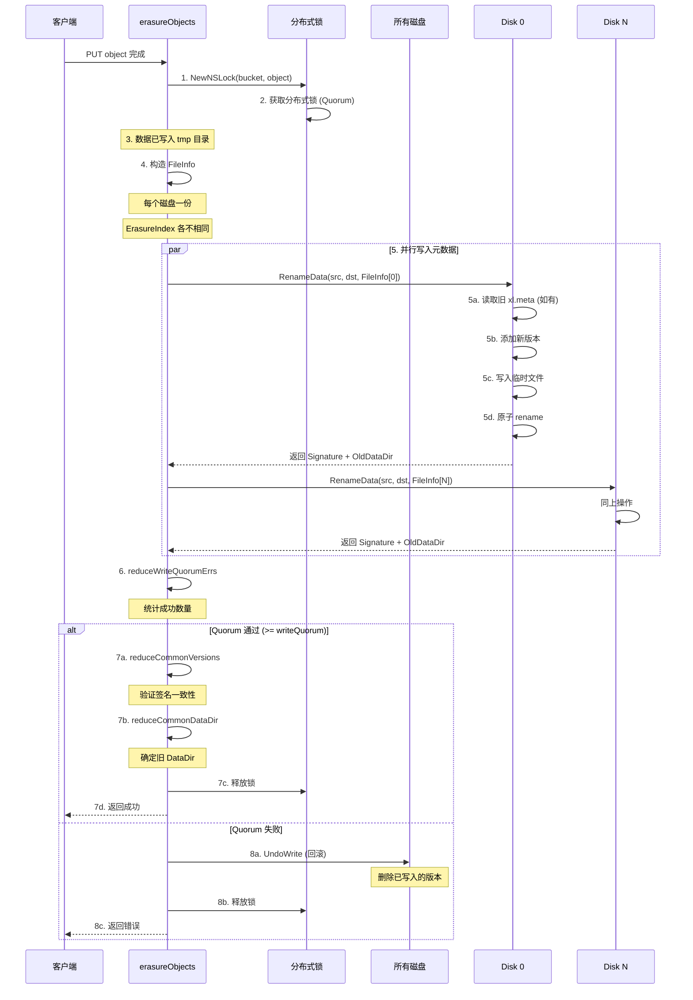
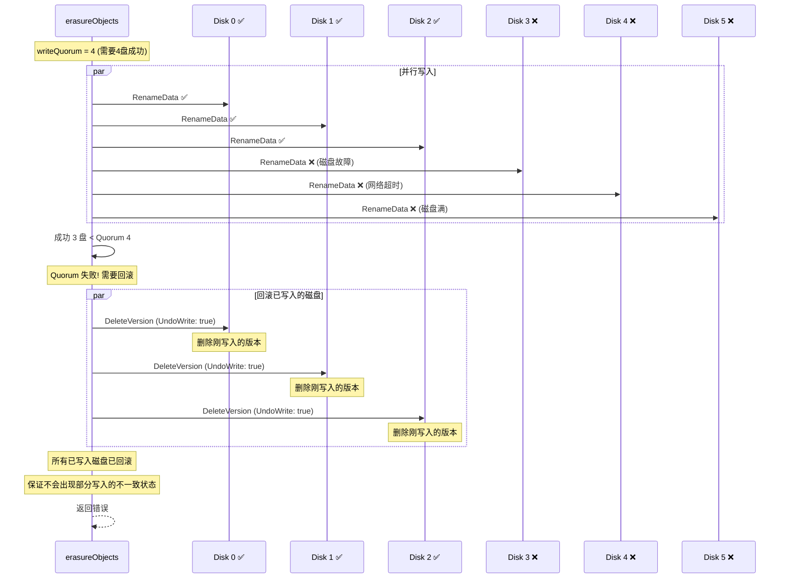
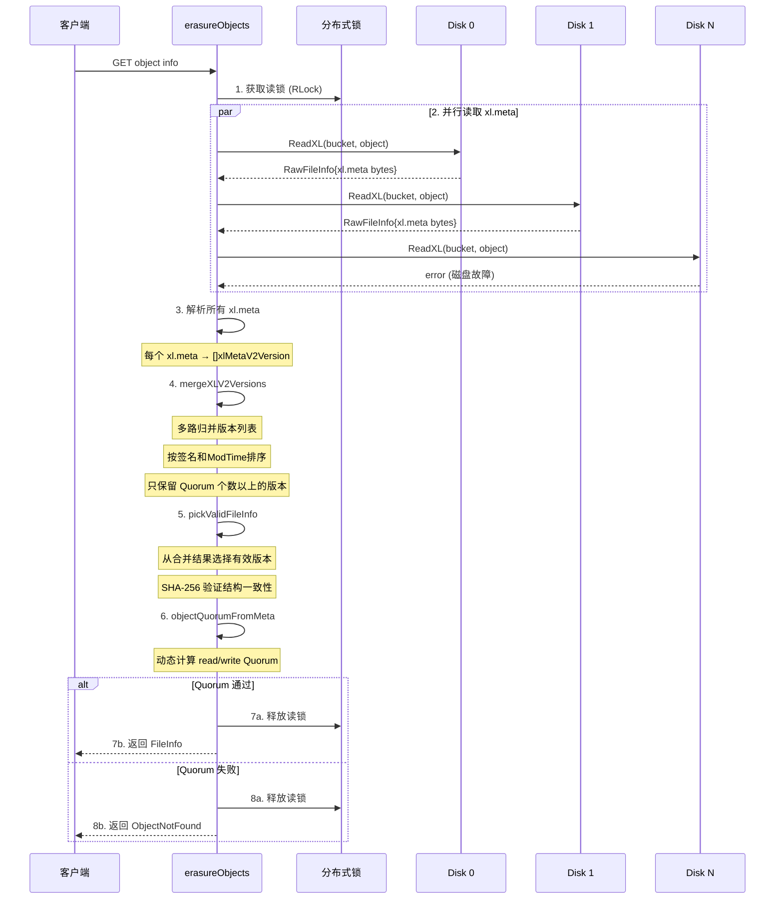
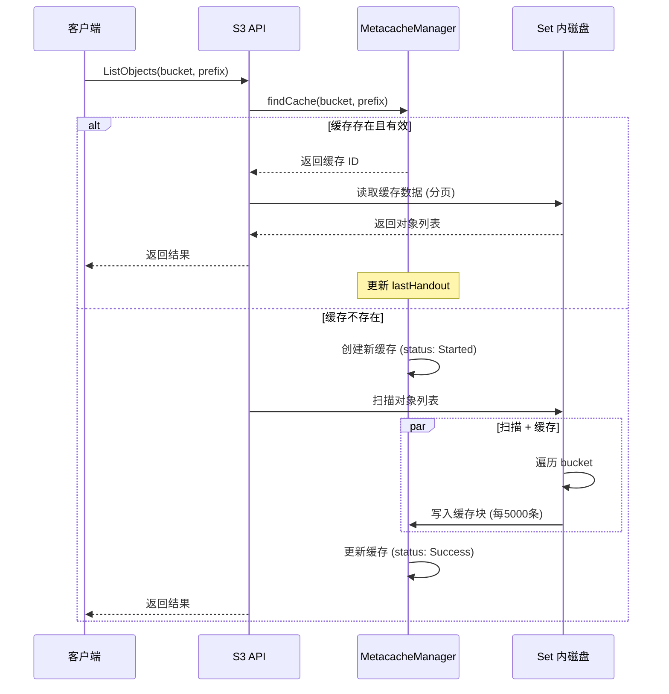

# MinIO 元数据管理机制

## 1. 概述

MinIO **没有独立的元数据服务器**，所有元数据**分散存储在每个磁盘上**，通过**Quorum (法定人数) 机制**保证一致性。

```
┌─────────────────────────────────────────────────────────────────────────┐
│                     MinIO 元数据管理体系                                  │
├─────────────────────────────────────────────────────────────────────────┤
│                                                                          │
│  元数据类型                                                               │
│  ├── 集群级: format.json   (磁盘拓扑、集群标识)                           │
│  ├── Bucket级: .metadata.bin (Bucket 配置)                               │
│  ├── 对象级: xl.meta       (对象版本、纠删码参数)                         │
│  └── 缓存级: metacache     (列表缓存)                                    │
│                                                                          │
│  一致性保障                                                               │
│  ├── 分布式锁: dsync (多数派锁定)                                        │
│  ├── Quorum:    多数磁盘写入成功才提交                                   │
│  └── 版本签名:  xxhash 跨盘比较                                          │
│                                                                          │
└─────────────────────────────────────────────────────────────────────────┘
```

---

## 2. 元数据分类与存储位置

```
┌─────────────────────────────────────────────────────────────────────────┐
│                        磁盘上的元数据分布                                 │
├─────────────────────────────────────────────────────────────────────────┤
│                                                                          │
│  每个磁盘都有以下元数据文件:                                             │
│                                                                          │
│  disk0/                                                                  │
│  ├── .minio.sys/                                                        │
│  │   ├── format.json                ← 集群格式 (每个磁盘一份)            │
│  │   │                                                                   │
│  │   ├── buckets/                                                        │
│  │   │   └── {bucket-name}/                                             │
│  │   │       └── .metadata.bin     ← Bucket 元数据 (每个磁盘一份)        │
│  │   │                                                                   │
│  │   ├── tmp/                       ← 临时上传数据                       │
│  │   │                                                                   │
│  │   └── metacache/                 ← 列表缓存                           │
│  │       └── {bucket}/                                                   │
│  │           └── {cache-id}                                              │
│  │               └── xl.meta        ← 缓存条目                           │
│  │                                                                       │
│  └── {bucket}/                     ← 对象数据                            │
│      └── {object}/                                                      │
│          ├── xl.meta                ← 对象元数据 (每个磁盘一份)          │
│          └── {DataDir}/                                                 │
│              └── part.1             ← 数据分片                           │
│                                                                          │
└─────────────────────────────────────────────────────────────────────────┘
```

### 元数据类型对比

| 类型 | 文件 | 存储位置 | 作用 | 一致性 |
|------|------|----------|------|--------|
| **集群格式** | format.json | 每个磁盘 | 磁盘UUID、Set拓扑 | 写一次，启动时验证 |
| **Bucket配置** | .metadata.bin | 每个磁盘 | 策略、生命周期、版本控制 | 更新时全量写入 |
| **对象元数据** | xl.meta | 每个磁盘 | 版本信息、纠删码参数 | 每次上传/更新时写入 |
| **列表缓存** | xl.meta | 特定磁盘 | 加速 ListObjects | 本地缓存，非强一致 |

---

## 3. format.json - 集群格式元数据

### 3.1 结构

```go
// format-erasure.go:112
type formatErasureV3 struct {
    formatMetaV1                  // 版本、集群ID
    Erasure struct {
        Version          string   // "3"
        This             string   // 本磁盘的 UUID
        Sets             [][]string  // [setIndex][diskIndex] = diskUUID
        DistributionAlgo string   // "SIPMOD+PARITY"
    }
}
```

### 3.2 磁盘拓扑示例

```
┌─────────────────────────────────────────────────────────────────────────┐
│                     format.json 记录的磁盘拓扑                           │
├─────────────────────────────────────────────────────────────────────────┤
│                                                                          │
│  Sets:                                                                  │
│  [                                                                      │
│    ["uuid-00","uuid-01","uuid-02","uuid-03",                           │
│     "uuid-04","uuid-05","uuid-06","uuid-07"],   ← Set 0 (8盘)          │
│                                                                          │
│    ["uuid-08","uuid-09","uuid-10","uuid-11",                           │
│     "uuid-12","uuid-13","uuid-14","uuid-15"],   ← Set 1 (8盘)          │
│  ]                                                                      │
│                                                                          │
│  每个磁盘的 format.json 的 "This" 字段:                                 │
│  ├── Disk 0: "This": "uuid-00"                                         │
│  ├── Disk 1: "This": "uuid-01"                                         │
│  └── ...                                                                │
│                                                                          │
│  启动时:                                                                 │
│  ├── 读取所有磁盘的 format.json                                         │
│  ├── 验证 Quorum (>50% 一致)                                           │
│  ├── 通过 UUID 还原磁盘在 Set 中的位置                                  │
│  └── 构建 erasureServerPools 内存结构                                   │
│                                                                          │
└─────────────────────────────────────────────────────────────────────────┘
```

---

## 4. Bucket 元数据 (.metadata.bin)

### 4.1 结构

```go
// bucket-metadata.go:68
type BucketMetadata struct {
    Name                     string         // Bucket 名称
    Created                  time.Time      // 创建时间

    // 子配置 (XML/JSON 格式存储)
    PolicyConfigJSON         []byte   // 访问策略
    NotificationConfigXML    []byte   // 事件通知
    LifecycleConfigXML       []byte   // 生命周期规则
    ObjectLockConfigXML      []byte   // 对象锁定
    VersioningConfigXML      []byte   // 版本控制
    EncryptionConfigXML      []byte   // 加密配置
    TaggingConfigXML         []byte   // 标签
    QuotaConfigJSON          []byte   // 配额
    ReplicationConfigXML     []byte   // 复制配置
    BucketTargetsConfigJSON  []byte   // 远程目标

    // 每个子配置的更新时间戳
    PolicyConfigUpdatedAt    time.Time
    LifecycleConfigUpdatedAt time.Time
    // ... (11个子配置各有 UpdatedAt)
}
```

### 4.2 存储格式

```
┌─────────────────────────────────────────────────────────────────────────┐
│                     .metadata.bin 文件格式                                │
├─────────────────────────────────────────────────────────────────────────┤
│                                                                          │
│  ┌───────────────────────────────────────────────────────────────────┐  │
│  │  Header (4 bytes)                                                  │  │
│  │  ├── Format:   1 (uint16 LE)                                      │  │
│  │  └── Version:  1 (uint16 LE)                                      │  │
│  └───────────────────────────────────────────────────────────────────┘  │
│                                                                          │
│  ┌───────────────────────────────────────────────────────────────────┐  │
│  │  Body (MessagePack 编码)                                           │  │
│  │                                                                   │  │
│  │  ├── Name: "my-bucket"                                            │  │
│  │  ├── Created: 1703145600                                          │  │
│  │  ├── VersioningConfigXML: <VersioningConfiguration>...           │  │
│  │  ├── LifecycleConfigXML: <LifecycleConfiguration>...             │  │
│  │  ├── PolicyConfigJSON: {"Version":"2012-10-17",...}             │  │
│  │  └── ...UpdatedAt 时间戳                                          │  │
│  │                                                                   │  │
│  └───────────────────────────────────────────────────────────────────┘  │
│                                                                          │
│  存储路径: .minio.sys/buckets/{bucket}/.metadata.bin                    │
│  存储位置: 每个磁盘都有完整副本                                          │
│                                                                          │
└─────────────────────────────────────────────────────────────────────────┘
```

### 4.3 内存缓存机制

```
┌─────────────────────────────────────────────────────────────────────────┐
│                     BucketMetadataSys 内存缓存                           │
├─────────────────────────────────────────────────────────────────────────┤
│                                                                          │
│  ┌───────────────────────────────────────────────────────────────────┐  │
│  │                   BucketMetadataSys                                │  │
│  │                                                                   │  │
│  │   metadataMap map[string]BucketMetadata                           │  │
│  │   ├── "bucket-A": BucketMetadata{...}                             │  │
│  │   ├── "bucket-B": BucketMetadata{...}                             │  │
│  │   └── "bucket-C": BucketMetadata{...}                             │  │
│  │                                                                   │  │
│  │   singleflight.Group  ← 防止并发重复加载                           │  │
│  │                                                                   │  │
│  │   定期刷新: 每 15 分钟 (分布式模式)                                 │  │
│  │                                                                   │  │
│  └───────────────────────────────────────────────────────────────────┘  │
│                                                                          │
│  读取流程:                                                               │
│  ├── 1. 查内存缓存                                                      │
│  ├── 2. 未命中 → singleflight 去重                                      │
│  ├── 3. 从磁盘读取 .metadata.bin                                        │
│  ├── 4. 解析并存入缓存                                                  │
│  └── 5. 返回给调用方                                                    │
│                                                                          │
└─────────────────────────────────────────────────────────────────────────┘
```

---

## 5. 对象元数据 (xl.meta) - 核心机制

### 5.1 xl.meta 文件格式

```
┌─────────────────────────────────────────────────────────────────────────┐
│                        xl.meta 文件格式                                   │
├─────────────────────────────────────────────────────────────────────────┤
│                                                                          │
│  ┌───────────────────────────────────────────────────────────────────┐  │
│  │  Header (8 bytes)                                                 │  │
│  │  ├── Magic: "XL2 " (4 bytes)                                     │  │
│  │  ├── Major:  1 (uint16 LE)                                       │  │
│  │  └── Minor:  3 (uint16 LE)                                       │  │
│  └───────────────────────────────────────────────────────────────────┘  │
│                                                                          │
│  ┌───────────────────────────────────────────────────────────────────┐  │
│  │  Metadata Section (MessagePack)                                   │  │
│  │                                                                   │  │
│  │  ├── Header Version: 1                                            │  │
│  │  ├── Meta Version: 1                                              │  │
│  │  ├── Version Count: N                                             │  │
│  │  │                                                                │  │
│  │  └── Versions[]: 版本日志                                         │  │
│  │      ├── Version 0 (最新):                                        │  │
│  │      │   ├── VersionHeader (紧凑: 64 bytes)                        │  │
│  │      │   │   ├── VersionID (16 bytes UUID)                         │  │
│  │      │   │   ├── ModTime (8 bytes)                                │  │
│  │      │   │   ├── Signature (4 bytes xxhash)                       │  │
│  │      │   │   ├── Type: Object/Delete/Legacy                       │  │
│  │      │   │   └── Flags: FreeVersion/UsesDataDir/InlineData        │  │
│  │      │   │                                                        │  │
│  │      │   └── FullMeta (完整元数据)                                 │  │
│  │      │       ├── ErasureAlgorithm, M, N, BlockSize               │  │
│  │      │       ├── ErasureIndex (本盘分片位置)                       │  │
│  │      │       ├── ErasureDist (分布顺序)                           │  │
│  │      │       ├── PartNumbers, PartETags, PartSizes                │  │
│  │      │       ├── Size, ModTime                                    │  │
│  │      │       └── MetaSys, MetaUser                               │  │
│  │      │                                                            │  │
│  │      ├── Version 1 (历史版本): ...                                │  │
│  │      └── Version N: ...                                           │  │
│  │                                                                   │  │
│  └───────────────────────────────────────────────────────────────────┘  │
│                                                                          │
│  ┌───────────────────────────────────────────────────────────────────┐  │
│  │  CRC32 校验 (4 bytes)                                             │  │
│  └───────────────────────────────────────────────────────────────────┘  │
│                                                                          │
│  ┌───────────────────────────────────────────────────────────────────┐  │
│  │  Inline Data (可选, 小对象数据直接存储在 xl.meta 中)                │  │
│  └───────────────────────────────────────────────────────────────────┘  │
│                                                                          │
└─────────────────────────────────────────────────────────────────────────┘
```

### 5.2 版本类型

| 类型 | 值 | 说明 |
|------|-----|------|
| **ObjectType** | 1 | 完整的对象版本 (上传/复制) |
| **DeleteType** | 2 | 删除标记 (Delete Marker) |
| **LegacyType** | 3 | 旧版 xl.json 格式 (兼容) |

### 5.3 版本签名机制

```
┌─────────────────────────────────────────────────────────────────────────┐
│                     跨盘版本签名比较机制                                   │
├─────────────────────────────────────────────────────────────────────────┤
│                                                                          │
│  问题: 不同磁盘上的 xl.meta 内容不同 (ErasureIndex 不同)                 │
│        如何判断它们是同一个版本?                                         │
│                                                                          │
│  解决: Signature (4字节 xxhash)                                          │
│                                                                          │
│  签名计算:                                                                │
│  ┌───────────────────────────────────────────────────────────────────┐  │
│  │  1. 复制 xlMetaV2Object 数据                                       │  │
│  │  2. 将 ErasureIndex 清零 (磁盘特有字段)                             │  │
│  │  3. 将 ErasureDist 清零                                             │  │
│  │  4. xxhash 计算剩余字段                                              │  │
│  │  5. 组合高低 32 位 → 4字节 Signature                                │  │
│  └───────────────────────────────────────────────────────────────────┘  │
│                                                                          │
│  效果:                                                                   │
│  ├── 相同版本在不同磁盘上 → Signature 相同                               │
│  ├── 不同版本 → Signature 不同                                           │
│  └── 用于 Quorum 比较: 大多数磁盘签名一致即认为有效                       │
│                                                                          │
│  示例:                                                                   │
│  Disk 0: VersionID=aaa, Sig=0x1234, ErasureIndex=5                     │
│  Disk 1: VersionID=aaa, Sig=0x1234, ErasureIndex=2    ← 签名相同!      │
│  Disk 2: VersionID=aaa, Sig=0x1234, ErasureIndex=0                     │
│  Disk 3: VersionID=bbb, Sig=0x5678 (旧版本)            ← 不同           │
│                                                                          │
│  结论: 3/4 签名一致 → Quorum 通过 → 版本 aaa 有效                       │
│                                                                          │
└─────────────────────────────────────────────────────────────────────────┘
```

### 5.4 Flags 系统

```
┌─────────────────────────────────────────────────────────────────────────┐
│                        xlFlags 位标志                                     │
├─────────────────────────────────────────────────────────────────────────┤
│                                                                          │
│  Bit 0 (1): xlFlagFreeVersion   - 分层内容跟踪 (已删除版本的远程副本)   │
│  Bit 1 (2): xlFlagUsesDataDir   - 使用 DataDir 存储数据                 │
│  Bit 2 (4): xlFlagInlineData    - 数据内联在 xl.meta 中 (小对象)        │
│                                                                          │
│  组合示例:                                                                │
│  ├── 0x00: 普通对象, 数据在 DataDir/part.N                               │
│  ├── 0x02: 对象使用 DataDir                                              │
│  ├── 0x04: 小对象, 数据内联在 xl.meta                                    │
│  └── 0x06: 使用 DataDir + 数据内联 (不可能)                             │
│                                                                          │
└─────────────────────────────────────────────────────────────────────────┘
```

---

## 6. 元数据模块架构

```
┌─────────────────────────────────────────────────────────────────────────┐
│                     MinIO 元数据管理模块架构                              │
├─────────────────────────────────────────────────────────────────────────┤
│                                                                          │
│  ┌─────────────────────────────────────────────────────────────────┐   │
│  │                    API 层                                        │   │
│  │  bucket-handlers.go    object-handlers.go    admin-handlers.go │   │
│  └───────────────────────────┬─────────────────────────────────────┘   │
│                               │                                         │
│  ┌───────────────────────────▼─────────────────────────────────────┐   │
│  │                  Object Layer                                    │   │
│  │           erasureServerPools                                     │   │
│  └───────────────────────────┬─────────────────────────────────────┘   │
│                               │                                         │
│          ┌────────────────────┼────────────────────┐                    │
│          ▼                    ▼                    ▼                    │
│  ┌──────────────┐   ┌──────────────┐   ┌──────────────┐               │
│  │ Bucket 元数据 │   │ 对象元数据    │   │ 列表缓存     │               │
│  │              │   │              │   │              │               │
│  │ BucketMeta   │   │ FileInfo     │   │ Metacache    │               │
│  │ dataSys      │   │              │   │ Manager      │               │
│  │              │   │              │   │              │               │
│  │ 内存缓存     │   │ xl.meta v2   │   │ 本地缓存     │               │
│  │ 15分钟刷新   │   │              │   │              │               │
│  └──────┬───────┘   └──────┬───────┘   └──────┬───────┘               │
│         │                  │                  │                        │
│  ┌──────▼──────────────────▼──────────────────▼───────────────────┐    │
│  │                    存储层 (StorageAPI)                          │    │
│  │                                                                │    │
│  │   ┌─────────────────────────────────────────────────────────┐  │    │
│  │   │                    Quorum 保障                            │  │    │
│  │   │                                                         │  │    │
│  │   │  ┌────────────┐  ┌────────────┐  ┌────────────────┐    │  │    │
│  │   │  │ 分布式锁   │  │ 签名比较   │  │ 版本合并       │    │  │    │
│  │   │  │ (dsync)   │  │ (xxhash)  │  │(mergeXLV2)     │    │  │    │
│  │   │  └────────────┘  └────────────┘  └────────────────┘    │  │    │
│  │   │                                                         │  │    │
│  │   └─────────────────────────────────────────────────────────┘  │    │
│  │                                                                │    │
│  │   ┌──────────────┐         ┌──────────────────────┐            │    │
│  │   │  xlStorage   │         │  storageRESTClient    │            │    │
│  │   │  (本地磁盘)  │         │  (远程磁盘)           │            │    │
│  │   └──────────────┘         └──────────────────────┘            │    │
│  └────────────────────────────────────────────────────────────────┘    │
│                                                                          │
└─────────────────────────────────────────────────────────────────────────┘
```

---

## 7. 分布式锁机制 (dsync)

### 7.1 锁架构

```
┌─────────────────────────────────────────────────────────────────────────┐
│                     分布式锁架构                                          │
├─────────────────────────────────────────────────────────────────────────┤
│                                                                          │
│  ┌───────────────────────────────────────────────────────────────────┐  │
│  │                    nsLockMap (命名空间锁管理器)                     │  │
│  │                                                                   │  │
│  │   分布式模式:                                                      │  │
│  │   ├── distLockInstance (基于 dsync.DRWMutex)                      │  │
│  │   ├── 多数派锁定 (Quorum Lock)                                     │  │
│  │   └── 超时 + 重试                                                  │  │
│  │                                                                   │  │
│  │   单机模式:                                                        │  │
│  │   ├── localLockInstance (基于 lsync.LRWMutex)                     │  │
│  │   └── 进程内读写锁                                                 │  │
│  │                                                                   │  │
│  └───────────────────────────────────────────────────────────────────┘  │
│                                                                          │
│  锁调用链:                                                                │
│                                                                          │
│  erasureServerPools.NewNSLock()    (erasure-server-pool.go)            │
│      │                                                                   │
│      ▼                                                                   │
│  erasureSets.NewNSLock()           (erasure-sets.go:255)               │
│      │                                                                   │
│      ▼                                                                   │
│  erasureObjects.NewNSLock()        (erasure.go:74)                     │
│      │                                                                   │
│      ▼                                                                   │
│  nsMutex.NewNSLock(lockers, volume, paths)  (namespace-lock.go:231)    │
│      │                                                                   │
│      ├── 分布式 → dsync.DRWMutex (Quorum Lock)                         │
│      └── 单机   → lsync.LRWMutex (Local Lock)                          │
│                                                                          │
└─────────────────────────────────────────────────────────────────────────┘
```

### 7.2 分布式锁工作原理

```
┌─────────────────────────────────────────────────────────────────────────┐
│                  dsync 分布式锁 (Quorum Lock) 原理                        │
├─────────────────────────────────────────────────────────────────────────┤
│                                                                          │
│  假设: 4 节点集群，Quorum = 3 (多数派)                                   │
│                                                                          │
│  Node A 想要锁定 object-X:                                               │
│                                                                          │
│  ┌─────────┐     1. Lock(object-X)     ┌─────────┐                     │
│  │ Node A  │ ──────────────────────────▶│ Node A  │ ✅ (本地)          │
│  │         │                            └─────────┘                     │
│  │         │     2. Lock(object-X)     ┌─────────┐                     │
│  │         │ ──────────────────────────▶│ Node B  │ ✅                  │
│  │         │                            └─────────┘                     │
│  │         │     3. Lock(object-X)     ┌─────────┐                     │
│  │         │ ──────────────────────────▶│ Node C  │ ✅                  │
│  │         │                            └─────────┘                     │
│  │         │     4. Lock(object-X)     ┌─────────┐                     │
│  │         │ ──────────────────────────▶│ Node D  │ ❌ (超时)          │
│  └─────────┘                            └─────────┘                     │
│                                                                          │
│  结果: 3/4 节点锁定成功 → Quorum 通过 → 获取锁成功                      │
│        Node D 即使失败也不影响                                           │
│                                                                          │
│  释放锁: 向所有持有锁的节点发送 Unlock                                   │
│                                                                          │
└─────────────────────────────────────────────────────────────────────────┘
```

---

## 8. 元数据写入流程

### 8.1 对象上传元数据写入时序图



### 8.2 单磁盘 RenameData 原子操作

```
┌─────────────────────────────────────────────────────────────────────────┐
│                 disk.RenameData() 单磁盘原子操作                          │
├─────────────────────────────────────────────────────────────────────────┤
│                                                                          │
│  步骤 1: 读取目标 xl.meta (如果已存在)                                   │
│  ├── 路径: {bucket}/{object}/xl.meta                                    │
│  ├── 如果存在 → 加载已有版本列表                                         │
│  └── 如果不存在 → 新建空版本列表                                         │
│                                                                          │
│  步骤 2: 合并版本                                                        │
│  ├── 检查新版本是否已存在 (VersionID 匹配)                               │
│  ├── 保留 LegacyType 条目                                                │
│  ├── 添加新版本到版本数组开头                                             │
│  └── 按时间排序 (最新在前)                                                │
│                                                                          │
│  步骤 3: 移动数据目录                                                    │
│  ├── 从: .minio.sys/tmp/{uuid}/{DataDir}/part.1                         │
│  ├── 到: {bucket}/{object}/{DataDir}/part.1                             │
│  └── rename() 系统调用 (原子操作)                                        │
│                                                                          │
│  步骤 4: 原子写入 xl.meta                                                │
│  ├── 序列化版本列表 (MessagePack)                                        │
│  ├── 写入临时文件: xl.meta.tmp                                           │
│  ├── 计算并附加 CRC32                                                    │
│  ├── rename("xl.meta.tmp", "xl.meta")                                   │
│  └── 原子替换 (崩溃安全)                                                  │
│                                                                          │
│  步骤 5: 返回                                                             │
│  ├── Signature: 版本签名 (用于跨盘验证)                                  │
│  └── OldDataDir: 旧数据目录 (用于清理)                                   │
│                                                                          │
└─────────────────────────────────────────────────────────────────────────┘
```

### 8.3 写入回滚机制



---

## 9. 元数据读取流程

### 9.1 对象元数据读取时序图



### 9.2 版本合并算法 (mergeXLV2Versions)

```
┌─────────────────────────────────────────────────────────────────────────┐
│                  mergeXLV2Versions 多路归并算法                           │
├─────────────────────────────────────────────────────────────────────────┤
│                                                                          │
│  输入: 4 个磁盘各自的版本列表                                             │
│                                                                          │
│  Disk 0: [V_100(t=100), V_90(t=90), V_80(t=80)]                        │
│  Disk 1: [V_100(t=100), V_90(t=90)]                                    │
│  Disk 2: [V_100(t=100), V_85(t=85)]     ← V_85 是损坏版本               │
│  Disk 3: [V_95(t=95), V_90(t=90), V_80(t=80)]  ← 缺少 V_100            │
│                                                                          │
│  Quorum = 2 (至少2个磁盘有一致版本)                                      │
│                                                                          │
│  归并过程:                                                                │
│                                                                          │
│  ┌───────────────────────────────────────────────────────────────────┐  │
│  │  Round 1: 比较各磁盘的顶部版本                                     │  │
│  │  ├── Disk 0: V_100(t=100)                                         │  │
│  │  ├── Disk 1: V_100(t=100)                                         │  │
│  │  ├── Disk 2: V_100(t=100)                                         │  │
│  │  └── Disk 3: V_95(t=95)                                           │  │
│  │                                                                   │  │
│  │  V_100 出现在 3/4 磁盘 → ≥ Quorum → 加入合并结果                   │  │
│  │  所有磁盘跳过 V_100 (移动到下一个版本)                              │  │
│  │  Disk 3 跳过 V_95 (时间 < V_100，但 V_95 未在 Quorum 中)          │  │
│  └───────────────────────────────────────────────────────────────────┘  │
│                                                                          │
│  ┌───────────────────────────────────────────────────────────────────┐  │
│  │  Round 2:                                                          │  │
│  │  ├── Disk 0: V_90(t=90)                                            │  │
│  │  ├── Disk 1: V_90(t=90)                                            │  │
│  │  ├── Disk 2: V_85(t=85)                                            │  │
│  │  └── Disk 3: V_95(t=95)                                            │  │
│  │                                                                   │  │
│  │  V_95 出现在 1/4 磁盘 → < Quorum → 跳过                            │  │
│  │  V_90 出现在 2/4 磁盘 → ≥ Quorum → 加入合并结果                    │  │
│  │  V_85 出现在 1/4 磁盘 → < Quorum → 丢弃 (损坏)                     │  │
│  └───────────────────────────────────────────────────────────────────┘  │
│                                                                          │
│  ┌───────────────────────────────────────────────────────────────────┐  │
│  │  Round 3:                                                          │  │
│  │  ├── Disk 0: V_80(t=80)                                            │  │
│  │  ├── Disk 1: (空)                                                  │  │
│  │  ├── Disk 2: (空)                                                  │  │
│  │  └── Disk 3: V_80(t=80)                                            │  │
│  │                                                                   │  │
│  │  V_80 出现在 2/4 磁盘 → ≥ Quorum → 加入合并结果                    │  │
│  └───────────────────────────────────────────────────────────────────┘  │
│                                                                          │
│  最终合并结果: [V_100, V_90, V_80]                                      │
│  (丢弃了 V_95 和 V_85，因为不满足 Quorum)                                │
│                                                                          │
└─────────────────────────────────────────────────────────────────────────┘
```

---

## 10. Quorum 计算与一致性

### 10.1 动态 Quorum 计算

```
┌─────────────────────────────────────────────────────────────────────────┐
│                  objectQuorumFromMeta 动态 Quorum 计算                    │
├─────────────────────────────────────────────────────────────────────────┤
│                                                                          │
│  输入: 各磁盘的 FileInfo (含 Erasure.ParityBlocks)                       │
│                                                                          │
│  算法:                                                                   │
│                                                                          │
│  1. 统计各磁盘报告的 parity 值                                           │
│     listObjectParities():                                                │
│     ├── 普通对象: 读取 FileInfo.Erasure.ParityBlocks                    │
│     ├── 删除标记: parity = N/2 (最高)                                   │
│     └── 过渡对象: max(N/2, actual_parity)                               │
│                                                                          │
│  2. 找到满足 Quorum 的公共 parity                                        │
│     commonParity = 最常见的 parity (且 >= readQuorum)                    │
│                                                                          │
│  3. 计算 data 和 quorum                                                  │
│     dataBlocks = N - commonParity                                        │
│     readQuorum  = dataBlocks                                             │
│     writeQuorum = dataBlocks (+1 if data==parity)                       │
│                                                                          │
│  示例:                                                                   │
│  ├── 16盘, parity=4 → data=12, readQ=12, writeQ=12                      │
│  ├── 16盘, parity=8 → data=8,  readQ=8,  writeQ=9                       │
│  └── 16盘, parity=2 → data=14, readQ=14, writeQ=14                      │
│                                                                          │
│  特点:                                                                   │
│  ├── 每个对象的 Quorum 可以不同                                          │
│  ├── 动态 parity 升级的对象也能正确读取                                  │
│  └── 删除标记使用最高 parity，确保可靠性                                 │
│                                                                          │
└─────────────────────────────────────────────────────────────────────────┘
```

### 10.2 一致性保障总结

| 机制 | 作用 | 代码位置 |
|------|------|----------|
| **分布式锁** | 防止并发写入冲突 | `namespace-lock.go` |
| **版本签名** | 跨盘版本比较 | `xl-storage-format-v2.go:498` |
| **Quorum 写入** | 多数磁盘成功才提交 | `erasure-metadata.go:406` |
| **Quorum 读取** | 多数磁盘一致才有效 | `erasure-metadata.go:289` |
| **原子 rename** | 单磁盘写入崩溃安全 | `xl-storage.go:2557` |
| **写入回滚** | Quorum 失败时清理 | `erasure-object.go:1018` |
| **CRC32 校验** | xl.meta 完整性 | `xl-storage-format-v2.go:1176` |
| **Bitrot 校验** | 数据分片完整性 | `bitrot.go` |

---

## 11. 列表缓存 (Metacache)

### 11.1 缓存架构

```
┌─────────────────────────────────────────────────────────────────────────┐
│                        Metacache 列表缓存架构                             │
├─────────────────────────────────────────────────────────────────────────┤
│                                                                          │
│  ┌───────────────────────────────────────────────────────────────────┐  │
│  │                  metacacheManager (每个节点本地)                    │  │
│  │                                                                   │  │
│  │   buckets map[string]*bucketMetacache                             │  │
│  │   ├── "bucket-A": bucketMetacache{...}                            │  │
│  │   ├── "bucket-B": bucketMetacache{...}                            │  │
│  │   └── "bucket-C": bucketMetacache{...}                            │  │
│  │                                                                   │  │
│  │   trash map[string]metacache  (最近删除的缓存)                     │  │
│  │                                                                   │  │
│  │   后台清理: 每 1 分钟                                               │  │
│  │                                                                   │  │
│  └───────────────────────────────────────────────────────────────────┘  │
│                                                                          │
│  ┌───────────────────────────────────────────────────────────────────┐  │
│  │                  bucketMetacache                                    │  │
│  │                                                                   │  │
│  │   caches map[string]metacache       (按 cache ID 索引)             │  │
│  │   ├── "cache-001": {status: Success, bucket: "A", ...}           │  │
│  │   └── "cache-002": {status: Started, bucket: "A", ...}           │  │
│  │                                                                   │  │
│  │   cachesRoot map[string][]string   (按根路径索引)                  │  │
│  │   └── "prefix/photos": ["cache-001", "cache-003"]                │  │
│  │                                                                   │  │
│  │   最大缓存数: 5000 条/Bucket                                       │  │
│  │                                                                   │  │
│  └───────────────────────────────────────────────────────────────────┘  │
│                                                                          │
│  缓存淘汰规则:                                                            │
│  ├── 运行中扫描 > 1分钟无更新 → 丢弃                                     │
│  ├── 完成扫描 > 15分钟无客户端访问 → 丢弃                               │
│  └── 错误/无状态 > 5分钟 → 丢弃                                          │
│                                                                          │
└─────────────────────────────────────────────────────────────────────────┘
```

### 11.2 ListObjects 缓存流程



---

## 12. 元数据生命周期

```
┌─────────────────────────────────────────────────────────────────────────┐
│                        元数据生命周期                                      │
├─────────────────────────────────────────────────────────────────────────┤
│                                                                          │
│                    ┌──────────┐                                          │
│                    │  创建    │                                          │
│                    └────┬─────┘                                          │
│                         │                                                │
│         ┌───────────────┼───────────────┐                               │
│         ▼               ▼               ▼                                │
│    ┌─────────┐    ┌─────────┐    ┌─────────┐                            │
│    │ format  │    │ Bucket  │    │ Object  │                            │
│    │ .json   │    │ Meta    │    │ xl.meta │                            │
│    └────┬────┘    └────┬────┘    └────┬────┘                            │
│         │              │              │                                  │
│         ▼              ▼              ▼                                  │
│    ┌─────────┐    ┌─────────┐    ┌─────────┐                            │
│    │ 启动时  │    │ 更新时  │    │ 每次    │                            │
│    │ 验证    │    │ 全量写  │    │ 操作    │                            │
│    │         │    │ 入所有  │    │ 追加    │                            │
│    │         │    │ 磁盘    │    │ 版本    │                            │
│    └────┬────┘    └────┬────┘    └────┬────┘                            │
│         │              │              │                                  │
│         ▼              ▼              ▼                                  │
│    ┌─────────┐    ┌─────────┐    ┌─────────┐                            │
│    │ 不变    │    │ 缓存    │    │ 版本    │                            │
│    │ (除非   │    │ 刷新    │    │ 合并    │                            │
│    │ 扩容)   │    │ 15分钟  │    │ Quorum │                            │
│    └─────────┘    └─────────┘    └────┬────┘                            │
│                                       │                                  │
│                              ┌────────┼────────┐                        │
│                              ▼                 ▼                        │
│                         ┌─────────┐      ┌─────────┐                    │
│                         │ 治愈    │      │ 删除    │                    │
│                         │ 不一致  │      │ 版本    │                    │
│                         │ 的磁盘  │      │ (标记)  │                    │
│                         └─────────┘      └─────────┘                    │
│                                                                          │
└─────────────────────────────────────────────────────────────────────────┘
```

---

## 13. 关键代码文件索引

| 文件 | 核心功能 |
|------|----------|
| **xl-storage-format-v2.go** | xl.meta v2 格式、版本合并、签名计算 |
| **format-erasure.go** | format.json 结构、初始化、验证 |
| **bucket-metadata.go** | Bucket 元数据结构和序列化 |
| **bucket-metadata-sys.go** | Bucket 元数据内存缓存和刷新 |
| **erasure-metadata.go** | Quorum 计算、版本选择 |
| **erasure-metadata-utils.go** | 磁盘重排、错误归约 |
| **erasure-object.go** | renameData 原子提交、元数据读取 |
| **namespace-lock.go** | 分布式锁 (dsync) |
| **metacache.go** | 列表缓存条目结构 |
| **metacache-manager.go** | 缓存管理器 |
| **metacache-bucket.go** | Bucket 级缓存 |

---

## 14. 总结

| 问题 | 答案 |
|------|------|
| **有元数据服务器吗** | 无，元数据分散在每个磁盘上 |
| **如何保证一致** | Quorum 写入 + 版本签名 + 分布式锁 |
| **元数据存哪里** | xl.meta (对象)、.metadata.bin (Bucket)、format.json (集群) |
| **如何处理冲突** | mergeXLV2Versions 多路归并 + Quorum 过滤 |
| **崩溃安全吗** | 原子 rename (临时文件 + rename) |
| **写入失败怎么办** | 回滚已写入磁盘的版本 (UndoWrite) |
| **小对象优化** | 数据内联到 xl.meta (xlFlagInlineData) |
| **版本管理** | 版本日志 (Journal)，按 ModTime 排序 |
| **列表性能** | Metacache 本地缓存，避免全盘扫描 |

---
