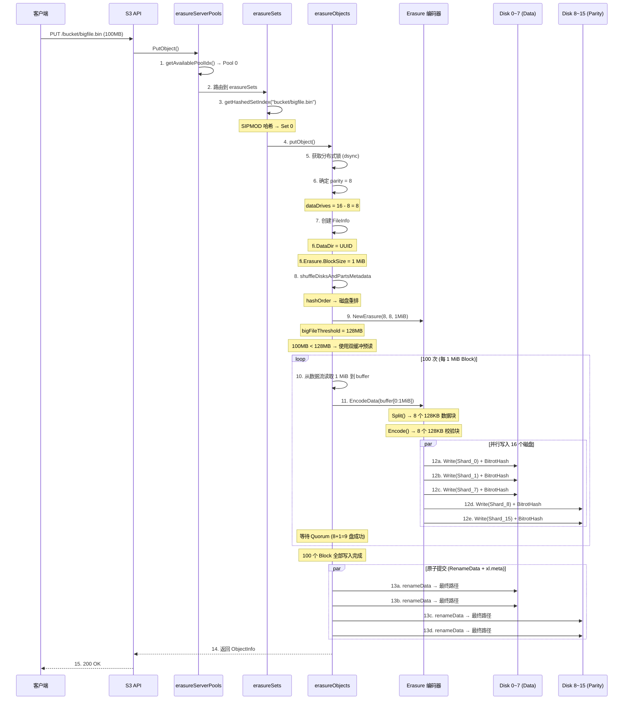

# MinIO 100MB 文件写入全流程分析

## 1. 场景设定

```
文件大小:  100 MB
集群配置:  1 个 Server Pool, 16 个磁盘 (1 个 Erasure Set)
纠删码:    8 Data + 8 Parity (高可用配置, 非默认)
Block 大小: 1 MiB

注: 16 盘集群默认为 12D + 4P，本文档选用 8D + 8P 高可用配置
    详见第 9 章 "纠删码配置选择"
```

---

## 2. 关键计算

### 2.1 分块计算

```
100 MB = 100 × 1024 × 1024 = 104,857,600 字节

Block 分块:
├── Block 大小: 1 MiB = 1,048,576 字节
├── Block 数量: ceil(100 MiB / 1 MiB) = 100 个 Block
└── 最后一个 Block: 恰好 1 MiB (100 是整数)
```

### 2.2 分片大小计算

```
代码位置: erasure-coding.go:116

ShardSize = ceil(blockSize / dataBlocks)
          = ceil(1,048,576 / 8)
          = 131,072 字节
          = 128 KiB

每个磁盘上存储的分片总大小:
ShardFileSize = numShards × ShardSize + lastShardSize
              = 100 × 131,072 + 0
              = 13,107,200 字节
              = 12.5 MiB

每个磁盘存储: ~12.5 MiB
16 个磁盘总存储: 12.5 × 16 = 200 MiB
存储开销: 200 / 100 = 2.0x (100% 冗余)
```

---

## 3. 完整写入流程

### 3.1 总览

```
┌─────────────────────────────────────────────────────────────────────────┐
│                     100MB 文件写入总览                                    │
├─────────────────────────────────────────────────────────────────────────┤
│                                                                          │
│  100 MB 原始数据                                                         │
│      │                                                                   │
│      │ 按 1 MiB 分块                                                      │
│      ▼                                                                   │
│  ┌───────────────────────────────────────────────────────────────────┐  │
│  │  Block 0 (1 MiB)  Block 1 (1 MiB) ... Block 99 (1 MiB)            │  │
│  │                                                                   │  │
│  │  共 100 个 Block                                                   │  │
│  └───────────────────────────────────────────────────────────────────┘  │
│      │                                                                   │
│      │ 每个 Block 纠删码编码 (8 Data + 8 Parity)                        │
│      ▼                                                                   │
│  ┌───────────────────────────────────────────────────────────────────┐  │
│  │                                                                   │  │
│  │  Block 0 → 8 Data Shards (128KB) + 8 Parity Shards (128KB)       │  │
│  │  Block 1 → 8 Data Shards (128KB) + 8 Parity Shards (128KB)       │  │
│  │  ...                                                              │  │
│  │  Block 99 → 8 Data Shards (128KB) + 8 Parity Shards (128KB)      │  │
│  │                                                                   │  │
│  └───────────────────────────────────────────────────────────────────┘  │
│      │                                                                   │
│      │ 并行写入 16 个磁盘                                                 │
│      ▼                                                                   │
│  ┌───────────────────────────────────────────────────────────────────┐  │
│  │                                                                   │  │
│  │  Disk 0:  [Shard0_B0][Shard0_B1]...[Shard0_B99] = 12.5 MiB      │  │
│  │  Disk 1:  [Shard1_B0][Shard1_B1]...[Shard1_B99] = 12.5 MiB      │  │
│  │  ...                                                              │  │
│  │  Disk 15: [Shard15_B0][Shard15_B1]...[Shard15_B99]= 12.5 MiB    │  │
│  │                                                                   │  │
│  │  每个磁盘: 1 个 part.1 文件 (12.5 MiB) + 1 个 xl.meta 文件        │  │
│  │                                                                   │  │
│  └───────────────────────────────────────────────────────────────────┘  │
│                                                                          │
└─────────────────────────────────────────────────────────────────────────┘
```

### 3.2 详细时序图



---

## 4. 单个 Block 的编解码细节

### 4.1 Block N 的处理过程

```
┌─────────────────────────────────────────────────────────────────────────┐
│                  Block N (第 N 个 1 MiB) 的处理                           │
├─────────────────────────────────────────────────────────────────────────┤
│                                                                          │
│  步骤 1: 读取数据                                                         │
│  ┌───────────────────────────────────────────────────────────────────┐  │
│  │  从数据流读取 1,048,576 字节 (1 MiB) 到 buffer                      │  │
│  └───────────────────────────────────────────────────────────────────┘  │
│                                                                          │
│  步骤 2: Split 分割 (erasure-coding.go:81)                              │
│  ┌───────────────────────────────────────────────────────────────────┐  │
│  │                                                                   │  │
│  │  1 MiB 数据                                                       │  │
│  │  ┌──────┬──────┬──────┬──────┬──────┬──────┬──────┬──────┐      │  │
│  │  │ D0   │ D1   │ D2   │ D3   │ D4   │ D5   │ D6   │ D7   │      │  │
│  │  │128KB │128KB │128KB │128KB │128KB │128KB │128KB │128KB │      │  │
│  │  └──────┴──────┴──────┴──────┴──────┴──────┴──────┴──────┘      │  │
│  │                                                                   │  │
│  └───────────────────────────────────────────────────────────────────┘  │
│                                                                          │
│  步骤 3: Encode 纠删码 (erasure-coding.go:85)                           │
│  ┌───────────────────────────────────────────────────────────────────┐  │
│  │                                                                   │  │
│  │  Reed-Solomon 编码:                                               │  │
│  │  从 8 个数据块 → 生成 8 个校验块                                    │  │
│  │                                                                   │  │
│  │  ┌──────┬──────┬──────┬──────┬──────┬──────┬──────┬──────┐      │  │
│  │  │ P0   │ P1   │ P2   │ P3   │ P4   │ P5   │ P6   │ P7   │      │  │
│  │  │128KB │128KB │128KB │128KB │128KB │128KB │128KB │128KB │      │  │
│  │  └──────┴──────┴──────┴──────┴──────┴──────┴──────┴──────┘      │  │
│  │                                                                   │  │
│  │  共 16 个分片 (8 Data + 8 Parity)                                 │  │
│  │                                                                   │  │
│  └───────────────────────────────────────────────────────────────────┘  │
│                                                                          │
│  步骤 4: 并行写入磁盘                                                     │
│  ┌───────────────────────────────────────────────────────────────────┐  │
│  │                                                                   │  │
│  │  multiWriter.Write() (erasure-encode.go:34)                      │  │
│  │                                                                   │  │
│  │  磁盘0    磁盘1    ...   磁盘7    磁盘8    ...   磁盘15           │  │
│  │  ┌────┐  ┌────┐         ┌────┐  ┌────┐         ┌────┐           │  │
│  │  │ D0 │  │ D1 │  ...    │ D7 │  │ P0 │  ...    │ P7 │           │  │
│  │  │128K│  │128K│         │128K│  │128K│         │128K│           │  │
│  │  └────┘  └────┘         └────┘  └────┘         └────┘           │  │
│  │      ↓       ↓             ↓       ↓              ↓              │  │
│  │  bitrotWriter 计算 HighwayHash 并附加到数据后写入                    │  │
│  │                                                                   │  │
│  │  写入路径: .minio.sys/tmp/{uuid}/{DataDir}/part.1                  │  │
│  │                                                                   │  │
│  └───────────────────────────────────────────────────────────────────┘  │
│                                                                          │
│  步骤 5: Quorum 检查                                                      │
│  ┌───────────────────────────────────────────────────────────────────┐  │
│  │                                                                   │  │
│  │  writeQuorum = dataDrives + 1 = 9 (当 data == parity 时)          │  │
│  │                                                                   │  │
│  │  countErrs(errs, nil) >= 9 → 写入成功                             │  │
│  │                                                                   │  │
│  └───────────────────────────────────────────────────────────────────┘  │
│                                                                          │
└─────────────────────────────────────────────────────────────────────────┘
```

---

## 5. 磁盘上的最终布局

### 5.1 单个磁盘的存储

```
假设: 16 磁盘集群，8 Data + 8 Parity
对象: bucket/bigfile.bin

磁盘 0 上的存储内容:
┌─────────────────────────────────────────────────────────────────────────┐
│                                                                          │
│  /data/disk0/                                                            │
│  ├── .minio.sys/                                                        │
│  │   ├── format.json                  (集群格式信息)                     │
│  │   ├── tmp/                         (临时上传目录)                    │
│  │   │   └── {upload-uuid}/          (上传完成后删除)                   │
│  │   │       └── {DataDir}/                                            │
│  │   │           └── part.1           (写入时临时位置)                  │
│  │   └── buckets/                                                       │
│  │       └── bucket/                                                    │
│  │           └── .metadata.bin        (Bucket 元数据)                  │
│  │                                                                       │
│  └── bucket/                        (最终位置)                           │
│      └── bigfile.bin/                                                    │
│          ├── xl.meta                 (元数据文件)                        │
│          └── a192c1d5-9bd5-41fd-9a90-ab10e165398d/  (DataDir UUID)     │
│              └── part.1              (本磁盘的分片数据)                  │
│                                                                          │
│  part.1 内容:                                                            │
│  ┌───────────────────────────────────────────────────────────────────┐  │
│  │                                                                   │  │
│  │  [Shard of Block 0]   128 KiB + Bitrot Hash                      │  │
│  │  [Shard of Block 1]   128 KiB + Bitrot Hash                      │  │
│  │  [Shard of Block 2]   128 KiB + Bitrot Hash                      │  │
│  │  ...                                                              │  │
│  │  [Shard of Block 99]  128 KiB + Bitrot Hash                      │  │
│  │                                                                   │  │
│  │  总大小: ~12.5 MiB                                                │  │
│  │                                                                   │  │
│  └───────────────────────────────────────────────────────────────────┘  │
│                                                                          │
└─────────────────────────────────────────────────────────────────────────┘
```

### 5.2 全部 16 个磁盘的视图

```
┌─────────────────────────────────────────────────────────────────────────┐
│                    16 个磁盘上的完整存储                                   │
├─────────────────────────────────────────────────────────────────────────┤
│                                                                          │
│  对象: bucket/bigfile.bin                                                │
│  DataDir: a192c1d5-9bd5-41fd-9a90-ab10e165398d                           │
│                                                                          │
│  分布顺序 (hashOrder): [5, 2, 0, 4, 1, 3, 7, 6, 9, 8, 11, 10, 13, 12, 15, 14]│
│  (示例顺序，实际由对象名哈希决定)                                         │
│                                                                          │
│  磁盘      part.1 内容          类型      大小                            │
│  ─────    ──────────          ──────    ─────                           │
│  Disk 0    Data Shard 5        Data      12.5 MiB                       │
│  Disk 1    Data Shard 2        Data      12.5 MiB                       │
│  Disk 2    Data Shard 0        Data      12.5 MiB                       │
│  Disk 3    Data Shard 4        Data      12.5 MiB                       │
│  Disk 4    Data Shard 1        Data      12.5 MiB                       │
│  Disk 5    Data Shard 3        Data      12.5 MiB                       │
│  Disk 6    Data Shard 7        Data      12.5 MiB                       │
│  Disk 7    Data Shard 6        Data      12.5 MiB                       │
│  Disk 8    Parity Shard 9      Parity    12.5 MiB                       │
│  Disk 9    Parity Shard 8      Parity    12.5 MiB                       │
│  Disk 10   Parity Shard 11     Parity    12.5 MiB                       │
│  Disk 11   Parity Shard 10     Parity    12.5 MiB                       │
│  Disk 12   Parity Shard 13     Parity    12.5 MiB                       │
│  Disk 13   Parity Shard 12     Parity    12.5 MiB                       │
│  Disk 14   Parity Shard 15     Parity    12.5 MiB                       │
│  Disk 15   Parity Shard 14     Parity    12.5 MiB                       │
│                                                                          │
│  每个磁盘都有:                                                            │
│  ├── {object}/{DataDir}/part.1  (分片数据, ~12.5 MiB)                   │
│  └── {object}/xl.meta           (元数据, 记录本盘存储的是哪个分片)        │
│                                                                          │
│  全部磁盘总计: 12.5 × 16 = 200 MiB                                       │
│  原始文件大小: 100 MiB                                                   │
│  存储开销: 2.0x                                                          │
│                                                                          │
└─────────────────────────────────────────────────────────────────────────┘
```

---

## 6. xl.meta 元数据内容

### 6.1 每个磁盘上 xl.meta 的关键字段

```
┌─────────────────────────────────────────────────────────────────────────┐
│               Disk 2 上的 xl.meta (存储 Data Shard 0)                    │
├─────────────────────────────────────────────────────────────────────────┤
│                                                                          │
│  Header:                                                                 │
│  ├── Magic: "XL2 "                                                      │
│  └── Version: 1.3                                                       │
│                                                                          │
│  Body (MessagePack):                                                     │
│  ┌───────────────────────────────────────────────────────────────────┐  │
│  │                                                                   │  │
│  │  Version 1:                                                       │  │
│  │  ├── Type: ObjectType                                             │  │
│  │  ├── VersionID: (UUID)                                            │  │
│  │  ├── DataDir: a192c1d5-9bd5-41fd-9a90-ab10e165398d                │  │
│  │  │                                                                │  │
│  │  ├── ErasureAlgorithm: "rs-vandermonde"                           │  │
│  │  ├── ErasureM: 8              (数据分片数)                         │  │
│  │  ├── ErasureN: 8              (校验分片数)                         │  │
│  │  ├── ErasureBlockSize: 1048576  (1 MiB)                           │  │
│  │  ├── ErasureIndex: 3          (本盘是第3个分片, 即 Shard 0)       │  │
│  │  ├── ErasureDist: [5,2,0,4,1,3,7,6,9,8,11,10,13,12,15,14]      │  │
│  │  │                                                                │  │
│  │  ├── BitrotChecksumAlgo: HighwayHash                              │  │
│  │  │                                                                │  │
│  │  ├── PartNumbers: [1]          (单 part 上传)                      │  │
│  │  ├── PartETags: ["etag..."]                                                       │  │
│  │  ├── PartSizes: [13107200]    (分片文件大小 ~12.5 MiB)            │  │
│  │  │   注: PartSizes 存储的是 ShardFileSize                         │  │
│  │  │                                                                │  │
│  │  ├── Size: 104857600          (原始文件大小 100 MiB)               │  │
│  │  ├── ModTime: (时间戳)                                            │  │
│  │  │                                                                │  │
│  │  ├── MetaSys: { 内部元数据 }                                      │  │
│  │  │   ├── "x-minio-internal-erasure-upgraded": "8->8"             │  │
│  │  │   └── ...                                                      │  │
│  │  │                                                                │  │
│  │  └── MetaUser: { 用户自定义元数据 }                                │  │
│  │      ├── "Content-Type": "application/octet-stream"              │  │
│  │      └── ...                                                      │  │
│  │                                                                   │  │
│  └───────────────────────────────────────────────────────────────────┘  │
│                                                                          │
└─────────────────────────────────────────────────────────────────────────┘
```

### 6.2 ErasureIndex 的含义

```
每个磁盘的 xl.meta 中 ErasureIndex 不同:

磁盘    ErasureIndex    说明
─────   ────────────    ────
Disk 0       5          本盘存储第 5 号分片
Disk 1       2          本盘存储第 2 号分片
Disk 2       0          本盘存储第 0 号分片 (数据分片)
Disk 3       4          本盘存储第 4 号分片
Disk 4       1          本盘存储第 1 号分片
Disk 5       3          本盘存储第 3 号分片
Disk 6       7          本盘存储第 7 号分片
Disk 7       6          本盘存储第 6 号分片
Disk 8       9          本盘存储第 9 号分片 (校验分片)
...
Disk 15      14         本盘存储第 14 号分片

读取时: 通过 ErasureIndex 还原分片在原始数据中的位置
```

---

## 7. 数据流可视化

### 7.1 完整数据流

```
┌─────────────────────────────────────────────────────────────────────────┐
│                      100MB 数据流完整可视化                               │
├─────────────────────────────────────────────────────────────────────────┤
│                                                                          │
│  客户端发送                                                               │
│  ┌───────────────────────────────────────────────────────────────────┐  │
│  │              100 MB 数据流                                          │  │
│  └───────────────────────────────────────────────────────────────────┘  │
│      │                                                                   │
│      │ 分块读取 (1 MiB / 次)                                              │
│      ▼                                                                   │
│  ┌──────┬──────┬──────┬──────┬─────────────┬──────┐                    │
│  │ B_0  │ B_1  │ B_2  │ B_3  │ ...  ...    │ B_99 │  ← 100 个 Block   │
│  │1 MiB │1 MiB │1 MiB │1 MiB │             │1 MiB │                    │
│  └──┬───┴──┬───┴──┬───┴──┬───┴──────┬──────┴──┬───┘                    │
│     │      │      │      │          │         │                         │
│     ▼      ▼      ▼      ▼          ▼         ▼   ← 每块独立编码        │
│                                                                          │
│  Block 0 编码:                                                           │
│  ┌─────────────────────────────────────────────────────────────────┐   │
│  │  1 MiB → Split → 8 × 128 KiB (Data) → Encode → 8 × 128 KiB (Parity)│  │
│  │                                                                  │   │
│  │  D0    D1    D2    D3    D4    D5    D6    D7                    │   │
│  │  128K  128K  128K  128K  128K  128K  128K  128K                 │   │
│  │                                                                  │   │
│  │  P0    P1    P2    P3    P4    P5    P6    P7                    │   │
│  │  128K  128K  128K  128K  128K  128K  128K  128K                 │   │
│  └──────────────────────────────────────────────────────────────────┘   │
│     │      │      │      │      │      │      │      │                   │
│     ▼      ▼      ▼      ▼      ▼      ▼      ▼      ▼   ← 并行写入      │
│   Disk   Disk   Disk   Disk   Disk   Disk   Disk   Disk                │
│    0      1      2      3      4      5      6      7    ... Disk 15   │
│                                                                          │
│  Block 1 编码: (同样的过程)                                              │
│   Disk   Disk   Disk   Disk   Disk   Disk   Disk   Disk                │
│    0      1      2      3      4      5      6      7    ... Disk 15   │
│                                                                          │
│   ...                                                                    │
│                                                                          │
│  Block 99 编码: (同样的过程)                                             │
│   Disk   Disk   Disk   Disk   Disk   Disk   Disk   Disk                │
│    0      1      2      3      4      5      6      7    ... Disk 15   │
│                                                                          │
│  最终每个磁盘的 part.1 文件:                                              │
│  ┌─────────────────────────────────────────────────────────────────┐   │
│  │  [Block0的分片][Block1的分片]...[Block99的分片] + Bitrot Hashes  │   │
│  │  = 100 × 128 KiB = ~12.5 MiB                                    │   │
│  └──────────────────────────────────────────────────────────────────┘   │
│                                                                          │
└─────────────────────────────────────────────────────────────────────────┘
```

---

## 8. 读取时的逆过程

```
┌─────────────────────────────────────────────────────────────────────────┐
│                    读取 100MB 文件的逆过程                                 │
├─────────────────────────────────────────────────────────────────────────┤
│                                                                          │
│  GET /bucket/bigfile.bin                                                 │
│                                                                          │
│  Step 1: 路由到 Set 0 (哈希计算)                                          │
│                                                                          │
│  Step 2: 读取所有 16 个磁盘的 xl.meta                                     │
│  ├── Quorum 校验: 至少 9 个磁盘的元数据一致                               │
│  └── 还原分布顺序 (ErasureDist)                                           │
│                                                                          │
│  Step 3: 逐 Block 解码                                                    │
│                                                                          │
│  Block 0:                                                                │
│  ├── 优先读取 8 个数据盘                                                  │
│  │   Disk0: Shard5 (128 KiB) ✅                                         │
│  │   Disk1: Shard2 (128 KiB) ✅                                         │
│  │   Disk2: Shard0 (128 KiB) ✅                                         │
│  │   ...                                                                 │
│  │   收集到 8 个分片 → 足够解码                                          │
│  │                                                                       │
│  ├── Bitrot 校验: 每个分片验证 HighwayHash                               │
│  │                                                                       │
│  ├── ReconstructData: 8 分片 → 1 MiB 原始数据                           │
│  │                                                                       │
│  └── 输出到客户端                                                         │
│                                                                          │
│  Block 1 ~ Block 99: 同样过程                                             │
│                                                                          │
│  总计读取: 100 × 8 × 128 KiB = 100 MiB (只读数据盘)                      │
│  输出: 100 MiB 原始数据                                                   │
│                                                                          │
│  如果某个数据盘损坏:                                                      │
│  ├── 用 8 个数据分片 + 1 个校验分片重建                                  │
│  ├── 仍然可以完整读取                                                    │
│  └── 后台触发治愈                                                        │
│                                                                          │
│  如果 8 个磁盘同时损坏 (数据+校验):                                       │
│  ├── 仍有 8 个分片可用                                                   │
│  ├── 可以重建完整数据                                                    │
│  └── 数据不丢失!                                                         │
│                                                                          │
└─────────────────────────────────────────────────────────────────────────┘
```

---

## 9. 纠删码配置选择

### 9.1 Parity 数量如何决定？

parity 数量取决于**两个因素**：Set 内磁盘数 + 用户配置。

**默认策略** (代码位置: `erasure-server-pool.go:122`)：

```
switch setDriveCount {
case 4, 5:  parity = 2      // 4~5 盘 → 2 校验
case 6, 7:  parity = 3      // 6~7 盘 → 3 校验
default:    parity = 4      // 8~16 盘 → 4 校验
}
```

**16 盘集群默认是 12 Data + 4 Parity，不是 8+8。**

### 9.2 三种典型配置对比

| 配置 | 磁盘数 | Data | Parity | 容错盘数 | 存储开销 | 有效存储率 |
|------|--------|------|--------|----------|----------|------------|
| 4D+2P | 6 | 4 | 2 | 2 | 1.5x | 66.7% |
| **12D+4P** | **16** | **12** | **4** | **4** | **1.33x** | **75%** |
| 8D+8P | 16 | 8 | 8 | 8 | 2.0x | 50% |

> 有效存储率 = Data / 总磁盘数

### 9.3 配置选择权衡

```
┌─────────────────────────────────────────────────────────────────────────┐
│                     三种配置的权衡                                        │
├─────────────────────────────────────────────────────────────────────────┤
│                                                                          │
│  4D + 2P (6 盘集群)                                                      │
│  ├── 优点: 存储效率高 (1.5x 开销)                                        │
│  ├── 缺点: 只能容忍 2 盘故障                                             │
│  ├── 适用: 成本敏感，可接受中等可靠性                                    │
│  └── 默认: 4~5 盘集群的默认配置                                          │
│                                                                          │
│  12D + 4P (16 盘集群, 默认)                                              │
│  ├── 优点: 存储效率高 (1.33x 开销), 大集群                              │
│  ├── 缺点: 容忍 4 盘故障                                                 │
│  ├── 适用: 通用场景，性能与可靠性平衡                                    │
│  └── 默认: 8~16 盘集群的标准配置                                         │
│                                                                          │
│  8D + 8P (16 盘集群, 高可用)                                             │
│  ├── 优点: 极高容错 (容忍 8 盘故障 = 50%)                               │
│  ├── 缺点: 存储开销大 (2.0x), 写入更慢                                  │
│  ├── 适用: 关键数据，归档存储                                            │
│  └── 配置: 用户手动设置或 EC:STANDARD                                    │
│                                                                          │
└─────────────────────────────────────────────────────────────────────────┘
```

### 9.4 100MB 文件在不同配置下的存储量

```
┌─────────────────────────────────────────────────────────────────────────┐
│                100MB 文件在不同配置下的存储量                              │
├─────────────────────────────────────────────────────────────────────────┤
│                                                                          │
│  配置: 12D + 4P (默认, 16 盘)                                            │
│  ├── ShardSize = ceil(1MiB / 12) = 85,333 字节 (~83 KiB)               │
│  ├── 每盘存储: ~83 KiB × 100 = ~8.3 MiB                                 │
│  ├── 总存储: 8.3 × 16 = ~133 MiB                                       │
│  └── 开销: 1.33x                                                       │
│                                                                          │
│  配置: 8D + 8P (高可用, 16 盘)                                           │
│  ├── ShardSize = ceil(1MiB / 8) = 131,072 字节 (128 KiB)              │
│  ├── 每盘存储: 128 KiB × 100 = ~12.5 MiB                                │
│  ├── 总存储: 12.5 × 16 = ~200 MiB                                      │
│  └── 开销: 2.0x                                                        │
│                                                                          │
│  配置: 4D + 2P (小集群, 6 盘)                                            │
│  ├── ShardSize = ceil(1MiB / 4) = 262,144 字节 (256 KiB)              │
│  ├── 每盘存储: 256 KiB × 100 = ~25 MiB                                  │
│  ├── 总存储: 25 × 6 = ~150 MiB                                         │
│  └── 开销: 1.5x                                                        │
│                                                                          │
└─────────────────────────────────────────────────────────────────────────┘
```

### 9.5 可靠性对比

```
假设: 单盘年故障率 2%

┌──────────────┬──────────┬────────────┬───────────────┐
│ 配置          │ 容错盘数  │ 多盘同时坏率 │ 数据丢失概率   │
├──────────────┼──────────┼────────────┼───────────────┤
│ 4D + 2P (6盘) │ 2盘      │ 2.0%       │ ~0.0008%      │
│ 12D + 4P (16盘)│ 4盘     │ 0.5%       │ ~0.000005%    │
│ 8D + 8P (16盘) │ 8盘     │ 0.01%      │ ~0.00000001%  │
└──────────────┴──────────┴────────────┴───────────────┘

8D+8P 的数据可靠性远高于 12D+4P，但代价是 50% 更多的存储空间。
```

### 9.6 代码中的配置逻辑

```go
// erasure-object.go:1299
parityDrives := globalStorageClass.GetParityForSC(userDefined[xhttp.AmzStorageClass])
if parityDrives < 0 {
    parityDrives = er.defaultParityCount  // 默认值 (16盘=4)
}

// 如果设置 MaxParity (高可用模式)
if opts.MaxParity {
    parityDrives = len(storageDisks) / 2  // 16/2 = 8 → 8D+8P
}

// 动态升级: 写入时有磁盘离线，自动增加 parity
if globalStorageClass.AvailabilityOptimized() {
    for _, disk := range storageDisks {
        if disk == nil || !disk.IsOnline() {
            parityDrives++  // 离线盘数增加 parity
        }
    }
}
```

**用户可通过环境变量配置：**

```bash
# 设置默认 storage class
MINIO_STORAGE_CLASS_STANDARD=EC:4    # 12D+4P (默认)
MINIO_STORAGE_CLASS_STANDARD=EC:8    # 8D+8P (高可用)
MINIO_STORAGE_CLASS_STANDARD=EC:2    # 14D+2P (高存储效率)
```

### 9.7 为什么本文档选 8D+8P？

| 原因 | 说明 |
|------|------|
| **对称性** | Data == Parity，便于理解纠删码原理 |
| **Quorum 示例** | data == parity 时 writeQuorum = data+1，展示特殊规则 |
| **高可用演示** | 50% 容错能力，对比效果明显 |
| **实际生产** | 关键数据 (如备份归档) 常用此配置 |

> **实际默认配置是 12D+4P**，适用于大多数通用场景。

---

## 10. 关键参数汇总

| 参数 | 值 | 代码位置 |
|------|-----|----------|
| **文件大小** | 100 MiB | 用户输入 |
| **BlockSize** | 1 MiB (1,048,576) | `object-api-common.go:37` |
| **Block 数量** | 100 | ceil(100MiB / 1MiB) |
| **DataBlocks** | 8 | `erasure-server-pool.go:122` |
| **ParityBlocks** | 8 | `erasure-server-pool.go:122` |
| **ShardSize** | 128 KiB (131,072) | `erasure-coding.go:117` |
| **每盘 part.1 大小** | ~12.5 MiB | `erasure-coding.go:121` |
| **WriteQuorum** | 9 (data+1) | `erasure-object.go:1338` |
| **ReadQuorum** | 8 | data blocks |
| **bigFileThreshold** | 128 MiB | `xl-storage.go:66` |
| **总存储开销** | 200 MiB (2.0x) | 16 × 12.5 MiB |
| **容错能力** | 8 盘故障 | parity blocks |

---

## 11. 总结

```
┌─────────────────────────────────────────────────────────────────────────┐
│                    100MB 文件写入总结                                     │
├─────────────────────────────────────────────────────────────────────────┤
│                                                                          │
│  100 MB 文件                                                             │
│      │                                                                   │
│      ├──▶ 分成 100 个 1 MiB Block                                        │
│      │                                                                   │
│      ├──▶ 每个 Block 编码为 16 个 128 KiB 分片 (8D + 8P)                │
│      │                                                                   │
│      ├──▶ 并行写入 16 个磁盘的 part.1 文件                               │
│      │    每个磁盘存储: 100 × 128 KiB = ~12.5 MiB                       │
│      │                                                                   │
│      ├──▶ 原子提交: renameData + 写入 xl.meta                           │
│      │                                                                   │
│      └──▶ 结果:                                                          │
│           ├── 16 个磁盘各有 1 个 part.1 (12.5 MiB) + 1 个 xl.meta      │
│           ├── 总存储: 200 MiB (2.0x 开销)                               │
│           ├── 可容忍 8 盘故障                                            │
│           └── 任何 8 个分片即可重建完整数据                               │
│                                                                          │
└─────────────────────────────────────────────────────────────────────────┘
```

---
