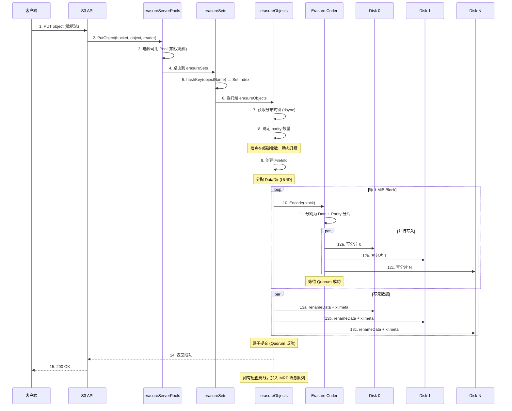
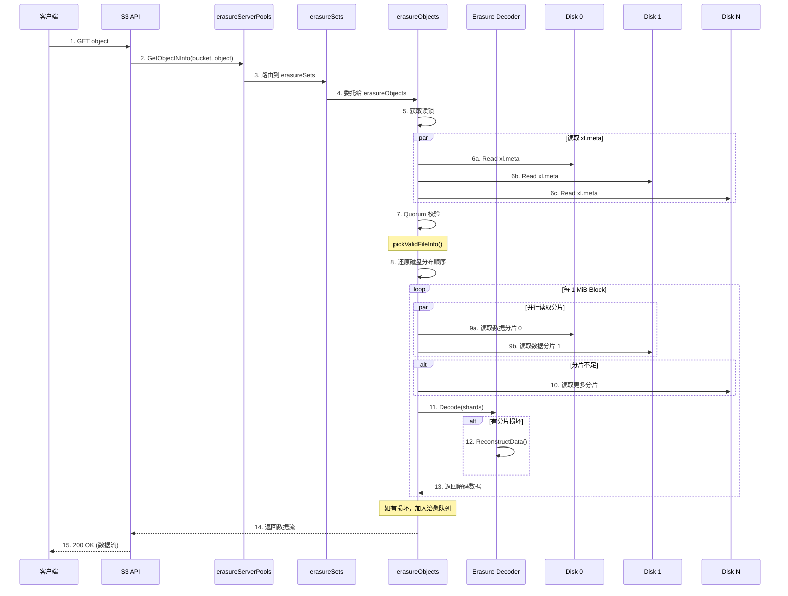
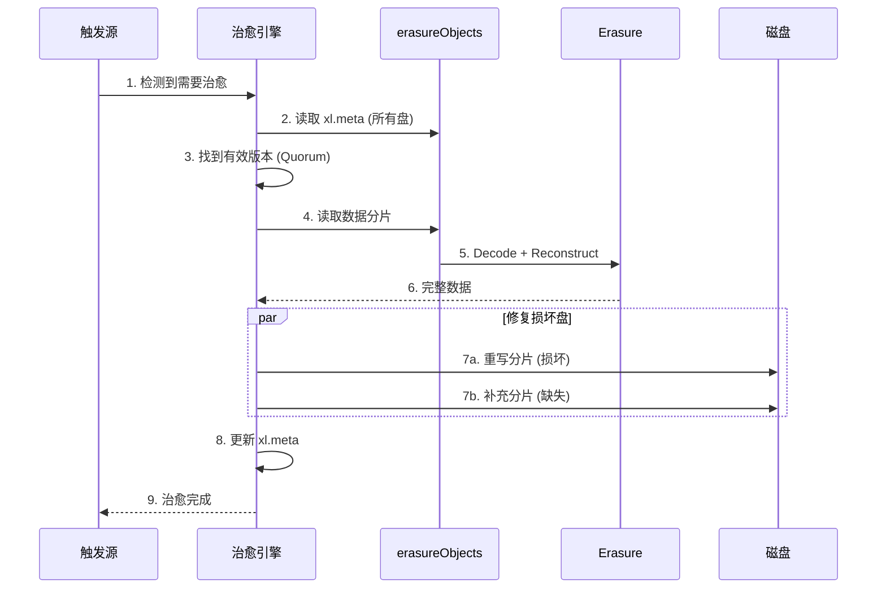
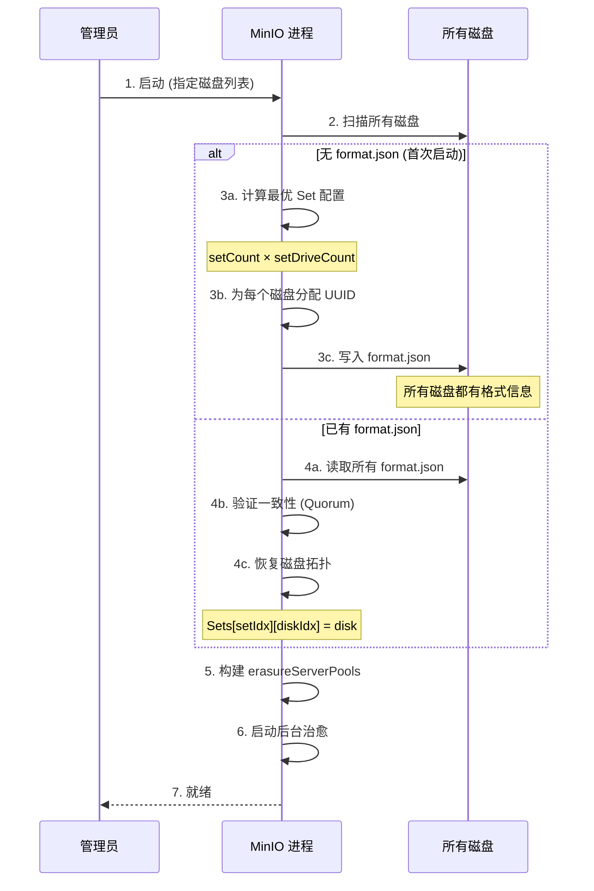

# MinIO 存储模型架构分析

## 1. 概述

MinIO 是一个**高性能、S3 兼容的对象存储系统**，采用 **Reed-Solomon 纠删码** 实现数据冗余和高可用。

**核心设计原则：**
- 无中心元数据服务器，**计算式路由**（一致性哈希）
- 数据冗余通过**纠删码**实现，非多副本
- **自愈合**：后台自动修复损坏数据

---

## 2. 整体架构

```
┌─────────────────────────────────────────────────────────────────────────┐
│                         MinIO 整体架构                                    │
├─────────────────────────────────────────────────────────────────────────┤
│                                                                          │
│  ┌─────────────────────────────────────────────────────────────────┐   │
│  │                       S3 兼容 API 层                              │   │
│  │    PUT / GET / DELETE / LIST  (api-router.go)                    │   │
│  └──────────────────────────────┬──────────────────────────────────┘   │
│                                  │                                       │
│  ┌──────────────────────────────▼──────────────────────────────────┐   │
│  │                    Object Layer 接口                              │   │
│  │                  (erasure-server-pool.go)                        │   │
│  │                                                                  │   │
│  │   ┌─────────────────────────────────────────────────────────┐   │   │
│  │   │              erasureServerPools                           │   │   │
│  │   │                                                          │   │   │
│  │   │   ┌──────────┐  ┌──────────┐  ┌──────────┐              │   │   │
│  │   │   │ Pool 0   │  │ Pool 1   │  │ Pool N   │              │   │   │
│  │   │   │erasureSets│  │erasureSets│  │erasureSets│             │   │   │
│  │   │   └────┬─────┘  └────┬─────┘  └────┬─────┘              │   │   │
│  │   └────────┼─────────────┼─────────────┼──────────────────────┘   │   │
│  │            │             │             │                           │   │
│  │   ┌────────▼─────────────▼─────────────▼──────────────────────┐   │   │
│  │   │              StorageAPI 接口                                │   │   │
│  │   │   ┌─────────────┐         ┌─────────────────┐             │   │   │
│  │   │   │  xlStorage   │         │ storageRESTClient│             │   │   │
│  │   │   │  (本地磁盘)  │         │   (远程磁盘)      │             │   │   │
│  │   │   └─────────────┘         └─────────────────┘             │   │   │
│  │   └───────────────────────────────────────────────────────────┘   │   │
│  └──────────────────────────────────────────────────────────────────┘   │
│                                                                          │
│  ┌──────────────────────────────────────────────────────────────────┐   │
│  │                       辅助子系统                                    │   │
│  │  ┌──────────┐ ┌──────────┐ ┌──────────┐ ┌──────────┐            │   │
│  │  │  治愈系统  │ │ Bitrot   │ │ dsync    │ │ 生命周期  │            │   │
│  │  │ (Healing)│ │ (数据校验)│ │ (分布式锁)│ │(Lifecycle)│            │   │
│  │  └──────────┘ └──────────┘ └──────────┘ └──────────┘            │   │
│  └──────────────────────────────────────────────────────────────────┘   │
│                                                                          │
└─────────────────────────────────────────────────────────────────────────┘
```

---

## 3. 存储层次结构

MinIO 的存储分为 **三层**：Server Pool → Erasure Set → Disk。

```
┌─────────────────────────────────────────────────────────────────────────┐
│                      MinIO 存储层次结构                                   │
├─────────────────────────────────────────────────────────────────────────┤
│                                                                          │
│  ┌───────────────────────────────────────────────────────────────────┐  │
│  │                    erasureServerPools                              │  │
│  │            (erasure-server-pool.go)                                │  │
│  │                                                                   │  │
│  │   集群最顶层，管理多个 Server Pool                                  │  │
│  │   对象写入时，按可用空间选择 Pool                                    │  │
│  │                                                                   │  │
│  └───────────────────────────┬───────────────────────────────────────┘  │
│                              │                                          │
│          ┌───────────────────┼───────────────────┐                      │
│          ▼                   ▼                   ▼                      │
│  ┌───────────────┐   ┌───────────────┐   ┌───────────────┐             │
│  │    Pool 0     │   │    Pool 1     │   │    Pool N     │             │
│  │  erasureSets  │   │  erasureSets  │   │  erasureSets  │             │
│  │               │   │               │   │               │             │
│  │ 多个 Erasure  │   │               │   │               │             │
│  │ Set 的集合    │   │               │   │               │             │
│  └───────┬───────┘   └───────────────┘   └───────────────┘             │
│          │                                                             │
│   ┌──────┼──────────────────────────┐                                  │
│   │      │     Erasure Sets         │                                  │
│   │      ▼                           │                                  │
│   │  ┌────────┐ ┌────────┐ ┌────────┐│                                 │
│   │  │Set 0   │ │Set 1   │ │Set M   ││  ← 每个 Set 独立进行纠删码       │
│   │  │4~16盘  │ │4~16盘  │ │4~16盘  ││                                 │
│   │  └───┬────┘ └────────┘ └────────┘│                                 │
│   │      │                           │                                  │
│   │      ▼ 对象按哈希路由到某个 Set                                      │
│   │  ┌──────────────────────────────┐│                                 │
│   │  │     erasureObjects            ││                                 │
│   │  │  (erasure.go)                 ││                                 │
│   │  │                               ││                                 │
│   │  │  ┌─────┐ ┌─────┐ ┌─────┐    ││                                 │
│   │  │  │Disk0│ │Disk1│ │DiskN│    ││  ← 数据分片写入各磁盘             │
│   │  │  │     │ │     │ │     │    ││                                 │
│   │  │  │Data │ │Data │ │Par  │    ││                                 │
│   │  │  │Shard│ │Shard│ │Shard│    ││                                 │
│   │  │  └─────┘ └─────┘ └─────┘    ││                                 │
│   │  └──────────────────────────────┘│                                 │
│   └──────────────────────────────────┘                                  │
│                                                                          │
└─────────────────────────────────────────────────────────────────────────┘
```

### 3.1 层级说明

| 层级 | 结构体 | 代码位置 | 作用 |
|------|--------|----------|------|
| **Server Pool** | `erasureServerPools` | `erasure-server-pool.go:52` | 管理多个 Pool，横向扩展 |
| **Erasure Sets** | `erasureSets` | `erasure-sets.go:51` | 管理 Set 集合，哈希路由 |
| **Erasure Objects** | `erasureObjects` | `erasure.go:48` | 单个 Set，执行纠删码 |
| **Disk** | `xlStorage` / `storageRESTClient` | `storage-datatypes.go` | 物理磁盘抽象 |

---

## 4. 纠删码机制

### 4.1 Reed-Solomon 编码

```
┌─────────────────────────────────────────────────────────────────────────┐
│                     Reed-Solomon 纠删码原理                               │
├─────────────────────────────────────────────────────────────────────────┤
│                                                                          │
│  原始数据 (1 MiB Block)                                                  │
│  ┌───────────────────────────────────────────────────────────────────┐  │
│  │                    D = D0 + D1 + D2 + D3                           │  │
│  │                    (4 个数据块, 每块 256 KiB)                      │  │
│  └───────────────────────────────────────────────────────────────────┘  │
│                              │                                           │
│                              │ Reed-Solomon 编码                         │
│                              ▼                                           │
│  ┌───────────────────────────────────────────────────────────────────┐  │
│  │                                                                    │  │
│  │   数据分片 (Data Shards)          校验分片 (Parity Shards)        │  │
│  │   ┌──────┐ ┌──────┐             ┌──────┐ ┌──────┐                │  │
│  │   │  D0  │ │  D1  │             │  P0  │ │  P1  │                │  │
│  │   │256KB │ │256KB │             │256KB │ │256KB │                │  │
│  │   └──────┘ └──────┘             └──────┘ └──────┘                │  │
│  │   ┌──────┐ ┌──────┐                                               │  │
│  │   │  D2  │ │  D3  │                                               │  │
│  │   │256KB │ │256KB │                                               │  │
│  │   └──────┘ └──────┘                                               │  │
│  │                                                                    │  │
│  │   总共: 4 Data + 2 Parity = 6 个分片 (写入 6 个磁盘)              │  │
│  │                                                                    │  │
│  └────────────────────────────────────────────────────────────────────┘  │
│                                                                          │
│  容错能力:                                                               │
│  ├── 丢失任意 2 个分片 (含校验) → 数据可恢复                             │
│  ├── 需要 4 个分片即可重建原始数据                                       │
│  └── 存储 overhead: 6/4 = 1.5x (50% 冗余)                              │
│                                                                          │
└─────────────────────────────────────────────────────────────────────────┘
```

### 4.2 默认校验盘数量

| 集群磁盘数 (per Set) | 数据分片 | 校验分片 | 容错盘数 | 存储开销 |
|----------------------|----------|----------|----------|----------|
| 4 | 2 | 2 | 2 | 2.0x |
| 5 | 3 | 2 | 2 | 1.67x |
| 6 | 3 | 3 | 3 | 2.0x |
| 7 | 4 | 3 | 3 | 1.75x |
| 8 | 4 | 4 | 4 | 2.0x |
| 12 | 8 | 4 | 4 | 1.5x |
| 16 | 8 | 8 | 8 | 2.0x |

> 代码位置: `erasure-server-pool.go:122-133`

### 4.3 读写仲裁

```
┌─────────────────────────────────────────────────────────────────────────┐
│                        读写仲裁规则                                       │
├─────────────────────────────────────────────────────────────────────────┤
│                                                                          │
│  示例: 4 Data + 2 Parity = 6 盘                                         │
│                                                                          │
│  写仲裁 (Write Quorum):                                                  │
│  ├── 需要至少 4 个盘写入成功                                              │
│  └── 当 data == parity 时，需要 data+1 = 5 个盘                          │
│                                                                          │
│  读仲裁 (Read Quorum):                                                   │
│  ├── 需要至少 4 个盘读取成功                                              │
│  └── 读取到的分片可以重建完整数据                                        │
│                                                                          │
│  容错分析:                                                               │
│                                                                          │
│  磁盘状态            可用盘    能否写    能否读                           │
│  ─────────────      ──────    ──────    ──────                           │
│  全部正常            6/6       ✅        ✅                               │
│  1 盘故障            5/6       ✅        ✅                               │
│  2 盘故障            4/6       ✅        ✅                               │
│  3 盘故障            3/6       ❌        ✅ (仍可读)                      │
│  4 盘故障            2/6       ❌        ❌                               │
│                                                                          │
└─────────────────────────────────────────────────────────────────────────┘
```

---

## 5. 磁盘上的存储格式

### 5.1 磁盘目录结构

```
disk1/
├── .minio.sys/                          ← MinIO 系统目录
│   ├── format.json                      ← 格式文件 (集群标识)
│   ├── tmp/                             ← 临时文件
│   └── buckets/
│       └── {bucket-name}/
│           └── .metadata.bin            ← Bucket 元数据
│
├── {bucket}/                            ← Bucket 数据目录
│   └── {object}/                        ← Object 目录
│       ├── xl.meta                       ← 元数据文件 (所有版本)
│       │
│       ├── a192c1d5-9bd5-41fd-9a90-ab10e165398d/  ← DataDir (版本1)
│       │   └── part.1                    ← 数据分片
│       │
│       ├── c06e0436-f813-447e-ae5e-f2564df9dfd4/  ← DataDir (版本2)
│       │   └── part.1                    ← 数据分片
│       │
│       └── df433928-2dcf-47b1-a786-43efa0f6b424/  ← DataDir (版本3)
│           └── part.1                    ← 数据分片
│
└── ...
```

> 每个磁盘只存储对象的一个分片 (Data Shard 或 Parity Shard)

### 5.2 xl.meta 文件格式

```
┌─────────────────────────────────────────────────────────────────────────┐
│                      xl.meta 文件格式 (v2)                                │
├─────────────────────────────────────────────────────────────────────────┤
│                                                                          │
│  ┌───────────────────────────────────────────────────────────────────┐  │
│  │  Header (6 bytes)                                                 │  │
│  │  ├── Magic: 'X', 'L', '2', ' ' (4 bytes)                        │  │
│  │  ├── Major Version: 1 (2 bytes)                                   │  │
│  │  └── Minor Version: 3 (2 bytes)                                   │  │
│  └───────────────────────────────────────────────────────────────────┘  │
│                                                                          │
│  ┌───────────────────────────────────────────────────────────────────┐  │
│  │  Body (MessagePack 编码)                                          │  │
│  │                                                                   │  │
│  │  Versions []xlMetaV2Version  ← 版本数组 (Journal)                │  │
│  │  │                                                               │  │
│  │  ├── Version 1:                                                  │  │
│  │  │   ├── Type: ObjectType                                        │  │
│  │  │   ├── VersionID: [16]byte (UUID)                               │  │
│  │  │   ├── DataDir: [16]byte (UUID)                                │  │
│  │  │   ├── ErasureAlgorithm: "rs-vandermonde"                      │  │
│  │  │   ├── ErasureM: 4 (数据分片数)                                 │  │
│  │  │   ├── ErasureN: 2 (校验分片数)                                 │  │
│  │  │   ├── ErasureBlockSize: 1048576 (1 MiB)                       │  │
│  │  │   ├── ErasureIndex: 3 (本磁盘的分片索引)                       │  │
│  │  │   ├── BitrotChecksumAlgo: HighwayHash                         │  │
│  │  │   ├── PartNumbers: [1]                                        │  │
│  │  │   ├── PartETags: ["sha256..."]                                │  │
│  │  │   ├── PartSizes: [1048576]                                    │  │
│  │  │   ├── Size: 1048576                                           │  │
│  │  │   ├── ModTime: 1703145600                                     │  │
│  │  │   ├── MetaSys: {internal metadata}                             │  │
│  │  │   └── MetaUser: {user-set metadata}                           │  │
│  │  │                                                               │  │
│  │  ├── Version 2:                                                  │  │
│  │  │   └── Type: DeleteType (删除标记)                              │  │
│  │  │                                                               │  │
│  │  └── Version N: ...                                              │  │
│  │                                                                   │  │
│  └───────────────────────────────────────────────────────────────────┘  │
│                                                                          │
└─────────────────────────────────────────────────────────────────────────┘
```

### 5.3 小对象内联存储

```
┌─────────────────────────────────────────────────────────────────────────┐
│                      小对象内联存储                                       │
├─────────────────────────────────────────────────────────────────────────┤
│                                                                          │
│  普通对象:                                                               │
│  ├── 元数据: xl.meta                                                    │
│  └── 数据: {DataDir}/part.1                                             │
│                                                                          │
│  小对象 (内联):                                                          │
│  ├── 元数据: xl.meta                                                    │
│  └── 数据: 直接存储在 xl.meta 的 Data 字段中                             │
│           (无需单独的 part 文件)                                         │
│                                                                          │
│  优势:                                                                   │
│  ├── 减少磁盘 IO (一次读即可)                                            │
│  ├── 减少小文件数量                                                      │
│  └── 降低元数据开销                                                      │
│                                                                          │
└─────────────────────────────────────────────────────────────────────────┘
```

---

## 6. 对象路由机制

### 6.1 对象 → Pool 路由

```
┌─────────────────────────────────────────────────────────────────────────┐
│                     对象到 Pool 的路由                                    │
├─────────────────────────────────────────────────────────────────────────┤
│                                                                          │
│  PUT object "bucket/photos/img.jpg"                                     │
│       │                                                                  │
│       ▼                                                                  │
│  getAvailablePoolIdx()                                                   │
│       │                                                                  │
│       ├── Pool 0: 可用空间 80% ──┐                                       │
│       ├── Pool 1: 可用空间 50% ──┼── 加权随机选择                         │
│       └── Pool 2: 可用空间 30% ──┘                                       │
│                                  │                                       │
│                                  ▼                                       │
│                          选择 Pool 1                                     │
│                                                                          │
│  注: 写入时按可用空间加权随机，读取时需要查找所有 Pool                    │
│                                                                          │
└─────────────────────────────────────────────────────────────────────────┘
```

### 6.2 对象 → Set 路由

```
┌─────────────────────────────────────────────────────────────────────────┐
│                     对象到 Set 的哈希路由                                  │
├─────────────────────────────────────────────────────────────────────────┤
│                                                                          │
│  选定 Pool 后:                                                           │
│                                                                          │
│  objectName = "bucket/photos/img.jpg"                                   │
│  deploymentID = [16]byte{...}                                           │
│                                                                          │
│  setIndex = hashKey("SIPMOD+PARITY", objectName, setCount, deployID)    │
│                                                                          │
│  SIPMOD 算法:                                                            │
│  ├── 1. SIPHash(objectName) → 64bit hash                                │
│  ├── 2. hash % setCount → setIndex                                      │
│  └── 3. 加入 deploymentID 保证不同集群分布不同                           │
│                                                                          │
│  示例:                                                                   │
│  ├── setCount = 16 (16 个 Set)                                          │
│  ├── hash("img.jpg") = 0x...42                                          │
│  └── 0x42 % 16 = 2 → Set 2                                              │
│                                                                          │
│  特点:                                                                   │
│  ├── 确定性: 相同对象名始终路由到相同 Set                                 │
│  ├── 均匀性: 哈希均匀分布                                                │
│  └── 无状态: 不需要元数据服务器                                          │
│                                                                          │
└─────────────────────────────────────────────────────────────────────────┘
```

### 6.3 分片分布 (Distribution)

```
┌─────────────────────────────────────────────────────────────────────────┐
│                     分片在磁盘上的分布                                     │
├─────────────────────────────────────────────────────────────────────────┤
│                                                                          │
│  Set 内有 6 个磁盘，对象分 4 Data + 2 Parity                             │
│                                                                          │
│  hashOrder(objectName, 6) → [5, 2, 0, 4, 1, 3]                         │
│  (每个对象的分布顺序不同，避免热点)                                       │
│                                                                          │
│  磁盘0  磁盘1  磁盘2  磁盘3  磁盘4  磁盘5                               │
│  ┌────┐ ┌────┐ ┌────┐ ┌────┐ ┌────┐ ┌────┐                             │
│  │ D2 │ │ D4 │ │ D1 │ │ P1 │ │ D3 │ │ D0 │  ← 按分布顺序               │
│  │    │ │    │ │    │ │    │ │    │ │    │    写入分片                 │
│  └────┘ └────┘ └────┘ └────┘ └────┘ └────┘                             │
│                                                                          │
│  xl.meta 中记录:                                                        │
│  ├── ErasureIndex: 指明本盘存储的是第几个分片                            │
│  └── ErasureDist: [5, 2, 0, 4, 1, 3] 分布顺序                           │
│                                                                          │
└─────────────────────────────────────────────────────────────────────────┘
```

---

## 7. 数据写入流程

### 7.1 PUT Object 时序图



### 7.2 关键步骤说明

| 步骤 | 操作 | 代码位置 |
|------|------|----------|
| 1 | 接收 S3 PUT 请求 | `api-router.go` |
| 2-4 | Pool/Set 路由 | `erasure-server-pool.go` |
| 5 | 哈希选择 Set | `erasure-sets.go` `getHashedSetIndex()` |
| 7 | 分布式锁 | `dsync` (NetLocker) |
| 8 | 动态 parity | `erasure-object.go:1299` |
| 10-11 | 纠删码编码 | `erasure-encode.go` `EncodeData()` |
| 12 | 并行写入分片 | `multiWriter` |
| 13 | 原子提交 | `erasure-object.go:1564` `RenameData()` |

---

## 8. 数据读取流程

### 8.1 GET Object 时序图



### 8.2 读取容错

```
┌─────────────────────────────────────────────────────────────────────────┐
│                        读取容错机制                                       │
├─────────────────────────────────────────────────────────────────────────┤
│                                                                          │
│  场景: 4 Data + 2 Parity，读取对象                                       │
│                                                                          │
│  尝试 1: 读取前 4 个磁盘 (优先数据盘)                                     │
│  ├── Disk 0: ✅ D0                                                      │
│  ├── Disk 1: ✅ D1                                                      │
│  ├── Disk 2: ❌ 离线                                                    │
│  ├── Disk 3: ❌ Bitrot 损坏                                             │
│  └── 只获得 2 个数据分片 → 不足                                          │
│                                                                          │
│  尝试 2: 读取剩余磁盘                                                    │
│  ├── Disk 4: ✅ D3                                                      │
│  ├── Disk 5: ✅ P1                                                      │
│  └── 获得 4 个分片 (D0, D1, D3, P1) → 足够                              │
│                                                                          │
│  解码:                                                                   │
│  ├── 4 个分片 (含校验) → ReconstructData()                              │
│  ├── 恢复 D2 → 完整数据                                                 │
│  └── 返回给客户端                                                        │
│                                                                          │
│  后台治愈:                                                               │
│  ├── Disk 2: 需要重建 D2                                                │
│  ├── Disk 3: 需要重建 D3 (修复 bitrot)                                  │
│  └── 加入 PartialOperation 治愈队列                                      │
│                                                                          │
└─────────────────────────────────────────────────────────────────────────┘
```

---

## 9. 数据治愈机制

### 9.1 治愈触发条件

```
┌─────────────────────────────────────────────────────────────────────────┐
│                        数据治愈触发条件                                   │
├─────────────────────────────────────────────────────────────────────────┤
│                                                                          │
│  1. 读取时发现损坏                                                       │
│     ├── Bitrot 校验失败 (HighwayHash 不匹配)                             │
│     ├── 分片缺失                                                         │
│     └── xl.meta 版本不一致                                               │
│                                                                          │
│  2. 磁盘重新上线                                                         │
│     ├── 磁盘恢复连接                                                     │
│     └── 需要同步缺失数据                                                 │
│                                                                          │
│  3. MRF 队列 (Missing Resource Feedback)                                 │
│     ├── 写入时有磁盘离线                                                 │
│     └── 对象加入 MRF 队列，等待后台同步                                   │
│                                                                          │
│  4. 手动触发                                                             │
│     ├── admin heal API                                                   │
│     └── 定时全量扫描                                                     │
│                                                                          │
└─────────────────────────────────────────────────────────────────────────┘
```

### 9.2 治愈流程



---

## 10. Bitrot 保护 (数据完整性)

```
┌─────────────────────────────────────────────────────────────────────────┐
│                        Bitrot 保护机制                                    │
├─────────────────────────────────────────────────────────────────────────┤
│                                                                          │
│  写入时:                                                                 │
│  ┌───────────────────────────────────────────────────────────────────┐  │
│  │                                                                   │  │
│  │   原始分片数据                                                     │  │
│  │       │                                                           │  │
│  │       ▼                                                           │  │
│  │   HighwayHash 计算                                                 │  │
│  │       │                                                           │  │
│  │       ▼                                                           │  │
│  │   ┌────────────────────────────────┐                              │  │
│  │   │  分片数据 + Checksum           │ → 写入磁盘                    │  │
│  │   └────────────────────────────────┘                              │  │
│  │                                                                   │  │
│  └───────────────────────────────────────────────────────────────────┘  │
│                                                                          │
│  读取时:                                                                 │
│  ┌───────────────────────────────────────────────────────────────────┐  │
│  │                                                                   │  │
│  │   从磁盘读取分片数据                                                │  │
│  │       │                                                           │  │
│  │       ▼                                                           │  │
│  │   HighwayHash 重新计算                                             │  │
│  │       │                                                           │  │
│  │       ▼                                                           │  │
│  │   ┌────────────────┐                                              │  │
│  │   │ Checksum 匹配? │                                              │  │
│  │   └───────┬────────┘                                              │  │
│  │           │                                                       │  │
│  │     ┌─────┴─────┐                                                │  │
│  │     ▼           ▼                                                │  │
│  │   ✅ 通过    ❌ 失败 (Bitrot)                                     │  │
│  │   返回数据    标记损坏 → 触发治愈                                  │  │
│  │                                                                   │  │
│  └───────────────────────────────────────────────────────────────────┘  │
│                                                                          │
└─────────────────────────────────────────────────────────────────────────┘
```

---

## 11. 格式初始化

### 11.1 format.json 结构

```
┌─────────────────────────────────────────────────────────────────────────┐
│                     format.json 文件结构                                   │
├─────────────────────────────────────────────────────────────────────────┤
│                                                                          │
│  存储: .minio.sys/format.json (每个磁盘)                                  │
│                                                                          │
│  ┌───────────────────────────────────────────────────────────────────┐  │
│  │  formatErasureV3                                                   │  │
│  │  ├── formatMetaV1                                                  │  │
│  │  │   ├── Version: "3"                                             │  │
│  │  │   ├── ID: {集群UUID}                                           │  │
│  │  │   └── Format: "erasure"                                        │  │
│  │  └── Erasure                                                       │  │
│  │      ├── Version: "3"                                             │  │
│  │      ├── This: "本磁盘的UUID"                                      │  │
│  │      ├── Sets: [                                                  │  │
│  │      │     ["uuid0","uuid1","uuid2","uuid3"],  ← Set 0 (4盘)      │  │
│  │      │     ["uuid4","uuid5","uuid6","uuid7"],  ← Set 1 (4盘)      │  │
│  │      │     ...                                                    │  │
│  │      │   ]                                                        │  │
│  │      └── DistributionAlgo: "SIPMOD+PARITY"                        │  │
│  └───────────────────────────────────────────────────────────────────┘  │
│                                                                          │
│  版本演进:                                                               │
│  ├── V1: 单 Set，JBOD 数组                                               │
│  ├── V2: 多 Set 支持                                                     │
│  └── V3: 当前版本，简化 multipart                                        │
│                                                                          │
└─────────────────────────────────────────────────────────────────────────┘
```

### 11.2 初始化时序图



---

## 12. 关键代码文件索引

| 文件 | 路径 | 核心功能 |
|------|------|----------|
| **erasure-server-pool.go** | `cmd/` | 多 Pool 管理，对象路由 |
| **erasure-sets.go** | `cmd/` | Set 管理，哈希路由 |
| **erasure.go** | `cmd/` | 单 Set 操作，读写入口 |
| **erasure-coding.go** | `cmd/` | Reed-Solomon 编解码 |
| **erasure-encode.go** | `cmd/` | 编码实现 (数据→分片) |
| **erasure-decode.go** | `cmd/` | 解码实现 (分片→数据) |
| **erasure-object.go** | `cmd/` | PUT/GET/DELETE 实现 |
| **erasure-metadata.go** | `cmd/` | FileInfo 辅助，Quorum 计算 |
| **erasure-healing.go** | `cmd/` | 数据治愈 |
| **format-erasure.go** | `cmd/` | format.json 结构，初始化 |
| **xl-storage-format-v2.go** | `cmd/` | xl.meta v2 二进制格式 |
| **xl-storage-format-v1.go** | `cmd/` | 旧版 xl.json，ErasureInfo |
| **storage-datatypes.go** | `cmd/` | FileInfo, 核心数据类型 |
| **bucket-metadata.go** | `cmd/` | Bucket 元数据管理 |
| **bitrot.go** | `cmd/` | HighwayHash 数据完整性 |
| **object-api-common.go** | `cmd/` | 常量 (blockSizeV2 = 1 MiB) |

---

## 13. 总结

| 问题 | 答案 |
|------|------|
| **存储模型** | Pool → Set → Disk 三层结构 |
| **冗余机制** | Reed-Solomon 纠删码 (非多副本) |
| **路由方式** | SIPMOD 哈希 (无元数据服务器) |
| **数据块大小** | 1 MiB (blockSizeV2) |
| **元数据存储** | xl.meta (MessagePack 格式) |
| **数据完整性** | HighwayHash (Bitrot 保护) |
| **容错能力** | 丢失 N/2 个分片仍可读 |
| **自愈合** | 后台自动修复损坏数据 |
| **一致性** | Quorum 读写 (多数派) |

### 核心设计理念

1. **计算代替元数据**：对象位置通过哈希计算，无需元数据服务器
2. **纠删码优于多副本**：更低的存储开销，更高的耐久性
3. **自底向上的自愈**：从读取触发到后台扫描，层层修复
4. **无共享架构**：每个节点对等，无单点故障

---
