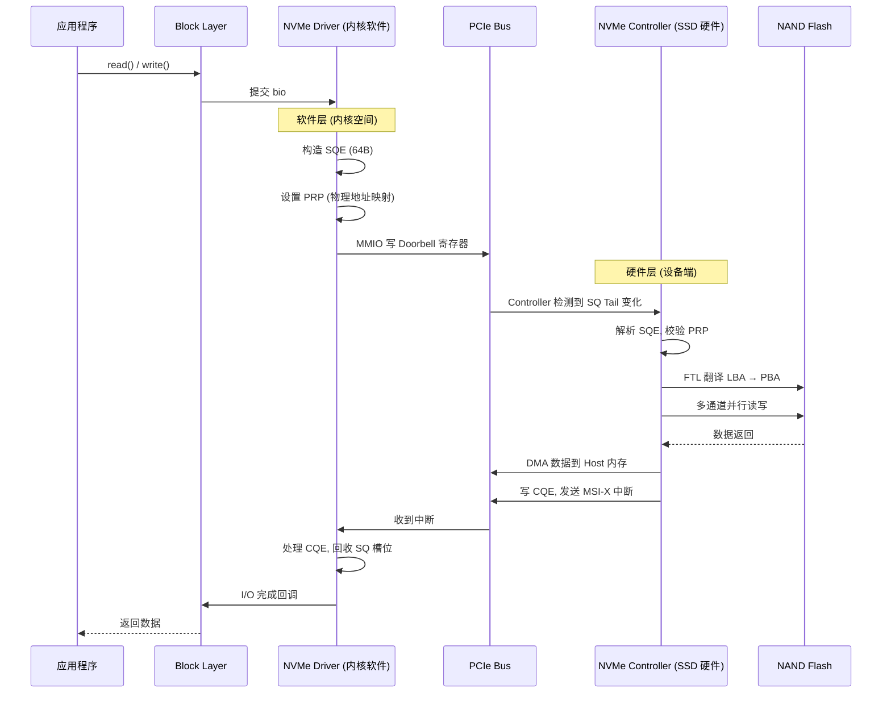
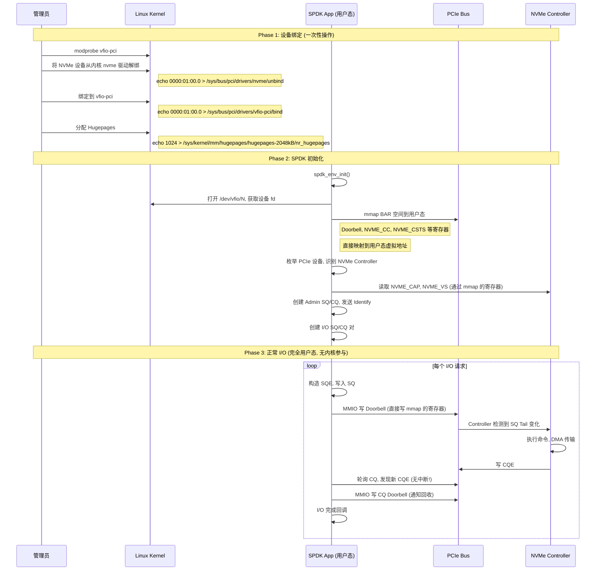

# NVMe Controller 定位与 SPDK 用户态直通分析

---

## 1. NVMe Controller 不是 Linux 内核组件

NVMe Controller 是 SSD 硬件上的物理组件（芯片 + 固件），运行在 PCIe 总线的设备端，不在 Linux 内核中。

### 1.1 架构定位

```
┌─────────────────────── Host (服务器) ───────────────────────┐
│                                                              │
│  ┌──────────────────────────────────────────────────────┐   │
│  │              Linux Kernel                              │   │
│  │                                                        │   │
│  │   ┌────────────┐    ┌──────────────┐   ┌──────────┐  │   │
│  │   │ Block Layer│───▶│ NVMe Driver  │──▶│ PCIe 驱动 │  │   │
│  │   └────────────┘    │  (软件)      │   └─────┬────┘  │   │
│  │                     └──────────────┘         │        │   │
│  └──────────────────────────────────────────────┼────────┘   │
│                                                  │            │
└──────────────────────────────────────────────────┼────────────┘
                                                   │ PCIe 总线
                                                   ▼
┌────────────────────── SSD 硬件设备 ──────────────────────────┐
│                                                              │
│   ┌──────────────────────────────────────────────────────┐   │
│   │           NVMe Controller (硬件芯片 + 固件)            │   │
│   │                                                        │   │
│   │   ┌───────────┐  ┌─────────┐  ┌───────────────────┐  │   │
│   │   │ Command   │  │   DMA   │  │      FTL          │  │   │
│   │   │ Processor │  │  Engine │  │ (Flash Translation│  │   │
│   │   │           │  │         │  │   Layer 固件)     │  │   │
│   │   └─────┬─────┘  └────┬────┘  └────────┬──────────┘  │   │
│   └─────────┼─────────────┼────────────────┼─────────────┘   │
│             │             │                │                   │
│   ┌─────────▼─────────────▼────────────────▼─────────────┐   │
│   │              NAND Flash (存储颗粒)                     │   │
│   │    Die 0    Die 1    Die 2    ...    Die N           │   │
│   └──────────────────────────────────────────────────────┘   │
└──────────────────────────────────────────────────────────────┘
```

### 1.2 核心区分

| | 位置 | 本质 | 职责 |
|---|---|---|---|
| **NVMe Driver** | Linux 内核 (`drivers/nvme/`) | 软件 | 构造 SQE、写 Doorbell、处理 CQE、向 Block Layer 报告完成 |
| **NVMe Controller** | SSD 硬件上 | 硬件 + 固件 | 解析命令、DMA 数据传输、FTL 地址翻译、磨损均衡、GC、管理 NAND |

### 1.3 两者协作关系



**总结**：NVMe Driver 是 Host 端的"翻译官"，把操作系统的 I/O 请求翻译成 NVMe 协议命令；NVMe Controller 是 SSD 端的"执行引擎"，接收命令后实际操作 NAND Flash。两者通过 PCIe 总线连接，分属不同设备。

---

## 2. SPDK 用户态直通 NVMe Controller

SPDK (Storage Performance Development Kit) 可以绕过 Linux 内核，在用户态直接操作 NVMe Controller，这是 SPDK 的核心设计目标。

### 2.1 传统路径 vs SPDK 路径

```
┌──────────────────── 传统路径 (内核 NVMe Driver) ────────────────────────┐
│                                                                         │
│  App ──▶ VFS ──▶ Block Layer ──▶ NVMe Driver ──▶ PCIe ──▶ Controller   │
│                                         ▲                               │
│                                  系统调用开销                              │
│                                  中断开销                                │
│                                  上下文切换                               │
│                                  内核锁竞争                               │
└─────────────────────────────────────────────────────────────────────────┘

┌──────────────────── SPDK 路径 (用户态直通) ─────────────────────────────┐
│                                                                         │
│  App ──▶ SPDK NVMe Driver (用户态) ──▶ PCIe (VFIO/UIO) ──▶ Controller  │
│             ▲                                                           │
│        零拷贝 · 无系统调用 · 无中断 · 纯轮询                              │
│                                                                         │
│  Linux Kernel: 只在初始化时将 PCIe 设备绑定到 VFIO/UIO, 之后不参与 I/O    │
└─────────────────────────────────────────────────────────────────────────┘
```

### 2.2 SPDK 直通架构

```
┌────────────────────── Host ─────────────────────────────────┐
│                                                              │
│  ┌──── User Space ───────────────────────────────────────┐  │
│  │                                                         │  │
│  │  ┌──────────┐  ┌───────────────────┐  ┌────────────┐  │  │
│  │  │ App      │  │ SPDK NVMe Driver  │  │ SPDK bdev  │  │  │
│  │  │ (iSCSI/  │─▶│ (用户态 NVMe 协议栈)│─▶│ Layer      │  │  │
│  │  │  vhost/  │  │                   │  │ (可选)     │  │  │
│  │  │  NVMe-oF)│  │ 直接操作:          │  └────────────┘  │  │
│  │  └──────────┘  │ - 构造 SQE        │                   │  │
│  │                │ - 映射 Doorbell   │                   │  │
│  │  ┌──────────┐  │   寄存器到用户态  │                   │  │
│  │  │ SPDK     │  │ - 轮询 CQE       │                   │  │
│  │  │ memzone  │  │ - PRP/DMA 直接   │                   │  │
│  │  │(hugepg)  │  │   读写           │                   │  │
│  │  └────┬─────┘  └────────┬──────────┘                   │  │
│  └───────┼────────────────┼───────────────────────────────┘  │
│          │ mmap           │ mmap (BAR 空间映射到用户态)       │
│  ────────┼────────────────┼────────────────────────────────── │
│  ┌──── Kernel Space ─────┼───────────────────────────────┐  │
│  │        │              │                               │  │
│  │  ┌─────▼─────┐  ┌────▼─────┐                         │  │
│  │  │ vfio-pci  │  │ uio_pci  │  只负责暴露设备给用户态   │  │
│  │  │           │  │ _generic │  不处理任何 I/O 请求      │  │
│  │  └─────┬─────┘  └────┬─────┘                         │  │
│  └────────┼──────────────┼────────────────────────────────┘  │
│          │  IOMMU        │                                   │
└──────────┼──────────────┼───────────────────────────────────┘
           ▼              ▼
┌───────────────── PCIe Bus ───────────────────────────────────────┐
│   ┌──────────────────────────────────────────────────────────┐   │
│   │              NVMe Controller (硬件)                        │   │
│   └──────────────────────────────────────────────────────────┘   │
└───────────────────────────────────────────────────────────────┘
```

### 2.3 SPDK 直通的核心机制

| 机制 | 说明 | 解决的问题 |
|------|------|-----------|
| **VFIO/UIO** | 将 PCIe 设备 BAR 空间 mmap 到用户态，Driver 直接读写寄存器 | 绕过内核驱动独占设备 |
| **Hugepages** | 所有 DMA Buffer 使用大页内存 (2MB) | 减少 TLB miss，保证内存物理连续 |
| **IOMMU** | 硬件地址翻译，控制 DMA 访问范围 | 用户态 DMA 安全隔离 |
| **轮询模式** | CPU 持续轮询 CQE，不使用中断 | 消除中断开销和上下文切换 |
| **零拷贝** | 应用 Buffer 直接作为 PRP DMA Buffer | 消除内核态↔用户态数据拷贝 |
| **CPU 绑定** | 将轮询线程绑定到独立核心 | 避免调度干扰，保证性能稳定 |

### 2.4 SPDK 初始化与直通操作流程



### 2.5 传统路径 vs SPDK 性能对比

```
┌────────────────────────────────────────────────────────────────────┐
│                   性能对比 (4K 随机读)                              │
│                                                                     │
│  指标              │  内核 NVMe Driver     │  SPDK 用户态直通        │
│  ─────────────────┼──────────────────────┼───────────────────────  │
│  系统调用/I/O      │  2 次 (submit+done)  │  0 次                   │
│  上下文切换/I/O    │  2-4 次              │  0 次                   │
│  中断              │  MSI-X 中断           │  无 (纯轮询)            │
│  DMA 内存          │  内核 slab 分配       │  Hugepage 预分配        │
│  数据拷贝          │  至少 1 次            │  0 次 (零拷贝)          │
│  IOPS              │  ~500K-1M            │  ~1M-10M+              │
│  延迟 (p99)        │  ~50-100 us          │  ~10-30 us             │
│                                                                     │
│  SPDK 的代价:                                                       │
│  - 需要绑定 CPU 核 (轮询线程独占核心, 无法复用)                       │
│  - 需要管理员权限 (VFIO 设备绑定)                                    │
│  - 应用需集成 SPDK API 或通过 vhost/bdev 暴露                        │
│  - 占用大量 Hugepages 内存                                          │
└────────────────────────────────────────────────────────────────────┘
```

---

## 3. 在 Ceph 中的应用

Ceph BlueStore 支持 SPDK 后端，适用于 NVMe 全闪场景：

```
┌──────────────────────────────────────────────────────────────┐
│                  Ceph OSD with SPDK 后端                      │
│                                                               │
│  ┌──────────┐  ┌──────────┐  ┌──────────────┐              │
│  │ Ceph OSD │  │ BlueStore│  │ SPDK bdev    │              │
│  │          │─▶│          │─▶│ (块设备抽象)  │              │
│  └──────────┘  └──────────┘  └──────┬───────┘              │
│                                      │                        │
│                          ┌───────────▼─────────────┐         │
│                          │ SPDK NVMe Driver (用户态)│         │
│                          └───────────┬─────────────┘         │
│                                      │ VFIO/UIO              │
│                          ┌───────────▼─────────────┐         │
│                          │ NVMe SSD (WAL/DB)       │         │
│                          │ NVMe SSD (Slow/Block)   │         │
│                          └─────────────────────────┘         │
└──────────────────────────────────────────────────────────────┘

优势:
  - OSD I/O 路径完全在用户态, 无内核切换开销
  - 多队列天然适配 Ceph 的 PG/OSD 并发模型
  - 显著提升 NVMe 全闪集群的 IOPS 和降低延迟
```

---

## 4. 总结

| 问题 | 结论 |
|------|------|
| NVMe Controller 在 Linux 内核中吗？ | **不在**。Controller 是 SSD 硬件上的芯片+固件，内核中只有 NVMe Driver（软件）与它通信 |
| SPDK 能直接操作 NVMe Controller 吗？ | **能**。SPDK 通过 VFIO/UIO 将 PCIe BAR 空间映射到用户态，在用户态重新实现了完整的 NVMe 协议栈，绕过内核直接与 Controller 交互 |
