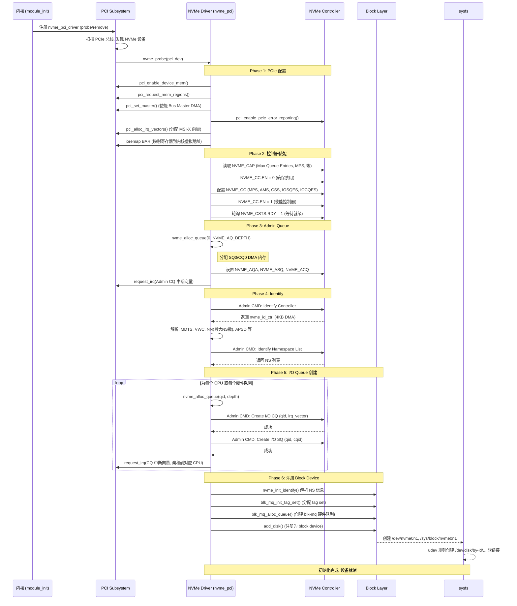
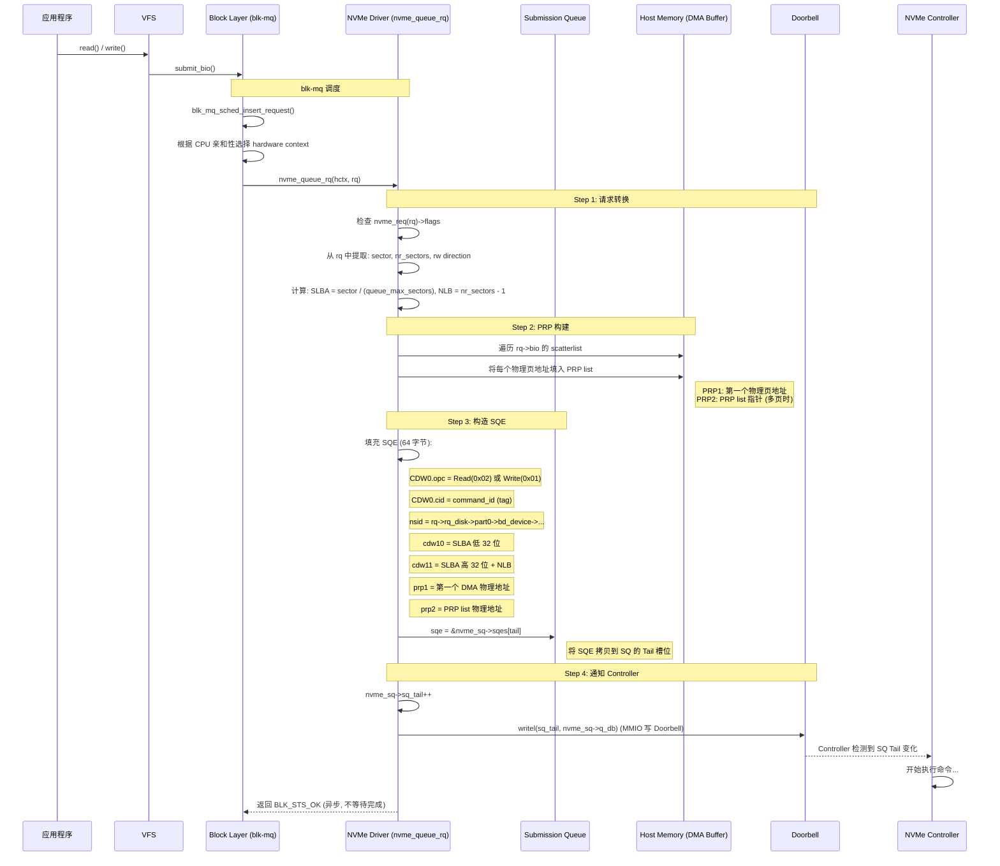
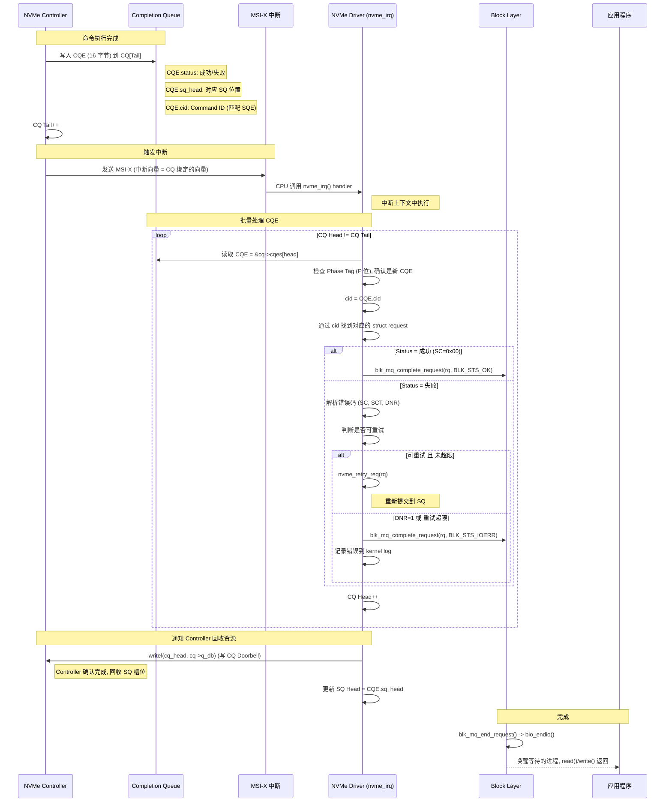
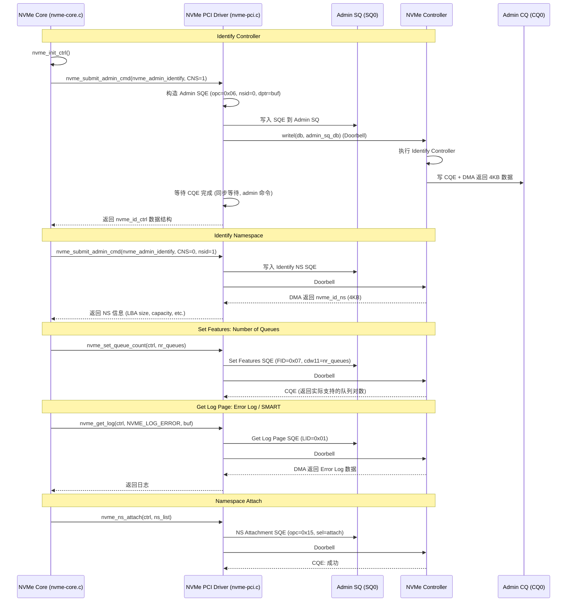
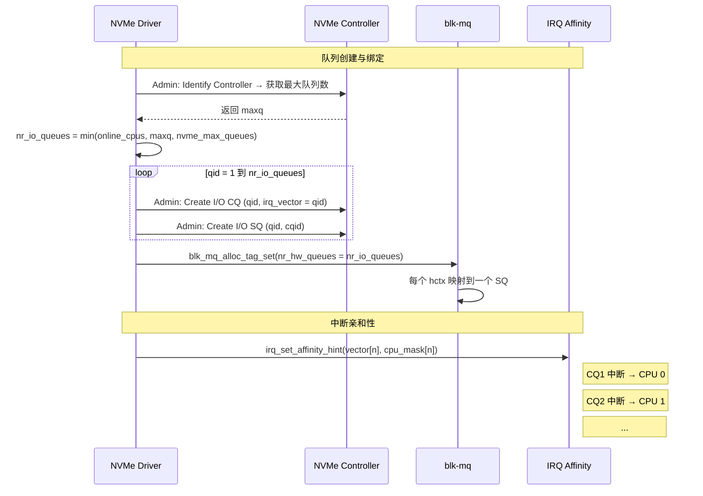
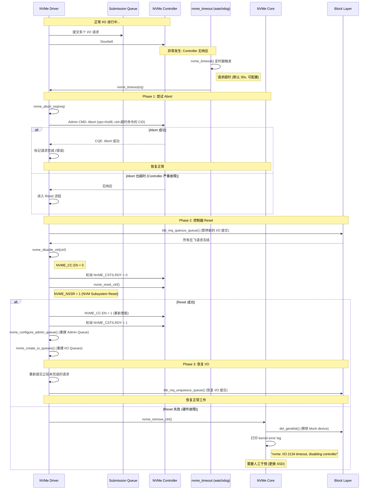
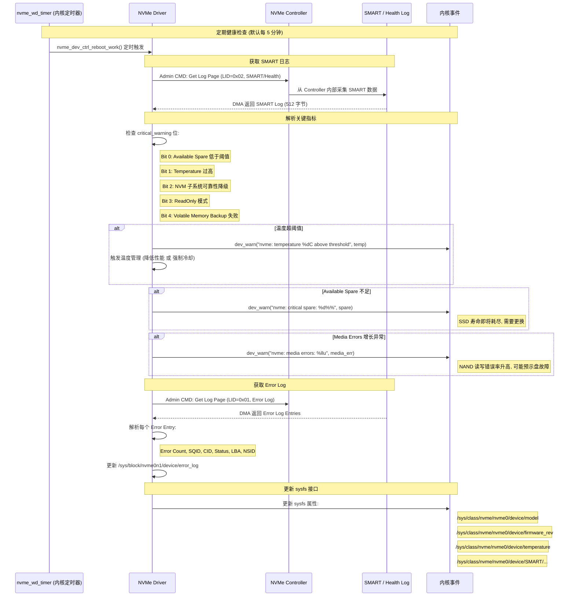
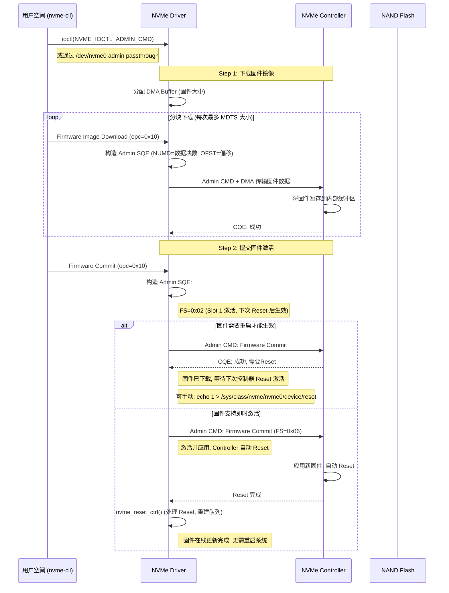
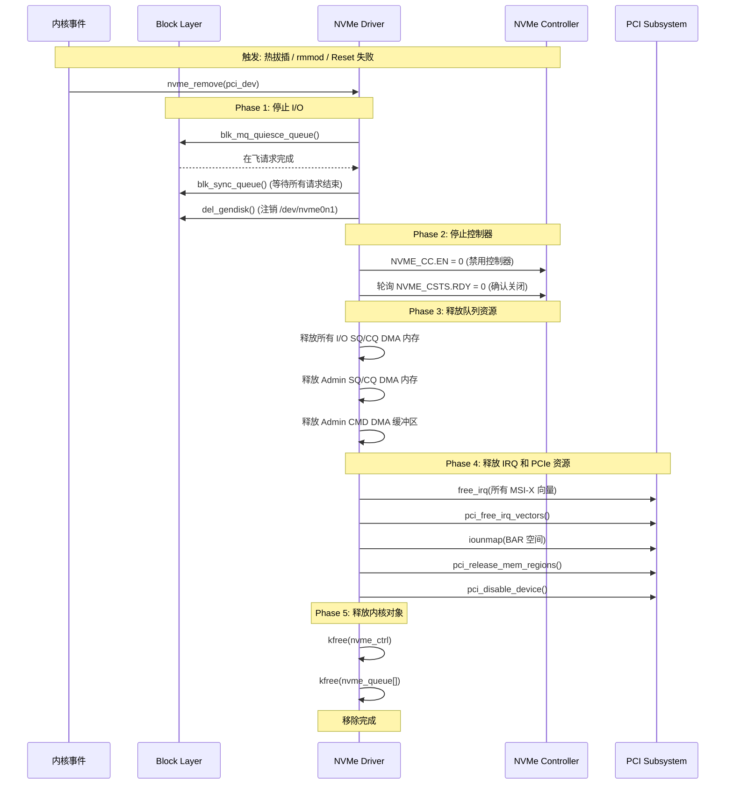

# Linux NVMe Driver 功能与时序流程分析

---

## 1. NVMe Driver 概述

Linux NVMe Driver 位于内核 `drivers/nvme/` 目录，是 Block Layer 与 NVMe Controller 之间的桥梁，承担请求转换、队列管理、控制器生命周期管理、错误恢复、健康监控等职责。

### 1.1 源码结构

```
drivers/nvme/
├── host/
│   ├── core.c            # 核心框架: 初始化, 注册, 管理
│   ├── pci.c             # PCIe 传输层: 探测, 映射, DB/中断
│   ├── Fabrics.c         # NVMe over Fabrics (TCP/RDMA) 框架
│   ├── tcp.c             # NVMe over TCP 传输层
│   ├── rdma.c            # NVMe over RDMA 传输层
│   └── nvme.h            # 内部数据结构定义
├── target/
│   └── ...               # NVMe Target (将本机作为 NVMe Controller)
└── common/
    └── ...               # Host/Target 共用代码
```

### 1.2 核心架构

```
┌─────────────────────────────────────────────────────────────────────┐
│                        Linux Kernel                                  │
│                                                                      │
│  ┌────────────┐    ┌─────────────┐    ┌──────────────────────────┐  │
│  │  VFS 层     │    │ Block Layer │    │     NVMe Driver          │  │
│  │  (ext4/     │───▶│ (blk-mq)   │───▶│                          │  │
│  │   xfs/...)  │    │ 多队列调度  │    │ ┌────────────────────┐  │  │
│  └────────────┘    └──────┬──────┘    │ │  nvme_pci_ctrl     │  │  │
│                          │           │ │  (PCIe 控制器实例)  │  │  │
│                          │           │ ├────────────────────┤  │  │
│                          │           │ │  nvme_queue (SQ)   │  │  │
│                          │           │ │  nvme_queue (CQ)   │  │  │
│                          │           │ ├────────────────────┤  │  │
│                          │           │ │  Admin Queue       │  │  │
│                          │           │ │  (SQ0 / CQ0)       │  │  │
│                          │           │ ├────────────────────┤  │  │
│                          │           │ │  blk-mq ops        │  │  │
│                          │           │ │  (与 Block Layer   │  │  │
│                          │           │ │   的对接接口)       │  │  │
│                          │           │ └────────────────────┘  │  │
│                          │           └──────────┬───────────────┘  │
│                          │                      │                    │
│                          │           ┌──────────▼───────────────┐  │
│                          │           │   PCIe Core (kernel)     │  │
│                          │           │   MMIO / MSI-X / DMA    │  │
│                          │           └──────────┬───────────────┘  │
└──────────────────────────────────────┼─────────────────────────────┘
                                       │ PCIe Bus
                                       ▼
                          ┌────────────────────────┐
                          │   NVMe Controller      │
                          │   (SSD 硬件)           │
                          └────────────────────────┘
```

---

## 2. 驱动加载与控制器初始化

驱动模块加载后，通过 PCI 子系统探测 NVMe 设备，完成从 PCIe 枚举到注册 block device 的全过程。



---

## 3. I/O 提交路径

这是 Driver 最核心的功能：将 Block Layer 的 `struct request` 转换为 NVMe SQE，提交给 Controller。



---

## 4. I/O 完成路径

Controller 完成命令后，通过 MSI-X 中断通知 Driver，Driver 处理 CQE 并通知 Block Layer。



---

## 5. Admin 命令处理

Admin 命令通过 SQ0/CQ0 发送，用于控制器管理和 Namespace 发现。



---

## 6. 多队列与 CPU 亲和性

NVMe Driver 通过 `blk-mq` 框架实现多队列与 CPU 核的绑定，消除锁竞争。

```
┌─────────────────────────────────────────────────────────────────────┐
│                 blk-mq + NVMe 多队列映射                             │
│                                                                      │
│   blk-mq 硬件上下文 (hctx)        NVMe SQ/CQ                       │
│   ─────────────────────────       ──────────────                    │
│                                                                      │
│   hctx0 (CPU 0)  ──────────────▶ SQ1 / CQ1 ──▶ MSI-X Vector 1    │
│   hctx1 (CPU 1)  ──────────────▶ SQ2 / CQ2 ──▶ MSI-X Vector 2    │
│   hctx2 (CPU 2)  ──────────────▶ SQ3 / CQ3 ──▶ MSI-X Vector 3    │
│   hctx3 (CPU 3)  ──────────────▶ SQ4 / CQ4 ──▶ MSI-X Vector 4    │
│   ...                               ...                             │
│                                                                      │
│   每个 CPU 核的 I/O 请求:                                           │
│   task_queue → softirq → hctx[n] → SQ[n] → Controller              │
│                                                                      │
│   无共享队列 → 无锁竞争 → 线性扩展                                   │
└─────────────────────────────────────────────────────────────────────┘
```

### 6.1 队列分配策略



---

## 7. 错误处理与控制器复位

当 Controller 出现异常（超时、错误率过高、PCIe 错误等），Driver 会执行复位流程恢复设备。



### 7.1 错误分级处理策略

```
┌─────────────────────────────────────────────────────────────────────┐
│                    NVMe Driver 错误分级策略                           │
│                                                                      │
│  Level 1: 请求级重试 (自动恢复)                                      │
│  ────────────────────────────                                       │
│  单个请求失败, SC != Generic Success                                 │
│  - 检查 DNR (Do Not Retry) 标志                                     │
│  - DNR=0: 最多重试 nvme_max_retries 次 (默认 3)                     │
│  - DNR=1: 直接上报错误, 不重试                                       │
│                                                                      │
│  Level 2: Abort 命令 (自动恢复)                                      │
│  ────────────────────────────                                       │
│  请求超时, Controller 可能卡住                                       │
│  - 发送 Admin Abort 命令 (opc=0x08)                                  │
│  - Abort 超时阈值: nvme_admin_timeout (默认 60s)                     │
│                                                                      │
│  Level 3: 控制器 Reset (自动恢复)                                    │
│  ────────────────────────────                                       │
│  Abort 失败 或 错误率超阈值                                         │
│  - nvme_reset_ctrl(): CC.EN=0 → NSSR=1 → CC.EN=1                   │
│  - 重建所有队列, 重新提交在飞请求                                     │
│  - 限制 Reset 频率 (防止 Reset 风暴)                                 │
│                                                                      │
│  Level 4: 移除设备 (需人工干预)                                      │
│  ────────────────────────────                                       │
│  Reset 失败 或 PCIe AER 严重错误                                     │
│  - del_gendisk(), 从系统中移除设备                                   │
│  - 内核日志告警, 触发硬件故障告警                                     │
└─────────────────────────────────────────────────────────────────────┘
```

---

## 8. 健康监控

Driver 定期通过 Admin 命令采集 SMART 数据，监控 SSD 健康状态。



### 8.1 sysfs 暴露的关键属性

```
/sys/class/nvme/nvme0/
├── device/
│   ├── model                    # 型号 (如 "Samsung SSD 980 PRO")
│   ├── serial                   # 序列号
│   ├── firmware_rev             # 固件版本
│   ├── temperature              # 当前温度 (毫摄氏度)
│   ├── SMART/
│   │   ├── critical_warning     # 关键告警位掩码
│   │   ├── available_spare      # 可用 spare 空间百分比
│   │   ├── percentage_used      # SSD 已使用寿命百分比
│   │   ├── data_units_read      # 读取数据量 (单位 512B)
│   │   ├── data_units_written   # 写入数据量
│   │   ├── host_reads           # 读取命令数
│   │   ├── host_writes          # 写入命令数
│   │   ├── power_cycles         # 电源开关次数
│   │   ├── power_on_hours       # 累计通电时间
│   │   ├── unsafe_shutdowns     # 非正常断电次数
│   │   └── media_errors         # 不可纠正的介质错误数
│   └── error_log/               # 最近的错误日志条目
└── nvme0n1/                     # Namespace (block device)
    └── ...
```

---

## 9. 固件更新流程

NVMe Driver 支持在不重启系统的情况下通过 Admin 命令在线更新 SSD 固件。



---

## 10. 移除与卸载流程

设备热拔或模块卸载时，Driver 需要安全清理所有资源。



---

## 11. 功能总结

| 功能模块 | 核心函数 | 作用 |
|---------|---------|------|
| **PCIe 探测与绑定** | `nvme_probe()` | 枚举 NVMe 设备, 映射 BAR, 分配 MSI-X |
| **控制器初始化** | `nvme_init_ctrl()` | 使能 Controller, Identify, 创建队列 |
| **请求转换与提交** | `nvme_queue_rq()` | bio → SQE 转换, PRP 构建, 写 Doorbell |
| **I/O 完成处理** | `nvme_irq()` → `nvme_process_cq()` | 读 CQE, 匹配请求, 错误处理, 通知 blk-mq |
| **队列管理** | `nvme_create_queue()` / `nvme_delete_queue()` | Admin 命令创建/删除 I/O Queue, CPU 亲和性 |
| **Admin 命令** | `nvme_submit_admin_cmd()` | Identify, Set/Get Features, Get Log Page |
| **错误恢复** | `nvme_timeout()` → `nvme_reset_ctrl()` | Abort → Reset → 移除, 分级错误处理 |
| **健康监控** | `nvme_get_log()` (定时器触发) | SMART 日志采集, 温度/寿命/错误率监控 |
| **固件更新** | `nvme_fw_download()` + `nvme_fw_commit()` | 在线固件下载与激活 |
| **设备移除** | `nvme_remove()` | 停止 I/O, 释放队列/IRQ/PCIe 资源 |
