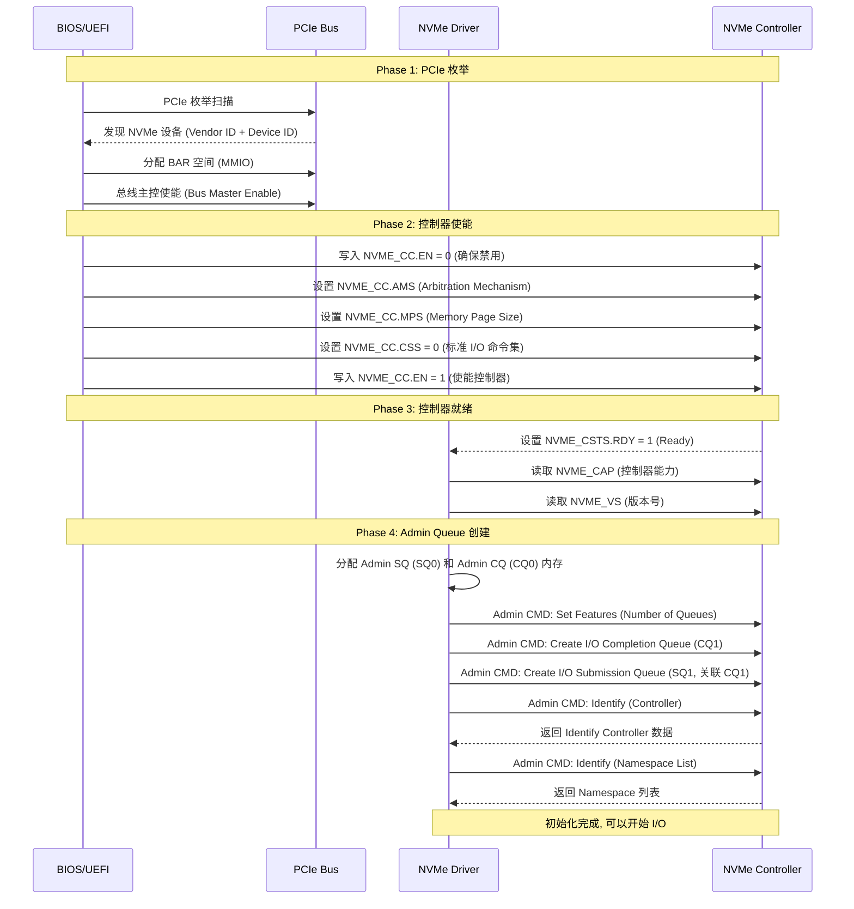
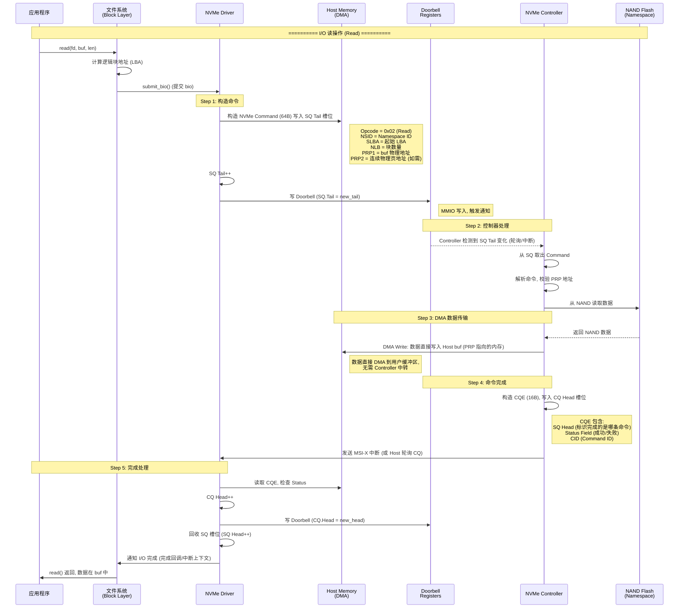
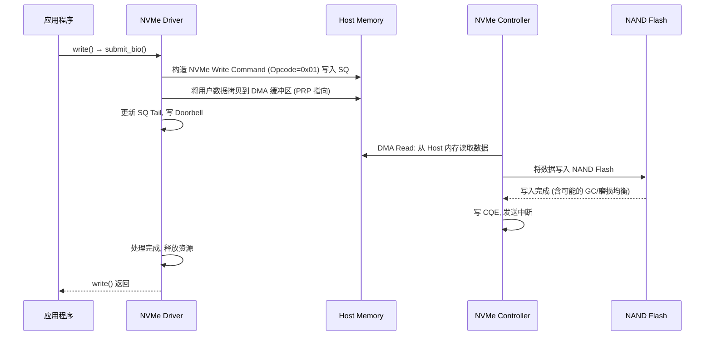
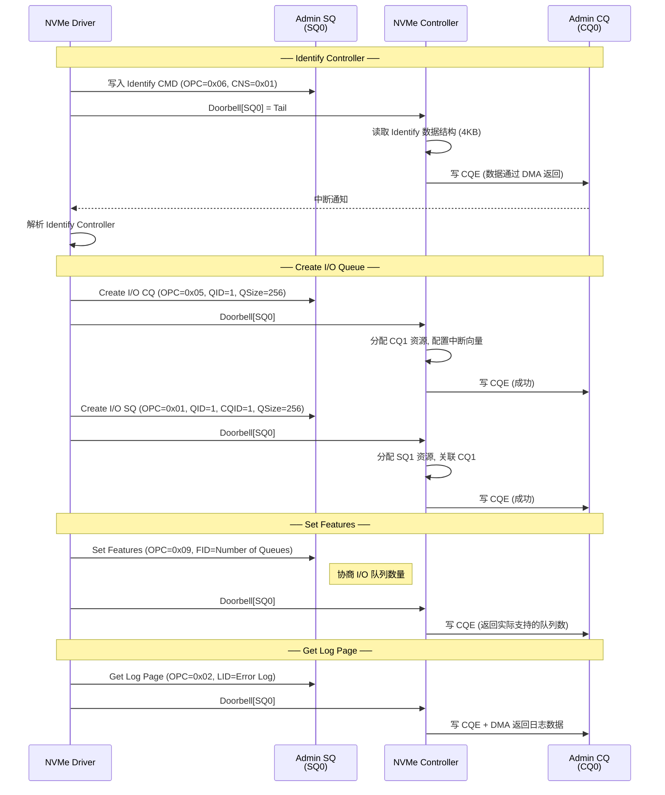
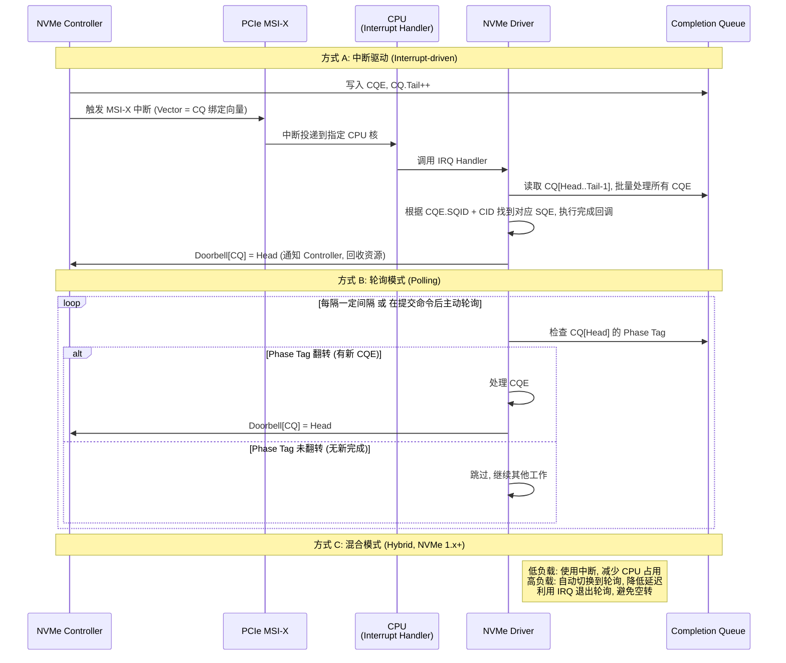
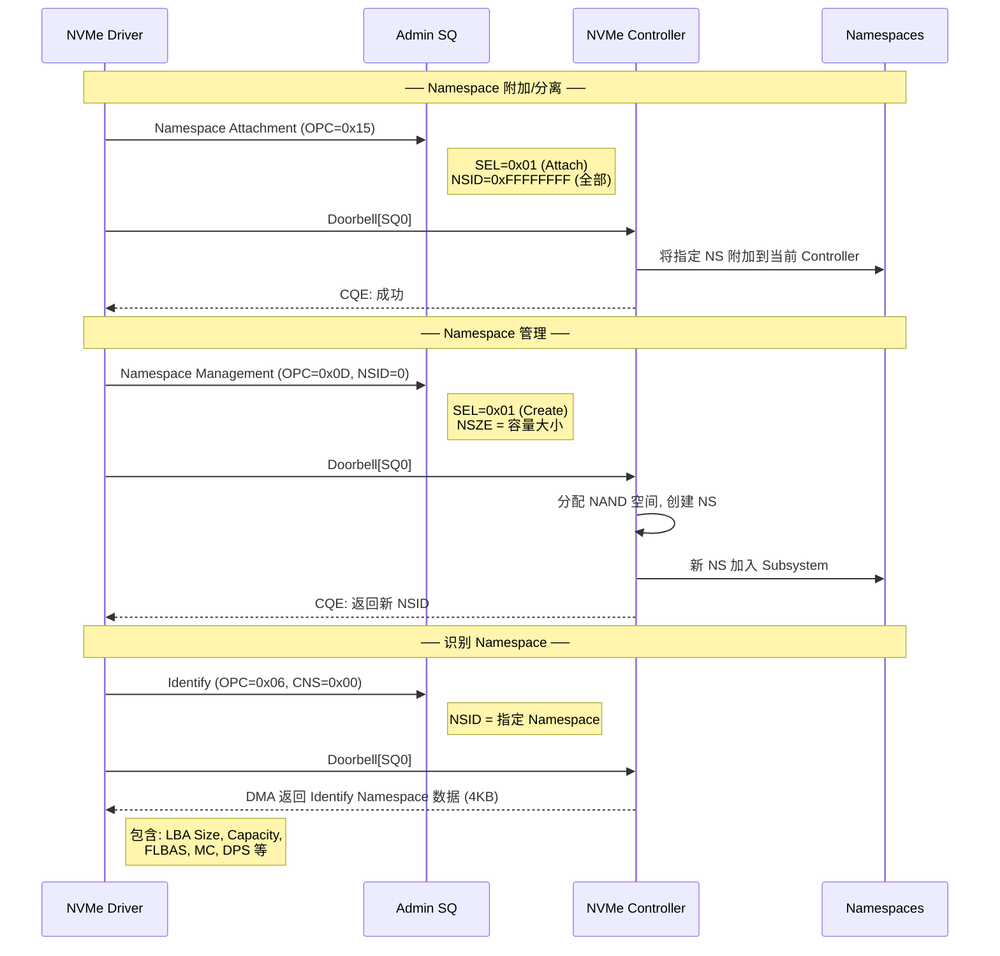
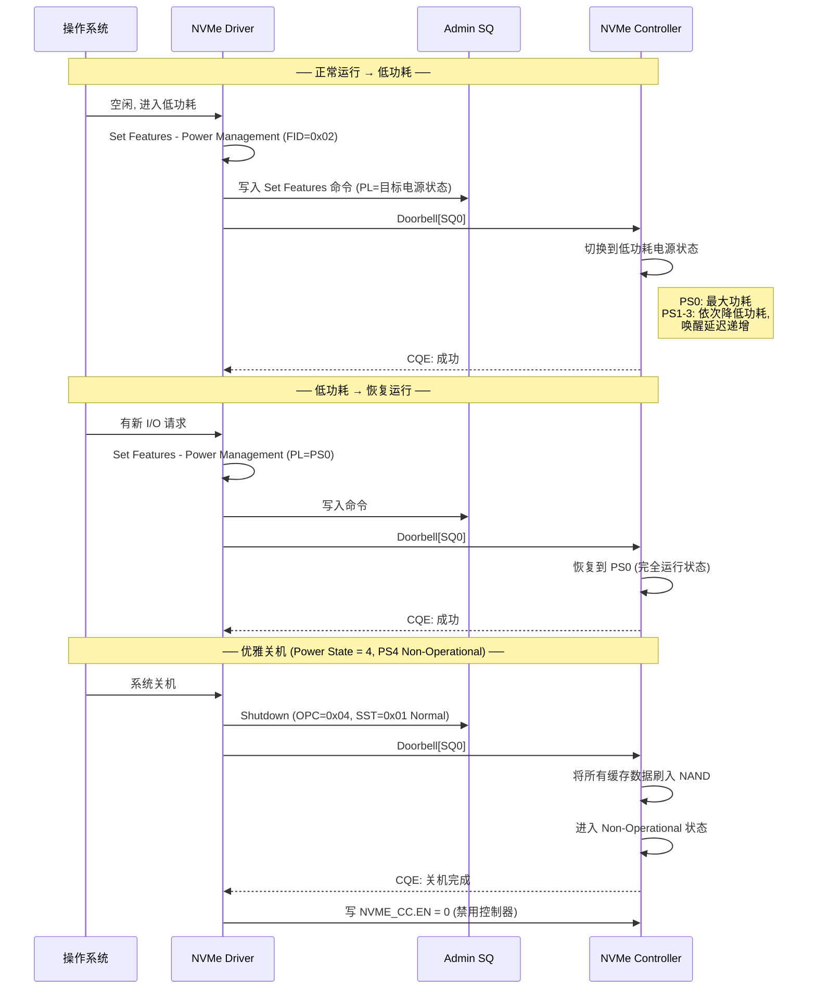

# NVMe 协议控制流程分析

---

## 1. NVMe 协议概述

NVMe (Non-Volatile Memory Express) 是面向 PCIe SSD 的高性能存储协议，核心设计目标是**充分利用 PCIe 带宽、降低 I/O 延迟**。

### 1.1 核心架构

```
┌─────────────────────────────────────────────────────────────────────┐
│                          NVMe 系统架构                               │
│                                                                      │
│  ┌────────────┐     ┌────────────────────────────────────────────┐  │
│  │   Host     │     │              NVMe Controller               │  │
│  │  (主机端)  │     │               (控制器端)                    │  │
│  │            │     │                                            │  │
│  │ ┌────────┐ │     │ ┌──────────────┐  ┌──────────────────────┐ │  │
│  │ │ NVMe   │ │     │ │  Admin Queue │  │     I/O Queues       │ │  │
│  │ │ Driver │ │     │ │  (SQ0/CQ0)   │  │  (SQ1~N/CQ1~N)     │ │  │
│  │ └───┬────┘ │     │ └──────┬───────┘  └──────────┬───────────┘ │  │
│  │     │      │     │        │                      │             │  │
│  │ ┌───▼────┐ │     │ ┌──────▼──────────────────────▼───────────┐ │  │
│  │ │ SQ/CQ  │◄├─────┤ │            Command Processor            │ │  │
│  │ │ Pairs  │ │PCIe │ └────────────────────┬──────────────────┘ │  │
│  │ └───┬────┘ │     │                      │                    │  │
│  │     │      │     │ ┌────────────────────▼──────────────────┐ │  │
│  │ ┌───▼────┐ │     │ │         NVMe Subsystem                │ │  │
│  │ │ Door-  │ │     │ │  ┌─────────┐ ┌──────────┐ ┌────────┐ │ │  │
│  │ │ bell   │ │     │ │  │   NS 0  │ │   NS 1   │ │  NS N  │ │ │  │
│  │ │ Ring   │ │     │ │  │(Namespace)│ │(Namespace)│ │(...)   │ │ │  │
│  │ └────────┘ │     │ │  └─────────┘ └──────────┘ └────────┘ │ │  │
│  └────────────┘     │ └───────────────────────────────────────┘ │  │
│                      └────────────────────────────────────────────┘  │
└─────────────────────────────────────────────────────────────────────┘
```

### 1.2 关键概念

| 概念 | 说明 |
|------|------|
| **SQ (Submission Queue)** | 提交队列，Host 将命令写入此队列，最多 64K 条 |
| **CQ (Completion Queue)** | 完成队列，Controller 将命令完成状态写入此队列 |
| **Admin SQ/CQ** | 管理队列（SQ0/CQ0），用于控制器管理命令，系统启动时必须存在 |
| **I/O SQ/CQ** | I/O 队列，用于数据读写，可动态创建/删除，最多 64K 对 |
| **Doorbell** | 门铃寄存器，Host 写入 DB 通知 Controller 有新命令 |
| **Namespace (NS)** | 命名空间，逻辑上的存储单元，类似 LUN |
| **PRP/SGL** | Physical Region Page / Scatter Gather List，描述数据缓冲区的物理地址 |

---

## 2. NVMe 初始化流程

系统上电后，Host 需要经过一系列步骤完成 NVMe 控制器的发现与初始化。



### 2.1 初始化关键寄存器

```
NVMe Controller 寄存器 (PCIe BAR 空间内):

  偏移      寄存器         作用
  ─────────────────────────────────────────
  0x0000    NVME_CAP       控制器能力 (最大队列深度, MPS 支持等)
  0x0014    NVME_VS        版本号
  0x0018    NVME_INTMS     中断掩码设置
  0x001C    NVME_INTMC     中断掩码清除
  0x0020    NVME_CC        控制器配置 (EN, MPS, AMS, CSS, IOCQES, IOSQES)
  0x0024    NVME_CSTS      控制器状态 (RDY, SHST, CFS)
  0x0028    NVME_NSSR      NVM Subsystem Reset
  0x0030    NVME_AQA       Admin Queue 属性 (SQ/CQ 大小)
  0x0038    NVME_ASQ       Admin SQ 物理基地址
  0x0040    NVME_ACQ       Admin CQ 物理基地址
  0x1000+   Doorbell       门铃寄存器 (每对 SQ/CQ 一个)
```

---

## 3. 标准 I/O 读写流程

NVMe I/O 的核心是 **基于 SQ/CQ 的门铃通知机制**，避免了传统 SCSI 协议的多次握手开销。



### 3.1 I/O 写操作流程

写操作与读操作类似，主要区别在于数据传输方向相反：



---

## 4. SQ/CQ 与门铃机制详解

### 4.1 队列数据结构

```
每个 Submission Queue Entry (SQE) = 64 Bytes:

┌──────────────────────────────────────────────────────────────┐
│  Byte 0-3:   CDW0                                            │
│    [7:0]     OPC  - 操作码 (Read=0x02, Write=0x01, ...)      │
│    [15:8]    FUSE - Fused Operation                           │
│    [23:16]   Reserved                                         │
│    [31:24]   CID  - Command ID (由 Host 分配, 用于匹配完成)    │
│                                                              │
│  Byte 4-7:   NSID - Namespace ID                             │
│  Byte 8-15:  Reserved                                        │
│  Byte 16-19: PRP1 - Physical Region Page 1 (数据缓冲区地址)    │
│  Byte 20-23: PRP2 - Physical Region Page 2 (连续页链表)       │
│  Byte 24-39: Reserved                                        │
│  Byte 40-43: CDW10 - 命令特有参数 (Read: 起始 LBA 低32位)      │
│  Byte 44-47: CDW11 - 命令特有参数 (Read: LBA 高32位 + 块数)    │
│  Byte 48-63: CDW12~15 - 命令特有参数                          │
└──────────────────────────────────────────────────────────────┘


每个 Completion Queue Entry (CQE) = 16 Bytes:

┌──────────────────────────────────────────────────────────────┐
│  Byte 0-2:   DW0 - 命令特有返回值                              │
│  Byte 3:     SF - Submission Queue Head pointer (高16位)       │
│  Byte 4-7:   SQHD - SQ Head (低16位) + SQ Identifier          │
│  Byte 8-11:  CID - Command ID (匹配 SQE 中的 CID)             │
│  Byte 12-15: Status                                          │
│    [0]       P    - Phase Tag (阶段翻转, 用于检测新 CQE)       │
│    [1]       SC   - Status Code                               │
│    [7:2]     SCT  - Status Code Type                          │
│    [15:8]    Reserved                                          │
└──────────────────────────────────────────────────────────────┘
```

### 4.2 Doorbell 通知时序

```
时间线 ──────────────────────────────────────────────────────────►

Host 端                          Controller 端
───────                          ──────────────

  ① 构造 SQE, 写入 SQ[Tail]
  ② SQ.Tail++
  ③ MMIO Write: Doorbell[SQn]
       │
       ├──────────────────────────► ④ 检测 Doorbell 更新
       │                           ⑤ 读取 SQ[Head..Tail-1]
       │                           ⑥ 执行命令
       │                           ⑦ DMA 数据传输
       │                           ⑧ 写 CQE 到 CQ[CQ.Tail]
       │                           ⑨ CQ.Tail++
       │  ◄── MSI-X 中断 ──────── ⑩ 发送中断
  ⑪ 读取 CQ[Head..Tail-1]
  ⑫ CQ.Head++
  ⑬ MMIO Write: Doorbell[CQn]
       │
       ├──────────────────────────► ⑭ 确认完成, 更新 SQ Head
       │                           ⑮ 回收 SQ 槽位
```

---

## 5. Admin 命令控制流程

Admin 命令通过专用的 Admin Queue (SQ0/CQ0) 发送，用于控制器管理。



### 5.1 主要 Admin 命令列表

| Opcode | 命令 | 功能 |
|--------|------|------|
| 0x01 | Create I/O SQ | 创建 I/O 提交队列 |
| 0x04 | Delete I/O SQ | 删除 I/O 提交队列 |
| 0x05 | Create I/O CQ | 创建 I/O 完成队列 |
| 0x08 | Delete I/O CQ | 删除 I/O 完成队列 |
| 0x06 | Identify | 获取控制器/Namespace 信息 |
| 0x09 | Set Features | 设置控制器特性 |
| 0x0A | Get Features | 获取控制器特性 |
| 0x02 | Get Log Page | 获取错误日志/SMART 信息 |
| 0x0C | Abort | 中止指定命令 |
| 0x08 | Firmware Commit | 提交固件更新 |
| 0x10 | Firmware Image Download | 下载固件镜像 |
| 0xFF | Namespace Management | Namespace Attach/Detach |
| 0x0E | Format NVM | 格式化 NVM (安全擦除) |

---

## 6. 中断处理流程

NVMe 支持 MSI-X 中断机制，每个 CQ 可独立绑定中断向量。



### 6.1 中断合并与亲和性

```
┌──────────────────────────────────────────────────────────────────┐
│                      中断优化策略                                  │
│                                                                   │
│  ① Interrupt Coalescing (中断合并):                                │
│     ─────────────────────────────────                              │
│     Controller 不每完成一个命令就中断                               │
│     而是等待多个命令完成 或 超时后批量通知                           │
│     Set Features: Interrupt Coalescing                            │
│     - AGG: 中断聚合时间阈值 (单位 100us)                           │
│     - THR: 中断聚合命令数阈值                                      │
│                                                                   │
│  ② Interrupt Vector Affinity (中断亲和性):                         │
│     ─────────────────────────────────                              │
│     每个 CQ 绑定一个 MSI-X 向量                                    │
│     操作系统将向量亲和到特定 CPU 核                                 │
│     实现多队列的 CPU 亲和性调度                                     │
│                                                                   │
│     CQ1 → MSI-X Vector 1 → CPU Core 0                             │
│     CQ2 → MSI-X Vector 2 → CPU Core 1                             │
│     CQ3 → MSI-X Vector 3 → CPU Core 2                             │
│     ...                                                            │
│                                                                   │
│  ③ 多队列减少锁竞争:                                               │
│     ─────────────────────────────────                              │
│     不同 CPU 核使用不同的 SQ/CQ                                    │
│     无需共享队列锁, 消除并发瓶颈                                    │
└──────────────────────────────────────────────────────────────────┘
```

---

## 7. Namespace 管理流程

Namespace 是 NVMe 中的逻辑存储单元，支持动态创建、附加、分离和删除。



---

## 8. 坚固状态电源管理 (PSM) 流程

NVMe 支持通过 Power State Management 实现电源状态切换。



---

## 9. NVMe 与 SCSI 协议对比

```
┌────────────────────────────────────────────────────────────────────┐
│                     NVMe vs SCSI/SAS 协议对比                       │
│                                                                     │
│  维度           │  SCSI/SAS              │  NVMe                   │
│  ──────────────┼────────────────────────┼─────────────────────────  │
│  传输层         │  SCSI over SAS/FC      │  直接 PCIe              │
│  命令深度       │  单队列, 32 深度        │  多队列, 64K 深度       │
│  命令开销       │  ~96 字节 (CDB)        │  64 字节 (SQE)          │
│  完成开销       │  Sense 数据 (~256B)    │  16 字节 (CQE)         │
│  通知机制       │  单中断, 需轮询         │  MSI-X 多向量          │
│  寄存器访问     │  IO 端口 (慢)           │  MMIO (内存映射, 快)   │
│  CPU 开销       │  每次访问 SCSI 层       │  驱动直接操作, 极低     │
│  最大队列数     │  1                      │  64K                    │
│  每队列深度     │  32                     │  64K                    │
│  地址映射       │  固定映射               │  PRP/SGL 灵活映射       │
└────────────────────────────────────────────────────────────────────┘
```

---

## 10. 端到端完整 I/O 路径

从应用程序到 NAND Flash 的完整数据通路：

```
┌─────────────────────────────────────────────────────────────────────────────┐
│                        NVMe 端到端 I/O 数据通路                              │
│                                                                              │
│  ┌──────────┐   ┌──────────────┐   ┌─────────────┐   ┌──────────────────┐   │
│  │ App      │   │ VFS/Block    │   │ NVMe Driver │   │ NVMe Controller  │   │
│  │ read()   │──▶│ Layer        │──▶│             │──▶│                  │   │
│  │ write()  │   │ (bio/req)    │   │ 构造 SQE    │   │ 解析命令         │   │
│  └──────────┘   └──────────────┘   │ PRP 映射    │   │ DMA 引擎         │   │
│                                    └──────┬──────┘   └────────┬─────────┘   │
│                                           │                    │             │
│                                           ▼                    ▼             │
│                                    ┌──────────────┐   ┌──────────────────┐   │
│                                    │ Host Memory  │   │ NAND Flash       │   │
│                                    │ (DMA Buffer) │◄──│ (FTL 翻译层)     │   │
│                                    │ PRP 描述     │──▶│ 多通道并行       │   │
│                                    └──────────────┘   └──────────────────┘   │
│                                                                              │
│  完成路径:                                                                    │
│  NAND → DMA → CQ → 中断/轮询 → Driver 完成回调 → Block Layer → App          │
└─────────────────────────────────────────────────────────────────────────────┘

各阶段延迟参考 (典型值):
  ┌─────────────────────────────┬──────────────┐
  │ 阶段                        │ 延迟          │
  ├─────────────────────────────┼──────────────┤
  │ VFS + Block Layer           │ ~1-2 us      │
  │ NVMe Driver (构造 SQE+DB)   │ ~0.5-1 us    │
  │ PCIe 传输 + Controller 解析  │ ~1-2 us      │
  │ NAND 读取 (4K)              │ ~15-100 us   │
  │ DMA 回传 + CQE + 中断       │ ~1-2 us      │
  ├─────────────────────────────┼──────────────┤
  │ 端到端总延迟 (4K Read)      │ ~20-110 us   │
  └─────────────────────────────┴──────────────┘
```

---

## 11. 关键设计总结

| 设计要点 | NVMe 方案 | 优势 |
|---------|----------|------|
| **多队列** | 最多 64K 对 SQ/CQ | 消除锁竞争, 充分利用多核 |
| **门铃通知** | MMIO 写 Doorbell 寄存器 | 单次寄存器写入即可提交命令, 极低开销 |
| **DMA 直传** | PRP/SGL 描述物理内存 | 数据直接在 App Buffer 和 SSD 间传输, 零拷贝 |
| **轻量命令** | 64B SQE + 16B CQE | 远小于 SCSI CDB + Sense Data |
| **MSI-X 多中断** | 每 CQ 独立中断向量 | 中断亲和到不同 CPU 核, 减少中断处理开销 |
| **PCIe 直连** | 无中间协议层 (无 SCSI) | 降低协议栈开销, 减少延迟 |
| **Phase Tag** | CQE Phase 翻转检测 | 无需额外的"有效"标志, 简化轮询逻辑 |
