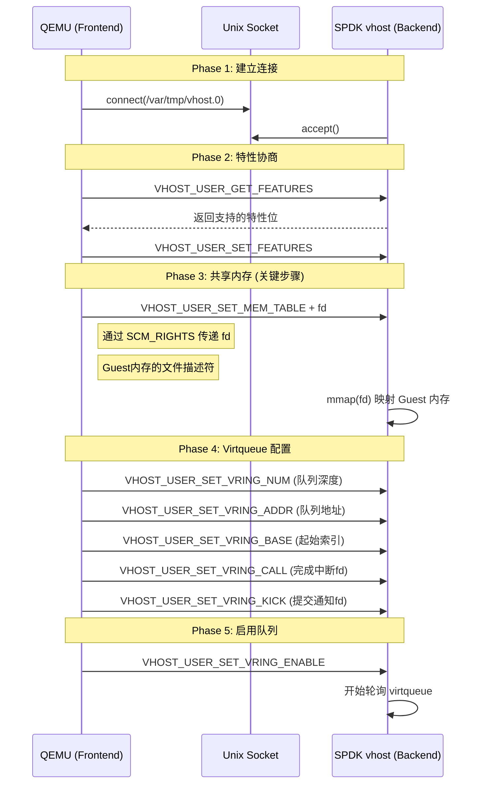
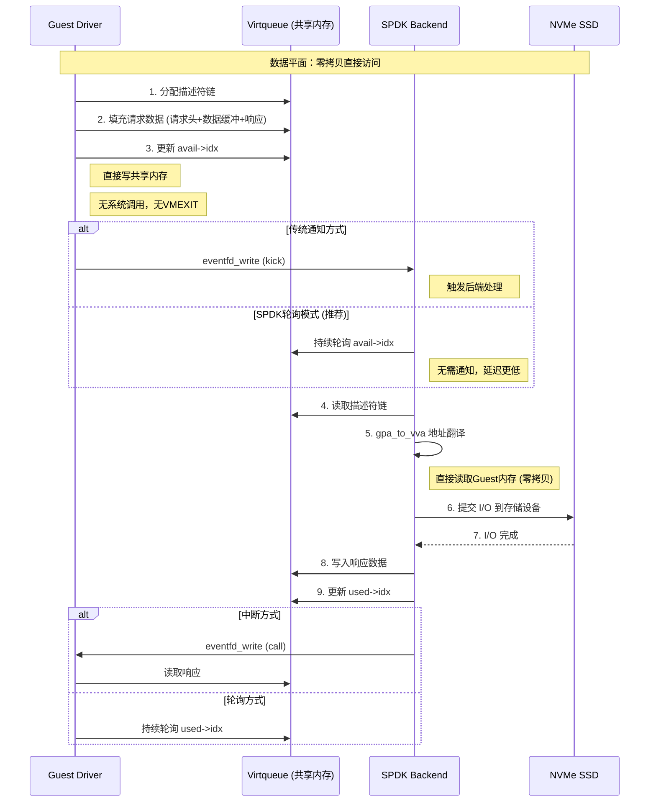

# SPDK Vhost-user 通信机制分析

## 1. 概述

**Vhost-user** 是一种用于进程间高性能通信的协议，专门设计用于高效共享 Virtio 设备的 virtqueue（虚拟队列）。它通过 **Unix Domain Socket** 传递文件描述符，实现 **共享内存** 的直接访问，是 SPDK 实现高性能存储 I/O 的核心技术之一。

### 1.1 设计目标

- **零拷贝**：数据直接在共享内存中传递，无需序列化/反序列化
- **零系统调用**：I/O 路径完全在用户态，无内核切换
- **零 VMEXIT**：SPDK 轮询模式避免虚拟机陷入
- **标准化**：基于 Virtio 规范，Guest 无需特殊驱动

### 1.2 应用场景

- **存储虚拟化**：SPDK vhost-blk、vhost-scsi
- **网络虚拟化**：DPDK vhost-net、OVS-DPDK
- **硬件加速**：vDPA (vHost Data Path Acceleration)

## 2. 架构概览

### 2.1 整体架构

```
┌─────────────────────────────────────────────────────────────┐
│                        Host System                           │
│  ┌──────────────┐                    ┌──────────────────┐   │
│  │    QEMU      │                    │   SPDK vhost     │   │
│  │   (Frontend) │                    │   (Backend)      │   │
│  │              │                    │                  │   │
│  │  Virtio PCI  │◄── Unix Socket ───►│  Vhost-user      │   │
│  │  Driver      │    (控制平面)       │  Server          │   │
│  │              │                    │                  │   │
│  │  ┌────────┐  │    共享内存        │  ┌────────────┐  │   │
│  │  │Virtqueue│◄──────────────────────►│ I/O处理    │  │   │
│  │  │(VRing)  │  │   (数据平面零拷贝)   │  (轮询模式) │  │   │
│  │  └────────┘  │                    │  └────────────┘  │   │
│  └──────────────┘                    └──────────────────┘   │
│         ▲                                    │              │
│         │ VM Entry/Exit                      │              │
│         ▼                                    ▼              │
│  ┌──────────────┐                    ┌──────────────────┐   │
│  │  Guest OS    │                    │   NVMe SSD       │   │
│  │  Virtio Driver│                   │   (存储后端)      │   │
│  └──────────────┘                    └──────────────────┘   │
└─────────────────────────────────────────────────────────────┘
```

### 2.2 通信平面分离

| 平面 | 通信方式 | 用途 |
|------|----------|------|
| **控制平面** | Unix Domain Socket | 特性协商、内存共享、队列配置 |
| **数据平面** | 共享内存直接访问 | I/O 请求/响应数据传输 |

### 2.3 角色定义

- **Frontend（前端）**：QEMU，共享 virtqueue 的一方
- **Backend（后端）**：SPDK，消费 virtqueue 的一方

## 3. 与普通 Socket 通信的对比

### 3.1 本质区别

| 特性 | 普通 Socket 通信 | Vhost-user 通信 |
|------|------------------|-----------------|
| **数据传输方式** | 数据拷贝经过内核缓冲区 | 共享内存，零拷贝直接访问 |
| **控制平面** | 所有数据通过socket | 仅配置/通知通过socket |
| **数据平面** | 每次I/O都经过socket | 直接读写共享内存 |
| **内存布局** | 独立地址空间 | 共享地址空间（mmap） |
| **同步机制** | read/write系统调用 | 原子操作+内存屏障 |
| **延迟** | 微秒级（内核切换） | 纳秒级（用户态直接访问） |
| **吞吐量** | 受限于socket缓冲区 | 仅受限于内存带宽 |
| **CPU开销** | 每次I/O需要系统调用 | 轮询模式无系统调用 |

### 3.2 数据流对比

```
普通 Socket 数据流:
┌────────┐    send()    ┌────────┐   内核拷贝   ┌────────┐
│ Client │ ───────────► │ Kernel │ ──────────► │ Server │
└────────┘              └────────┘             └────────┘
     │                       │                      │
     └───── 数据拷贝 ────────┴────── 数据拷贝 ───────┘
                    每次I/O两次拷贝

Vhost-user 数据流:
┌────────┐              ┌────────┐
│ Frontend│◄──共享内存──►│ Backend│
└────────┘              └────────┘
     │                       │
     └───── 零拷贝直接访问 ────┘
           同一块物理内存
```

### 3.3 性能对比

```
┌────────────────────────────────────────────────────────────────┐
│                    I/O 路径延迟对比                             │
├────────────────────────────────────────────────────────────────┤
│                                                                │
│  普通Socket (如 NBD/iSCSI):                                    │
│  Guest → VMEXIT → QEMU → socket send → 内核 → socket recv →    │
│  后端处理 → socket send → ... → VMEXIT → Guest                 │
│  延迟: ~50-100μs                                               │
│                                                                │
│  Vhost-user:                                                   │
│  Guest → 写共享内存 → SPDK直接读取(无VMEXIT) → 后端处理 →       │
│  写共享内存 → 中断Guest                                        │
│  延迟: ~5-10μs                                                 │
│                                                                │
│  Vhost-user + SPDK轮询模式:                                    │
│  Guest → 写共享内存 → SPDK轮询读取(无VMEXIT,无中断) → 处理 →    │
│  写共享内存 → Guest轮询读取                                     │
│  延迟: ~1-2μs                                                  │
│                                                                │
└────────────────────────────────────────────────────────────────┘
```


## 4. 协议时序流程

### 4.1 初始化阶段时序



### 4.2 I/O 数据路径时序



## 5. 核心技术实现

### 5.1 文件描述符传递（SCM_RIGHTS）

Vhost-user 通过 Unix Domain Socket 的 `SCM_RIGHTS` 机制传递文件描述符，实现内存共享：

```c
// Frontend (QEMU): 发送内存文件描述符
struct msghdr msg;
struct cmsghdr *cmsg;
struct iovec iov;
int fd = open("/dev/hugepages/guest_memory", O_RDWR);

// 设置消息头
memset(&msg, 0, sizeof(msg));
iov.iov_base = (void *)&memory_info;
iov.iov_len = sizeof(memory_info);
msg.msg_iov = &iov;
msg.msg_iovlen = 1;

// 设置辅助数据，传递 fd
msg.msg_control = control_buf;
msg.msg_controllen = CMSG_SPACE(sizeof(fd));
cmsg = CMSG_FIRSTHDR(&msg);
cmsg->cmsg_level = SOL_SOCKET;
cmsg->cmsg_type = SCM_RIGHTS;
cmsg->cmsg_len = CMSG_LEN(sizeof(fd));
memcpy(CMSG_DATA(cmsg), &fd, sizeof(fd));

sendmsg(socket_fd, &msg, 0);
```

```c
// Backend (SPDK): 接收并映射内存
struct msghdr msg;
struct cmsghdr *cmsg;
int fd;

recvmsg(socket_fd, &msg, 0);

// 从辅助数据中提取 fd
cmsg = CMSG_FIRSTHDR(&msg);
if (cmsg->cmsg_level == SOL_SOCKET && 
    cmsg->cmsg_type == SCM_RIGHTS) {
    memcpy(&fd, CMSG_DATA(cmsg), sizeof(fd));
}

// 映射到本地地址空间
void *mem = mmap(NULL, size, PROT_READ|PROT_WRITE, 
                 MAP_SHARED, fd, 0);
```

### 5.2 地址翻译（GPA → VVA）

由于 Guest 和 Backend 使用不同的虚拟地址空间，需要进行地址翻译：

```c
// Guest Physical Address → Vhost Virtual Address
void *gpa_to_vva(struct vhost_memory_region *regions, 
                 int nregions, uint64_t gpa, uint64_t size) {
    for (int i = 0; i < nregions; i++) {
        uint64_t region_start = regions[i].guest_phys_addr;
        uint64_t region_end = region_start + regions[i].size;
        
        if (gpa >= region_start && 
            gpa + size <= region_end) {
            // 计算偏移并转换为本地虚拟地址
            uint64_t offset = gpa - region_start;
            return (void *)(regions[i].user_addr + offset);
        }
    }
    return NULL;  // 地址不在共享内存区域
}
```

### 5.3 内存区域结构

```c
// 内存区域描述
struct vhost_memory_region {
    uint64_t guest_phys_addr;  // Guest 物理地址
    uint64_t memory_size;      // 区域大小
    uint64_t userspace_addr;   // 映射后的用户态地址
    uint64_t mmap_offset;      // mmap 偏移
};

// 整体内存布局
struct vhost_memory {
    uint32_t nregions;         // 区域数量 (最大8个)
    uint32_t padding;
    struct vhost_memory_region regions[8];
};
```


### 5.4 Virtqueue 数据结构

```c
// Virtqueue 描述符
struct vring_desc {
    uint64_t addr;    // Guest 物理地址
    uint32_t len;     // 数据长度
    uint16_t flags;   // 标志位 (NEXT/WRITE/INDIRECT)
    uint16_t next;    // 下一个描述符索引
};

// 可用环 (Guest 写，Backend 读)
struct vring_avail {
    uint16_t flags;     // 标志
    uint16_t idx;       // 下一个可用槽位
    uint16_t ring[];    // 描述符索引数组
};

// 已用环 (Backend 写，Guest 读)
struct vring_used_elem {
    uint32_t id;    // 描述符链头索引
    uint32_t len;   // 写入字节数
};

struct vring_used {
    uint16_t flags;
    uint16_t idx;
    struct vring_used_elem ring[];
};
```

## 6. Vhost-user 协议消息

### 6.1 消息类型

| 消息类型 | 值 | 说明 |
|----------|-----|------|
| VHOST_USER_GET_FEATURES | 1 | 获取设备特性 |
| VHOST_USER_SET_FEATURES | 2 | 设置特性 |
| VHOST_USER_SET_OWNER | 3 | 设置设备所有者 |
| VHOST_USER_SET_MEM_TABLE | 5 | 设置内存映射表 (关键) |
| VHOST_USER_SET_VRING_NUM | 8 | 设置队列深度 |
| VHOST_USER_SET_VRING_ADDR | 9 | 设置队列地址 |
| VHOST_USER_SET_VRING_BASE | 10 | 设置起始索引 |
| VHOST_USER_GET_VRING_BASE | 11 | 获取当前索引 |
| VHOST_USER_SET_VRING_KICK | 12 | 设置提交通知fd |
| VHOST_USER_SET_VRING_CALL | 13 | 设置完成中断fd |
| VHOST_USER_SET_VRING_ENABLE | 18 | 启用/禁用队列 |

### 6.2 消息格式

```c
struct vhost_user_msg {
    enum vhost_user_request request;  // 消息类型
    uint32_t flags;                   // 标志 (VERSION/REPLY)
    uint32_t size;                    // 负载大小
    union {
        uint64_t u64;
        struct vhost_vring_state state;
        struct vhost_vring_addr addr;
        struct vhost_memory_padded memory;
    } payload;
} __attribute((packed));
```

### 6.3 特性位

| 特性位 | 说明 |
|--------|------|
| VIRTIO_BLK_F_SIZE_MAX | 最大段大小 |
| VIRTIO_BLK_F_SEG_MAX | 最大段数 |
| VIRTIO_BLK_F_MQ | 多队列支持 |
| VIRTIO_RING_F_EVENT_IDX | 事件索引优化 |
| VHOST_USER_F_PROTOCOL_FEATURES | 协议特性支持 |

## 7. SPDK 优化实现

### 7.1 轮询模式

SPDK 使用轮询模式替代中断，避免 VMEXIT 和上下文切换：

```c
// SPDK vhost 轮询循环
static int
vhost_poll(void *arg)
{
    struct spdk_vhost_dev *vdev = arg;
    struct spdk_vhost_virtqueue *vq;
    uint16_t i, count;

    for (i = 0; i < vdev->num_queues; i++) {
        vq = &vdev->virtqueue[i];
        
        // 直接读取共享内存中的可用环
        uint16_t avail_idx = vq->vring.avail->idx;
        
        // 批量处理请求
        count = 0;
        while (vq->last_avail_idx != avail_idx && count < MAX_BATCH) {
            // 获取描述符
            uint16_t desc_idx = vq->vring.avail->ring[vq->last_avail_idx % vq->vring.size];
            
            // 处理 I/O 请求 (零拷贝)
            process_io_request(vdev, vq, desc_idx);
            
            vq->last_avail_idx++;
            count++;
        }
    }
    
    return count > 0 ? SPDK_POLLER_BUSY : SPDK_POLLER_IDLE;
}
```

### 7.2 无锁通知抑制

```c
// 设置 VRING_USED_F_NO_NOTIFY 标志
// 告诉 Guest 不需要每次都 kick
vq->vring.used->flags = VRING_USED_F_NO_NOTIFY;

// 使用事件索引进一步优化
if (virtio_dev_has_feature(vdev, VIRTIO_RING_F_EVENT_IDX)) {
    // 精确控制何时需要通知
    vhost_vring_call(vq);
}
```

### 7.3 批量处理

```c
// 批量提交 I/O
#define MAX_BATCH 32

struct spdk_bdev_io *ios[MAX_BATCH];
int count = 0;

// 收集一批请求
while (count < MAX_BATCH && has_pending_requests()) {
    ios[count++] = prepare_io_request();
}

// 批量提交
for (int i = 0; i < count; i++) {
    spdk_bdev_readv(bdev, ch, iovs, iovcnt, 
                    offset, nbytes, cb, arg);
}
```

## 8. 性能数据

### 8.1 典型性能指标

| 指标 | 传统 Virtio | Vhost-user | Vhost-user + 轮询 |
|------|-------------|------------|-------------------|
| I/O 延迟 | 50-100μs | 5-10μs | 1-2μs |
| 4K 随机读 IOPS | ~100K | ~500K | ~2M+ |
| CPU 利用率 | 100% | ~50% | ~30% |
| VMEXIT 次数/I/O | 2-4次 | 0-1次 | 0次 |

### 8.2 优化效果

```
┌───────────────────────────────────────────────────────────┐
│                   性能优化效果对比                          │
├───────────────────────────────────────────────────────────┤
│                                                           │
│  传统 Virtio (QEMU 处理):                                 │
│  ┌─────┐    VMEXIT    ┌─────┐   系统调用   ┌─────┐        │
│  │Guest│ ──────────► │ QEMU │ ──────────► │Kernel│        │
│  └─────┘              └─────┘              └─────┘        │
│  延迟: 高，CPU开销大                                      │
│                                                           │
│  Vhost-user (SPDK 处理):                                  │
│  ┌─────┐  写共享内存  ┌─────┐   直接访问   ┌─────┐        │
│  │Guest│ ──────────► │ VRing│ ◄─────────► │SPDK │         │
│  └─────┘              └─────┘              └─────┘        │
│  延迟: 低，零拷贝，无VMEXIT                               │
│                                                           │
│  Vhost-user + Polling:                                    │
│  ┌─────┐  写共享内存  ┌─────┐   轮询读取   ┌─────┐        │
│  │Guest│ ──────────► │ VRing│ ◄─────────► │SPDK │         │
│  └─────┘              └─────┘              └─────┘        │
│  延迟: 极低，完全绕过 QEMU/KVM 开销                       │
│                                                           │
└───────────────────────────────────────────────────────────┘
```


## 9. 使用示例

### 9.1 SPDK Vhost 配置

```bash
# 1. 分配大页内存
HUGEMEM=4096 scripts/setup.sh

# 2. 启动 SPDK vhost 应用
build/bin/vhost -S /var/tmp -m 0x3

# 3. 创建存储后端
scripts/rpc.py bdev_malloc_create 64 512 -b Malloc0

# 4. 创建 vhost-blk 设备
scripts/rpc.py vhost_create_blk_controller --cpumask 0x1 vhost.0 Malloc0
```

### 9.2 QEMU 启动参数

```bash
qemu-system-x86_64 \n    --enable-kvm \n    -cpu host -smp 2 \n    -m 1G \n    # 关键：使用共享内存
    -object memory-backend-file,id=mem0,size=1G,mem-path=/dev/hugepages,share=on \n    -numa node,memdev=mem0 \n    # vhost-blk 设备
    -chardev socket,id=char0,path=/var/tmp/vhost.0 \n    -device vhost-user-blk-pci,chardev=char0,num-queues=2
```

### 9.3 关键配置说明

| 配置项 | 说明 |
|--------|------|
| `memory-backend-file,share=on` | 启用内存共享，必须设置 |
| `mem-path=/dev/hugepages` | 使用大页内存，提升性能 |
| `num-queues` | 队列数，建议等于 vCPU 数 |
| `cpumask` | SPDK 绑定的 CPU 核心掩码 |

## 10. 与其他通信机制对比

### 10.1 与 vhost-kernel 对比

| 特性 | vhost-kernel | vhost-user |
|------|--------------|------------|
| 后端位置 | 内核态 | 用户态 |
| 开发难度 | 需要内核开发 | 用户态开发更容易 |
| 灵活性 | 受限于内核接口 | 完全自定义 |
| 性能 | 高 | 更高 (SPDK轮询) |
| 适用场景 | 标准虚拟化 | 高性能存储/网络 |

### 10.2 与 vfio-user 对比

| 特性 | vhost-user | vfio-user |
|------|------------|-----------|
| 协议基础 | Vhost 协议 | VFIO 协议 |
| 设备模拟 | Virtio 设备 | PCI 设备 |
| DMA 支持 | 通过内存映射 | 完整 IOMMU 支持 |
| 适用场景 | Virtio 设备 | 硬件设备直通 |

### 10.3 通信方式总览

```
┌────────────────────────────────────────────────────────────┐
│                    通信方式选择指南                          │
├────────────────────────────────────────────────────────────┤
│                                                            │
│  普通 Socket:                                              │
│  ✓ 简单易用                                                │
│  ✓ 跨机器通信                                              │
│  ✗ 性能较低                                                │
│  适用: 管理接口、低吞吐场景                                 │
│                                                            │
│  Unix Domain Socket:                                       │
│  ✓ 同机高性能                                              │
│  ✓ 支持fd传递                                              │
│  ✗ 仅限同机                                                │
│  适用: 本地IPC、控制平面                                    │
│                                                            │
│  共享内存 (Vhost-user):                                    │
│  ✓ 零拷贝                                                  │
│  ✓ 极低延迟                                                │
│  ✓ 标准化接口                                              │
│  适用: 高性能存储/网络虚拟化                                │
│                                                            │
│  RDMA:                                                     │
│  ✓ 跨机器零拷贝                                            │
│  ✓ 极高吞吐                                                │
│  ✗ 需要专用硬件                                            │
│  适用: 分布式存储、高性能计算                               │
│                                                            │
└────────────────────────────────────────────────────────────┘
```

## 11. 总结

### 11.1 Vhost-user 核心优势

1. **零拷贝数据传输**：通过共享内存实现真正的零拷贝
2. **零系统调用**：I/O 路径完全在用户态
3. **零 VMEXIT**：SPDK 轮询模式避免虚拟机陷入
4. **标准化接口**：基于 Virtio 规范，Guest 无需修改
5. **灵活后端**：支持 SPDK、DPDK、OVS 等多种后端

### 11.2 与普通 Socket 的本质区别

| 方面 | 普通 Socket | Vhost-user |
|------|-------------|------------|
| 通信模型 | 消息传递 | 共享内存 |
| 数据拷贝 | 每次通信都拷贝 | 零拷贝 |
| 同步机制 | 系统调用 | 原子操作 |
| 适用场景 | 通用通信 | 高性能 I/O |

### 11.3 最佳实践

1. 使用大页内存减少 TLB miss
2. 队列数匹配 vCPU 数
3. 绑定 CPU 亲和性
4. 启用 SPDK 轮询模式
5. 合理配置 NUMA

---
