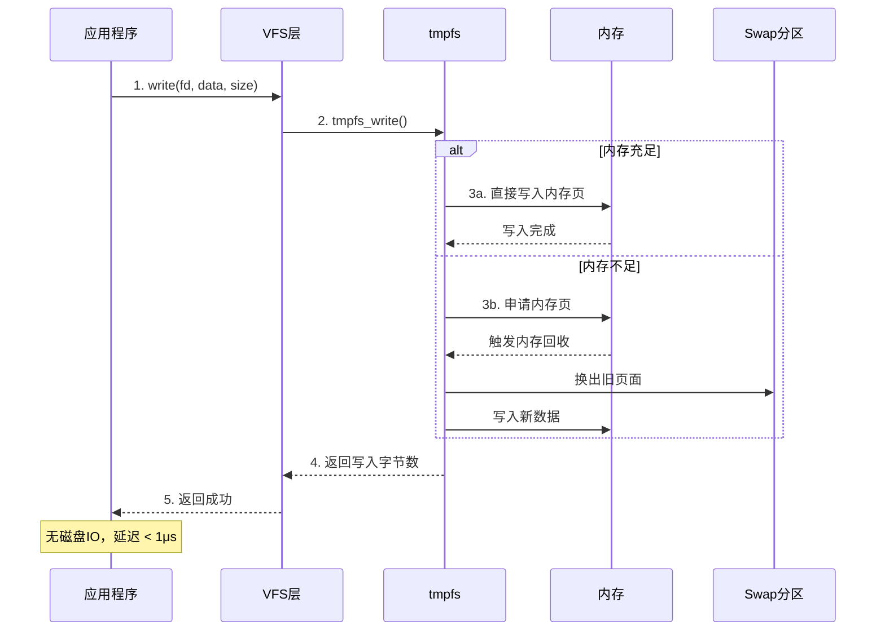
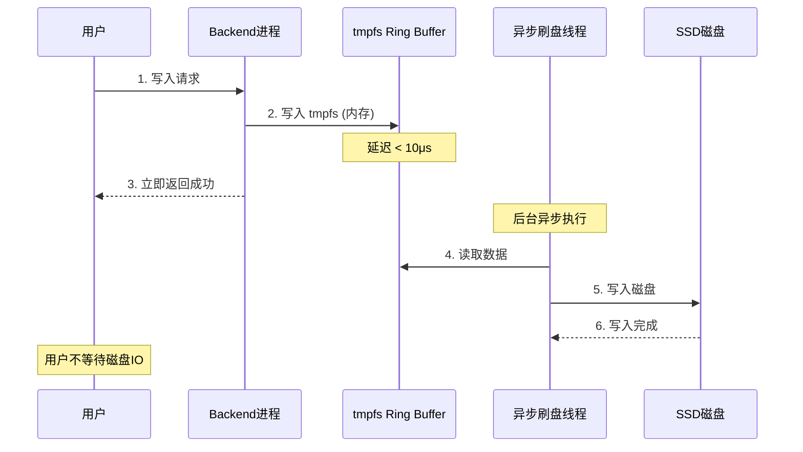

# tmpfs 内存文件系统介绍

## 1. 概述

tmpfs 是一种**基于内存的临时文件系统**，数据存储在 RAM 中，读写速度极快，但重启后数据丢失。

```
┌─────────────────────────────────────────────────────────────────────────┐
│                          tmpfs 核心特点                                   │
├─────────────────────────────────────────────────────────────────────────┤
│                                                                          │
│  存储位置:  内存 (RAM) + 可能的 Swap                                     │
│  持久化:    无 (重启后数据丢失)                                           │
│  读写速度:  极快 (~GB/s 级别)                                            │
│  延迟:      < 1μs                                                        │
│  空间大小:  动态分配，最大受内存限制                                       │
│  典型用途:  临时文件、缓存、IPC 通信                                      │
│                                                                          │
└─────────────────────────────────────────────────────────────────────────┘
```

---

## 2. 与普通文件系统对比

| 特性 | tmpfs | 磁盘文件系统 (ext4/xfs) |
|------|-------|------------------------|
| **存储介质** | 内存 | 磁盘 (SSD/HDD) |
| **读写速度** | ~GB/s | ~100MB/s - ~3GB/s (NVMe) |
| **延迟** | < 1μs | ~100μs - ~1ms |
| **持久化** | 重启丢失 | 持久保存 |
| **空间成本** | 消耗内存 | 消耗磁盘 |
| **适用场景** | 临时数据、缓存 | 永久数据 |

---

## 3. 内部机制

```
┌─────────────────────────────────────────────────────────────────────────┐
│                        tmpfs 内存管理机制                                 │
├─────────────────────────────────────────────────────────────────────────┤
│                                                                          │
│  用户写入文件                                                             │
│       │                                                                  │
│       ▼                                                                  │
│  ┌─────────────────────────────────────────────────────────────────┐   │
│  │                        tmpfs                                     │   │
│  │                                                                  │   │
│  │   文件 → 页缓存 (Page Cache)                                     │   │
│  │           │                                                      │   │
│  │           ├──▶ 内存充足 → 直接存入 RAM                            │   │
│  │           │                                                      │   │
│  │           └──▶ 内存不足 → 换出到 Swap                             │   │
│  │                                                                  │   │
│  │   特点:                                                          │   │
│  │   ├── 文件内容始终在页缓存中                                       │   │
│  │   ├── 不会写回磁盘 (除非换出)                                      │   │
│  │   └── 空间动态增长，用多少占多少                                    │   │
│  │                                                                  │   │
│  └─────────────────────────────────────────────────────────────────┘   │
│                                                                          │
└─────────────────────────────────────────────────────────────────────────┘
```

### 关键设计

| 设计点 | 说明 |
|--------|------|
| **页缓存** | 文件内容直接存储在内核页缓存中 |
| **动态分配** | 写入时才分配内存，不预分配 |
| **Swap 支持** | 内存不足时可换出到 Swap 分区 |
| **零拷贝** | 支持 mmap，减少数据拷贝 |

---

## 4. 读写流程时序图



---

## 5. Linux 系统中的典型使用

### 5.1 查看现有 tmpfs 挂载

```bash
$ df -h | grep tmpfs

tmpfs           7.8G   1.2M  7.8G   1% /run
tmpfs           7.8G     0  7.8G   0% /dev/shm
tmpfs           5.0M     0  5.0M   0% /run/lock
tmpfs           7.8G     0  7.8G   0% /sys/fs/cgroup
```

### 5.2 各挂载点用途

| 挂载点 | 用途 | 典型大小 |
|--------|------|----------|
| `/run` | 系统运行时数据 (PID文件、socket) | 内存 50% |
| `/dev/shm` | POSIX 共享内存 (进程间通信) | 内存 50% |
| `/tmp` | 临时文件 (某些系统) | 可配置 |
| `/run/lock` | 锁文件 | 5MB |

---

## 6. 创建和使用 tmpfs

### 6.1 挂载 tmpfs

```bash
# 创建挂载点
sudo mkdir -p /mnt/mytmpfs

# 挂载 tmpfs，限制最大 1GB
sudo mount -t tmpfs -o size=1G,mode=1777 tmpfs /mnt/mytmpfs

# 挂载选项说明:
# -t tmpfs     : 指定文件系统类型
# -o size=1G   : 最大使用 1GB 内存
# -o mode=1777 : 权限设置 (类似 /tmp)
```

### 6.2 性能测试

```bash
# 写入测试
$ dd if=/dev/zero of=/mnt/mytmpfs/test bs=1M count=100
100+0 records in
100+0 records out
104857600 bytes (105 MB) copied, 0.05 s, 2.0 GB/s  # 极快!

# 读取测试
$ dd if=/mnt/mytmpfs/test of=/dev/null bs=1M
100+0 records in
100+0 records out
104857600 bytes (105 MB) copied, 0.02 s, 4.8 GB/s  # 更快!
```

### 6.3 查看内存占用

```bash
$ free -h
              total        used        free      shared
Mem:           16G        1.2G        14G        100M

# tmpfs 占用计入 used 和 shared 列
```

### 6.4 卸载 (数据丢失)

```bash
sudo umount /mnt/mytmpfs
```

---

## 7. 大小限制配置

### 7.1 配置选项

```
┌─────────────────────────────────────────────────────────────────────────┐
│                        tmpfs 挂载选项                                     │
├─────────────────────────────────────────────────────────────────────────┤
│                                                                          │
│  size=N        : 最大使用 N 字节内存 (默认: 内存的一半)                    │
│  nr_blocks=N   : 最大块数                                                │
│  nr_inodes=N   : 最大 inode 数量 (文件数限制)                             │
│  mode=NNN      : 权限模式                                                │
│  uid=N         : 所有者 UID                                              │
│  gid=N         : 所有者 GID                                              │
│                                                                          │
│  示例:                                                                    │
│  mount -t tmpfs -o size=2G,nr_inodes=100k,mode=1777 tmpfs /mydata       │
│                                                                          │
└─────────────────────────────────────────────────────────────────────────┘
```

### 7.2 大小单位

| 单位 | 含义 |
|------|------|
| `k` | KB |
| `M` | MB |
| `G` | GB |
| `%` | 物理内存百分比 |

### 7.3 动态调整大小

```bash
# 运行时调整 tmpfs 大小
sudo mount -o remount,size=2G /mnt/mytmpfs

# 查看当前大小
$ df -h /mnt/mytmpfs
Filesystem      Size  Used Avail Use% Mounted on
tmpfs           2.0G     0  2.0G   0% /mnt/mytmpfs
```

---

## 8. tmpfs vs ramfs

| 特性 | tmpfs | ramfs |
|------|-------|-------|
| **大小限制** | 可设置上限 | 无上限 (可能耗尽内存) |
| **Swap 支持** | 可换出到 Swap | 不会换出 |
| **显示大小** | df 可见 | df 显示为 0 |
| **内存回收** | 支持 | 不支持 |
| **推荐使用** | ✅ 推荐 | ⚠️ 特殊场景 |

**警告：** ramfs 无大小限制，可能耗尽所有内存导致系统崩溃。

---

## 9. 在 CDS 存储系统中的应用

### 9.1 Ring Buffer 使用 tmpfs

```
┌─────────────────────────────────────────────────────────────────────────┐
│                   CDS 中 tmpfs Ring Buffer 的使用                        │
├─────────────────────────────────────────────────────────────────────────┤
│                                                                          │
│  用户写入请求                                                             │
│       │                                                                  │
│       ▼                                                                  │
│  ┌─────────────────────────────────────────────────────────────────┐   │
│  │                    tmpfs Ring Buffer                             │   │
│  │                                                                  │   │
│  │   优点:                                                          │   │
│  │   ├── 写入延迟 < 10μs (内存速度)                                  │   │
│  │   ├── 避免磁盘IO阻塞                                              │   │
│  │   ├── 支持 mmap 零拷贝                                           │   │
│  │   └── 后台异步刷盘                                                │   │
│  │                                                                  │   │
│  │   数据流:                                                         │   │
│  │   用户数据 → tmpfs → 异步刷盘 → SSD                               │   │
│  │              (内存)      (后台)                                   │   │
│  │                                                                  │   │
│  └─────────────────────────────────────────────────────────────────┘   │
│                                                                          │
└─────────────────────────────────────────────────────────────────────────┘
```

### 9.2 为什么用 tmpfs 而不是直接内存

| 方案 | 优点 | 缺点 |
|------|------|------|
| **直接内存** | 最快 | 需要自己管理、不支持文件接口 |
| **tmpfs** | 文件接口、支持 mmap、内核管理 | 略有开销 |
| **磁盘文件** | 持久化 | 慢 (~1ms) |

### 9.3 写入流程



---

## 10. 典型应用场景

### 10.1 应用场景列表

| 场景 | 说明 | 示例 |
|------|------|------|
| **临时文件** | 程序运行时临时数据 | `/tmp` |
| **进程间通信** | 共享内存 IPC | `/dev/shm` |
| **缓存** | 高速缓存存储 | Redis 可用 |
| **运行时数据** | PID 文件、Socket | `/run` |
| **数据库 Buffer** | 减少磁盘延迟 | CDS Ring Buffer |
| **容器存储** | 容器临时层 | Docker tmpfs mount |

### 10.2 Docker 中使用 tmpfs

```bash
# Docker 挂载 tmpfs
docker run -d \
  --tmpfs /app/cache:size=100M,mode=1777 \
  myapp

# docker-compose 示例
version: '3'
services:
  app:
    image: myapp
    tmpfs:
      - /app/cache:size=100M
```

### 10.3 数据库中使用 tmpfs

```sql
-- MySQL 临时表使用 tmpfs
[mysqld]
tmpdir = /mnt/tmpfs/mysql

-- PostgreSQL 临时表
temp_tablespaces = '/mnt/tmpfs/pgsql'
```

---

## 11. 注意事项

### 11.1 风险与建议

| 风险 | 说明 | 建议 |
|------|------|------|
| **数据丢失** | 重启后数据消失 | 只存临时数据 |
| **内存耗尽** | 写入过多导致 OOM | 设置 size 上限 |
| **Swap 影响** | 可能换出到 Swap | 监控 Swap 使用 |
| **权限问题** | 多用户访问冲突 | 设置正确权限 |

### 11.2 监控命令

```bash
# 查看 tmpfs 使用情况
df -h | grep tmpfs

# 查看详细内存使用
cat /proc/meminfo | grep -i shmem

# 查看具体 tmpfs 挂载信息
findmnt -t tmpfs

# 监控 tmpfs 文件变化
watch -n 1 'df -h /mnt/mytmpfs'
```

---

## 12. 总结

| 问题 | 答案 |
|------|------|
| **存储位置** | 内存 (可换出到 Swap) |
| **速度** | 极快，接近内存带宽 (~GB/s) |
| **延迟** | < 1μs |
| **持久化** | 无，重启丢失 |
| **大小限制** | 可配置，默认内存一半 |
| **适用场景** | 临时文件、缓存、IPC、高速缓冲 |
| **注意事项** | 控制大小，避免耗尽内存，不存重要数据 |

---
