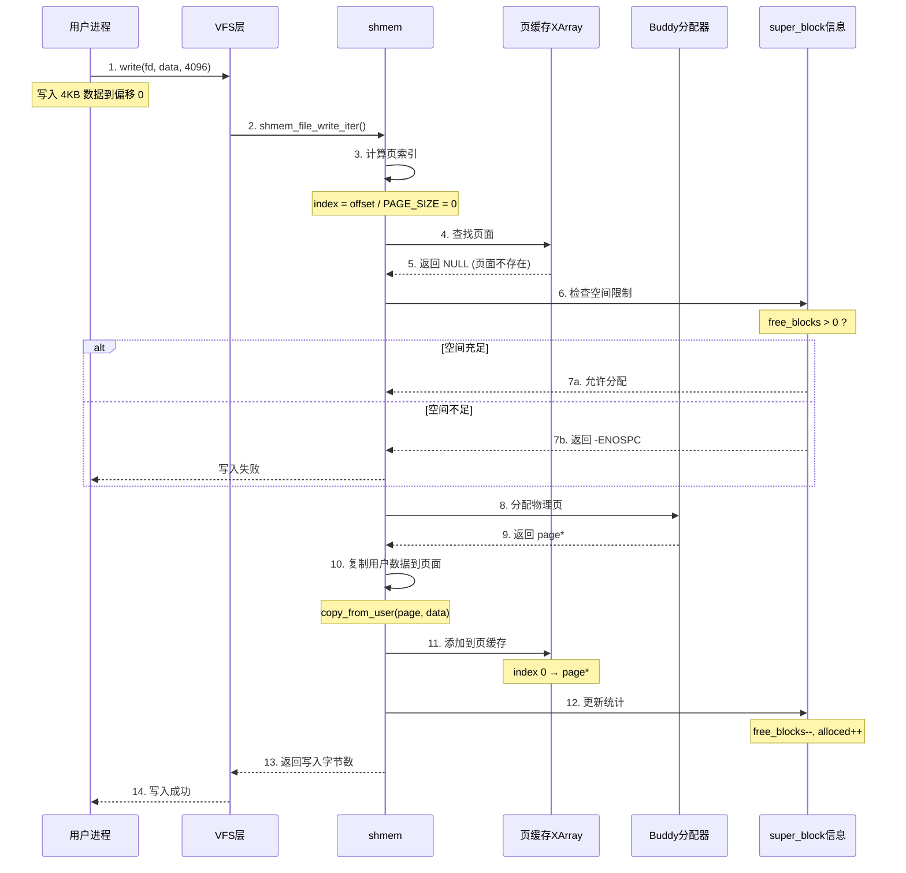
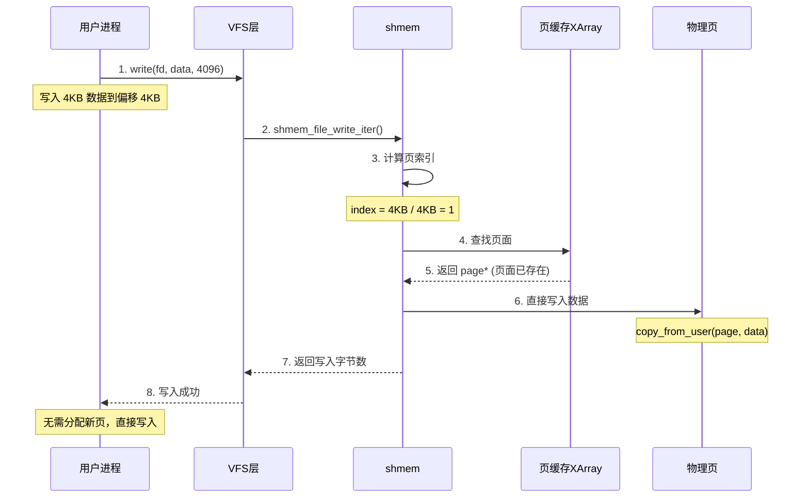
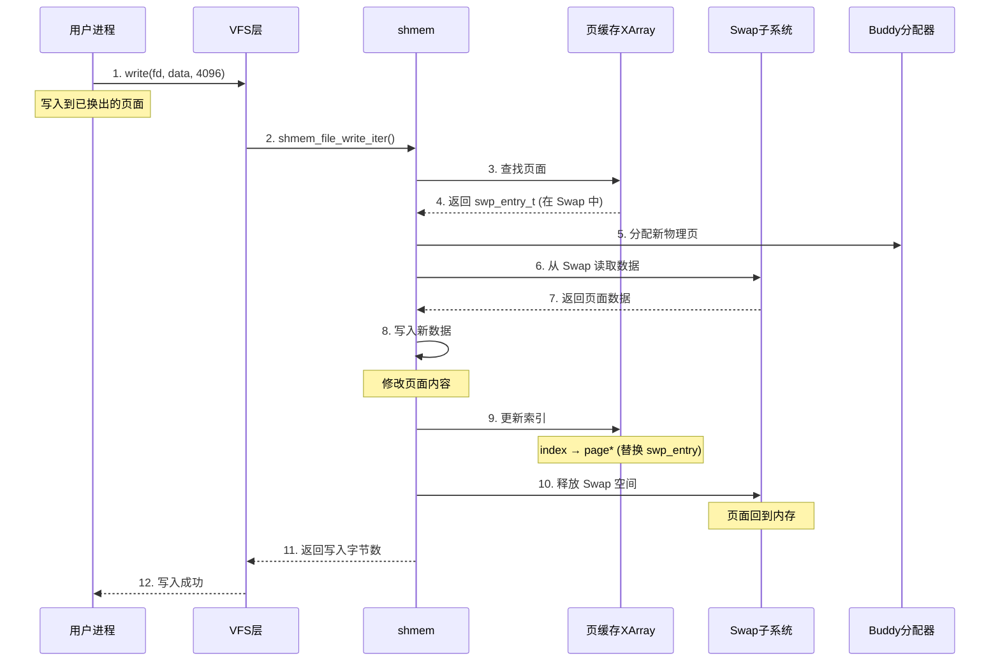
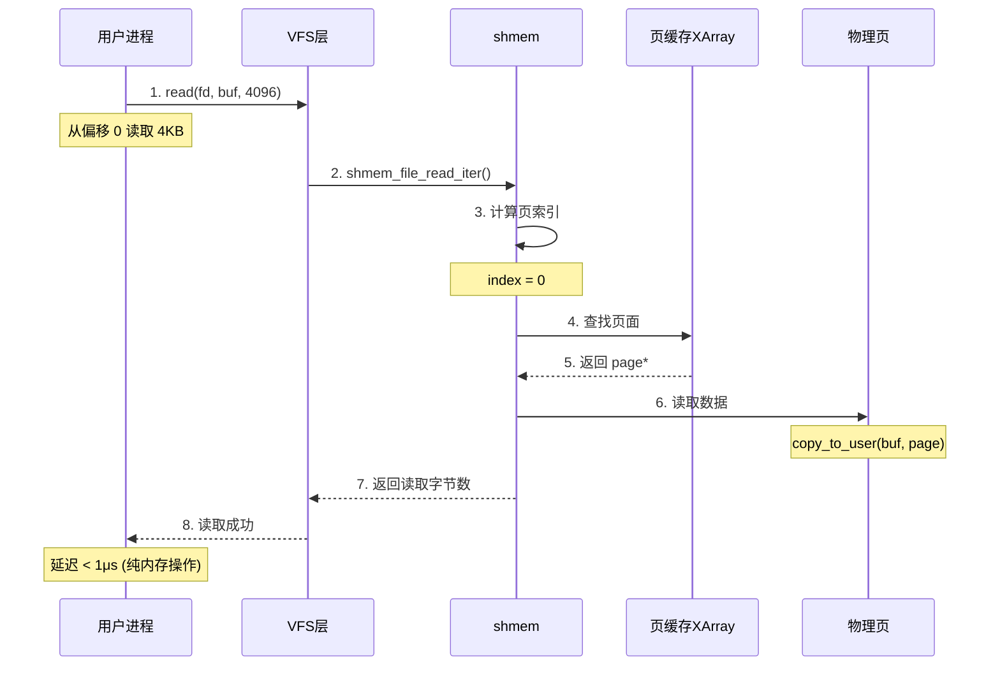
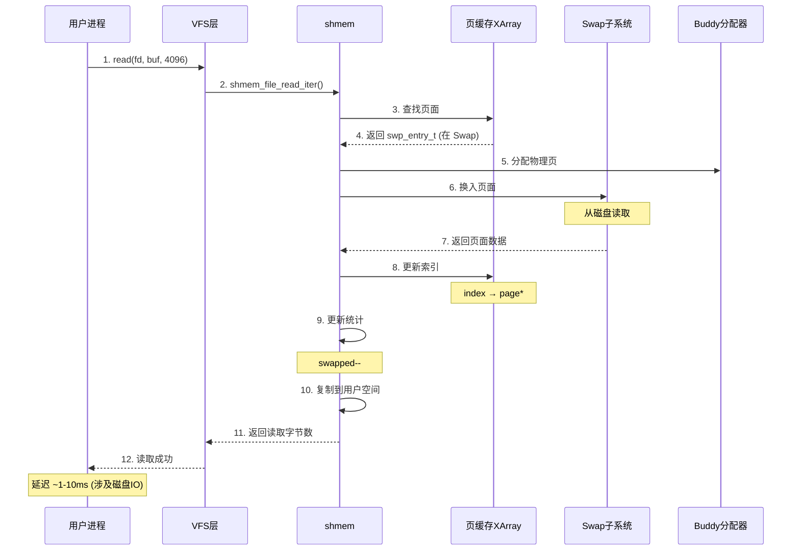
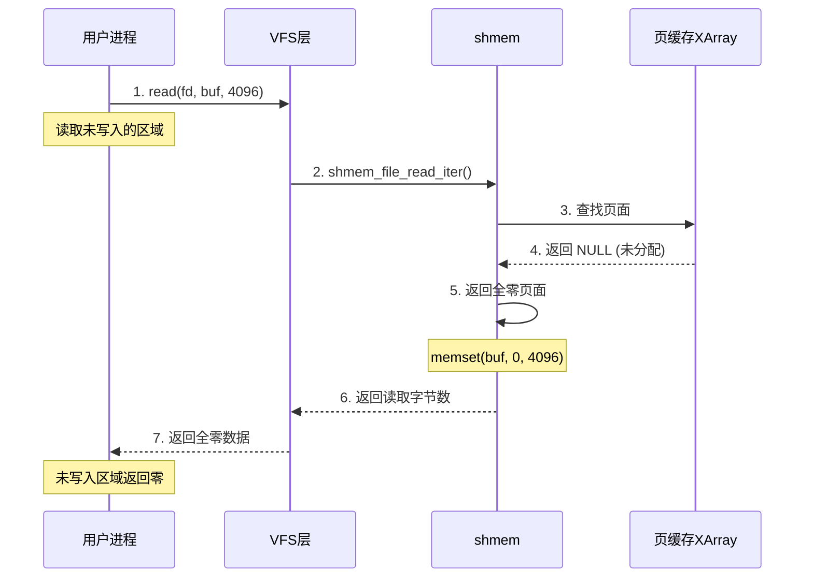
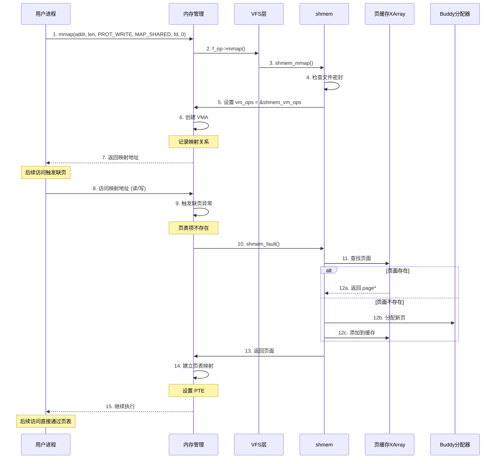
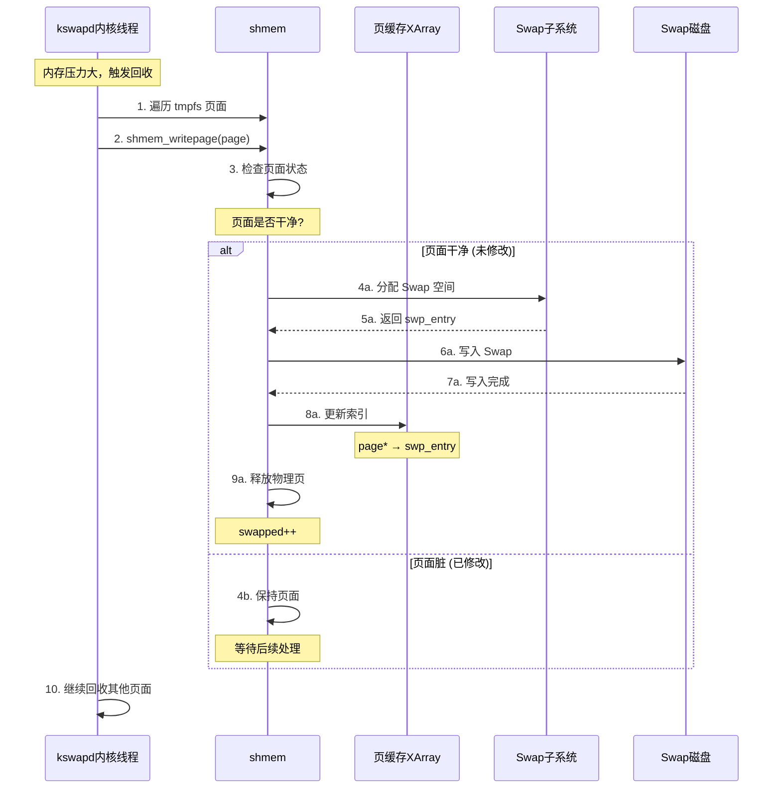
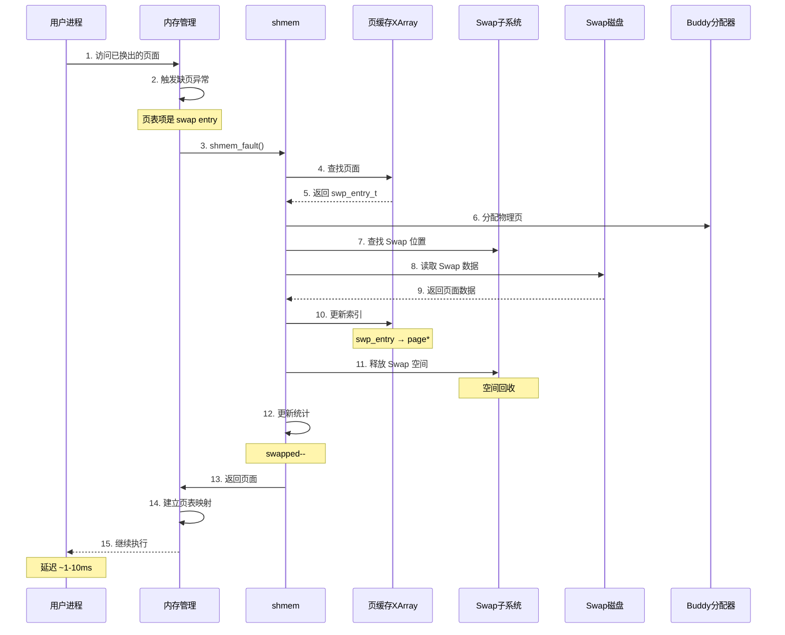
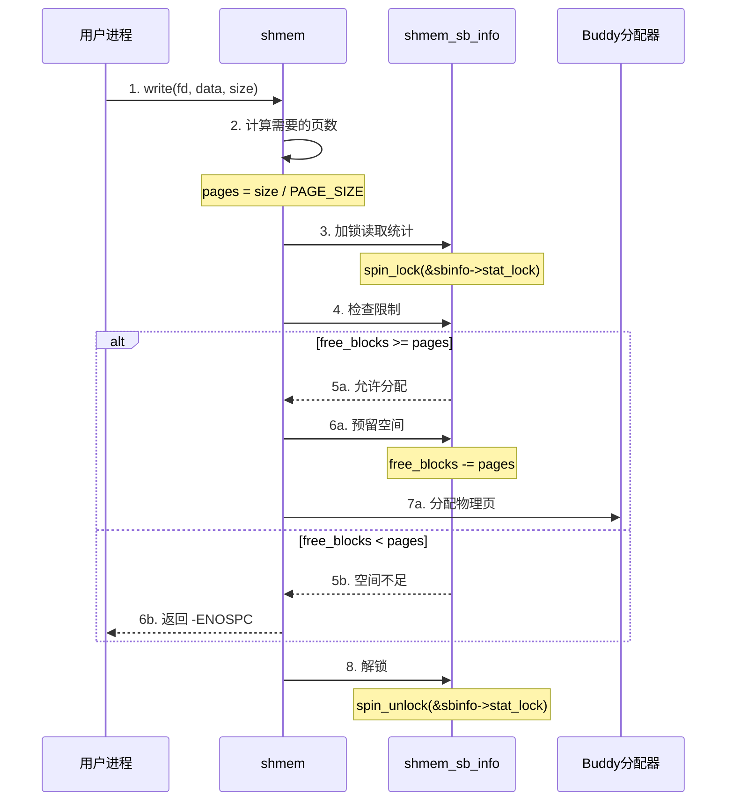

# tmpfs 存储模型分析

## 1. 概述

tmpfs 将文件数据存储在**页缓存 (Page Cache)** 中，通过 **inode** 管理文件元数据，支持 **Swap 换出** 释放内存。

```
┌─────────────────────────────────────────────────────────────────────────┐
│                        tmpfs 存储模型总览                                 │
├─────────────────────────────────────────────────────────────────────────┤
│                                                                          │
│  文件系统层                                                              │
│  ├── 目录结构 (dentry)                                                   │
│  ├── 文件元数据 (inode)                                                  │
│  └── 文件数据 (页缓存)                                                   │
│                                                                          │
│  内存管理层                                                              │
│  ├── 页分配器 (Buddy System)                                             │
│  ├── 页缓存 (Page Cache)                                                 │
│  └── Swap 子系统                                                         │
│                                                                          │
│  特点:                                                                   │
│  ├── 文件数据始终在内存中 (或 Swap)                                       │
│  ├── 无磁盘持久化                                                        │
│  ├── 动态分配，用多少占多少                                               │
│  └── 支持内存回收 (换出到 Swap)                                           │
│                                                                          │
└─────────────────────────────────────────────────────────────────────────┘
```

---

## 2. 存储层次结构

### 2.1 整体架构

```
┌─────────────────────────────────────────────────────────────────────────┐
│                        tmpfs 存储层次架构                                 │
├─────────────────────────────────────────────────────────────────────────┤
│                                                                          │
│  ┌─────────────────────────────────────────────────────────────────┐   │
│  │                      用户态                                      │   │
│  │  ┌─────┐ ┌─────┐ ┌─────┐                                       │   │
│  │  │文件1│ │文件2│ │目录 │  ← 用户看到的文件系统                   │   │
│  │  └─────┘ └─────┘ └─────┘                                       │   │
│  └─────────────────────────────────────────────────────────────────┘   │
│                              │                                          │
│                              ▼ VFS                                      │
│  ┌─────────────────────────────────────────────────────────────────┐   │
│  │                      VFS 层                                      │   │
│  │                                                                  │   │
│  │  super_block          dentry              inode                  │   │
│  │  ┌──────────┐        ┌──────────┐        ┌──────────┐           │   │
│  │  │shmem_sb  │───────▶│ 目录项   │───────▶│ shmem_   │           │   │
│  │  │_info     │        │ dentry   │        │ inode_   │           │   │
│  │  │          │        │          │        │ info     │           │   │
│  │  │max_blocks│        │d_parent  │        │          │           │   │
│  │  │free_blocks│       │d_inode   │        │alloced   │           │   │
│  │  │max_inodes│        │d_name    │        │swapped   │           │   │
│  │  └──────────┘        └──────────┘        │vfs_inode │           │   │
│  │                                          └──────────┘           │   │
│  └─────────────────────────────────────────────────────────────────┘   │
│                              │                                          │
│                              ▼                                          │
│  ┌─────────────────────────────────────────────────────────────────┐   │
│  │                     页缓存层                                     │   │
│  │                                                                  │   │
│  │  address_space (inode->i_mapping)                               │   │
│  │  ┌──────────────────────────────────────────────────────────┐   │   │
│  │  │  radix tree / xarray                                      │   │   │
│  │  │                                                           │   │   │
│  │  │   index 0        index 1        index 2        index 3   │   │   │
│  │  │  ┌────────┐     ┌────────┐     ┌────────┐     ┌────────┐│   │   │
│  │  │  │ Page 0 │     │ Page 1 │     │ Page 2 │     │   NULL ││   │   │
│  │  │  │ (4KB)  │     │ (4KB)  │     │ (4KB)  │     │(未分配)││   │   │
│  │  │  └────────┘     └────────┘     └────────┘     └────────┘│   │   │
│  │  │       │              │              │                     │   │   │
│  │  └───────┼──────────────┼──────────────┼─────────────────────┘   │   │
│  │          │              │              │                          │   │
│  └──────────┼──────────────┼──────────────┼──────────────────────────┘   │
│             │              │              │                              │
│             ▼              ▼              ▼                              │
│  ┌─────────────────────────────────────────────────────────────────┐   │
│  │                      物理内存                                    │   │
│  │                                                                  │   │
│  │  ┌──────┐ ┌──────┐ ┌──────┐ ┌──────┐ ┌──────┐ ┌──────┐        │   │
│  │  │ Page │ │ Page │ │ Page │ │ Page │ │ Page │ │ Page │        │   │
│  │  │  0   │ │  1   │ │  2   │ │  3   │ │  4   │ │  5   │        │   │
│  │  └──────┘ └──────┘ └──────┘ └──────┘ └──────┘ └──────┘        │   │
│  │                                                                  │   │
│  │              Buddy System (页分配器)                             │   │
│  └─────────────────────────────────────────────────────────────────┘   │
│                                                                          │
│                              │                                          │
│                              ▼ 内存不足时                                │
│  ┌─────────────────────────────────────────────────────────────────┐   │
│  │                       Swap                                       │   │
│  │  ┌──────────────────────────────────────────────────────────┐   │   │
│  │  │  swap_entry_0   swap_entry_1   swap_entry_2   ...        │   │   │
│  │  └──────────────────────────────────────────────────────────┘   │   │
│  └─────────────────────────────────────────────────────────────────┘   │
│                                                                          │
└─────────────────────────────────────────────────────────────────────────┘
```

### 2.2 核心数据结构关系

```
┌─────────────────────────────────────────────────────────────────────────┐
│                      数据结构关系图                                       │
├─────────────────────────────────────────────────────────────────────────┤
│                                                                          │
│  super_block                                                             │
│  ┌──────────────────────────────────────────────┐                       │
│  │ s_fs_info → shmem_sb_info                    │                       │
│  │                  │                           │                       │
│  │                  ├── max_blocks    (大小限制) │                       │
│  │                  ├── free_blocks   (空闲块)  │                       │
│  │                  ├── max_inodes    (文件数限制)│                      │
│  │                  └── free_inodes   (空闲inode)│                      │
│  └──────────────────────────────────────────────┘                       │
│           │                                                              │
│           │ s_inodes                                                     │
│           ▼                                                              │
│  inode (每个文件一个)                                                     │
│  ┌──────────────────────────────────────────────┐                       │
│  │ i_data (address_space)                       │                       │
│  │     │                                        │                       │
│  │     ├── i_pages (xarray) → 页缓存索引        │                       │
│  │     │                                        │                       │
│  │     └── a_ops → shmem_aops                  │                       │
│  │                                              │                       │
│  │ i_private → shmem_inode_info                │                       │
│  │                  │                           │                       │
│  │                  ├── alloced    (已分配块数) │                       │
│  │                  ├── swapped    (换出页数)   │                       │
│  │                  └── lock       (保护锁)     │                       │
│  └──────────────────────────────────────────────┘                       │
│           │                                                              │
│           │ i_pages (xarray)                                             │
│           ▼                                                              │
│  页缓存 (文件数据)                                                        │
│  ┌──────────────────────────────────────────────┐                       │
│  │                                              │                       │
│  │  index 0: page 0 (物理内存页)                │                       │
│  │  index 1: page 1 (物理内存页)                │                       │
│  │  index 2: swp_entry (换出到 Swap)            │                       │
│  │  index 3: NULL (未分配)                      │                       │
│  │  ...                                         │                       │
│  │                                              │                       │
│  └──────────────────────────────────────────────┘                       │
│                                                                          │
└─────────────────────────────────────────────────────────────────────────┘
```

---

## 3. 文件到 inode 到 page 的映射关系

### 3.1 基本映射规则

```
┌─────────────────────────────────────────────────────────────────────────┐
│                    tmpfs 文件到内存的映射规则                             │
├─────────────────────────────────────────────────────────────────────────┤
│                                                                          │
│   1 个文件                                                               │
│      │                                                                   │
│      ▼                                                                   │
│   1 个 inode                                                             │
│      │                                                                   │
│      │ i_mapping (address_space)                                        │
│      ▼                                                                   │
│   1 个页缓存索引 (xarray)                                                 │
│      │                                                                   │
│      ▼                                                                   │
│   N 个 page (N = 文件大小 / 4KB)                                         │
│                                                                          │
│   总结: 1 文件 → 1 inode → 1 address_space → N pages                    │
│                                                                          │
└─────────────────────────────────────────────────────────────────────────┘
```

### 3.2 详细映射结构

```
┌─────────────────────────────────────────────────────────────────────────┐
│                        文件 → inode → pages 详细映射                      │
├─────────────────────────────────────────────────────────────────────────┤
│                                                                          │
│  文件: "data.txt" (大小 12KB)                                            │
│                                                                          │
│  ┌──────────────────────────────────────────────────────────────────┐  │
│  │                        dentry (目录项)                            │  │
│  │   d_name = "data.txt"                                            │  │
│  │   d_inode ──────────────────────────────┐                        │  │
│  └──────────────────────────────────────────│────────────────────────┘  │
│                                               │                          │
│                                               ▼                          │
│  ┌──────────────────────────────────────────────────────────────────┐  │
│  │                          inode (1个)                              │  │
│  │                                                                   │  │
│  │   i_ino      = 12345          (inode 编号)                        │  │
│  │   i_size     = 12KB           (文件大小)                          │  │
│  │   i_blocks   = 3              (占用的 4KB 块数)                   │  │
│  │   i_mapping  ────────────────────────┐                           │  │
│  │   i_private  → shmem_inode_info     │                           │  │
│  └──────────────────────────────────────│───────────────────────────┘  │
│                                         │                              │
│                                         ▼                              │
│  ┌──────────────────────────────────────────────────────────────────┐  │
│  │                 address_space (i_mapping) (1个)                   │  │
│  │                                                                   │  │
│  │   i_pages (xarray) ─────────────────────────────────────────┐    │  │
│  │   host → inode                                               │    │  │
│  │   a_ops → shmem_aops                                         │    │  │
│  └──────────────────────────────────────────────────────────────│───┘  │
│                                                                 │      │
│                                                                 ▼      │
│  ┌──────────────────────────────────────────────────────────────────┐  │
│  │                    xarray (页缓存索引) (1个)                      │  │
│  │                                                                   │  │
│  │    index 0          index 1          index 2                     │  │
│  │   ┌────────┐       ┌────────┐       ┌────────┐                  │  │
│  │   │ page 0 │       │ page 1 │       │ page 2 │                  │  │
│  │   │ (4KB)  │       │ (4KB)  │       │ (4KB)  │                  │  │
│  │   │        │       │        │       │        │                  │  │
│  │   │偏移0-4KB│       │偏移4-8KB│       │偏移8-12KB│                 │  │
│  │   └────────┘       └────────┘       └────────┘                  │  │
│  │       │                │                │                       │  │
│  └───────┼────────────────┼────────────────┼───────────────────────┘  │
│          │                │                │                          │
│          ▼                ▼                ▼                          │
│  ┌──────────────────────────────────────────────────────────────────┐  │
│  │                      物理内存页 (N个)                              │  │
│  │                                                                   │  │
│  │   page 0           page 1           page 2                       │  │
│  │  ┌────────┐       ┌────────┐       ┌────────┐                   │  │
│  │  │物理地址│       │物理地址│       │物理地址│                   │  │
│  │  │ 0x1000 │       │ 0x2000 │       │ 0x3000 │                   │  │
│  │  └────────┘       └────────┘       └────────┘                   │  │
│  │                                                                   │  │
│  └──────────────────────────────────────────────────────────────────┘  │
│                                                                          │
└─────────────────────────────────────────────────────────────────────────┘
```

### 3.3 页索引计算方式

```
┌─────────────────────────────────────────────────────────────────────────┐
│                        页索引计算方式                                     │
├─────────────────────────────────────────────────────────────────────────┤
│                                                                          │
│  文件偏移 → 页索引                                                        │
│                                                                          │
│  index = offset / PAGE_SIZE                                              │
│        = offset / 4096                                                   │
│                                                                          │
│  示例:                                                                   │
│  ├── 偏移 0KB     → index 0                                              │
│  ├── 偏移 4KB     → index 1                                              │
│  ├── 偏移 8KB     → index 2                                              │
│  └── 偏移 12KB    → index 3                                              │
│                                                                          │
│  页内偏移:                                                                │
│  offset_in_page = offset % PAGE_SIZE                                     │
│                                                                          │
│  示例:                                                                   │
│  ├── 偏移 1000    → 页内偏移 1000 (在 index 0 页中)                       │
│  └── 偏移 5000    → 页内偏移 904  (在 index 1 页中)                       │
│                                                                          │
└─────────────────────────────────────────────────────────────────────────┘
```

### 3.4 关键数据结构

```c
// 1. inode 结构 (简化)
struct inode {
    unsigned long       i_ino;          // inode 编号
    loff_t              i_size;         // 文件大小
    struct address_space *i_mapping;    // 指向页缓存
    void                *i_private;     // 指向 shmem_inode_info
};

// 2. address_space 结构
struct address_space {
    struct inode        *host;          // 所属 inode
    struct xarray       i_pages;        // 页缓存索引
    const struct address_space_operations *a_ops;
};

// 3. 页缓存项
// i_pages 是一个 xarray，存储:
//   - page* : 页面在内存中
//   - swp_entry_t : 页面在 Swap 中
//   - NULL : 页面未分配

// 4. page 结构
struct page {
    unsigned long flags;        // 页面标志
    struct address_space *mapping;  // 所属 address_space
    pgoff_t index;              // 页索引
    atomic_t _refcount;         // 引用计数
};
```

### 3.5 完整访问链路

```
┌─────────────────────────────────────────────────────────────────────────┐
│                     用户访问到物理内存的完整链路                           │
├─────────────────────────────────────────────────────────────────────────┤
│                                                                          │
│  用户访问: read(fd, buf, 4096, offset=5000)                             │
│                                                                          │
│  Step 1: 找到文件                                                        │
│  ├── fd → file结构 → dentry → inode                                    │
│  │                                                                      │
│  Step 2: 计算页索引                                                      │
│  ├── offset = 5000                                                      │
│  ├── index = 5000 / 4096 = 1                                            │
│  └── offset_in_page = 5000 % 4096 = 904                                 │
│                                                                          │
│  Step 3: 从页缓存查找                                                    │
│  ├── inode->i_mapping->i_pages                                          │
│  └── xa_load(i_pages, index=1) → page*                                  │
│                                                                          │
│  Step 4: 访问物理内存                                                    │
│  ├── page → 物理地址 0x2000                                             │
│  └── 从偏移 904 开始读取                                                 │
│                                                                          │
│  Step 5: 复制到用户空间                                                  │
│  └── copy_to_user(buf, page + 904, ...)                                 │
│                                                                          │
└─────────────────────────────────────────────────────────────────────────┘
```

### 3.6 稀疏文件支持

```
┌─────────────────────────────────────────────────────────────────────────┐
│                        稀疏文件示例                                       │
├─────────────────────────────────────────────────────────────────────────┤
│                                                                          │
│  文件大小: 100KB                                                         │
│  实际写入: 只写了偏移 0-4KB 和 96-100KB                                  │
│                                                                          │
│  xarray 内容:                                                            │
│                                                                          │
│  index 0: page 0     ← 已分配 (写入过)                                   │
│  index 1: NULL       ← 未分配 (空洞)                                     │
│  index 2: NULL       ← 未分配 (空洞)                                     │
│  ...                                                                     │
│  index 23: NULL      ← 未分配 (空洞)                                     │
│  index 24: page 24   ← 已分配 (写入过)                                   │
│                                                                          │
│  物理内存占用: 只有 2 个页面 (8KB)，而不是 100KB                          │
│                                                                          │
│  读取空洞区域时返回全零                                                   │
│                                                                          │
└─────────────────────────────────────────────────────────────────────────┘
```

### 3.7 映射关系总结

| 问题 | 答案 |
|------|------|
| **1 文件 → 几个 inode** | 1 个 |
| **1 inode → 几个 page** | N 个 (N = 文件大小/4KB) |
| **索引结构** | xarray (基数树) |
| **索引键** | 页索引 (offset / PAGE_SIZE) |
| **索引值** | page* 或 swp_entry_t 或 NULL |
| **支持空洞** | 是，未分配区域返回零 |

---

## 4. 页面存储模型

### 4.1 页缓存索引

```
┌─────────────────────────────────────────────────────────────────────────┐
│                        页缓存索引模型                                     │
├─────────────────────────────────────────────────────────────────────────┤
│                                                                          │
│  文件 "data.txt" (大小 20KB)                                             │
│                                                                          │
│  页大小 = 4KB                                                            │
│  需要页数 = ceil(20KB / 4KB) = 5 页                                      │
│                                                                          │
│  ┌─────────────────────────────────────────────────────────────────┐   │
│  │                    inode->i_data->i_pages                        │   │
│  │                                                                  │   │
│  │  xarray (基数树/稀疏数组)                                         │   │
│  │                                                                  │   │
│  │  index    内容              文件偏移      状态                    │   │
│  │  ─────    ────              ────────      ────                    │   │
│  │    0     page 0            0-4KB        在内存                    │   │
│  │    1     page 1            4-8KB        在内存                    │   │
│  │    2     swp_entry_123     8-12KB       已换出到 Swap             │   │
│  │    3     page 3            12-16KB      在内存                    │   │
│  │    4     page 4            16-20KB      在内存                    │   │
│  │    5     NULL              20KB+        未分配 (文件结束)          │   │
│  │                                                                  │   │
│  └─────────────────────────────────────────────────────────────────┘   │
│                                                                          │
│  特点:                                                                   │
│  ├── 稀疏存储: 只有写入的页才分配内存                                     │
│  ├── 动态增长: 写入时才分配页                                             │
│  └── 支持空洞: 未写入的区域不占内存                                       │
│                                                                          │
└─────────────────────────────────────────────────────────────────────────┘
```

### 3.2 页面状态

| 状态 | 表示 | 说明 |
|------|------|------|
| **在内存** | `page*` | 页面在物理内存中 |
| **在 Swap** | `swp_entry_t` | 页面已换出到 Swap |
| **未分配** | `NULL` | 该位置未写入过 |

---

## 4. 文件写入流程时序图

### 4.1 首次写入新页面



### 4.2 写入已存在页面



### 4.3 写入已换出页面



---

## 5. 文件读取流程时序图

### 5.1 读取在内存的页面



### 5.2 读取已换出页面



### 5.3 读取未分配区域



---

## 6. mmap 流程时序图



---

## 7. Swap 换出流程时序图



---

## 8. Swap 换入流程时序图



---

## 9. 空间限制检查流程



---

## 10. 存储模型总结

### 10.1 存储特点

| 特点 | 说明 |
|------|------|
| **全内存存储** | 文件数据在页缓存中 |
| **动态分配** | 写入时才分配内存 |
| **稀疏存储** | 未写入区域不占空间 |
| **支持 Swap** | 内存不足可换出 |
| **空间限制** | 通过 sbinfo 控制 |
| **零填充** | 读取未分配区域返回零 |

### 10.2 关键数据路径

```
写入路径:
用户数据 → copy_from_user → 页缓存 → 物理内存
                                    ↓ (内存不足)
                                  Swap 磁盘

读取路径:
用户请求 → 查页缓存 → 物理内存 → copy_to_user → 用户空间
              ↓ (在 Swap)
           Swap 磁盘 → 物理内存 → 用户空间
```

### 10.3 性能特点

| 操作 | 场景 | 延迟 |
|------|------|------|
| 写入 | 页面在内存 | < 1μs |
| 读取 | 页面在内存 | < 1μs |
| 写入 | 需分配新页 | ~1μs |
| 读取 | 需从 Swap 换入 | ~1-10ms |
| mmap | 首次访问 | ~1μs |

---
