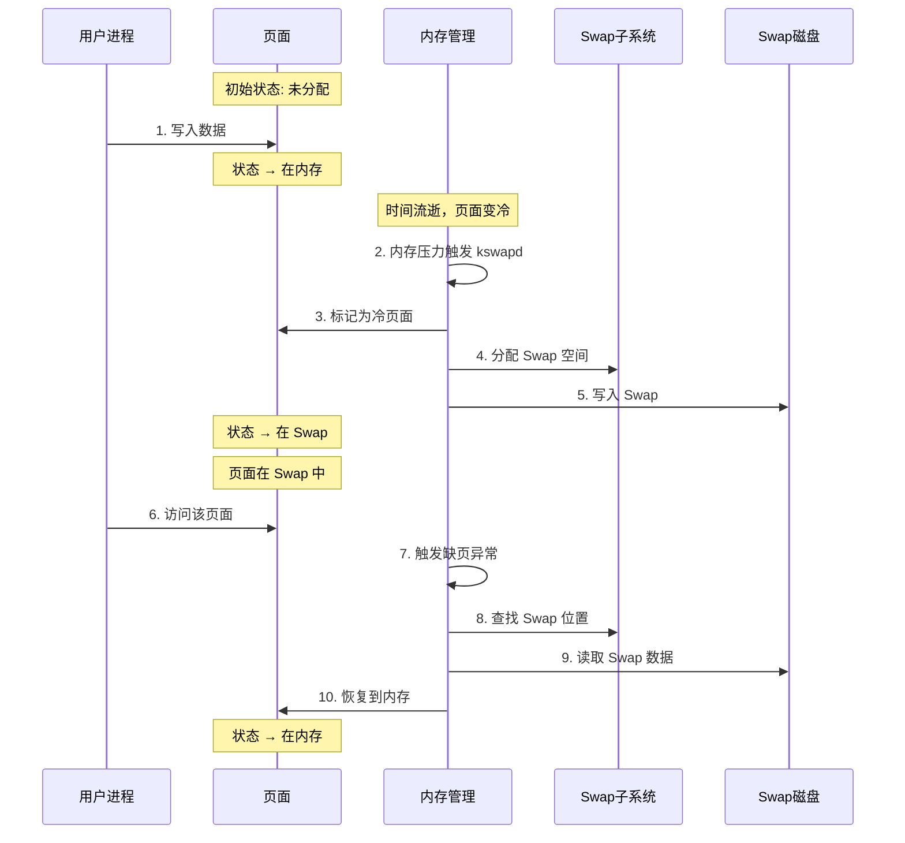

# tmpfs 页面交换机制分析

## 1. 概述

tmpfs 文件可以**部分页面在内存，部分页面在 Swap**，这是 tmpfs 的正常工作状态。

```
┌─────────────────────────────────────────────────────────────────────────┐
│                        tmpfs 页面分布状态                                 │
├─────────────────────────────────────────────────────────────────────────┤
│                                                                          │
│   一个文件可以同时存在于:                                                 │
│                                                                          │
│   ┌─────────────────┐     ┌─────────────────┐                          │
│   │    物理内存      │     │    Swap 磁盘     │                          │
│   │                 │     │                 │                          │
│   │  热数据页面     │     │  冷数据页面     │                          │
│   │  (频繁访问)     │     │  (长时间未访问)  │                          │
│   │                 │     │                 │                          │
│   │  延迟 < 1μs     │     │  延迟 ~1-10ms   │                          │
│   └─────────────────┘     └─────────────────┘                          │
│                                                                          │
│   同一文件的不同页面可以分布在不同位置                                     │
│                                                                          │
└─────────────────────────────────────────────────────────────────────────┘
```

---

## 2. 部分页面在 Swap 的示例

### 2.1 典型状态

```
┌─────────────────────────────────────────────────────────────────────────┐
│                    文件部分页面在 Swap 的示例                             │
├─────────────────────────────────────────────────────────────────────────┤
│                                                                          │
│  文件 "data.txt" (大小 20KB, 5个页面)                                    │
│                                                                          │
│  ┌──────────────────────────────────────────────────────────────────┐  │
│  │                        xarray 索引                                │  │
│  │                                                                   │  │
│  │  index 0: page 0        → 物理内存 (刚访问过)                     │  │
│  │  index 1: swp_entry_A   → Swap 磁盘 (冷数据，被换出)              │  │
│  │  index 2: page 2        → 物理内存 (正在使用)                     │  │
│  │  index 3: swp_entry_B   → Swap 磁盘 (冷数据，被换出)              │  │
│  │  index 4: page 4        → 物理内存 (热数据)                       │  │
│  │                                                                   │  │
│  │  内存占用: 3 页 (12KB)                                            │  │
│  │  Swap 占用: 2 页 (8KB)                                            │  │
│  │  文件大小: 20KB                                                   │  │
│  │                                                                   │  │
│  └──────────────────────────────────────────────────────────────────┘  │
│                                                                          │
│  ┌──────────────────────────────────────────────────────────────────┐  │
│  │                        物理内存                                   │  │
│  │                                                                   │  │
│  │   page 0 (热)        page 2 (热)        page 4 (热)              │  │
│  │  ┌────────┐         ┌────────┐         ┌────────┐               │  │
│  │  │ 4KB    │         │ 4KB    │         │ 4KB    │               │  │
│  │  └────────┘         └────────┘         └────────┘               │  │
│  │                                                                   │  │
│  └──────────────────────────────────────────────────────────────────┘  │
│                                                                          │
│  ┌──────────────────────────────────────────────────────────────────┐  │
│  │                        Swap 磁盘                                  │  │
│  │                                                                   │  │
│  │   swp_entry_A                    swp_entry_B                     │  │
│  │  ┌────────┐                     ┌────────┐                       │  │
│  │  │ 4KB    │                     │ 4KB    │                       │  │
│  │  │(index 1)│                    │(index 3)│                       │  │
│  │  └────────┘                     └────────┘                       │  │
│  │                                                                   │  │
│  └──────────────────────────────────────────────────────────────────┘  │
│                                                                          │
└─────────────────────────────────────────────────────────────────────────┘
```

### 2.2 页面状态表

| index | 文件偏移 | 状态 | 位置 | 访问延迟 |
|-------|----------|------|------|----------|
| 0 | 0-4KB | 在内存 | 物理内存 | < 1μs |
| 1 | 4-8KB | 在 Swap | Swap 磁盘 | ~1-10ms |
| 2 | 8-12KB | 在内存 | 物理内存 | < 1μs |
| 3 | 12-16KB | 在 Swap | Swap 磁盘 | ~1-10ms |
| 4 | 16-20KB | 在内存 | 物理内存 | < 1μs |

---

## 3. 为什么会部分换出？

### 3.1 页面级回收机制

```
┌─────────────────────────────────────────────────────────────────────────┐
│                      页面级回收机制                                       │
├─────────────────────────────────────────────────────────────────────────┤
│                                                                          │
│  kswapd 回收策略:                                                        │
│                                                                          │
│  ├── 以页面为单位回收，不是以文件为单位                                   │
│  ├── 只换出冷页面 (长时间未访问)                                         │
│  ├── 保留热页面 (频繁访问)                                               │
│  └── 不考虑页面属于哪个文件                                              │
│                                                                          │
│  页面访问热度判断:                                                        │
│  ├── Accessed bit (PTE 中的访问位)                                       │
│  ├── 最近访问时间                                                        │
│  └── LRU 链表位置                                                        │
│                                                                          │
└─────────────────────────────────────────────────────────────────────────┘
```

### 3.2 热数据 vs 冷数据

```
┌─────────────────────────────────────────────────────────────────────────┐
│                      热数据与冷数据                                       │
├─────────────────────────────────────────────────────────────────────────┤
│                                                                          │
│  热数据 (保留在内存):                                                     │
│  ├── 频繁读取的页面                                                      │
│  ├── 最近写入的页面                                                      │
│  ├── mmap 映射后正在使用的页面                                           │
│  └── 应用程序主动锁定的页面 (mlock)                                       │
│                                                                          │
│  冷数据 (换出到 Swap):                                                    │
│  ├── 长时间未访问的页面                                                  │
│  ├── 一次性写入后不再访问的页面                                           │
│  ├── 文件尾部不常用的数据                                                │
│  └── 内存压力大时优先换出                                                │
│                                                                          │
└─────────────────────────────────────────────────────────────────────────┘
```

### 3.3 触发换出的条件

```
┌─────────────────────────────────────────────────────────────────────────┐
│                      触发 Swap 换出的条件                                 │
├─────────────────────────────────────────────────────────────────────────┤
│                                                                          │
│  1. 内存压力                                                             │
│     ├── 空闲内存低于水位线                                               │
│     ├── kswapd 被唤醒                                                   │
│     └── 开始回收页面                                                     │
│                                                                          │
│  2. 页面状态                                                             │
│     ├── 页面在 LRU 惰性链表中                                            │
│     ├── 长时间未被访问                                                   │
│     └── Accessed bit 未设置                                              │
│                                                                          │
│  3. tmpfs 特点                                                           │
│     ├── tmpfs 页面可换出 (非脏页)                                        │
│     ├── 换出成本低 (无需写回原文件)                                      │
│     └── 换入时可恢复 (从 Swap 读取)                                      │
│                                                                          │
└─────────────────────────────────────────────────────────────────────────┘
```

---

## 4. 页面状态转换

### 4.1 状态转换图

```
┌─────────────────────────────────────────────────────────────────────────┐
│                        页面状态转换图                                     │
├─────────────────────────────────────────────────────────────────────────┤
│                                                                          │
│                          写入数据                                        │
│                             │                                           │
│                             ▼                                           │
│     ┌─────────────┐                              ┌─────────────┐        │
│     │   未分配    │ ─────────────────────────▶  │  在内存     │        │
│     │   (NULL)    │      首次写入               │  (page*)    │        │
│     └─────────────┘                              └──────┬──────┘        │
│                                                   │     │              │
│                                                   │     │ 长时间未访问 │
│                                                   │     │ 内存压力大   │
│                                                   │     ▼              │
│                          访问已换出页面            │  ┌─────────────┐   │
│                                 │                 │  │  在 Swap    │   │
│                                 │                 └──│(swp_entry)  │   │
│                                 ▼                 │  └─────────────┘   │
│     ┌─────────────┐         ┌─────────────┐      │                    │
│     │  在内存     │ ◀────── │  在 Swap    │◀─────┘                    │
│     │  (page*)    │  换入   │(swp_entry)  │                           │
│     └─────────────┘         └─────────────┘                           │
│          │                                                            │
│          │ 删除文件/截断                                               │
│          ▼                                                            │
│     ┌─────────────┐                                                   │
│     │   未分配    │                                                   │
│     │   (NULL)    │                                                   │
│     └─────────────┘                                                   │
│                                                                          │
└─────────────────────────────────────────────────────────────────────────┘
```

### 4.2 转换触发条件

| 转换 | 触发条件 | 执行者 |
|------|----------|--------|
| 未分配 → 在内存 | 首次写入 | 用户进程 |
| 在内存 → 在 Swap | 内存压力 + 冷页面 | kswapd |
| 在 Swap → 在内存 | 访问该页面 | 用户进程 (缺页) |
| 在内存 → 未分配 | 删除/截断文件 | 用户进程 |

### 4.3 状态转换时序图



---

## 5. 实际场景示例

### 5.1 大文件小内存场景

```
┌─────────────────────────────────────────────────────────────────────────┐
│                   大文件小内存场景示例                                    │
├─────────────────────────────────────────────────────────────────────────┤
│                                                                          │
│  配置:                                                                   │
│  ├── tmpfs 文件大小: 1GB                                                │
│  ├── 物理内存: 512MB                                                    │
│  └── Swap 空间: 2GB                                                     │
│                                                                          │
│  时间线:                                                                 │
│                                                                          │
│  T0: 创建并写入 1GB 文件                                                 │
│      ├── 写入前 200MB (内存足够)                                        │
│      ├── 写入中间 400MB (触发内存压力)                                   │
│      │   └── 开始换出前面的冷页面                                        │
│      └── 写入后 400MB (持续换出)                                        │
│                                                                          │
│  T1: 写入完成，稳定状态                                                  │
│      ├── 热数据: ~200MB 在内存                                          │
│      ├── 冷数据: ~800MB 在 Swap                                         │
│      └── 文件仍然完整可用                                                │
│                                                                          │
│  T2: 顺序读取整个文件                                                   │
│      ├── 读取热数据: 直接从内存 (< 1μs)                                 │
│      ├── 读取冷数据: 从 Swap 换入 (~1-10ms)                             │
│      └── 边读边换入换出                                                  │
│                                                                          │
└─────────────────────────────────────────────────────────────────────────┘
```

### 5.2 随机访问场景

```
┌─────────────────────────────────────────────────────────────────────────┐
│                      随机访问场景示例                                     │
├─────────────────────────────────────────────────────────────────────────┤
│                                                                          │
│  文件: 日志文件 (100MB)                                                  │
│                                                                          │
│  访问模式:                                                               │
│  ├── 频繁访问: 最新日志 (最后 10MB) → 在内存                             │
│  ├── 偶尔访问: 最近日志 (前 30MB) → 部分在内存，部分在 Swap              │
│  └── 很少访问: 历史日志 (中间 60MB) → 在 Swap                            │
│                                                                          │
│  页面分布:                                                               │
│                                                                          │
│  文件偏移      状态           访问频率                                   │
│  ─────────    ─────          ────────                                   │
│  0-30MB      在 Swap         很少访问                                    │
│  30-60MB     在 Swap         偶尔访问                                    │
│  60-90MB     部分在内存      偶尔访问                                    │
│  90-100MB    在内存          频繁访问                                    │
│                                                                          │
└─────────────────────────────────────────────────────────────────────────┘
```

### 5.3 mmap 共享内存场景

```
┌─────────────────────────────────────────────────────────────────────────┐
│                     mmap 共享内存场景示例                                 │
├─────────────────────────────────────────────────────────────────────────┤
│                                                                          │
│  场景: 多进程共享 100MB 内存                                             │
│                                                                          │
│  进程 A: 使用区域 0-40MB (活跃)                                          │
│  进程 B: 使用区域 60-100MB (活跃)                                        │
│  中间区域: 40-60MB (不活跃)                                              │
│                                                                          │
│  页面分布:                                                               │
│  ├── 0-40MB: 在内存 (进程 A 活跃使用)                                   │
│  ├── 40-60MB: 在 Swap (无进程使用)                                      │
│  └── 60-100MB: 在内存 (进程 B 活跃使用)                                 │
│                                                                          │
│  好处:                                                                   │
│  ├── 只保留真正使用的页面在内存                                          │
│  ├── 不使用的区域自动换出                                                │
│  └── 节省内存资源                                                        │
│                                                                          │
└─────────────────────────────────────────────────────────────────────────┘
```

---

## 6. 性能影响分析

### 6.1 延迟对比

| 操作 | 页面状态 | 延迟 | 比值 |
|------|----------|------|------|
| 读取 | 在内存 | < 1μs | 1x |
| 读取 | 在 Swap | ~1-10ms | 1000x - 10000x |
| 写入 | 在内存 | < 1μs | 1x |
| 写入 | 在 Swap (需换入) | ~1-10ms | 1000x - 10000x |

### 6.2 性能曲线

```
┌─────────────────────────────────────────────────────────────────────────┐
│                      访问延迟 vs 页面位置                                 │
├─────────────────────────────────────────────────────────────────────────┤
│                                                                          │
│  延迟                                                                    │
│    ▲                                                                     │
│ 10ms├─────────────────────────────────────────────┐                     │
│    │                                              │                     │
│    │  ■■■■ 读取 Swap 中页面                        │                     │
│    │                                              │                     │
│  1ms├─────────────────────────────────────────────┤                     │
│    │                                              │                     │
│    │                                              │                     │
│ 1μs ├─────────────────────────────────────────────┤                     │
│    │  ■■■■ 读取内存中页面                          │                     │
│    │                                              │                     │
│    └──────────────────────────────────────────────┴───▶                 │
│        内存页面    Swap页面    内存页面    Swap页面                      │
│                                                                          │
└─────────────────────────────────────────────────────────────────────────┘
```

### 6.3 性能优化建议

| 场景 | 优化方法 |
|------|----------|
| 频繁访问热数据 | 使用 mlock 锁定关键页面 |
| 顺序扫描大文件 | 使用 posix_fadvise 预读 |
| 随机访问模式 | 增加物理内存 |
| 避免抖动 | 调整 swappiness 参数 |

---

## 7. 监控与调试

### 7.1 查看 Swap 使用

```bash
# 查看系统 Swap 使用情况
cat /proc/meminfo | grep -i swap

# 输出示例:
# SwapCached:         1024 kB
# SwapTotal:       2097148 kB
# SwapFree:        1945600 kB

# 查看进程 Swap 使用
cat /proc/<pid>/status | grep -i swap

# 输出示例:
# VmSwap:     10240 kB
```

### 7.2 查看 tmpfs 使用情况

```bash
# 查看 tmpfs 挂载点使用
df -h /dev/shm

# 输出示例:
# Filesystem      Size  Used Avail Use% Mounted on
# tmpfs           7.8G  1.2G  6.6G  16% /dev/shm

# 查看具体文件
ls -lh /dev/shm/
```

### 7.3 控制换出行为

```bash
# 调整 swappiness (0-100, 值越小越倾向不换出)
sysctl vm.swappiness=10

# 查看当前值
cat /proc/sys/vm/swappiness

# 禁止特定文件的页面换出 (需要 root)
# 使用 mlock 系统调用
```

---

## 8. 与普通文件系统的对比

| 对比项 | tmpfs | 普通文件系统 (ext4) |
|--------|-------|---------------------|
| **数据存储** | 内存 + Swap | 磁盘 |
| **换出目标** | Swap | 写回原文件 |
| **换出成本** | 低 (无需写回) | 高 (需写回磁盘) |
| **换入成本** | 从 Swap 读取 | 从原文件读取 |
| **部分换出** | 常见 | 不适用 |
| **持久化** | 无 | 有 |

---

## 9. 总结

| 问题 | 答案 |
|------|------|
| **会部分换出吗** | ✅ 会，这是正常状态 |
| **为什么** | 页面级回收，只换出冷页面 |
| **粒度** | 以 4KB 页面为单位 |
| **影响** | 热数据留在内存，冷数据换出 |
| **性能影响** | 访问 Swap 中页面延迟增加 1000 倍 |
| **优化方法** | mlock 锁定、增加内存、调整 swappiness |

---
